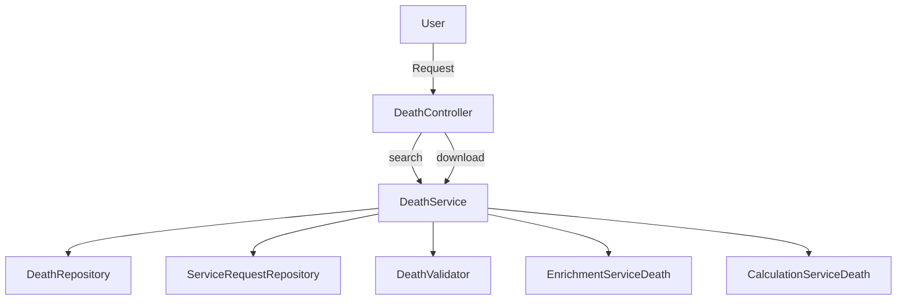

# Overview

Death services refer to the functionalities and services related to the registration, management, and issuance of death certificates. The <SwmToken path="municipal-services/birth-death-services/src/main/java/org/bel/birthdeath/death/controller/DeathController.java" pos="80:7:7" line-data="        DeathCertificate deathCert = deathService.download(criteria,requestInfoWrapper.getRequestInfo());">`deathService`</SwmToken> class is a central component that handles various operations such as searching for death details, downloading death certificates, and managing death certificate applications.

# <SwmToken path="municipal-services/birth-death-services/src/main/java/org/bel/birthdeath/death/controller/DeathController.java" pos="80:7:7" line-data="        DeathCertificate deathCert = deathService.download(criteria,requestInfoWrapper.getRequestInfo());">`deathService`</SwmToken> Class

The <SwmToken path="municipal-services/birth-death-services/src/main/java/org/bel/birthdeath/death/controller/DeathController.java" pos="80:7:7" line-data="        DeathCertificate deathCert = deathService.download(criteria,requestInfoWrapper.getRequestInfo());">`deathService`</SwmToken> class interacts with multiple repositories and services, including <SwmToken path="municipal-services/birth-death-services/src/main/java/org/bel/birthdeath/death/service/DeathService.java" pos="26:12:12" line-data="import org.bel.birthdeath.death.repository.DeathRepository;">`DeathRepository`</SwmToken>, <SwmToken path="municipal-services/birth-death-services/src/main/java/org/bel/birthdeath/death/service/DeathService.java" pos="18:12:12" line-data="import org.bel.birthdeath.common.repository.ServiceRequestRepository;">`ServiceRequestRepository`</SwmToken>, <SwmToken path="municipal-services/birth-death-services/src/main/java/org/bel/birthdeath/death/service/DeathService.java" pos="27:12:12" line-data="import org.bel.birthdeath.death.validator.DeathValidator;">`DeathValidator`</SwmToken>, <SwmToken path="municipal-services/birth-death-services/src/main/java/org/bel/birthdeath/death/service/DeathService.java" pos="55:1:1" line-data="	EnrichmentServiceDeath enrichmentServiceDeath;">`EnrichmentServiceDeath`</SwmToken>, and <SwmToken path="municipal-services/birth-death-services/src/main/java/org/bel/birthdeath/death/service/DeathService.java" pos="58:1:1" line-data="	CalculationServiceDeath calculationServiceDeath;">`CalculationServiceDeath`</SwmToken>, to perform its operations.

# Search Method

The <SwmToken path="municipal-services/birth-death-services/src/main/java/org/bel/birthdeath/death/service/DeathService.java" pos="69:8:8" line-data="	public List&lt;EgDeathDtl&gt; search(SearchCriteria criteria,RequestInfo requestInfo) {">`search`</SwmToken> method in <SwmToken path="municipal-services/birth-death-services/src/main/java/org/bel/birthdeath/death/controller/DeathController.java" pos="80:7:7" line-data="        DeathCertificate deathCert = deathService.download(criteria,requestInfoWrapper.getRequestInfo());">`deathService`</SwmToken> allows for searching death details based on criteria and user information, differentiating between employee and citizen requests.

# Download Method

The <SwmToken path="municipal-services/birth-death-services/src/main/java/org/bel/birthdeath/death/service/DeathService.java" pos="88:5:5" line-data="	public DeathCertificate download(SearchCriteria criteria, RequestInfo requestInfo) {">`download`</SwmToken> method in <SwmToken path="municipal-services/birth-death-services/src/main/java/org/bel/birthdeath/death/controller/DeathController.java" pos="80:7:7" line-data="        DeathCertificate deathCert = deathService.download(criteria,requestInfoWrapper.getRequestInfo());">`deathService`</SwmToken> generates and returns a death certificate based on the provided search criteria and request information, handling various data enrichment and validation steps.

<SwmSnippet path="/municipal-services/birth-death-services/src/main/java/org/bel/birthdeath/death/service/DeathService.java" line="88">

---

The <SwmToken path="municipal-services/birth-death-services/src/main/java/org/bel/birthdeath/death/service/DeathService.java" pos="88:5:5" line-data="	public DeathCertificate download(SearchCriteria criteria, RequestInfo requestInfo) {">`download`</SwmToken> method in <SwmToken path="municipal-services/birth-death-services/src/main/java/org/bel/birthdeath/death/controller/DeathController.java" pos="80:7:7" line-data="        DeathCertificate deathCert = deathService.download(criteria,requestInfoWrapper.getRequestInfo());">`deathService`</SwmToken> generates and returns a death certificate based on the provided search criteria and request information, handling various data enrichment and validation steps.

```java
	public DeathCertificate download(SearchCriteria criteria, RequestInfo requestInfo) {
		try {
		DeathCertificate deathCertificate = new DeathCertificate();
		deathCertificate.setSource(criteria.getSource().toString());
		deathCertificate.setDeathDtlId(criteria.getId());
		deathCertificate.setTenantId(criteria.getTenantId());
		DeathCertRequest deathCertRequest = DeathCertRequest.builder().deathCertificate(deathCertificate).requestInfo(requestInfo).build();
		List<EgDeathDtl> deathDtls = repository.getDeathDtlsAll(criteria,requestInfo);
			deathCertificate.setGender(deathDtls.get(0).getGenderStr());
			deathCertificate.setAge(deathDtls.get(0).getAge());
			deathCertificate.setWard(deathDtls.get(0).getDeathPermaddr().getTehsil());
			deathCertificate.setState(deathDtls.get(0).getDeathPermaddr().getState());
			deathCertificate.setDistrict(deathDtls.get(0).getDeathPermaddr().getDistrict());
			deathCertificate.setDateofdeath(deathDtls.get(0).getDateofdeath());
			deathCertificate.setDateofreport(deathDtls.get(0).getDateofreport());
			deathCertificate.setPlaceofdeath(deathDtls.get(0).getPlaceofdeath());
			SimpleDateFormat format = new SimpleDateFormat("dd-MM-yyyy");
			String date = format.format(deathDtls.get(0).getDateofreport());
			String datestr= date.split("-")[2];
			deathCertificate.setYear(datestr);
		if(deathDtls.size()>1) 
```

---

</SwmSnippet>

<SwmSnippet path="/municipal-services/birth-death-services/src/main/java/org/bel/birthdeath/death/service/DeathService.java" line="84">

---

The <SwmToken path="municipal-services/birth-death-services/src/main/java/org/bel/birthdeath/death/service/DeathService.java" pos="84:8:8" line-data="	public List&lt;DeathCertificate&gt; plainSearch(SearchCriteria criteria) {">`plainSearch`</SwmToken> method in <SwmToken path="municipal-services/birth-death-services/src/main/java/org/bel/birthdeath/death/controller/DeathController.java" pos="80:7:7" line-data="        DeathCertificate deathCert = deathService.download(criteria,requestInfoWrapper.getRequestInfo());">`deathService`</SwmToken> allows for plain searching of death details.

```java
	public List<DeathCertificate> plainSearch(SearchCriteria criteria) {
		return repository.getDeathDtlsForPlainSearch(criteria);
	}
```

---

</SwmSnippet>

# Death Certificate APIs

Death Certificate APIs provide endpoints for searching and downloading death certificates.

## Search Endpoint

The <SwmToken path="municipal-services/birth-death-services/src/main/java/org/bel/birthdeath/death/service/DeathService.java" pos="69:8:8" line-data="	public List&lt;EgDeathDtl&gt; search(SearchCriteria criteria,RequestInfo requestInfo) {">`search`</SwmToken> endpoint allows users to search for death details based on criteria and user information. It differentiates between citizen and employee requests and returns a list of death certificates matching the search criteria.

## Download Endpoint

The <SwmToken path="municipal-services/birth-death-services/src/main/java/org/bel/birthdeath/death/service/DeathService.java" pos="88:5:5" line-data="	public DeathCertificate download(SearchCriteria criteria, RequestInfo requestInfo) {">`download`</SwmToken> endpoint generates and returns a death certificate based on the provided search criteria and request information. It handles various data enrichment and validation steps before returning the certificate.

<SwmSnippet path="/municipal-services/birth-death-services/src/main/java/org/bel/birthdeath/death/controller/DeathController.java" line="73">

---

The <SwmToken path="municipal-services/birth-death-services/src/main/java/org/bel/birthdeath/death/controller/DeathController.java" pos="74:8:8" line-data="    public ResponseEntity&lt;DeathCertResponse&gt; download(@RequestBody RequestInfoWrapper requestInfoWrapper,">`download`</SwmToken> endpoint in <SwmToken path="municipal-services/birth-death-services/src/main/java/org/bel/birthdeath/death/controller/DeathController.java" pos="31:4:4" line-data="public class DeathController {">`DeathController`</SwmToken> generates and returns a death certificate based on the provided search criteria and request information.

```java
	@PostMapping(value = { "/_download"})
    public ResponseEntity<DeathCertResponse> download(@RequestBody RequestInfoWrapper requestInfoWrapper,
                                                       @Valid @ModelAttribute SearchCriteria criteria) {
		if(liveCitizenTenantsList.contains(criteria.getTenantId()))
		{
			return new ResponseEntity<>(new DeathCertResponse(), HttpStatus.OK);
		}
        DeathCertificate deathCert = deathService.download(criteria,requestInfoWrapper.getRequestInfo());
        DeathCertResponse response ;
        if(deathCert.getCounter()<=0)
        	response = DeathCertResponse.builder().filestoreId(deathCert.getFilestoreid()).responseInfo(
                responseInfoFactory.createResponseInfoFromRequestInfo(requestInfoWrapper.getRequestInfo(), true))
                .build();
        else
        	response = DeathCertResponse.builder().consumerCode(deathCert.getDeathCertificateNo()).tenantId(deathCert.getTenantId())
        			.responseInfo(responseInfoFactory.createResponseInfoFromRequestInfo(requestInfoWrapper.getRequestInfo(), true))
                    .build();
        return new ResponseEntity<>(response, HttpStatus.OK);
    }
```

---

</SwmSnippet>

&nbsp;

*This is an auto-generated document by Swimm AI 🌊 and has not yet been verified by a human*

<SwmMeta version="3.0.0" repo-id="Z2l0aHViJTNBJTNBRElHSVQtT1NTJTNBJTNBU3dpbW0tRGVtbw==" repo-name="DIGIT-OSS" doc-type="overview"><sup>Powered by [Swimm](/)</sup></SwmMeta>
