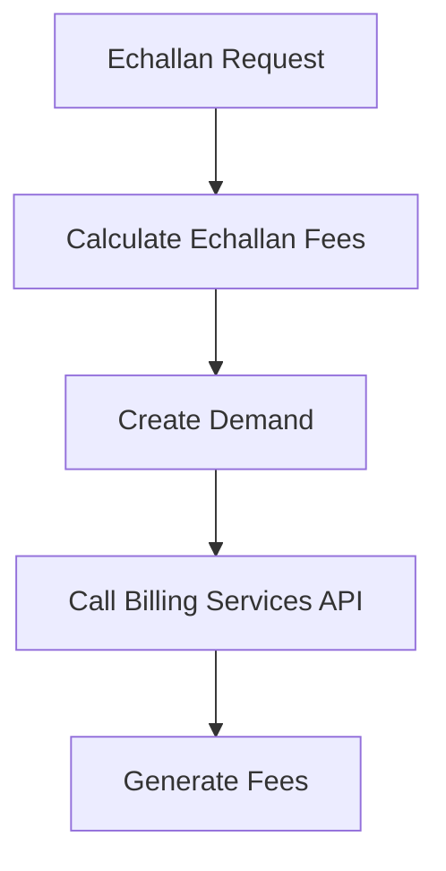

# Overview

Echallan services are used to calculate the echallan amount based on the details present in the echallan request. This module is designed to serve echallans for different types of services.

# Service Details

The echallan calculator application calculates the echallan fees based on the data mentioned during echallan creation. Based on the tax amount mentioned in the echallan, a demand is created. Once the demand is created, the echallan calculator calls the billing-services API to generate the fees.

# Dependencies

The echallan services depend on other services such as echallan-service, billing-service, and egov-mdms-service.

# Running Locally

To run the echallan-services locally, you need to port forward several services including echallan-calculator, billing-service, and egov-mdms-service.

# Main Functions

There are several main functions in this folder. Some of them are calculating the echallan fees, creating a demand based on the tax amount, and calling the billing-services API to generate the fees.

## Calculate the Echallan Fees

The echallan calculator application is used to calculate the echallan fees based on the data mentioned during echallan creation. This function ensures that the correct fees are calculated based on the provided details.

## Create a Demand Based on the Tax Amount

Based on the tax amount mentioned in the echallan, a demand is created. This function is essential as it sets up the necessary demand for the billing process to proceed.

# Echallan Service Endpoints

The echallan service provides several endpoints to interact with the echallan data.

<SwmSnippet path="/municipal-services/echallan-services/src/main/java/org/egov/echallan/web/controllers/ChallanController.java" line="41">

---

## Create

The <SwmToken path="municipal-services/echallan-services/src/main/java/org/egov/echallan/web/controllers/ChallanController.java" pos="42:8:8" line-data="	public ResponseEntity&lt;ChallanResponse&gt; create(@Valid @RequestBody ChallanRequest challanRequest) {">`create`</SwmToken> endpoint is used to generate a new challan. It accepts a <SwmToken path="municipal-services/echallan-services/src/main/java/org/egov/echallan/web/controllers/ChallanController.java" pos="42:16:16" line-data="	public ResponseEntity&lt;ChallanResponse&gt; create(@Valid @RequestBody ChallanRequest challanRequest) {">`ChallanRequest`</SwmToken> object and returns a <SwmToken path="municipal-services/echallan-services/src/main/java/org/egov/echallan/web/controllers/ChallanController.java" pos="42:5:5" line-data="	public ResponseEntity&lt;ChallanResponse&gt; create(@Valid @RequestBody ChallanRequest challanRequest) {">`ChallanResponse`</SwmToken> object containing the created challan details.

```java
	@PostMapping("/_create")
	public ResponseEntity<ChallanResponse> create(@Valid @RequestBody ChallanRequest challanRequest) {

		Challan challan = challanService.create(challanRequest);
		ResponseInfo resInfo = responseInfoFactory.createResponseInfoFromRequestInfo(challanRequest.getRequestInfo(), true);
		ChallanResponse response = ChallanResponse.builder().challans(Arrays.asList(challan))
				.responseInfo(resInfo)
				.build();
		return new ResponseEntity<>(response, HttpStatus.OK);
	}
```

---

</SwmSnippet>

<SwmSnippet path="/municipal-services/echallan-services/src/main/java/org/egov/echallan/web/controllers/ChallanController.java" line="52">

---

## Search

The <SwmToken path="municipal-services/echallan-services/src/main/java/org/egov/echallan/web/controllers/ChallanController.java" pos="53:8:8" line-data="	 public ResponseEntity&lt;ChallanResponse&gt; search(@Valid @RequestBody RequestInfoWrapper requestInfoWrapper,">`search`</SwmToken> endpoint is used to search for existing challans based on the provided search criteria. It accepts a <SwmToken path="municipal-services/echallan-services/src/main/java/org/egov/echallan/web/controllers/ChallanController.java" pos="53:16:16" line-data="	 public ResponseEntity&lt;ChallanResponse&gt; search(@Valid @RequestBody RequestInfoWrapper requestInfoWrapper,">`RequestInfoWrapper`</SwmToken> and <SwmToken path="municipal-services/echallan-services/src/main/java/org/egov/echallan/web/controllers/ChallanController.java" pos="54:7:7" line-data="	                                                       @Valid @ModelAttribute SearchCriteria criteria) {">`SearchCriteria`</SwmToken> and returns a <SwmToken path="municipal-services/echallan-services/src/main/java/org/egov/echallan/web/controllers/ChallanController.java" pos="53:5:5" line-data="	 public ResponseEntity&lt;ChallanResponse&gt; search(@Valid @RequestBody RequestInfoWrapper requestInfoWrapper,">`ChallanResponse`</SwmToken> object containing the list of matching challans.

```java
	 @RequestMapping(value = "/_search", method = RequestMethod.POST)
	 public ResponseEntity<ChallanResponse> search(@Valid @RequestBody RequestInfoWrapper requestInfoWrapper,
	                                                       @Valid @ModelAttribute SearchCriteria criteria) {
		 String tenantId = criteria.getTenantId();
	     List<Challan> challans = challanService.search(criteria, requestInfoWrapper.getRequestInfo());
	    	 
	     
	     Map<String,Integer> dynamicData = challanService.getDynamicData(tenantId);
	    	 
	     int countOfServices = dynamicData.get(ChallanConstants.TOTAL_SERVICES);
	     int totalAmountCollected = dynamicData.get(ChallanConstants.TOTAL_COLLECTION);
	     int validity = challanService.getChallanValidity();
	     int totalCount = challanService.countForSearch(criteria,requestInfoWrapper.getRequestInfo());

	     ChallanResponse response = ChallanResponse.builder().challans(challans).countOfServices(countOfServices)
				 .totalAmountCollected(totalAmountCollected).validity(validity).totalCount(totalCount)
				 .responseInfo(responseInfoFactory.createResponseInfoFromRequestInfo(requestInfoWrapper.getRequestInfo(), true))
				 .build();
	     return new ResponseEntity<>(response, HttpStatus.OK);
	}
```

---

</SwmSnippet>

&nbsp;

*This is an auto-generated document by Swimm AI 🌊 and has not yet been verified by a human*

<SwmMeta version="3.0.0" repo-id="Z2l0aHViJTNBJTNBRElHSVQtT1NTJTNBJTNBU3dpbW0tRGVtbw==" repo-name="DIGIT-OSS" doc-type="overview"><sup>Powered by [Swimm](/)</sup></SwmMeta>
