```mermaid
classDiagram
    class oldProperty {
        OldAuditDetails OldAuditDetails
        CreationReasonEnum creationReason
        Long occupancyDate
        List<PropertyDetail> propertyDetails
        Object additionalDetails
        +PropertyBuilder builder()
    }
    class PropertyBuilder {
        CreationReasonEnum creationReason
        Long occupancyDate
        List<PropertyDetail> propertyDetails
        OldAuditDetails OldAuditDetails
        String propertyId
        String tenantId
        String acknowldgementNumber
        String oldPropertyId
        StatusEnum status
        Address address
        +OldProperty build()
    }
    oldProperty --> PropertyBuilder
    class OldPropertyCriteria {
        String tenantId
        Set<String> ids
        Set<String> oldpropertyids
        Set<String> propertyDetailids
        Set<String> addressids
        Set<String> unitids
        Set<String> documentids
        Set<String> ownerids
        String userName
        String mobileNumber
        String propertyDetailStatus
        String name
        String doorNo
        String locality
        String accountId
        Set<String> statuses
        Integer offset
        Integer limit
        Date asOnDate
        String financialYear
        String propertyId
        +boolean isNull()
    }

%% Swimm:
%% classDiagram
%%     class <SwmToken path="municipal-services/property-services/src/main/java/org/egov/pt/models/oldProperty/OldProperty.java" pos="1:10:10" line-data="package org.egov.pt.models.oldProperty;">`oldProperty`</SwmToken> {
%%         <SwmToken path="municipal-services/property-services/src/main/java/org/egov/pt/models/oldProperty/OldProperty.java" pos="103:3:3" line-data="		private OldAuditDetails oldAuditDetails;">`OldAuditDetails`</SwmToken> <SwmToken path="municipal-services/property-services/src/main/java/org/egov/pt/models/oldProperty/OldProperty.java" pos="103:3:3" line-data="		private OldAuditDetails oldAuditDetails;">`OldAuditDetails`</SwmToken>
%%         <SwmToken path="municipal-services/property-services/src/main/java/org/egov/pt/models/oldProperty/OldProperty.java" pos="40:5:5" line-data="	public enum CreationReasonEnum {">`CreationReasonEnum`</SwmToken> <SwmToken path="municipal-services/property-services/src/main/java/org/egov/pt/models/oldProperty/OldProperty.java" pos="97:5:5" line-data="		private CreationReasonEnum creationReason;">`creationReason`</SwmToken>
%%         Long <SwmToken path="municipal-services/property-services/src/main/java/org/egov/pt/models/oldProperty/OldProperty.java" pos="98:5:5" line-data="		private Long occupancyDate;">`occupancyDate`</SwmToken>
%%         <SwmToken path="municipal-services/property-services/src/main/java/org/egov/pt/models/oldProperty/OldProperty.java" pos="102:3:6" line-data="		private List&lt;PropertyDetail&gt;  propertyDetails;">`List<PropertyDetail>`</SwmToken> <SwmToken path="municipal-services/property-services/src/main/java/org/egov/pt/models/oldProperty/OldProperty.java" pos="102:8:8" line-data="		private List&lt;PropertyDetail&gt;  propertyDetails;">`propertyDetails`</SwmToken>
%%         Object <SwmToken path="municipal-services/property-services/src/main/java/org/egov/pt/models/oldProperty/OldProperty.java" pos="78:5:5" line-data="	@JsonProperty(&quot;additionalDetails&quot;)">`additionalDetails`</SwmToken>
%%         +PropertyBuilder builder()
%%     }
%%     class <SwmToken path="municipal-services/property-services/src/main/java/org/egov/pt/models/oldProperty/OldProperty.java" pos="95:7:7" line-data="    public static class PropertyBuilder{">`PropertyBuilder`</SwmToken> {
%%         <SwmToken path="municipal-services/property-services/src/main/java/org/egov/pt/models/oldProperty/OldProperty.java" pos="40:5:5" line-data="	public enum CreationReasonEnum {">`CreationReasonEnum`</SwmToken> <SwmToken path="municipal-services/property-services/src/main/java/org/egov/pt/models/oldProperty/OldProperty.java" pos="97:5:5" line-data="		private CreationReasonEnum creationReason;">`creationReason`</SwmToken>
%%         Long <SwmToken path="municipal-services/property-services/src/main/java/org/egov/pt/models/oldProperty/OldProperty.java" pos="98:5:5" line-data="		private Long occupancyDate;">`occupancyDate`</SwmToken>
%%         <SwmToken path="municipal-services/property-services/src/main/java/org/egov/pt/models/oldProperty/OldProperty.java" pos="102:3:6" line-data="		private List&lt;PropertyDetail&gt;  propertyDetails;">`List<PropertyDetail>`</SwmToken> <SwmToken path="municipal-services/property-services/src/main/java/org/egov/pt/models/oldProperty/OldProperty.java" pos="102:8:8" line-data="		private List&lt;PropertyDetail&gt;  propertyDetails;">`propertyDetails`</SwmToken>
%%         <SwmToken path="municipal-services/property-services/src/main/java/org/egov/pt/models/oldProperty/OldProperty.java" pos="103:3:3" line-data="		private OldAuditDetails oldAuditDetails;">`OldAuditDetails`</SwmToken> <SwmToken path="municipal-services/property-services/src/main/java/org/egov/pt/models/oldProperty/OldProperty.java" pos="103:3:3" line-data="		private OldAuditDetails oldAuditDetails;">`OldAuditDetails`</SwmToken>
%%         String <SwmToken path="municipal-services/property-services/src/main/java/org/egov/pt/models/oldProperty/OldProperty.java" pos="105:5:5" line-data="		private String propertyId;">`propertyId`</SwmToken>
%%         String <SwmToken path="municipal-services/property-services/src/main/java/org/egov/pt/models/oldProperty/OldProperty.java" pos="108:5:5" line-data="		private String tenantId;">`tenantId`</SwmToken>
%%         String <SwmToken path="municipal-services/property-services/src/main/java/org/egov/pt/models/oldProperty/OldProperty.java" pos="109:5:5" line-data="		private String acknowldgementNumber;">`acknowldgementNumber`</SwmToken>
%%         String <SwmToken path="municipal-services/property-services/src/main/java/org/egov/pt/models/oldProperty/OldProperty.java" pos="110:5:5" line-data="		private String oldPropertyId;">`oldPropertyId`</SwmToken>
%%         <SwmToken path="municipal-services/property-services/src/main/java/org/egov/pt/models/oldProperty/OldProperty.java" pos="111:3:3" line-data="		private StatusEnum status;">`StatusEnum`</SwmToken> status
%%         Address address
%%         +OldProperty build()
%%     }
%%     <SwmToken path="municipal-services/property-services/src/main/java/org/egov/pt/models/oldProperty/OldProperty.java" pos="1:10:10" line-data="package org.egov.pt.models.oldProperty;">`oldProperty`</SwmToken> --> <SwmToken path="municipal-services/property-services/src/main/java/org/egov/pt/models/oldProperty/OldProperty.java" pos="95:7:7" line-data="    public static class PropertyBuilder{">`PropertyBuilder`</SwmToken>
%%     class <SwmToken path="municipal-services/property-services/src/main/java/org/egov/pt/models/oldProperty/OldPropertyCriteria.java" pos="19:4:4" line-data="public class OldPropertyCriteria {">`OldPropertyCriteria`</SwmToken> {
%%         String <SwmToken path="municipal-services/property-services/src/main/java/org/egov/pt/models/oldProperty/OldProperty.java" pos="108:5:5" line-data="		private String tenantId;">`tenantId`</SwmToken>
%%         <SwmToken path="municipal-services/property-services/src/main/java/org/egov/pt/models/oldProperty/OldPropertyCriteria.java" pos="24:3:6" line-data="	private Set&lt;String&gt; ids;">`Set<String>`</SwmToken> ids
%%         <SwmToken path="municipal-services/property-services/src/main/java/org/egov/pt/models/oldProperty/OldPropertyCriteria.java" pos="24:3:6" line-data="	private Set&lt;String&gt; ids;">`Set<String>`</SwmToken> oldpropertyids
%%         <SwmToken path="municipal-services/property-services/src/main/java/org/egov/pt/models/oldProperty/OldPropertyCriteria.java" pos="24:3:6" line-data="	private Set&lt;String&gt; ids;">`Set<String>`</SwmToken> <SwmToken path="municipal-services/property-services/src/main/java/org/egov/pt/models/oldProperty/OldPropertyCriteria.java" pos="28:8:8" line-data="	private Set&lt;String&gt; propertyDetailids;">`propertyDetailids`</SwmToken>
%%         <SwmToken path="municipal-services/property-services/src/main/java/org/egov/pt/models/oldProperty/OldPropertyCriteria.java" pos="24:3:6" line-data="	private Set&lt;String&gt; ids;">`Set<String>`</SwmToken> addressids
%%         <SwmToken path="municipal-services/property-services/src/main/java/org/egov/pt/models/oldProperty/OldPropertyCriteria.java" pos="24:3:6" line-data="	private Set&lt;String&gt; ids;">`Set<String>`</SwmToken> unitids
%%         <SwmToken path="municipal-services/property-services/src/main/java/org/egov/pt/models/oldProperty/OldPropertyCriteria.java" pos="24:3:6" line-data="	private Set&lt;String&gt; ids;">`Set<String>`</SwmToken> documentids
%%         <SwmToken path="municipal-services/property-services/src/main/java/org/egov/pt/models/oldProperty/OldPropertyCriteria.java" pos="24:3:6" line-data="	private Set&lt;String&gt; ids;">`Set<String>`</SwmToken> ownerids
%%         String <SwmToken path="municipal-services/property-services/src/main/java/org/egov/pt/service/MigrationService.java" pos="330:25:25" line-data="     * Returns user using user search based on propertyCriteria(owner name,mobileNumber,userName)">`userName`</SwmToken>
%%         String <SwmToken path="municipal-services/property-services/src/main/java/org/egov/pt/service/MigrationService.java" pos="330:23:23" line-data="     * Returns user using user search based on propertyCriteria(owner name,mobileNumber,userName)">`mobileNumber`</SwmToken>
%%         String <SwmToken path="municipal-services/property-services/src/main/java/org/egov/pt/models/oldProperty/OldPropertyCriteria.java" pos="42:5:5" line-data="	private Status propertyDetailStatus;">`propertyDetailStatus`</SwmToken>
%%         String name
%%         String <SwmToken path="municipal-services/property-services/src/main/java/org/egov/pt/models/oldProperty/OldPropertyCriteria.java" pos="46:5:5" line-data="	private String doorNo;">`doorNo`</SwmToken>
%%         String locality
%%         String <SwmToken path="municipal-services/property-services/src/main/java/org/egov/pt/service/MigrationService.java" pos="460:3:3" line-data="            String accountId = requestInfo.getUserInfo().getUuid();">`accountId`</SwmToken>
%%         <SwmToken path="municipal-services/property-services/src/main/java/org/egov/pt/models/oldProperty/OldPropertyCriteria.java" pos="24:3:6" line-data="	private Set&lt;String&gt; ids;">`Set<String>`</SwmToken> statuses
%%         Integer offset
%%         Integer limit
%%         Date <SwmToken path="municipal-services/property-services/src/main/java/org/egov/pt/models/oldProperty/OldPropertyCriteria.java" pos="60:5:5" line-data="	@JsonProperty(&quot;asOnDate&quot;)">`asOnDate`</SwmToken>
%%         String <SwmToken path="municipal-services/property-services/src/main/java/org/egov/pt/models/oldProperty/OldPropertyCriteria.java" pos="63:5:5" line-data="	@JsonProperty(&quot;financialYear&quot;)">`financialYear`</SwmToken>
%%         String <SwmToken path="municipal-services/property-services/src/main/java/org/egov/pt/models/oldProperty/OldProperty.java" pos="105:5:5" line-data="		private String propertyId;">`propertyId`</SwmToken>
%%         +boolean <SwmToken path="municipal-services/property-services/src/main/java/org/egov/pt/models/oldProperty/OldPropertyCriteria.java" pos="70:5:7" line-data="	public Boolean isNull(){">`isNull()`</SwmToken>
%%     }
```

# Overview

The <SwmToken path="municipal-services/property-services/src/main/java/org/egov/pt/models/oldProperty/OldProperty.java" pos="1:10:10" line-data="package org.egov.pt.models.oldProperty;">`oldProperty`</SwmToken> class is designed to represent properties that have been previously registered or migrated from older systems. It extends the <SwmToken path="municipal-services/property-services/src/main/java/org/egov/pt/models/oldProperty/OldProperty.java" pos="33:8:8" line-data="public class OldProperty extends PropertyInfo {">`PropertyInfo`</SwmToken> class and includes various fields to capture the attributes of these old properties.

# <SwmToken path="municipal-services/property-services/src/main/java/org/egov/pt/models/oldProperty/OldProperty.java" pos="1:10:10" line-data="package org.egov.pt.models.oldProperty;">`oldProperty`</SwmToken> Class

The <SwmToken path="municipal-services/property-services/src/main/java/org/egov/pt/models/oldProperty/OldProperty.java" pos="1:10:10" line-data="package org.egov.pt.models.oldProperty;">`oldProperty`</SwmToken> class includes fields such as <SwmToken path="municipal-services/property-services/src/main/java/org/egov/pt/models/oldProperty/OldProperty.java" pos="103:3:3" line-data="		private OldAuditDetails oldAuditDetails;">`OldAuditDetails`</SwmToken>, <SwmToken path="municipal-services/property-services/src/main/java/org/egov/pt/models/oldProperty/OldProperty.java" pos="97:5:5" line-data="		private CreationReasonEnum creationReason;">`creationReason`</SwmToken>, <SwmToken path="municipal-services/property-services/src/main/java/org/egov/pt/models/oldProperty/OldProperty.java" pos="98:5:5" line-data="		private Long occupancyDate;">`occupancyDate`</SwmToken>, <SwmToken path="municipal-services/property-services/src/main/java/org/egov/pt/models/oldProperty/OldProperty.java" pos="102:8:8" line-data="		private List&lt;PropertyDetail&gt;  propertyDetails;">`propertyDetails`</SwmToken>, and <SwmToken path="municipal-services/property-services/src/main/java/org/egov/pt/models/oldProperty/OldProperty.java" pos="78:5:5" line-data="	@JsonProperty(&quot;additionalDetails&quot;)">`additionalDetails`</SwmToken>. These fields capture various attributes of the old property.

# <SwmToken path="municipal-services/property-services/src/main/java/org/egov/pt/models/oldProperty/OldProperty.java" pos="40:5:5" line-data="	public enum CreationReasonEnum {">`CreationReasonEnum`</SwmToken>

The <SwmToken path="municipal-services/property-services/src/main/java/org/egov/pt/models/oldProperty/OldProperty.java" pos="97:5:5" line-data="		private CreationReasonEnum creationReason;">`creationReason`</SwmToken> field is an enumeration that indicates why the property was created. Possible values include <SwmToken path="municipal-services/property-services/src/main/java/org/egov/pt/models/oldProperty/OldProperty.java" pos="41:1:1" line-data="		NEWPROPERTY(&quot;NEWPROPERTY&quot;),">`NEWPROPERTY`</SwmToken> and <SwmToken path="municipal-services/property-services/src/main/java/org/egov/pt/models/oldProperty/OldProperty.java" pos="43:1:1" line-data="		SUBDIVISION(&quot;SUBDIVISION&quot;);">`SUBDIVISION`</SwmToken>.

<SwmSnippet path="/municipal-services/property-services/src/main/java/org/egov/pt/models/oldProperty/OldProperty.java" line="40">

---

The <SwmToken path="municipal-services/property-services/src/main/java/org/egov/pt/models/oldProperty/OldProperty.java" pos="40:5:5" line-data="	public enum CreationReasonEnum {">`CreationReasonEnum`</SwmToken> enumeration defines possible reasons for the creation of the property.

```java
	public enum CreationReasonEnum {
		NEWPROPERTY("NEWPROPERTY"),

		SUBDIVISION("SUBDIVISION");
```

---

</SwmSnippet>

# <SwmToken path="municipal-services/property-services/src/main/java/org/egov/pt/models/oldProperty/OldProperty.java" pos="95:7:7" line-data="    public static class PropertyBuilder{">`PropertyBuilder`</SwmToken> Class

The <SwmToken path="municipal-services/property-services/src/main/java/org/egov/pt/models/oldProperty/OldProperty.java" pos="95:7:7" line-data="    public static class PropertyBuilder{">`PropertyBuilder`</SwmToken> class provides a builder pattern for creating instances of <SwmToken path="municipal-services/property-services/src/main/java/org/egov/pt/models/oldProperty/OldProperty.java" pos="1:10:10" line-data="package org.egov.pt.models.oldProperty;">`oldProperty`</SwmToken>. It includes methods for setting various attributes and a <SwmToken path="municipal-services/property-services/src/main/java/org/egov/pt/service/MigrationService.java" pos="561:23:23" line-data="                PropertyRequest request = PropertyRequest.builder().requestInfo(requestInfo).property(property).build();">`build`</SwmToken> method to create and return a new instance of <SwmToken path="municipal-services/property-services/src/main/java/org/egov/pt/models/oldProperty/OldProperty.java" pos="1:10:10" line-data="package org.egov.pt.models.oldProperty;">`oldProperty`</SwmToken>.

<SwmSnippet path="/municipal-services/property-services/src/main/java/org/egov/pt/models/oldProperty/OldProperty.java" line="95">

---

The <SwmToken path="municipal-services/property-services/src/main/java/org/egov/pt/models/oldProperty/OldProperty.java" pos="95:7:7" line-data="    public static class PropertyBuilder{">`PropertyBuilder`</SwmToken> class includes methods for setting various attributes and a <SwmToken path="municipal-services/property-services/src/main/java/org/egov/pt/service/MigrationService.java" pos="561:23:23" line-data="                PropertyRequest request = PropertyRequest.builder().requestInfo(requestInfo).property(property).build();">`build`</SwmToken> method to create and return a new instance of <SwmToken path="municipal-services/property-services/src/main/java/org/egov/pt/models/oldProperty/OldProperty.java" pos="1:10:10" line-data="package org.egov.pt.models.oldProperty;">`oldProperty`</SwmToken>.

```java
    public static class PropertyBuilder{

		private CreationReasonEnum creationReason;
		private Long occupancyDate;
		
		@NotNull
		@Valid
		private List<PropertyDetail>  propertyDetails;
		private OldAuditDetails oldAuditDetails;

		private String propertyId;
		
		@NotEmpty
		private String tenantId;
		private String acknowldgementNumber;
		private String oldPropertyId;
		private StatusEnum status;
		
		@NotNull
		@Valid
		private Address address;
```

---

</SwmSnippet>

# Usage in Services and Utilities

Old property instances are used in various services and utilities, such as <SwmToken path="municipal-services/property-services/src/main/java/org/egov/pt/service/MigrationService.java" pos="63:4:4" line-data="public class MigrationService {">`MigrationService`</SwmToken>, `PropertyEncryptionService`, and `NotificationUtil`, to handle operations related to old properties.

<SwmSnippet path="/municipal-services/property-services/src/main/java/org/egov/pt/service/MigrationService.java" line="561">

---

The <SwmToken path="municipal-services/property-services/src/main/java/org/egov/pt/service/MigrationService.java" pos="63:4:4" line-data="public class MigrationService {">`MigrationService`</SwmToken> uses old property instances to handle operations related to old properties.

```java
                PropertyRequest request = PropertyRequest.builder().requestInfo(requestInfo).property(property).build();
                try{
```

---

</SwmSnippet>

# <SwmToken path="municipal-services/property-services/src/main/java/org/egov/pt/models/oldProperty/OldPropertyCriteria.java" pos="19:4:4" line-data="public class OldPropertyCriteria {">`OldPropertyCriteria`</SwmToken> Class

The <SwmToken path="municipal-services/property-services/src/main/java/org/egov/pt/models/oldProperty/OldPropertyCriteria.java" pos="19:4:4" line-data="public class OldPropertyCriteria {">`OldPropertyCriteria`</SwmToken> class is used to define the criteria for searching old properties. It includes fields such as <SwmToken path="municipal-services/property-services/src/main/java/org/egov/pt/models/oldProperty/OldProperty.java" pos="108:5:5" line-data="		private String tenantId;">`tenantId`</SwmToken>, <SwmToken path="municipal-services/property-services/src/main/java/org/egov/pt/models/oldProperty/OldPropertyCriteria.java" pos="23:5:5" line-data="	@JsonProperty(&quot;ids&quot;)">`ids`</SwmToken>, <SwmToken path="municipal-services/property-services/src/main/java/org/egov/pt/models/oldProperty/OldPropertyCriteria.java" pos="26:8:8" line-data="	private Set&lt;String&gt; oldpropertyids;">`oldpropertyids`</SwmToken>, <SwmToken path="municipal-services/property-services/src/main/java/org/egov/pt/models/oldProperty/OldPropertyCriteria.java" pos="28:8:8" line-data="	private Set&lt;String&gt; propertyDetailids;">`propertyDetailids`</SwmToken>, <SwmToken path="municipal-services/property-services/src/main/java/org/egov/pt/models/oldProperty/OldPropertyCriteria.java" pos="30:8:8" line-data="	private Set&lt;String&gt; addressids;">`addressids`</SwmToken>, <SwmToken path="municipal-services/property-services/src/main/java/org/egov/pt/models/oldProperty/OldPropertyCriteria.java" pos="32:8:8" line-data="	private Set&lt;String&gt; unitids;">`unitids`</SwmToken>, <SwmToken path="municipal-services/property-services/src/main/java/org/egov/pt/models/oldProperty/OldPropertyCriteria.java" pos="34:8:8" line-data="	private Set&lt;String&gt; documentids;">`documentids`</SwmToken>, <SwmToken path="municipal-services/property-services/src/main/java/org/egov/pt/service/MigrationService.java" pos="312:11:11" line-data="     * Overloaded function which populates ownerids in criteria from list of property">`ownerids`</SwmToken>, <SwmToken path="municipal-services/property-services/src/main/java/org/egov/pt/service/MigrationService.java" pos="330:25:25" line-data="     * Returns user using user search based on propertyCriteria(owner name,mobileNumber,userName)">`userName`</SwmToken>, <SwmToken path="municipal-services/property-services/src/main/java/org/egov/pt/service/MigrationService.java" pos="330:23:23" line-data="     * Returns user using user search based on propertyCriteria(owner name,mobileNumber,userName)">`mobileNumber`</SwmToken>, <SwmToken path="municipal-services/property-services/src/main/java/org/egov/pt/models/oldProperty/OldPropertyCriteria.java" pos="42:5:5" line-data="	private Status propertyDetailStatus;">`propertyDetailStatus`</SwmToken>, <SwmToken path="municipal-services/property-services/src/main/java/org/egov/pt/service/MigrationService.java" pos="330:21:21" line-data="     * Returns user using user search based on propertyCriteria(owner name,mobileNumber,userName)">`name`</SwmToken>, <SwmToken path="municipal-services/property-services/src/main/java/org/egov/pt/models/oldProperty/OldPropertyCriteria.java" pos="46:5:5" line-data="	private String doorNo;">`doorNo`</SwmToken>, <SwmToken path="municipal-services/property-services/src/main/java/org/egov/pt/service/MigrationService.java" pos="605:3:3" line-data="    public Locality migrateLocality(Boundary oldLocality){">`Locality`</SwmToken>, <SwmToken path="municipal-services/property-services/src/main/java/org/egov/pt/service/MigrationService.java" pos="460:3:3" line-data="            String accountId = requestInfo.getUserInfo().getUuid();">`accountId`</SwmToken>, <SwmToken path="municipal-services/property-services/src/main/java/org/egov/pt/models/oldProperty/OldPropertyCriteria.java" pos="52:10:10" line-data="	private List&lt;PropertyInfo.StatusEnum&gt; statuses;">`statuses`</SwmToken>, <SwmToken path="municipal-services/property-services/src/main/java/org/egov/pt/service/MigrationService.java" pos="127:9:9" line-data="    @Value(&quot;${migration.offset.value}&quot;)">`offset`</SwmToken>, <SwmToken path="municipal-services/property-services/src/main/java/org/egov/pt/models/oldProperty/OldPropertyCriteria.java" pos="57:5:5" line-data="	@JsonProperty(&quot;limit&quot;)">`limit`</SwmToken>, <SwmToken path="municipal-services/property-services/src/main/java/org/egov/pt/models/oldProperty/OldPropertyCriteria.java" pos="60:5:5" line-data="	@JsonProperty(&quot;asOnDate&quot;)">`asOnDate`</SwmToken>, <SwmToken path="municipal-services/property-services/src/main/java/org/egov/pt/models/oldProperty/OldPropertyCriteria.java" pos="63:5:5" line-data="	@JsonProperty(&quot;financialYear&quot;)">`financialYear`</SwmToken>, and <SwmToken path="municipal-services/property-services/src/main/java/org/egov/pt/models/oldProperty/OldProperty.java" pos="105:5:5" line-data="		private String propertyId;">`propertyId`</SwmToken>. These fields allow for filtering and searching old properties based on various attributes.

<SwmSnippet path="/municipal-services/property-services/src/main/java/org/egov/pt/models/oldProperty/OldPropertyCriteria.java" line="15">

---

The <SwmToken path="municipal-services/property-services/src/main/java/org/egov/pt/models/oldProperty/OldPropertyCriteria.java" pos="19:4:4" line-data="public class OldPropertyCriteria {">`OldPropertyCriteria`</SwmToken> class includes fields that allow for filtering and searching old properties based on various attributes.

```java
@Data
@NoArgsConstructor
@AllArgsConstructor
@Builder
public class OldPropertyCriteria {

	private String tenantId;

	@JsonProperty("ids")
	private Set<String> ids;

	private Set<String> oldpropertyids;

	private Set<String> propertyDetailids;

	private Set<String> addressids;

	private Set<String> unitids;

	private Set<String> documentids;
```

---

</SwmSnippet>

# <SwmToken path="municipal-services/property-services/src/main/java/org/egov/pt/models/oldProperty/OldPropertyCriteria.java" pos="70:5:5" line-data="	public Boolean isNull(){">`isNull`</SwmToken> Method

The <SwmToken path="municipal-services/property-services/src/main/java/org/egov/pt/models/oldProperty/OldPropertyCriteria.java" pos="70:5:5" line-data="	public Boolean isNull(){">`isNull`</SwmToken> method in the <SwmToken path="municipal-services/property-services/src/main/java/org/egov/pt/models/oldProperty/OldPropertyCriteria.java" pos="19:4:4" line-data="public class OldPropertyCriteria {">`OldPropertyCriteria`</SwmToken> class checks if all the criteria fields are null or empty. This can be used to determine if any search criteria have been provided.

&nbsp;

*This is an auto-generated document by Swimm AI 🌊 and has not yet been verified by a human*

<SwmMeta version="3.0.0" repo-id="Z2l0aHViJTNBJTNBRElHSVQtT1NTJTNBJTNBU3dpbW0tRGVtbw==" repo-name="DIGIT-OSS" doc-type="overview"><sup>Powered by [Swimm](/)</sup></SwmMeta>
