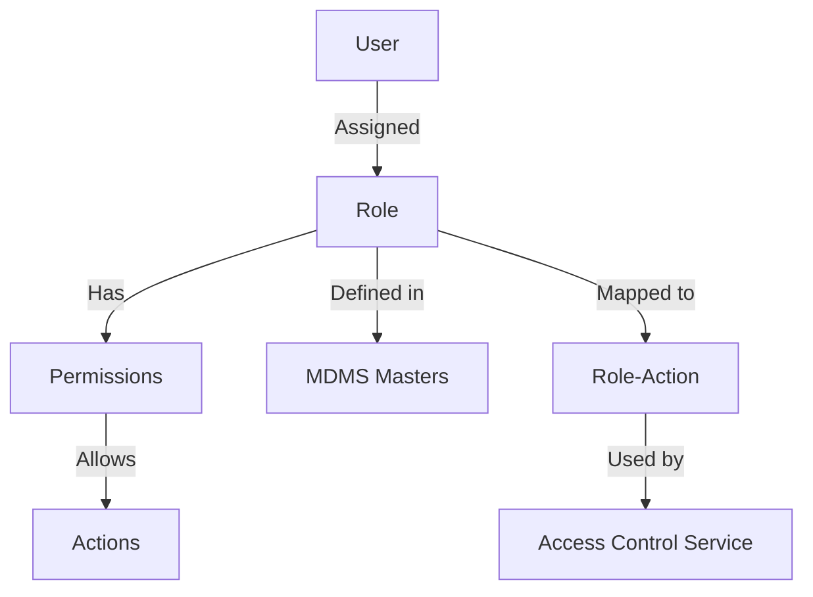

# Overview

User Role refers to the specific permissions and access rights assigned to a user within the system. Roles are defined in MDMS masters and can be assigned to users, allowing them to hold multiple roles simultaneously.

# Role Definition

The <SwmToken path="municipal-services/ws-calculator/src/main/java/org/egov/wscalculation/web/models/Role.java" pos="14:11:11" line-data=" * this to have more role related attributes">`role`</SwmToken> class defines the structure of a role, including its name, code, and description. This class is used to represent roles within the system and is carried along in <SwmToken path="municipal-services/ws-calculator/src/main/java/org/egov/wscalculation/web/models/Role.java" pos="13:3:3" line-data=" * UserInfo with RequestInfo meta data. Actual authorization service to extend">`UserInfo`</SwmToken> with <SwmToken path="municipal-services/ws-calculator/src/main/java/org/egov/wscalculation/web/models/Role.java" pos="13:7:7" line-data=" * UserInfo with RequestInfo meta data. Actual authorization service to extend">`RequestInfo`</SwmToken> metadata.

<SwmSnippet path="/municipal-services/ws-calculator/src/main/java/org/egov/wscalculation/web/models/Role.java" line="11">

---

The <SwmToken path="municipal-services/ws-calculator/src/main/java/org/egov/wscalculation/web/models/Role.java" pos="14:11:11" line-data=" * this to have more role related attributes">`role`</SwmToken> class is a minimal representation of the roles in the system. It includes attributes such as <SwmToken path="municipal-services/ws-calculator/src/main/java/org/egov/wscalculation/web/models/Role.java" pos="20:5:5" line-data="	@JsonProperty(&quot;name&quot;)">`name`</SwmToken>, <SwmToken path="municipal-services/ws-calculator/src/main/java/org/egov/wscalculation/web/models/Role.java" pos="23:5:5" line-data="	@JsonProperty(&quot;code&quot;)">`code`</SwmToken>, and <SwmToken path="municipal-services/ws-calculator/src/main/java/org/egov/wscalculation/web/models/Role.java" pos="16:3:3" line-data="@ApiModel(description = &quot;minimal representation of the Roles in the system to be carried along in UserInfo with RequestInfo meta data. Actual authorization service to extend this to have more role related attributes &quot;)">`description`</SwmToken>, which are essential for managing and identifying roles.

```java
/**
 * minimal representation of the Roles in the system to be carried along in
 * UserInfo with RequestInfo meta data. Actual authorization service to extend
 * this to have more role related attributes
 */
@ApiModel(description = "minimal representation of the Roles in the system to be carried along in UserInfo with RequestInfo meta data. Actual authorization service to extend this to have more role related attributes ")
@Validated
@javax.annotation.Generated(value = "io.swagger.codegen.v3.generators.java.SpringCodegen", date = "2019-10-24T10:29:25.253+05:30[Asia/Kolkata]")
public class Role {
	@JsonProperty("name")
	private String name = null;

	@JsonProperty("code")
	private String code = null;

	@JsonProperty("description")
	private String description = null;

	public Role name(String name) {
		this.name = name;
		return this;
```

---

</SwmSnippet>

# Role-Action Mapping

Role actions are mappings between Actions and Roles. Based on Role-Action mapping, the access control service identifies applicable actions for a role. This ensures that users can only perform actions they are authorized for.

# Main Functions

There are several main functions related to roles and role-actions. These include defining roles, assigning roles to users, and mapping roles to actions.

# Role-Action

Role actions are mappings between Actions and Roles. Based on Role-Action mapping, the access control service identifies applicable actions for a role. This ensures that users can only perform actions they are authorized for. The Role-Action mapping is essential for maintaining the integrity and security of the system by enforcing proper access controls.

&nbsp;

*This is an auto-generated document by Swimm AI 🌊 and has not yet been verified by a human*

<SwmMeta version="3.0.0" repo-id="Z2l0aHViJTNBJTNBRElHSVQtT1NTJTNBJTNBU3dpbW0tRGVtbw==" repo-name="DIGIT-OSS" doc-type="overview"><sup>Powered by [Swimm](/)</sup></SwmMeta>
