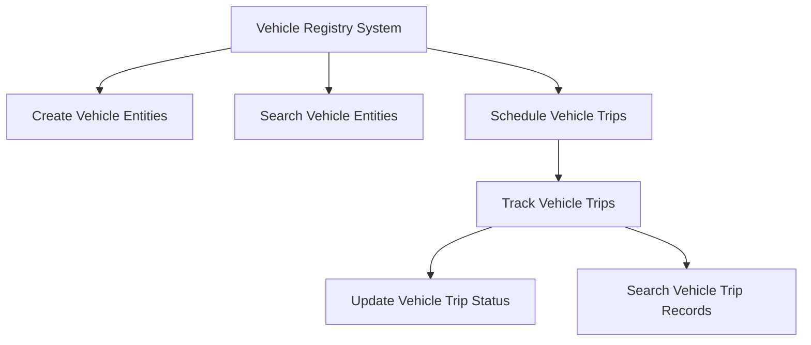

# Overview

The Vehicle Registry system enables ULB Employees to create and search Vehicle Entities and schedule Vehicle Trips for the FSM Application. It ensures that vehicles are properly assigned and managed within the FSM Application.

# Core Features

The system includes APIs to create, update, and search for vehicles and vehicle trips, facilitating efficient vehicle management.

# Vehicle Trip Creation

Vehicle Trips are created by the FSM Application when a DSO assigns a vehicle to the FSM Application in a scheduled status.

# Vehicle Trip Update

The update API helps move the vehicle trip application from one state to another, ensuring accurate tracking of vehicle statuses.

# Vehicle Trip Search

The search API fetches VehicleTrip records based on specific search criteria, allowing for detailed queries and data retrieval.

&nbsp;

*This is an auto-generated document by Swimm AI 🌊 and has not yet been verified by a human*

<SwmMeta version="3.0.0" repo-id="Z2l0aHViJTNBJTNBRElHSVQtT1NTJTNBJTNBU3dpbW0tRGVtbw==" repo-name="DIGIT-OSS" doc-type="overview">Powered by [Swimm](/)</SwmMeta>
