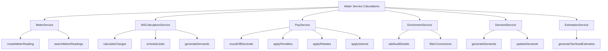

# Basic Concepts of Water Service Calculations

Water service calculations involve various functionalities provided by different classes and interfaces to manage aspects such as meter readings, demand generation, and estimation. This document will cover the main services involved in these calculations and their respective functionalities.

## <SwmToken path="municipal-services/ws-calculator/src/main/java/org/egov/wscalculation/service/MeterService.java" pos="11:4:4" line-data="public interface MeterService {">`MeterService`</SwmToken>

The <SwmToken path="municipal-services/ws-calculator/src/main/java/org/egov/wscalculation/service/MeterService.java" pos="11:4:4" line-data="public interface MeterService {">`MeterService`</SwmToken> interface defines methods for creating and searching meter readings. It is implemented by the `MeterServicesImpl` class, which handles the actual logic for managing meter readings.

<SwmSnippet path="/municipal-services/ws-calculator/src/main/java/org/egov/wscalculation/service/MeterService.java" line="11">

---

The <SwmToken path="municipal-services/ws-calculator/src/main/java/org/egov/wscalculation/service/MeterService.java" pos="11:4:4" line-data="public interface MeterService {">`MeterService`</SwmToken> interface includes methods like <SwmToken path="municipal-services/ws-calculator/src/main/java/org/egov/wscalculation/service/MeterService.java" pos="12:6:6" line-data="	List&lt;MeterReading&gt; createMeterReading(MeterConnectionRequest meterConnectionRequest);">`createMeterReading`</SwmToken> and <SwmToken path="municipal-services/ws-calculator/src/main/java/org/egov/wscalculation/service/MeterService.java" pos="14:6:6" line-data="	List&lt;MeterReading&gt; searchMeterReadings(MeterReadingSearchCriteria criteria, RequestInfo requestInfo);">`searchMeterReadings`</SwmToken> to manage meter readings.

```java
public interface MeterService {
	List<MeterReading> createMeterReading(MeterConnectionRequest meterConnectionRequest);
	
	List<MeterReading> searchMeterReadings(MeterReadingSearchCriteria criteria, RequestInfo requestInfo);
}
```

---

</SwmSnippet>

## WSCalculationService

The `WSCalculationService` interface provides methods for calculating water service charges, scheduling jobs, and generating demands based on time periods.

## <SwmToken path="municipal-services/ws-calculator/src/main/java/org/egov/wscalculation/service/PayService.java" pos="17:4:4" line-data="public class PayService {">`PayService`</SwmToken>

The <SwmToken path="municipal-services/ws-calculator/src/main/java/org/egov/wscalculation/service/PayService.java" pos="17:4:4" line-data="public class PayService {">`PayService`</SwmToken> class includes methods for rounding off decimals and applying penalties, rebates, and interest to water charges. It interacts with other services like <SwmToken path="municipal-services/ws-calculator/src/main/java/org/egov/wscalculation/service/PayService.java" pos="20:3:3" line-data="	private MasterDataService mDService;">`MasterDataService`</SwmToken> and <SwmToken path="municipal-services/ws-calculator/src/main/java/org/egov/wscalculation/service/PayService.java" pos="23:3:3" line-data="	private EstimationService estimationService;">`EstimationService`</SwmToken> to perform these calculations.

<SwmSnippet path="/municipal-services/ws-calculator/src/main/java/org/egov/wscalculation/service/PayService.java" line="16">

---

The <SwmToken path="municipal-services/ws-calculator/src/main/java/org/egov/wscalculation/service/PayService.java" pos="17:4:4" line-data="public class PayService {">`PayService`</SwmToken> class includes methods for rounding off decimals and applying penalties, rebates, and interest to water charges.

```java
@Service
public class PayService {

	@Autowired
	private MasterDataService mDService;
	
	@Autowired
	private EstimationService estimationService;

	/**
	 * Decimal is ceiled for all the tax heads
	 * 
	 * if the decimal is greater than 0.5 upper bound will be applied
	 * 
	 * else if decimal is lesser than 0.5 lower bound is applied
	 * 
	 */
	public TaxHeadEstimate roundOfDecimals(BigDecimal creditAmount, BigDecimal debitAmount, boolean isConnectionFee) {
		BigDecimal roundOffPos = BigDecimal.ZERO;
		BigDecimal roundOffNeg = BigDecimal.ZERO;
        String taxHead = isConnectionFee ? WSCalculationConstant.WS_Round_Off : WSCalculationConstant.WS_ONE_TIME_FEE_ROUND_OFF;
```

---

</SwmSnippet>

## <SwmToken path="municipal-services/ws-calculator/src/main/java/org/egov/wscalculation/service/EnrichmentService.java" pos="23:4:4" line-data="public class EnrichmentService {">`EnrichmentService`</SwmToken>

The <SwmToken path="municipal-services/ws-calculator/src/main/java/org/egov/wscalculation/service/EnrichmentService.java" pos="23:4:4" line-data="public class EnrichmentService {">`EnrichmentService`</SwmToken> class enriches incoming requests by adding audit details and filtering connections based on specific criteria. It ensures that the data is complete and accurate before processing.

<SwmSnippet path="/municipal-services/ws-calculator/src/main/java/org/egov/wscalculation/service/EnrichmentService.java" line="22">

---

The <SwmToken path="municipal-services/ws-calculator/src/main/java/org/egov/wscalculation/service/EnrichmentService.java" pos="23:4:4" line-data="public class EnrichmentService {">`EnrichmentService`</SwmToken> class enriches incoming requests by adding audit details and filtering connections based on specific criteria.

```java
@Service
public class EnrichmentService {

	/**
	 * Enriches the incoming createRequest
	 * 
	 * @param meterConnectionRequest The create request for the meter reading
	 */
	@Autowired
	private ObjectMapper mapper;

	public void enrichMeterReadingRequest(MeterConnectionRequest meterConnectionRequest) {
		AuditDetails auditDetails = getAuditDetails(meterConnectionRequest.getRequestInfo().getUserInfo().getUuid(),
				true);
		meterConnectionRequest.getMeterReading().setId(UUID.randomUUID().toString());
		if (meterConnectionRequest.getMeterReading().getLastReadingDate() == null
				|| meterConnectionRequest.getMeterReading().getLastReadingDate() == 0) {
			Long lastReadingDate = System.currentTimeMillis() - TimeUnit.DAYS.toMillis(30);
			meterConnectionRequest.getMeterReading().setLastReadingDate(lastReadingDate);
		}
		meterConnectionRequest.getMeterReading().setAuditDetails(auditDetails);
```

---

</SwmSnippet>

## <SwmToken path="municipal-services/ws-calculator/src/main/java/org/egov/wscalculation/service/DemandService.java" pos="42:4:4" line-data="public class DemandService {">`DemandService`</SwmToken>

The <SwmToken path="municipal-services/ws-calculator/src/main/java/org/egov/wscalculation/service/DemandService.java" pos="42:4:4" line-data="public class DemandService {">`DemandService`</SwmToken> class is responsible for generating and updating demands based on calculations. It uses various other services like <SwmToken path="municipal-services/ws-calculator/src/main/java/org/egov/wscalculation/service/PayService.java" pos="17:4:4" line-data="public class PayService {">`PayService`</SwmToken>, <SwmToken path="municipal-services/ws-calculator/src/main/java/org/egov/wscalculation/service/PayService.java" pos="20:3:3" line-data="	private MasterDataService mDService;">`MasterDataService`</SwmToken>, and <SwmToken path="municipal-services/ws-calculator/src/main/java/org/egov/wscalculation/service/PayService.java" pos="23:3:3" line-data="	private EstimationService estimationService;">`EstimationService`</SwmToken> to perform its tasks.

<SwmSnippet path="/municipal-services/ws-calculator/src/main/java/org/egov/wscalculation/service/DemandService.java" line="40">

---

The <SwmToken path="municipal-services/ws-calculator/src/main/java/org/egov/wscalculation/service/DemandService.java" pos="42:4:4" line-data="public class DemandService {">`DemandService`</SwmToken> class is responsible for generating and updating demands based on calculations.

```java
@Service
@Slf4j
public class DemandService {

	@Autowired
	private ServiceRequestRepository repository;

	@Autowired
	private ObjectMapper mapper;

	@Autowired
	private PayService payService;

	@Autowired
	private MasterDataService mstrDataService;

	@Autowired
	private WSCalculationUtil utils;

	@Autowired
	private WSCalculationConfiguration configs;
```

---

</SwmSnippet>

## <SwmToken path="municipal-services/ws-calculator/src/main/java/org/egov/wscalculation/service/PayService.java" pos="23:3:3" line-data="	private EstimationService estimationService;">`EstimationService`</SwmToken>

The <SwmToken path="municipal-services/ws-calculator/src/main/java/org/egov/wscalculation/service/PayService.java" pos="23:3:3" line-data="	private EstimationService estimationService;">`EstimationService`</SwmToken> class generates a list of tax head estimates based on the provided criteria. It uses various utilities and master data to calculate the estimates.

<SwmSnippet path="/municipal-services/ws-calculator/src/main/java/org/egov/wscalculation/service/EstimationService.java" line="30">

---

The <SwmToken path="municipal-services/ws-calculator/src/main/java/org/egov/wscalculation/service/EstimationService.java" pos="32:4:4" line-data="public class EstimationService {">`EstimationService`</SwmToken> class generates a list of tax head estimates based on the provided criteria.

```java
@Service
@Slf4j
public class EstimationService {

	@Autowired
	private WaterCessUtil waterCessUtil;
	
	@Autowired
	private CalculatorUtil calculatorUtil;
	

	@Autowired
	private ObjectMapper mapper;
	
	@Autowired
	private WSCalculationUtil wSCalculationUtil;

	/**
	 * Generates a List of Tax head estimates with tax head code, tax head
	 * category and the amount to be collected for the key.
	 *
```

---

</SwmSnippet>

&nbsp;

*This is an auto-generated document by Swimm AI 🌊 and has not yet been verified by a human*

<SwmMeta version="3.0.0" repo-id="Z2l0aHViJTNBJTNBRElHSVQtT1NTJTNBJTNBU3dpbW0tRGVtbw==" repo-name="DIGIT-OSS" doc-type="overview"><sup>Powered by [Swimm](/)</sup></SwmMeta>
