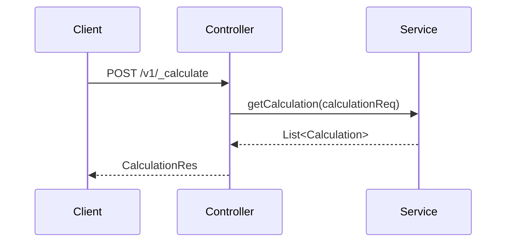

# Overview

The Echallan calculator is a service used to calculate the echallan amount based on the details present in the echallan request. This module is designed to serve echallan calculations for different types of services. The application calculates the <SwmToken path="municipal-services/echallan-calculator/src/main/resources/application.properties" pos="1:6:6" line-data="server.context-path=/echallan-calculator">`echallan`</SwmToken> fees based on the data mentioned in the echallan creation. Based on the tax amount mentioned in the echallan, a demand is created. Once the demand is created, the application calls the billing-services API to generate the fees.

# Main Application

The main class <SwmToken path="municipal-services/echallan-calculator/src/main/java/org/egov/echallancalculation/EchallanCalMain.java" pos="14:4:4" line-data="public class EchallanCalMain {">`EchallanCalMain`</SwmToken> initializes the Spring Boot application for the Echallan calculator service.

<SwmSnippet path="/municipal-services/echallan-calculator/src/main/java/org/egov/echallancalculation/EchallanCalMain.java" line="1">

---

The <SwmToken path="municipal-services/echallan-calculator/src/main/java/org/egov/echallancalculation/EchallanCalMain.java" pos="14:4:4" line-data="public class EchallanCalMain {">`EchallanCalMain`</SwmToken> class initializes the Spring Boot application for the Echallan calculator service. It imports necessary configurations and scans the required packages.

```java
package org.egov.echallancalculation;


import org.egov.tracer.config.TracerConfiguration;
import org.springframework.boot.SpringApplication;
import org.springframework.boot.autoconfigure.SpringBootApplication;
import org.springframework.context.annotation.ComponentScan;
import org.springframework.context.annotation.Import;


@SpringBootApplication
@ComponentScan(basePackages = { "org.egov.echallancalculation", "org.egov.echallancalculation.web.controllers" , "org.egov.echallancalculation.config"})
@Import({ TracerConfiguration.class })
public class EchallanCalMain {

    public static void main(String[] args) throws Exception {
        SpringApplication.run(EchallanCalMain.class, args);
    }

}
```

---

</SwmSnippet>

# Configuration

The <SwmPath>[municipal-services/echallan-calculator/src/main/resources/application.properties](municipal-services/echallan-calculator/src/main/resources/application.properties)</SwmPath> file contains configuration settings such as the server context path and port for the Echallan calculator service.

<SwmSnippet path="/municipal-services/echallan-calculator/src/main/resources/application.properties" line="1">

---

The <SwmPath>[municipal-services/echallan-calculator/src/main/resources/application.properties](municipal-services/echallan-calculator/src/main/resources/application.properties)</SwmPath> file sets the server context path, servlet context path, server port, and application timezone for the Echallan calculator service.

```ini
server.context-path=/echallan-calculator
server.servlet.context-path=/echallan-calculator
server.port=8078
app.timezone=UTC
```

---

</SwmSnippet>

# Main Functions

There are several main functions in this module. Some of them include calculating the echallan amount, creating demand, and generating fees. We will dive a little into calculating the echallan amount and creating demand.

## Calculate the Echallan Amount

This function calculates the echallan amount based on the details present in the echallan request. It is designed to serve echallan calculations for different types of services.

## Create Demand

Based on the tax amount mentioned in the echallan, this function creates a demand. Once the demand is created, it calls the billing-services API to generate the fees.

# Echallan Calculator Endpoints

The Echallan calculator provides several endpoints to interact with the service.

## Calculate Endpoint

The <SwmToken path="municipal-services/echallan-calculator/src/main/java/org/egov/echallancalculation/web/controllers/ChallanCalController.java" pos="28:8:8" line-data="	public ResponseEntity&lt;CalculationRes&gt; calculate(@Valid @RequestBody CalculationReq calculationReq,@PathVariable(required = false) String servicename) {">`calculate`</SwmToken> endpoint is used to calculate the echallan amount based on the details provided in the <SwmToken path="municipal-services/echallan-calculator/src/main/java/org/egov/echallancalculation/web/controllers/ChallanCalController.java" pos="28:16:16" line-data="	public ResponseEntity&lt;CalculationRes&gt; calculate(@Valid @RequestBody CalculationReq calculationReq,@PathVariable(required = false) String servicename) {">`CalculationReq`</SwmToken> object. It calls the <SwmToken path="municipal-services/echallan-calculator/src/main/java/org/egov/echallancalculation/web/controllers/ChallanCalController.java" pos="31:7:7" line-data="		calculations = calculationService.getCalculation(calculationReq);">`getCalculation`</SwmToken> method from the <SwmToken path="municipal-services/echallan-calculator/src/main/java/org/egov/echallancalculation/web/controllers/ChallanCalController.java" pos="31:5:5" line-data="		calculations = calculationService.getCalculation(calculationReq);">`calculationService`</SwmToken> to perform the calculation and returns a <SwmToken path="municipal-services/echallan-calculator/src/main/java/org/egov/echallancalculation/web/controllers/ChallanCalController.java" pos="28:5:5" line-data="	public ResponseEntity&lt;CalculationRes&gt; calculate(@Valid @RequestBody CalculationReq calculationReq,@PathVariable(required = false) String servicename) {">`CalculationRes`</SwmToken> object containing the calculated amounts.

<SwmSnippet path="/municipal-services/echallan-calculator/src/main/java/org/egov/echallancalculation/web/controllers/ChallanCalController.java" line="27">

---

The <SwmToken path="municipal-services/echallan-calculator/src/main/java/org/egov/echallancalculation/web/controllers/ChallanCalController.java" pos="28:8:8" line-data="	public ResponseEntity&lt;CalculationRes&gt; calculate(@Valid @RequestBody CalculationReq calculationReq,@PathVariable(required = false) String servicename) {">`calculate`</SwmToken> endpoint in the <SwmToken path="municipal-services/echallan-calculator/src/main/java/org/egov/echallancalculation/web/controllers/ChallanCalController.java" pos="23:4:4" line-data="public class ChallanCalController {">`ChallanCalController`</SwmToken> class handles POST requests to calculate the echallan amount. It uses the <SwmToken path="municipal-services/echallan-calculator/src/main/java/org/egov/echallancalculation/web/controllers/ChallanCalController.java" pos="31:7:7" line-data="		calculations = calculationService.getCalculation(calculationReq);">`getCalculation`</SwmToken> method from the <SwmToken path="municipal-services/echallan-calculator/src/main/java/org/egov/echallancalculation/web/controllers/ChallanCalController.java" pos="31:5:5" line-data="		calculations = calculationService.getCalculation(calculationReq);">`calculationService`</SwmToken> to perform the calculation and returns a <SwmToken path="municipal-services/echallan-calculator/src/main/java/org/egov/echallancalculation/web/controllers/ChallanCalController.java" pos="28:5:5" line-data="	public ResponseEntity&lt;CalculationRes&gt; calculate(@Valid @RequestBody CalculationReq calculationReq,@PathVariable(required = false) String servicename) {">`CalculationRes`</SwmToken> object.

```java
	@PostMapping("/_calculate")
	public ResponseEntity<CalculationRes> calculate(@Valid @RequestBody CalculationReq calculationReq,@PathVariable(required = false) String servicename) {

		List<Calculation> calculations = null;
		calculations = calculationService.getCalculation(calculationReq);

		CalculationRes calculationRes = CalculationRes.builder().calculations(calculations).build();
		return new ResponseEntity<CalculationRes>(calculationRes, HttpStatus.OK);
	}
```

---

</SwmSnippet>

&nbsp;

*This is an auto-generated document by Swimm AI 🌊 and has not yet been verified by a human*

<SwmMeta version="3.0.0" repo-id="Z2l0aHViJTNBJTNBRElHSVQtT1NTJTNBJTNBU3dpbW0tRGVtbw==" repo-name="DIGIT-OSS" doc-type="overview"><sup>Powered by [Swimm](/)</sup></SwmMeta>
