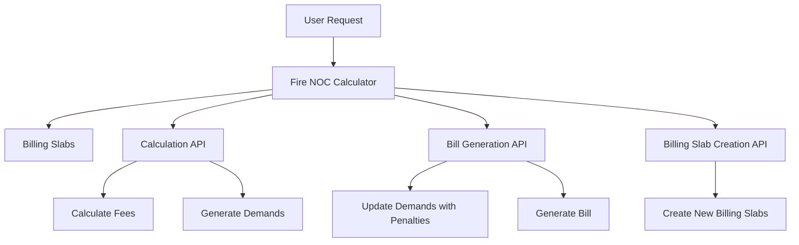

# Overview

The Firenoc calculator is a module designed to manage the billing process for Fire NOC (No Objection Certificate) services. It allows users to create, update, and search for billing slabs, which are predefined rates used to calculate charges. The module calculates and generates Fire NOC charges based on these billing slabs. It integrates with several services such as billing-service, egov-mdms, and firenoc-service to fetch necessary data and ensure accurate calculations.

# Main Functions

The Firenoc calculator provides several main functions through its APIs. These include calculating fees, generating demands, and updating demands with penalties if applicable. Additionally, it supports the creation of new billing slabs to accommodate changes in the billing structure.

## Calculation API

The <SwmToken path="municipal-services/firenoc-calculator/src/controller/index.js" pos="23:6:9" line-data="    &quot;/firenoc-calculator/v1/_calculate&quot;,">`/v1/_calculate`</SwmToken> endpoint calculates the Fire NOC fee and generates the respective demands in the system. It processes the calculation criteria provided in the request and interacts with various services to fetch necessary data and compute the charges.

<SwmSnippet path="/municipal-services/firenoc-calculator/src/controller/index.js" line="23">

---

The <SwmToken path="municipal-services/firenoc-calculator/src/controller/index.js" pos="23:6:9" line-data="    &quot;/firenoc-calculator/v1/_calculate&quot;,">`/v1/_calculate`</SwmToken> endpoint is defined in the code to handle the calculation of Fire NOC fees and the generation of demands.

```javascript
    "/firenoc-calculator/v1/_calculate",
    asyncHandler(
      async (req, res, next) => await calculate(req, res, pool, next)
    )
  );
```

---

</SwmSnippet>

## Bill Generation API

The <SwmToken path="municipal-services/firenoc-calculator/src/controller/index.js" pos="29:6:9" line-data="    &quot;/firenoc-calculator/v1/_getbill&quot;,">`/v1/_getbill`</SwmToken> endpoint updates demand with time-based penalties if applicable and generates a bill for the given criteria. It ensures that the bill reflects any penalties or rebates based on the current state of the demand.

<SwmSnippet path="/municipal-services/firenoc-calculator/src/controller/index.js" line="28">

---

The <SwmToken path="municipal-services/firenoc-calculator/src/controller/index.js" pos="29:6:9" line-data="    &quot;/firenoc-calculator/v1/_getbill&quot;,">`/v1/_getbill`</SwmToken> endpoint is defined in the code to handle the updating of demands with penalties and the generation of bills.

```javascript
  api.post(
    "/firenoc-calculator/v1/_getbill",
    asyncHandler(async (req, res, next) => getbill(req, res, next))
  );
```

---

</SwmSnippet>

## Billing Slab Creation API

The <SwmToken path="municipal-services/firenoc-calculator/src/controller/index.js" pos="13:10:13" line-data="  api.post(&quot;/firenoc-calculator/billingslab/_create&quot;, (req, res, next) =&gt;">`/billingslab/_create`</SwmToken> endpoint allows for the creation of new billing slabs for Fire NOC calculation. This is essential for accommodating changes in the billing structure and ensuring accurate fee calculations.

&nbsp;

*This is an auto-generated document by Swimm AI 🌊 and has not yet been verified by a human*

<SwmMeta version="3.0.0" repo-id="Z2l0aHViJTNBJTNBRElHSVQtT1NTJTNBJTNBU3dpbW0tRGVtbw==" repo-name="DIGIT-OSS" doc-type="overview"><sup>Powered by [Swimm](/)</sup></SwmMeta>
