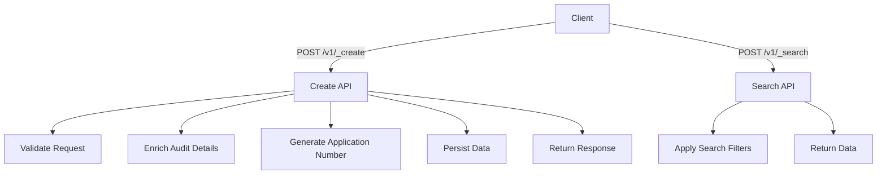

# Overview

Firenoc services refer to the functionalities provided by the Fire-NOC module, which is designed to issue a No Objection Certificate (NOC) indicating that a building complies with fire safety norms and regulations. These services are dependent on several other services such as egov-mdms, egov-user, egov-idgen, egov-workflow, egov-location, and firenoc-calculator to function effectively.

# Dependencies

The Firenoc services rely on several infrastructure dependencies such as Postgres DB, Kafka, Redis, and Elasticsearch.

# Running Locally

To run the Firenoc services locally, you need to port forward several services using kubectl commands.

# Firenoc Calculator

The Firenoc Calculator module is responsible for creating, updating, and searching billing slabs, as well as calculating and generating FireNOC charges. It makes calls to the egov-mdms-service to fetch required master data, which is crucial for validating applications. The master data fetched includes details about building types, state-level constants, units of measurement, and ULB-level constants.

<SwmSnippet path="/municipal-services/firenoc-services/src/services/firenocCalculatorService.js" line="4">

---

## Example of Firenoc Calculator Usage

The `calculate` function in the Firenoc Calculator Service demonstrates how to calculate FireNOC charges by making an HTTP request to the calculator endpoint.

```javascript
export const calculate = async (firenoc, requestInfo) => {
  const tenantId = firenoc.tenantId;
  const CalulationCriteria = [];
  CalulationCriteria.push({ fireNOC: firenoc, tenantId });
  const requestBody = {
    RequestInfo: requestInfo,
    CalulationCriteria
  };
  var calculateResponse = await httpRequest({
    hostURL: envVariables.EGOV_FN_CALCULATOR_HOST,
    endPoint: `${envVariables.EGOV_FN_CALCULATOR_CONTEXT_PATH}${
      envVariables.EGOV_FN_CALCULATOR_CALCULATOR_ENPOINT
    }`,
    requestBody
  });

  return calculateResponse;
};
```

---

</SwmSnippet>

# Main Functions

There are several main functions in this folder. Some of them are creating, updating, searching billing slabs, and calculating and generating FireNOC charges. We will dive a little into creating, updating, and searching billing slabs.

## Creating Billing Slabs

The function for creating billing slabs is responsible for defining new billing slabs that will be used to calculate FireNOC charges. This involves specifying the parameters and rates for different types of buildings and fire safety requirements.

## Calculating and Generating FireNOC Charges

The function for calculating and generating FireNOC charges uses the defined billing slabs to compute the charges for a given application. This ensures that the charges are accurate and based on the latest billing information.

# Firenoc Service Endpoints

The Firenoc Service Endpoints provide various functionalities for managing FireNOC applications.

<SwmSnippet path="/municipal-services/firenoc-services/src/api/create.js" line="20">

---

## /v1/\_create

The `/v1/_create` endpoint is used to create a new FireNOC application. It validates the request body, enriches audit details, generates an application number using idgen, persists data, and returns a response.

```javascript
    "/_create",
    asyncHandler(async ({ body }, res, next) => {
      let response = await createApiResponse({ body }, res, next);
      if(response.Errors)
        res.status(400);
      res.json(response);
    })
  );
```

---

</SwmSnippet>

<SwmSnippet path="/municipal-services/firenoc-services/src/api/search.js" line="17">

---

## /v1/\_search

The `/v1/_search` endpoint is used to search for existing FireNOC applications. It applies search filters based on the user's role and returns the relevant data.

```javascript
    "/_search",
    asyncHandler(async (request, res, next) => {
      let response = await searchApiResponse(request, next);
      res.json(response);
    })
  );
```

---

</SwmSnippet>

&nbsp;

*This is an auto-generated document by Swimm AI 🌊 and has not yet been verified by a human*

<SwmMeta version="3.0.0" repo-id="Z2l0aHViJTNBJTNBRElHSVQtT1NTJTNBJTNBU3dpbW0tRGVtbw==" repo-name="DIGIT-OSS" doc-type="overview"><sup>Powered by [Swimm](https://app.swimm.io/)</sup></SwmMeta>
