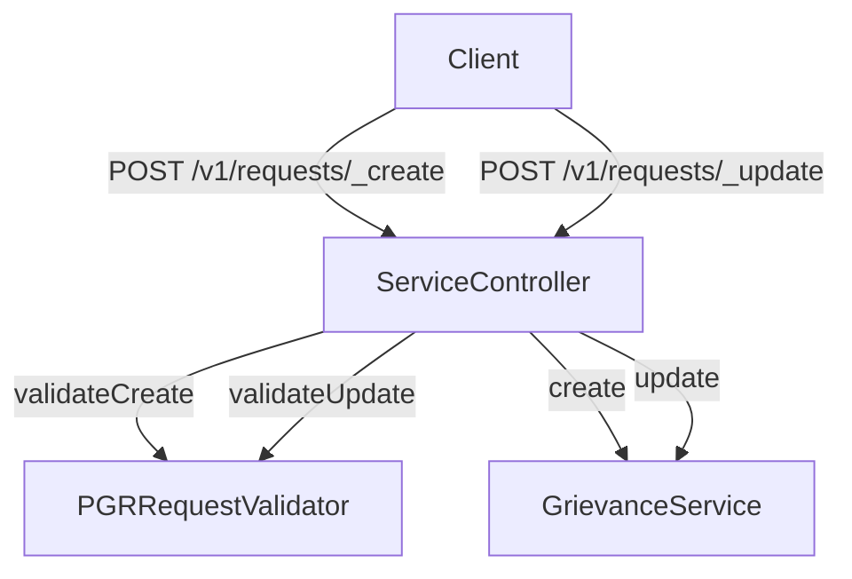

# Overview

Rainmaker Public Grievance Redressal (PGR) is a service designed to enable users to file complaints and have them resolved efficiently. It facilitates live tracking of the complaint status, allowing users to stay updated on the progress. The service includes features for uploading images, posting comments, and a workflow for complaint resolution. Rainmaker PGR provides both a citizen interface and an employee interface to cater to different user needs.

# Dependencies

To set up Rainmaker PGR locally, ensure that you have the necessary infrastructure dependencies like Postgres DB, Redis, Elastic Search, and Kafka.

# Running Locally

Follow the instructions in the Local Setup document to run Rainmaker PGR on your local system.

# Rainmaker PGR Endpoints

Rainmaker PGR provides several endpoints to manage service requests. Below are the primary endpoints used in the system.

## Create Endpoint

The <SwmToken path="municipal-services/rainmaker-pgr/src/main/java/org/egov/pgr/controller/ServiceController.java" pos="40:6:6" line-data="	private ResponseEntity&lt;?&gt; create(@RequestBody @Valid ServiceRequest serviceRequest) {">`create`</SwmToken> endpoint is used to create new service requests. It validates the request and then calls the <SwmToken path="municipal-services/rainmaker-pgr/src/main/java/org/egov/pgr/controller/ServiceController.java" pos="40:6:6" line-data="	private ResponseEntity&lt;?&gt; create(@RequestBody @Valid ServiceRequest serviceRequest) {">`create`</SwmToken> method of the <SwmToken path="municipal-services/rainmaker-pgr/src/main/java/org/egov/pgr/controller/ServiceController.java" pos="9:10:10" line-data="import org.egov.pgr.service.GrievanceService;">`GrievanceService`</SwmToken> to process the request.

<SwmSnippet path="/municipal-services/rainmaker-pgr/src/main/java/org/egov/pgr/controller/ServiceController.java" line="38">

---

The <SwmToken path="municipal-services/rainmaker-pgr/src/main/java/org/egov/pgr/controller/ServiceController.java" pos="40:6:6" line-data="	private ResponseEntity&lt;?&gt; create(@RequestBody @Valid ServiceRequest serviceRequest) {">`create`</SwmToken> endpoint in the <SwmToken path="municipal-services/rainmaker-pgr/src/main/java/org/egov/pgr/controller/ServiceController.java" pos="23:4:4" line-data="public class ServiceController {">`ServiceController`</SwmToken> class handles the creation of new service requests. It validates the incoming request using <SwmToken path="municipal-services/rainmaker-pgr/src/main/java/org/egov/pgr/controller/ServiceController.java" pos="41:1:3" line-data="		pgrRequestValidator.validateCreate(serviceRequest);">`pgrRequestValidator.validateCreate`</SwmToken> and then processes it using <SwmToken path="municipal-services/rainmaker-pgr/src/main/java/org/egov/pgr/controller/ServiceController.java" pos="42:7:9" line-data="		ServiceResponse response = service.create(serviceRequest);">`service.create`</SwmToken>.

```java
	@PostMapping("_create")
	@ResponseBody
	private ResponseEntity<?> create(@RequestBody @Valid ServiceRequest serviceRequest) {
		pgrRequestValidator.validateCreate(serviceRequest);
		ServiceResponse response = service.create(serviceRequest);
		return new ResponseEntity<>(response, HttpStatus.CREATED);
	}
```

---

</SwmSnippet>

<SwmSnippet path="/municipal-services/rainmaker-pgr/src/main/java/org/egov/pgr/controller/ServiceController.java" line="52">

---

The <SwmToken path="municipal-services/rainmaker-pgr/src/main/java/org/egov/pgr/controller/ServiceController.java" pos="54:6:6" line-data="	private ResponseEntity&lt;?&gt; update(@RequestBody @Valid ServiceRequest serviceRequest) {">`update`</SwmToken> endpoint in the <SwmToken path="municipal-services/rainmaker-pgr/src/main/java/org/egov/pgr/controller/ServiceController.java" pos="23:4:4" line-data="public class ServiceController {">`ServiceController`</SwmToken> class handles the updating of existing service requests. It validates the incoming request using <SwmToken path="municipal-services/rainmaker-pgr/src/main/java/org/egov/pgr/controller/ServiceController.java" pos="55:1:3" line-data="		pgrRequestValidator.validateUpdate(serviceRequest);">`pgrRequestValidator.validateUpdate`</SwmToken> and then processes it using <SwmToken path="municipal-services/rainmaker-pgr/src/main/java/org/egov/pgr/controller/ServiceController.java" pos="56:7:9" line-data="		ServiceResponse response = service.update(serviceRequest);">`service.update`</SwmToken>.

```java
	@PostMapping("_update")
	@ResponseBody
	private ResponseEntity<?> update(@RequestBody @Valid ServiceRequest serviceRequest) {
		pgrRequestValidator.validateUpdate(serviceRequest);
		ServiceResponse response = service.update(serviceRequest);
		return new ResponseEntity<>(response, HttpStatus.OK);
	}
```

---

</SwmSnippet>

## Data Flow

The data flow for creating and updating service requests involves several components. The client sends a POST request to the appropriate endpoint (<SwmToken path="municipal-services/rainmaker-pgr/src/main/java/org/egov/pgr/controller/ServiceController.java" pos="38:5:5" line-data="	@PostMapping(&quot;_create&quot;)">`_create`</SwmToken> or <SwmToken path="municipal-services/rainmaker-pgr/src/main/java/org/egov/pgr/controller/ServiceController.java" pos="52:5:5" line-data="	@PostMapping(&quot;_update&quot;)">`_update`</SwmToken>). The <SwmToken path="municipal-services/rainmaker-pgr/src/main/java/org/egov/pgr/controller/ServiceController.java" pos="23:4:4" line-data="public class ServiceController {">`ServiceController`</SwmToken> validates the request and then processes it using the <SwmToken path="municipal-services/rainmaker-pgr/src/main/java/org/egov/pgr/controller/ServiceController.java" pos="9:10:10" line-data="import org.egov.pgr.service.GrievanceService;">`GrievanceService`</SwmToken>.

&nbsp;

*This is an auto-generated document by Swimm AI 🌊 and has not yet been verified by a human*

<SwmMeta version="3.0.0" repo-id="Z2l0aHViJTNBJTNBRElHSVQtT1NTJTNBJTNBU3dpbW0tRGVtbw==" repo-name="DIGIT-OSS" doc-type="overview"><sup>Powered by [Swimm](/)</sup></SwmMeta>
