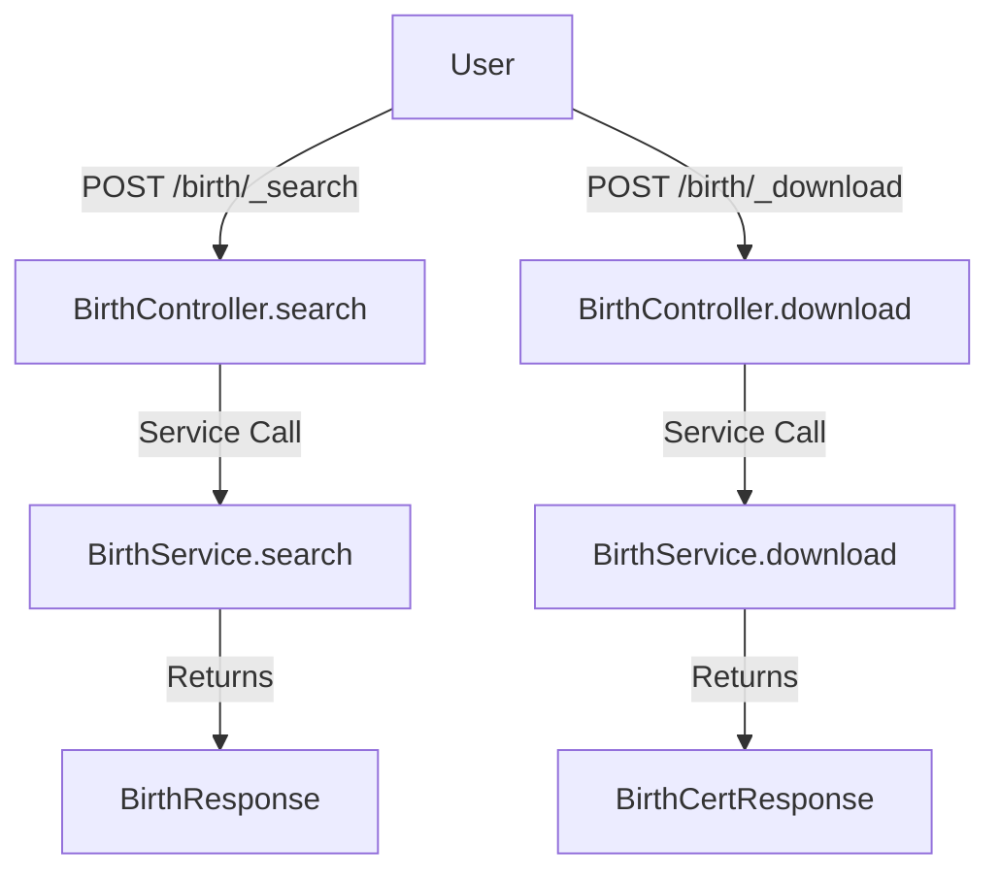

# Overview

Birth registration refers to the functionality of registering and managing birth records within the system. It allows employees to register new birth applications, update existing records, and search for birth details. Citizens can download birth certificates, with the first download being free and subsequent downloads requiring a fee.

# Birth Registration Service

The Birth Registration Service is used to issue birth certificates. It integrates with User service, <SwmToken path="municipal-services/birth-death-services/src/main/java/org/bel/birthdeath/birth/repository/BirthRepository.java" pos="23:10:10" line-data="import org.bel.birthdeath.common.Idgen.IdGenerationRequest;">`Idgen`</SwmToken> service, and Workflow service to create, update, and search birth registration applications. It also integrates with btr-calculator to calculate the amount to be paid.

## Methods

The service provides methods such as `_create` to create a birth registration application, `_update` to update an application based on the application number, and <SwmToken path="municipal-services/birth-death-services/src/main/java/org/bel/birthdeath/birth/controller/BirthController.java" pos="50:12:12" line-data="	@PostMapping(value = { &quot;/_search&quot;})">`_search`</SwmToken> to search for an application based on the application number.

# <SwmToken path="municipal-services/birth-death-services/src/main/java/org/bel/birthdeath/birth/controller/BirthController.java" pos="31:4:4" line-data="public class BirthController {">`BirthController`</SwmToken>

The <SwmToken path="municipal-services/birth-death-services/src/main/java/org/bel/birthdeath/birth/controller/BirthController.java" pos="31:4:4" line-data="public class BirthController {">`BirthController`</SwmToken> class handles HTTP requests related to birth records. It provides endpoints for searching, downloading, and viewing birth certificate data.

<SwmSnippet path="/municipal-services/birth-death-services/src/main/java/org/bel/birthdeath/birth/controller/BirthController.java" line="29">

---

The <SwmToken path="municipal-services/birth-death-services/src/main/java/org/bel/birthdeath/birth/controller/BirthController.java" pos="31:4:4" line-data="public class BirthController {">`BirthController`</SwmToken> class is annotated with <SwmToken path="municipal-services/birth-death-services/src/main/java/org/bel/birthdeath/birth/controller/BirthController.java" pos="29:0:1" line-data="@RestController">`@RestController`</SwmToken> and <SwmToken path="municipal-services/birth-death-services/src/main/java/org/bel/birthdeath/birth/controller/BirthController.java" pos="30:0:7" line-data="@RequestMapping(&quot;/birth&quot;)">`@RequestMapping("/birth")`</SwmToken>. It autowires the <SwmToken path="municipal-services/birth-death-services/src/main/java/org/bel/birthdeath/birth/controller/BirthController.java" pos="34:1:1" line-data="	BirthService birthService;">`BirthService`</SwmToken> and <SwmToken path="municipal-services/birth-death-services/src/main/java/org/bel/birthdeath/birth/controller/BirthController.java" pos="37:3:3" line-data="	private ResponseInfoFactory responseInfoFactory;">`ResponseInfoFactory`</SwmToken> classes and initializes the list of live citizen tenants.

```java
@RestController
@RequestMapping("/birth")
public class BirthController {
	
	@Autowired
	BirthService birthService;
	
	@Autowired
	private ResponseInfoFactory responseInfoFactory;
	
	@Value("#{'${egov.bnd.live.citizen.tenants}'.split(',')}")
    private String[] liveCitizenTenants;
	
	private List<String> liveCitizenTenantsList = new ArrayList<String>();
	
	@PostConstruct
    public void loadTenants() {
    	liveCitizenTenantsList = Arrays.asList(liveCitizenTenants);
    }
```

---

</SwmSnippet>

# <SwmToken path="municipal-services/birth-death-services/src/main/java/org/bel/birthdeath/birth/controller/BirthController.java" pos="34:1:1" line-data="	BirthService birthService;">`BirthService`</SwmToken>

The <SwmToken path="municipal-services/birth-death-services/src/main/java/org/bel/birthdeath/birth/controller/BirthController.java" pos="34:1:1" line-data="	BirthService birthService;">`BirthService`</SwmToken> class contains the business logic for managing birth records. It includes methods for searching birth details, downloading birth certificates, and validating birth data.

<SwmSnippet path="/municipal-services/birth-death-services/src/main/java/org/bel/birthdeath/birth/service/BirthService.java" line="39">

---

The <SwmToken path="municipal-services/birth-death-services/src/main/java/org/bel/birthdeath/birth/service/BirthService.java" pos="40:4:4" line-data="public class BirthService {">`BirthService`</SwmToken> class is annotated with <SwmToken path="municipal-services/birth-death-services/src/main/java/org/bel/birthdeath/birth/service/BirthService.java" pos="39:0:1" line-data="@Service">`@Service`</SwmToken> and autowires various repositories and services such as <SwmToken path="municipal-services/birth-death-services/src/main/java/org/bel/birthdeath/birth/service/BirthService.java" pos="43:1:1" line-data="	BirthRepository repository;">`BirthRepository`</SwmToken>, <SwmToken path="municipal-services/birth-death-services/src/main/java/org/bel/birthdeath/birth/service/BirthService.java" pos="46:1:1" line-data="	ServiceRequestRepository serviceRequestRepository;">`ServiceRequestRepository`</SwmToken>, <SwmToken path="municipal-services/birth-death-services/src/main/java/org/bel/birthdeath/birth/service/BirthService.java" pos="53:1:1" line-data="	BirthValidator validator;">`BirthValidator`</SwmToken>, <SwmToken path="municipal-services/birth-death-services/src/main/java/org/bel/birthdeath/birth/service/BirthService.java" pos="56:1:1" line-data="	EnrichmentService enrichmentService;">`EnrichmentService`</SwmToken>, and <SwmToken path="municipal-services/birth-death-services/src/main/java/org/bel/birthdeath/birth/service/BirthService.java" pos="59:1:1" line-data="	CalculationService calculationService;">`CalculationService`</SwmToken>.

```java
@Service
public class BirthService {
	
	@Autowired
	BirthRepository repository;

	@Autowired
	ServiceRequestRepository serviceRequestRepository;
	
	@Autowired
	@Qualifier("objectMapperBnd")
	ObjectMapper objectMapper;
	
	@Autowired
	BirthValidator validator;
	
	@Autowired
	EnrichmentService enrichmentService;
	
	@Autowired
	CalculationService calculationService;
```

---

</SwmSnippet>

# <SwmToken path="municipal-services/birth-death-services/src/main/java/org/bel/birthdeath/birth/service/BirthService.java" pos="43:1:1" line-data="	BirthRepository repository;">`BirthRepository`</SwmToken>

The <SwmToken path="municipal-services/birth-death-services/src/main/java/org/bel/birthdeath/birth/service/BirthService.java" pos="43:1:1" line-data="	BirthRepository repository;">`BirthRepository`</SwmToken> class interacts with the database to fetch and store birth records. It uses various row mappers to map database rows to Java objects.

<SwmSnippet path="/municipal-services/birth-death-services/src/main/java/org/bel/birthdeath/birth/repository/BirthRepository.java" line="59">

---

The <SwmToken path="municipal-services/birth-death-services/src/main/java/org/bel/birthdeath/birth/repository/BirthRepository.java" pos="61:4:4" line-data="public class BirthRepository {">`BirthRepository`</SwmToken> class is annotated with <SwmToken path="municipal-services/birth-death-services/src/main/java/org/bel/birthdeath/birth/repository/BirthRepository.java" pos="60:0:1" line-data="@Repository">`@Repository`</SwmToken> and autowires the <SwmToken path="municipal-services/birth-death-services/src/main/java/org/bel/birthdeath/birth/repository/BirthRepository.java" pos="64:3:3" line-data="    private JdbcTemplate jdbcTemplate;">`JdbcTemplate`</SwmToken> and various row mappers such as <SwmToken path="municipal-services/birth-death-services/src/main/java/org/bel/birthdeath/birth/repository/BirthRepository.java" pos="67:3:3" line-data="	private BirthDtlAllQueryBuilder allqueryBuilder;">`BirthDtlAllQueryBuilder`</SwmToken>, <SwmToken path="municipal-services/birth-death-services/src/main/java/org/bel/birthdeath/birth/repository/BirthRepository.java" pos="70:3:3" line-data="	private BirthDtlsRowMapper rowMapper;">`BirthDtlsRowMapper`</SwmToken>, <SwmToken path="municipal-services/birth-death-services/src/main/java/org/bel/birthdeath/birth/repository/BirthRepository.java" pos="73:3:3" line-data="	private BirthDtlsAllRowMapper allRowMapper;">`BirthDtlsAllRowMapper`</SwmToken>, <SwmToken path="municipal-services/birth-death-services/src/main/java/org/bel/birthdeath/birth/repository/BirthRepository.java" pos="76:3:3" line-data="	private BirthMasterDtlRowMapper birthMasterDtlRowMapper;">`BirthMasterDtlRowMapper`</SwmToken>, and <SwmToken path="municipal-services/birth-death-services/src/main/java/org/bel/birthdeath/birth/repository/BirthRepository.java" pos="79:3:3" line-data="	private BirthCertRowMapper birthCertRowMapper;">`BirthCertRowMapper`</SwmToken>.

```java
@Slf4j
@Repository
public class BirthRepository {

	@Autowired
    private JdbcTemplate jdbcTemplate;
	
	@Autowired
	private BirthDtlAllQueryBuilder allqueryBuilder;
	
	@Autowired
	private BirthDtlsRowMapper rowMapper;
	
	@Autowired
	private BirthDtlsAllRowMapper allRowMapper;
	
	@Autowired
	private BirthMasterDtlRowMapper birthMasterDtlRowMapper;
	
	@Autowired
	private BirthCertRowMapper birthCertRowMapper;
```

---

</SwmSnippet>

# Birth APIs

The Birth APIs provide endpoints for searching and downloading birth records.

## /birth/\_search

The `/birth/_search` endpoint allows users to search for birth records based on specific criteria. The <SwmToken path="municipal-services/birth-death-services/src/main/java/org/bel/birthdeath/birth/controller/BirthController.java" pos="51:8:8" line-data="    public ResponseEntity&lt;BirthResponse&gt; search(@RequestBody RequestInfoWrapper requestInfoWrapper,">`search`</SwmToken> method in <SwmToken path="municipal-services/birth-death-services/src/main/java/org/bel/birthdeath/birth/controller/BirthController.java" pos="31:4:4" line-data="public class BirthController {">`BirthController`</SwmToken> handles this endpoint. It takes a <SwmToken path="municipal-services/birth-death-services/src/main/java/org/bel/birthdeath/birth/controller/BirthController.java" pos="75:13:13" line-data="    public ResponseEntity&lt;BirthCertResponse&gt; download(@RequestBody RequestInfoWrapper requestInfoWrapper,">`RequestInfoWrapper`</SwmToken> and <SwmToken path="municipal-services/birth-death-services/src/main/java/org/bel/birthdeath/birth/controller/BirthController.java" pos="76:7:7" line-data="                                                       @Valid @ModelAttribute SearchCriteria criteria) {">`SearchCriteria`</SwmToken> as input, processes the search through <SwmToken path="municipal-services/birth-death-services/src/main/java/org/bel/birthdeath/birth/controller/BirthController.java" pos="34:1:1" line-data="	BirthService birthService;">`BirthService`</SwmToken>, and returns a <SwmToken path="municipal-services/birth-death-services/src/main/java/org/bel/birthdeath/birth/controller/BirthController.java" pos="19:12:12" line-data="import org.bel.birthdeath.common.contract.BirthResponse;">`BirthResponse`</SwmToken> containing the search results.

## /birth/\_download

The `/birth/_download` endpoint allows users to download birth certificates. The <SwmToken path="municipal-services/birth-death-services/src/main/java/org/bel/birthdeath/birth/controller/BirthController.java" pos="75:8:8" line-data="    public ResponseEntity&lt;BirthCertResponse&gt; download(@RequestBody RequestInfoWrapper requestInfoWrapper,">`download`</SwmToken> method in <SwmToken path="municipal-services/birth-death-services/src/main/java/org/bel/birthdeath/birth/controller/BirthController.java" pos="31:4:4" line-data="public class BirthController {">`BirthController`</SwmToken> handles this endpoint. It takes a <SwmToken path="municipal-services/birth-death-services/src/main/java/org/bel/birthdeath/birth/controller/BirthController.java" pos="75:13:13" line-data="    public ResponseEntity&lt;BirthCertResponse&gt; download(@RequestBody RequestInfoWrapper requestInfoWrapper,">`RequestInfoWrapper`</SwmToken> and <SwmToken path="municipal-services/birth-death-services/src/main/java/org/bel/birthdeath/birth/controller/BirthController.java" pos="76:7:7" line-data="                                                       @Valid @ModelAttribute SearchCriteria criteria) {">`SearchCriteria`</SwmToken> as input, checks if the tenant is valid, and processes the download through <SwmToken path="municipal-services/birth-death-services/src/main/java/org/bel/birthdeath/birth/controller/BirthController.java" pos="34:1:1" line-data="	BirthService birthService;">`BirthService`</SwmToken>. The response is a <SwmToken path="municipal-services/birth-death-services/src/main/java/org/bel/birthdeath/birth/controller/BirthController.java" pos="75:5:5" line-data="    public ResponseEntity&lt;BirthCertResponse&gt; download(@RequestBody RequestInfoWrapper requestInfoWrapper,">`BirthCertResponse`</SwmToken> containing the file store ID or consumer code of the birth certificate.

<SwmSnippet path="/municipal-services/birth-death-services/src/main/java/org/bel/birthdeath/birth/controller/BirthController.java" line="74">

---

The <SwmToken path="municipal-services/birth-death-services/src/main/java/org/bel/birthdeath/birth/controller/BirthController.java" pos="75:8:8" line-data="    public ResponseEntity&lt;BirthCertResponse&gt; download(@RequestBody RequestInfoWrapper requestInfoWrapper,">`download`</SwmToken> method in <SwmToken path="municipal-services/birth-death-services/src/main/java/org/bel/birthdeath/birth/controller/BirthController.java" pos="31:4:4" line-data="public class BirthController {">`BirthController`</SwmToken> handles the `/birth/_download` endpoint. It processes the download through <SwmToken path="municipal-services/birth-death-services/src/main/java/org/bel/birthdeath/birth/controller/BirthController.java" pos="81:7:7" line-data="        BirthCertificate birthCert = birthService.download(criteria,requestInfoWrapper.getRequestInfo());">`birthService`</SwmToken> and returns a <SwmToken path="municipal-services/birth-death-services/src/main/java/org/bel/birthdeath/birth/controller/BirthController.java" pos="75:5:5" line-data="    public ResponseEntity&lt;BirthCertResponse&gt; download(@RequestBody RequestInfoWrapper requestInfoWrapper,">`BirthCertResponse`</SwmToken> containing the file store ID or consumer code of the birth certificate.

```java
	@PostMapping(value = { "/_download"})
    public ResponseEntity<BirthCertResponse> download(@RequestBody RequestInfoWrapper requestInfoWrapper,
                                                       @Valid @ModelAttribute SearchCriteria criteria) {
		if(liveCitizenTenantsList.contains(criteria.getTenantId()))
		{
			return new ResponseEntity<>(new BirthCertResponse(), HttpStatus.OK);
		}
        BirthCertificate birthCert = birthService.download(criteria,requestInfoWrapper.getRequestInfo());
        BirthCertResponse response ;
        if(birthCert.getCounter()<=0)
        	response = BirthCertResponse.builder().filestoreId(birthCert.getFilestoreid()).responseInfo(
                responseInfoFactory.createResponseInfoFromRequestInfo(requestInfoWrapper.getRequestInfo(), true))
                .build();
        else
        	response = BirthCertResponse.builder().consumerCode(birthCert.getBirthCertificateNo()).tenantId(birthCert.getTenantId())
        			.responseInfo(responseInfoFactory.createResponseInfoFromRequestInfo(requestInfoWrapper.getRequestInfo(), true))
                    .build();
        return new ResponseEntity<>(response, HttpStatus.OK);
    }
```

---

</SwmSnippet>

&nbsp;

*This is an auto-generated document by Swimm AI 🌊 and has not yet been verified by a human*

<SwmMeta version="3.0.0" repo-id="Z2l0aHViJTNBJTNBRElHSVQtT1NTJTNBJTNBU3dpbW0tRGVtbw==" repo-name="DIGIT-OSS" doc-type="overview"><sup>Powered by [Swimm](/)</sup></SwmMeta>
