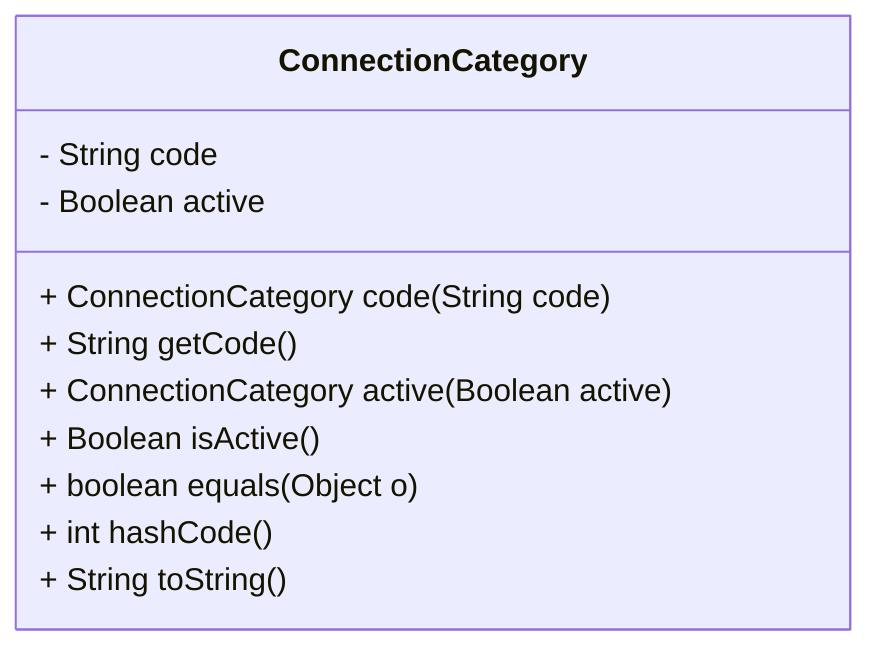

# Overview

The `ConnectionCategory` class represents different categories of connections in the system. It includes properties and methods to manage these categories effectively.

# Properties

The class contains two main properties:

- `code`: A string that uniquely identifies the connection category.
- `active`: A boolean indicating whether the connection category is active.

&nbsp;

*This is an auto-generated document by Swimm AI 🌊 and has not yet been verified by a human*

<SwmMeta version="3.0.0" repo-id="Z2l0aHViJTNBJTNBRElHSVQtT1NTJTNBJTNBU3dpbW0tRGVtbw==" repo-name="DIGIT-OSS" doc-type="overview">Powered by [Swimm](/)</SwmMeta>
