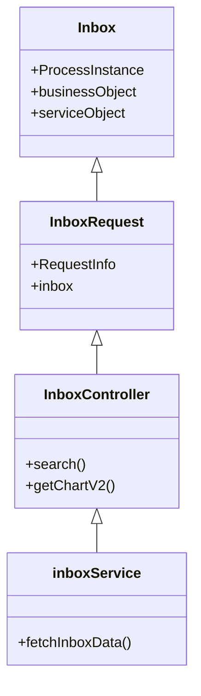

## Overview

The <SwmToken path="municipal-services/inbox/src/main/java/org/egov/inbox/web/controller/InboxController.java" pos="1:6:6" line-data="package org.egov.inbox.web.controller;">`inbox`</SwmToken> module in DIGIT is designed to handle various inbox-related operations. It includes classes for modeling inbox data, handling requests, and managing business logic. This guide will walk you through the key components and how to get started with the Inbox Web.

## Inbox Model

The <SwmToken path="municipal-services/inbox/src/main/java/org/egov/inbox/web/controller/InboxController.java" pos="1:6:6" line-data="package org.egov.inbox.web.controller;">`inbox`</SwmToken> class represents the structure of the inbox data. It contains properties such as `ProcessInstance`, `businessObject`, and `serviceObject`, which store various pieces of information related to the inbox.

## Inbox Request

The <SwmToken path="municipal-services/inbox/src/main/java/org/egov/inbox/web/controller/InboxController.java" pos="48:16:16" line-data="	public ResponseEntity&lt;InboxResponse&gt; search(@Valid @RequestBody  InboxRequest inboxRequest) {">`InboxRequest`</SwmToken> class encapsulates the request data for inbox-related operations. It includes properties like `RequestInfo` and <SwmToken path="municipal-services/inbox/src/main/java/org/egov/inbox/web/controller/InboxController.java" pos="1:6:6" line-data="package org.egov.inbox.web.controller;">`inbox`</SwmToken>, which hold the request metadata and search criteria, respectively.

## Inbox Controller

The <SwmToken path="municipal-services/inbox/src/main/java/org/egov/inbox/web/controller/InboxController.java" pos="31:4:4" line-data="public class InboxController {">`InboxController`</SwmToken> class handles HTTP requests related to the inbox. It defines endpoints for searching inbox data, retrieving chart data, and performing Elasticsearch queries. The controller uses services like <SwmToken path="municipal-services/inbox/src/main/java/org/egov/inbox/web/controller/InboxController.java" pos="50:7:7" line-data="		InboxResponse response = inboxService.fetchInboxData(inboxRequest.getInbox(),inboxRequest.getRequestInfo());">`inboxService`</SwmToken>, <SwmToken path="municipal-services/inbox/src/main/java/org/egov/inbox/web/controller/InboxController.java" pos="10:10:10" line-data="import org.egov.inbox.service.DSSInboxFilterService;">`DSSInboxFilterService`</SwmToken>, and <SwmToken path="municipal-services/inbox/src/main/java/org/egov/inbox/web/controller/InboxController.java" pos="11:10:10" line-data="import org.egov.inbox.service.ElasticSearchService;">`ElasticSearchService`</SwmToken> to process these requests.

<SwmSnippet path="/municipal-services/inbox/src/main/java/org/egov/inbox/web/controller/InboxController.java" line="47">

---

The `/v1/_search` endpoint is used to search inbox data. It accepts a POST request with an <SwmToken path="municipal-services/inbox/src/main/java/org/egov/inbox/web/controller/InboxController.java" pos="48:16:16" line-data="	public ResponseEntity&lt;InboxResponse&gt; search(@Valid @RequestBody  InboxRequest inboxRequest) {">`InboxRequest`</SwmToken> payload and returns an <SwmToken path="municipal-services/inbox/src/main/java/org/egov/inbox/web/controller/InboxController.java" pos="48:5:5" line-data="	public ResponseEntity&lt;InboxResponse&gt; search(@Valid @RequestBody  InboxRequest inboxRequest) {">`InboxResponse`</SwmToken> containing the search results.

```java
	@PostMapping(value = "/_search")
	public ResponseEntity<InboxResponse> search(@Valid @RequestBody  InboxRequest inboxRequest) {
		
		InboxResponse response = inboxService.fetchInboxData(inboxRequest.getInbox(),inboxRequest.getRequestInfo());
		
		response.setResponseInfo(
				responseInfoFactory.createResponseInfoFromRequestInfo(inboxRequest.getRequestInfo(), true));
		return new ResponseEntity<>(response, HttpStatus.OK);
	}
```

---

</SwmSnippet>

<SwmSnippet path="/municipal-services/inbox/src/main/java/org/egov/inbox/web/controller/InboxController.java" line="57">

---

The `/v1/dss/_search` endpoint is used to retrieve chart data. It accepts a POST request with an <SwmToken path="municipal-services/inbox/src/main/java/org/egov/inbox/web/controller/InboxController.java" pos="58:21:21" line-data="	public ResponseEntity&lt;Map&lt;String, BigDecimal&gt;&gt; getChartV2(@Valid @RequestBody InboxMetricCriteria request) {">`InboxMetricCriteria`</SwmToken> payload and returns a map of aggregated data.

```java
	@PostMapping(value = "/dss/_search")
	public ResponseEntity<Map<String, BigDecimal>> getChartV2(@Valid @RequestBody InboxMetricCriteria request) {
		Map<String, BigDecimal> response = dssInboxService.getAggregateData(request);
		return new ResponseEntity<>(response, HttpStatus.OK);
	}
```

---

</SwmSnippet>

## Inbox Service

The <SwmToken path="municipal-services/inbox/src/main/java/org/egov/inbox/web/controller/InboxController.java" pos="50:7:7" line-data="		InboxResponse response = inboxService.fetchInboxData(inboxRequest.getInbox(),inboxRequest.getRequestInfo());">`inboxService`</SwmToken> class is responsible for the business logic related to the inbox. It processes the search criteria and fetches the relevant inbox data, which is then returned to the controller.

## Error Handling

Error messages in web applications may include replaceable fields to provide more context. For example, format-related errors can indicate the specific field with an invalid format.

<SwmSnippet path="/municipal-services/inbox/src/main/java/org/egov/inbox/web/model/Error.java" line="111">

---

Some error messages may carry replaceable fields (e.g., $1, $2) to provide more context to the message. Clients should use the values in the param array to replace those fields.

```java
   * Some error messages may carry replaceable fields (say $1, $2) to provide more context to the message. E.g. Format related errors may want to indicate the actual field for which the format is invalid. Client's should use the values in the param array to replace those fields.
```

---

</SwmSnippet>

&nbsp;

*This is an auto-generated document by Swimm AI 🌊 and has not yet been verified by a human*

<SwmMeta version="3.0.0" repo-id="Z2l0aHViJTNBJTNBRElHSVQtT1NTJTNBJTNBU3dpbW0tRGVtbw==" repo-name="DIGIT-OSS" doc-type="overview"><sup>Powered by [Swimm](/)</sup></SwmMeta>
