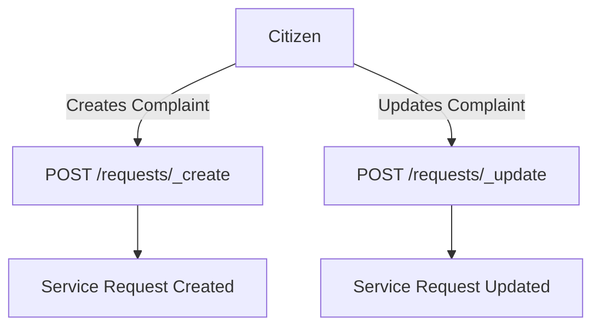

# Getting Started with PGR Services

PGR services provide functionality for citizens to raise complaints or grievances within the system. Citizens can track the progress of their complaints and receive notifications as the status of their complaints changes. The service depends on several other services such as egov-user, egov-localization, egov-idgen, and egov-mdms for its operations.

## Service Features

The PGR service includes a citizen interface for filing complaints and an employee interface for resolving them. The service also supports features like live tracking of complaint status, uploading images, posting comments, and a workflow for complaint resolution.

## Service Dependencies

PGR services depend on several other services such as egov-user, egov-localization, egov-idgen, and egov-mdms for its operations.

## Kafka Producers

The PGR service uses Kafka topics like `save-pgr-request` to create new complaints and `update-pgr-request` to update existing complaints.

## Local Setup

To set up PGR services locally, clone the Core Service repository and ensure dependencies like Postgres DB, Kafka, and Redis are configured.

## PGR Service Endpoints

The PGR service provides several endpoints for creating and updating service requests.

### <SwmToken path="municipal-services/pgr-services/src/main/resources/swagger-contract.yml" pos="73:1:4" line-data="  /requests/_create:">`/requests/_create`</SwmToken>

The <SwmToken path="municipal-services/pgr-services/src/main/resources/swagger-contract.yml" pos="73:1:4" line-data="  /requests/_create:">`/requests/_create`</SwmToken> endpoint is used to create new service requests. This endpoint supports batch operations, meaning multiple requests can be created in a single call. If there are any errors in the batch, the entire batch is rejected.

<SwmSnippet path="/municipal-services/pgr-services/src/main/resources/swagger-contract.yml" line="73">

---

The <SwmToken path="municipal-services/pgr-services/src/main/resources/swagger-contract.yml" pos="73:1:4" line-data="  /requests/_create:">`/requests/_create`</SwmToken> endpoint allows for the creation of new service requests. It supports batch operations, and if there are any errors in the batch, the entire batch is rejected.

```yaml
  /requests/_create:
    post:
      summary: Create service requests
      description: Create new service requests - supports batch -  please note that in case of errors entire batch is rejected
      tags:
      - Service Request
      requestBody:
        content:
          application/json:
            schema:
              $ref: '#/components/schemas/ServiceRequest'
        description: Request schema.
        required: true
      responses:
```

---

</SwmSnippet>

### <SwmToken path="municipal-services/pgr-services/src/main/resources/swagger-contract.yml" pos="99:1:4" line-data="  /requests/_update:">`/requests/_update`</SwmToken>

The <SwmToken path="municipal-services/pgr-services/src/main/resources/swagger-contract.yml" pos="99:1:4" line-data="  /requests/_update:">`/requests/_update`</SwmToken> endpoint is used to update existing service requests. This endpoint allows for modifications to the details of a complaint, primarily to perform actions on the complaint.

<SwmSnippet path="/municipal-services/pgr-services/src/main/resources/swagger-contract.yml" line="99">

---

The <SwmToken path="municipal-services/pgr-services/src/main/resources/swagger-contract.yml" pos="99:1:4" line-data="  /requests/_update:">`/requests/_update`</SwmToken> endpoint allows for updating existing service requests. It supports modifications to the details of a complaint.

```yaml
  /requests/_update:
    post:
      summary: Update service requests
      description: Updates service request
      tags:
      - Service Request
      responses:
        '202':
          description: Application submitted successfully
          content:
            '*/*':
              schema:
                $ref: '#/components/schemas/ServiceResponse'
        '400':
```

---

</SwmSnippet>

&nbsp;

*This is an auto-generated document by Swimm AI 🌊 and has not yet been verified by a human*

<SwmMeta version="3.0.0" repo-id="Z2l0aHViJTNBJTNBRElHSVQtT1NTJTNBJTNBU3dpbW0tRGVtbw==" repo-name="DIGIT-OSS" doc-type="overview"><sup>Powered by [Swimm](/)</sup></SwmMeta>
