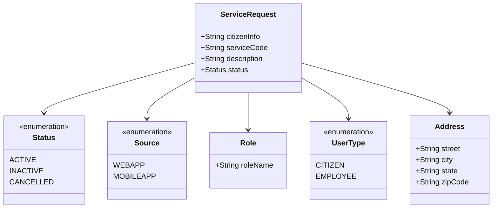

# Getting Started with Pgrmodels in Turn io Adapter

Pgrmodels is a package that contains various models used in the Turn io adapter. These models represent different entities and their attributes, which are essential for handling service requests and responses.

## <SwmToken path="municipal-services/turn-io-adapter/src/main/java/org/egov/rb/pgrmodels/ServiceRequest.java" pos="29:4:4" line-data="public class ServiceRequest   {">`ServiceRequest`</SwmToken> Class

The <SwmToken path="municipal-services/turn-io-adapter/src/main/java/org/egov/rb/pgrmodels/ServiceRequest.java" pos="29:4:4" line-data="public class ServiceRequest   {">`ServiceRequest`</SwmToken> class is used to represent a service request raised for a particular service. It includes details like citizen information, service code, description, and status.

<SwmSnippet path="/municipal-services/turn-io-adapter/src/main/java/org/egov/rb/pgrmodels/ServiceRequest.java" line="1">

---

The <SwmToken path="municipal-services/turn-io-adapter/src/main/java/org/egov/rb/pgrmodels/ServiceRequest.java" pos="29:4:4" line-data="public class ServiceRequest   {">`ServiceRequest`</SwmToken> class is defined in the <SwmPath>[municipal-services/turn-io-adapter/src/main/java/org/egov/rb/pgrmodels/ServiceRequest.java](municipal-services/turn-io-adapter/src/main/java/org/egov/rb/pgrmodels/ServiceRequest.java)</SwmPath> file. It imports necessary libraries and sets up the class structure.

```java
package org.egov.rb.pgrmodels;

import java.util.LinkedList;
import java.util.List;
```

---

</SwmSnippet>

## Source Enum

The <SwmToken path="municipal-services/turn-io-adapter/src/main/java/org/egov/rb/pgrmodels/Source.java" pos="6:4:4" line-data="public enum Source {">`Source`</SwmToken> enum defines the possible sources of service requests, such as WEBAPP and MOBILEAPP.

<SwmSnippet path="/municipal-services/turn-io-adapter/src/main/java/org/egov/rb/pgrmodels/Source.java" line="1">

---

The <SwmToken path="municipal-services/turn-io-adapter/src/main/java/org/egov/rb/pgrmodels/Source.java" pos="6:4:4" line-data="public enum Source {">`Source`</SwmToken> enum is defined in the <SwmPath>[municipal-services/turn-io-adapter/src/main/java/org/egov/rb/pgrmodels/Source.java](municipal-services/turn-io-adapter/src/main/java/org/egov/rb/pgrmodels/Source.java)</SwmPath> file. It includes annotations for JSON serialization and deserialization.

```java
package org.egov.rb.pgrmodels;

import com.fasterxml.jackson.annotation.JsonCreator;
import com.fasterxml.jackson.annotation.JsonValue;
```

---

</SwmSnippet>

## Status Enum

The `Status` enum represents the status of a service request, including values like ACTIVE, INACTIVE, and CANCELLED.

<SwmSnippet path="/municipal-services/turn-io-adapter/src/main/java/org/egov/rb/pgrmodels/ServiceResponse.java" line="1">

---

The `Status` enum is defined in the <SwmPath>[municipal-services/turn-io-adapter/src/main/java/org/egov/rb/pgrmodels/ServiceResponse.java](municipal-services/turn-io-adapter/src/main/java/org/egov/rb/pgrmodels/ServiceResponse.java)</SwmPath> file. It imports necessary libraries and sets up the enum structure.

```java
package org.egov.rb.pgrmodels;

import java.util.ArrayList;
import java.util.List;
import java.util.Objects;
```

---

</SwmSnippet>

## Role Class

The <SwmToken path="municipal-services/turn-io-adapter/src/main/java/org/egov/rb/pgrmodels/Role.java" pos="14:4:4" line-data="public class Role {">`Role`</SwmToken> class defines the roles associated with service requests.

<SwmSnippet path="/municipal-services/turn-io-adapter/src/main/java/org/egov/rb/pgrmodels/Role.java" line="1">

---

The <SwmToken path="municipal-services/turn-io-adapter/src/main/java/org/egov/rb/pgrmodels/Role.java" pos="14:4:4" line-data="public class Role {">`Role`</SwmToken> class is defined in the <SwmPath>[municipal-services/turn-io-adapter/src/main/java/org/egov/rb/pgrmodels/Role.java](municipal-services/turn-io-adapter/src/main/java/org/egov/rb/pgrmodels/Role.java)</SwmPath> file. It includes annotations for JSON properties and uses Lombok for boilerplate code reduction.

```java
package org.egov.rb.pgrmodels;

import com.fasterxml.jackson.annotation.JsonProperty;

import lombok.AllArgsConstructor;
```

---

</SwmSnippet>

## <SwmToken path="municipal-services/turn-io-adapter/src/main/java/org/egov/rb/pgrmodels/UserType.java" pos="43:4:4" line-data="public enum UserType {">`UserType`</SwmToken> Enum

The <SwmToken path="municipal-services/turn-io-adapter/src/main/java/org/egov/rb/pgrmodels/UserType.java" pos="43:4:4" line-data="public enum UserType {">`UserType`</SwmToken> enum defines the types of users involved in service requests.

<SwmSnippet path="/municipal-services/turn-io-adapter/src/main/java/org/egov/rb/pgrmodels/UserType.java" line="41">

---

The <SwmToken path="municipal-services/turn-io-adapter/src/main/java/org/egov/rb/pgrmodels/UserType.java" pos="43:4:4" line-data="public enum UserType {">`UserType`</SwmToken> enum is defined in the <SwmPath>[municipal-services/turn-io-adapter/src/main/java/org/egov/rb/pgrmodels/UserType.java](municipal-services/turn-io-adapter/src/main/java/org/egov/rb/pgrmodels/UserType.java)</SwmPath> file. It sets up the enum structure for different user types.

```java
package org.egov.rb.pgrmodels;

public enum UserType {
```

---

</SwmSnippet>

## Address Class

The <SwmToken path="municipal-services/turn-io-adapter/src/main/java/org/egov/rb/pgrmodels/Address.java" pos="20:4:4" line-data="public class Address {">`Address`</SwmToken> class defines the address details associated with service requests.

<SwmSnippet path="/municipal-services/turn-io-adapter/src/main/java/org/egov/rb/pgrmodels/Address.java" line="1">

---

The <SwmToken path="municipal-services/turn-io-adapter/src/main/java/org/egov/rb/pgrmodels/Address.java" pos="20:4:4" line-data="public class Address {">`Address`</SwmToken> class is defined in the <SwmPath>[municipal-services/turn-io-adapter/src/main/java/org/egov/rb/pgrmodels/Address.java](municipal-services/turn-io-adapter/src/main/java/org/egov/rb/pgrmodels/Address.java)</SwmPath> file. It includes validation constraints for various address fields.

```java
package org.egov.rb.pgrmodels;

import javax.validation.constraints.NotNull;
import javax.validation.constraints.Pattern;
import javax.validation.constraints.Size;
```

---

</SwmSnippet>

&nbsp;

*This is an auto-generated document by Swimm AI 🌊 and has not yet been verified by a human*

<SwmMeta version="3.0.0" repo-id="Z2l0aHViJTNBJTNBRElHSVQtT1NTJTNBJTNBU3dpbW0tRGVtbw==" repo-name="DIGIT-OSS" doc-type="overview"><sup>Powered by [Swimm](/)</sup></SwmMeta>
