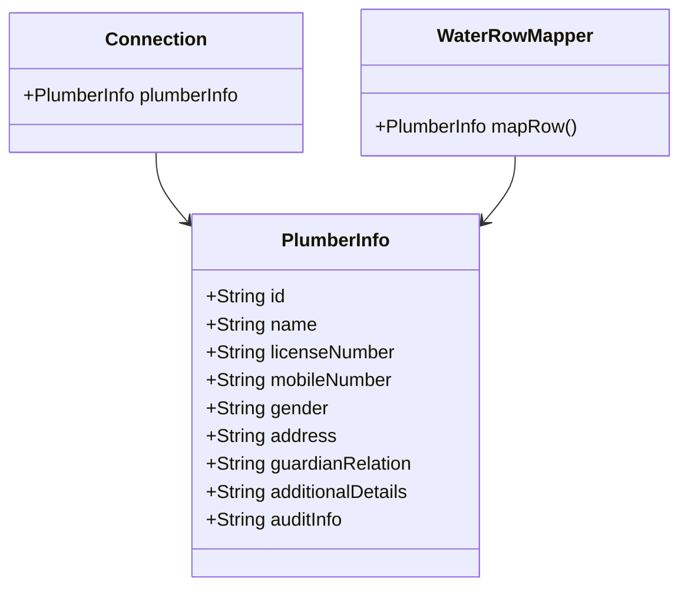

# Overview

Plumber Information refers to the details of a plumber, including their personal and professional information. This document will guide you through the process of managing plumber details using the `PlumberInfo` class.

# Attributes of PlumberInfo

The `PlumberInfo` class captures various attributes such as the plumber's ID, name, license number, mobile number, gender, and address. It also includes information about the plumber's guardian relationship, which can be either 'FATHER' or 'HUSBAND'. Additional details and audit information can also be stored in the `PlumberInfo` class.

# Usage in the Application

This information is used in various parts of the application, such as in the `Connection` class and the `WaterRowMapper` class, to manage and process plumber-related data.

The `Connection` class uses the `PlumberInfo` class to store and manage plumber details associated with a connection.

&nbsp;

*This is an auto-generated document by Swimm AI 🌊 and has not yet been verified by a human*

<SwmMeta version="3.0.0" repo-id="Z2l0aHViJTNBJTNBRElHSVQtT1NTJTNBJTNBU3dpbW0tRGVtbw==" repo-name="DIGIT-OSS" doc-type="overview">Powered by [Swimm](/)</SwmMeta>
