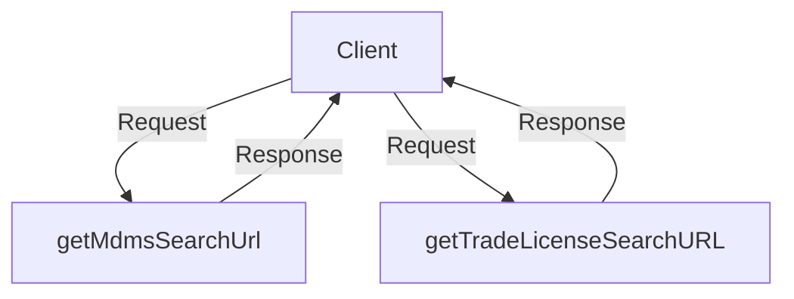

# Overview

The Trade License (TL) Fee Calculator is a service used to calculate the Trade License fees based on defined billing slabs. It is designed to handle different types of licenses, making it versatile for various licensing needs. The service works by creating a demand for each billing slab combination and then calling the billing-services API to generate the fees. Each billing slab combination has its own demand configurations stored in the database.

# API Details

The <SwmToken path="municipal-services/tl-calculator/src/main/resources/config/tl-calculation-persister.yml" pos="2:4:6" line-data=" serviceName: tl-calculator">`tl-calculator`</SwmToken> service provides several APIs for managing billing slabs and calculating fees. The `tl-calculator/billingslab/_create` API is used to create billing slabs, `tl-calculator/billingslab/_search` is used to search for billing slabs, and `tl-calculator/billingslab/_update` is used to update existing billing slabs. The `tl-calculator/v1/_calculate` API calculates the fees based on the created demand.

# Main Application

The main application class <SwmToken path="municipal-services/tl-calculator/src/main/java/org/egov/TLCalculatorApp.java" pos="12:4:4" line-data="public class TLCalculatorApp {">`TLCalculatorApp`</SwmToken> initializes the Spring Boot application for the TL Calculator service.

<SwmSnippet path="/municipal-services/tl-calculator/src/main/java/org/egov/TLCalculatorApp.java" line="10">

---

The <SwmToken path="municipal-services/tl-calculator/src/main/java/org/egov/TLCalculatorApp.java" pos="12:4:4" line-data="public class TLCalculatorApp {">`TLCalculatorApp`</SwmToken> class is the entry point of the Spring Boot application for the TL Calculator service. It initializes the application and imports necessary configurations.

```java
@SpringBootApplication
@Import({ TracerConfiguration.class })
public class TLCalculatorApp {

    public static void main(String[] args) throws Exception {
        SpringApplication.run(TLCalculatorApp.class, args);
    }
```

---

</SwmSnippet>

# Configuration

The <SwmPath>[municipal-services/tl-calculator/src/main/resources/config/tl-calculation-persister.yml](municipal-services/tl-calculator/src/main/resources/config/tl-calculation-persister.yml)</SwmPath> file contains the configuration for persisting trade license calculation details in the database. It maps JSON paths to database fields for insertion.

<SwmSnippet path="/municipal-services/tl-calculator/src/main/resources/config/tl-calculation-persister.yml" line="1">

---

The <SwmPath>[municipal-services/tl-calculator/src/main/resources/config/tl-calculation-persister.yml](municipal-services/tl-calculator/src/main/resources/config/tl-calculation-persister.yml)</SwmPath> file defines how trade license calculation details are persisted in the database. It includes mappings from JSON paths to database fields and the query used for insertion.

```yaml
serviceMaps:
 serviceName: tl-calculator
 mappings:
 - version: 1.0
   description: Persists tradeLicense calculation details in EG_TL_CALCULATION  table
   fromTopic: save-tl-calculation
   isTransaction: true
   queryMaps:

       - query: INSERT INTO eg_tl_calculator_tradetype(id,tenantId,consumercode,tradeTypeFeeAndBillingSlabIds,createdby, lastmodifiedby, createdtime, lastmodifiedtime) VALUES ( ?, ?, ?, ?, ?, ?, ?, ?);
         basePath: Calculations.*.tradeLicense
         jsonMaps:
          - jsonPath: $.Calculations.*.tradeTypeBillingIds.id

          - jsonPath: $.Calculations.*.tradeLicense.tenantId

          - jsonPath: $.Calculations.*.tradeLicense.applicationNumber

          - jsonPath: $.Calculations.*.tradeTypeBillingIds
            type: JSON
            dbType: JSONB
```

---

</SwmSnippet>

# Constants

The <SwmToken path="municipal-services/tl-calculator/src/main/java/org/egov/tlcalculator/web/controllers/CalculatorController.java" pos="21:12:12" line-data="import static org.egov.tlcalculator.utils.TLCalculatorConstants.businessService_BPA;">`TLCalculatorConstants`</SwmToken> class defines constants used throughout the TL Calculator service, such as <SwmToken path="municipal-services/tl-calculator/src/main/java/org/egov/tlcalculator/utils/TLCalculatorConstants.java" pos="42:9:9" line-data="    public static final String businessService_TL=&quot;TL&quot;;">`businessService_TL`</SwmToken> which represents the Trade License service.

<SwmSnippet path="/municipal-services/tl-calculator/src/main/java/org/egov/tlcalculator/utils/TLCalculatorConstants.java" line="40">

---

The <SwmToken path="municipal-services/tl-calculator/src/main/java/org/egov/tlcalculator/web/controllers/CalculatorController.java" pos="21:12:12" line-data="import static org.egov.tlcalculator.utils.TLCalculatorConstants.businessService_BPA;">`TLCalculatorConstants`</SwmToken> class includes constants like <SwmToken path="municipal-services/tl-calculator/src/main/java/org/egov/tlcalculator/utils/TLCalculatorConstants.java" pos="40:9:9" line-data="    public static final String MDMS_ROUNDOFF_TAXHEAD= &quot;TL_ROUNDOFF&quot;;">`MDMS_ROUNDOFF_TAXHEAD`</SwmToken> and <SwmToken path="municipal-services/tl-calculator/src/main/java/org/egov/tlcalculator/utils/TLCalculatorConstants.java" pos="42:9:9" line-data="    public static final String businessService_TL=&quot;TL&quot;;">`businessService_TL`</SwmToken> which are used throughout the TL Calculator service.

```java
    public static final String MDMS_ROUNDOFF_TAXHEAD= "TL_ROUNDOFF";

    public static final String businessService_TL="TL";
    public static final String BILLINGSLAB_KEY = "calculationDescription";
```

---

</SwmSnippet>

# Controller Usage

The <SwmToken path="municipal-services/tl-calculator/src/main/java/org/egov/tlcalculator/web/controllers/CalculatorController.java" pos="29:4:4" line-data="public class CalculatorController {">`CalculatorController`</SwmToken> class uses the <SwmToken path="municipal-services/tl-calculator/src/main/java/org/egov/tlcalculator/utils/TLCalculatorConstants.java" pos="42:9:9" line-data="    public static final String businessService_TL=&quot;TL&quot;;">`businessService_TL`</SwmToken> constant to handle requests related to Trade License calculations. It delegates the calculation logic to the <SwmToken path="municipal-services/tl-calculator/src/main/java/org/egov/tlcalculator/web/controllers/CalculatorController.java" pos="35:3:3" line-data="	private CalculationService calculationService;">`CalculationService`</SwmToken> and <SwmToken path="municipal-services/tl-calculator/src/main/java/org/egov/tlcalculator/web/controllers/CalculatorController.java" pos="37:3:3" line-data="	private DemandService demandService;">`DemandService`</SwmToken>.

<SwmSnippet path="/municipal-services/tl-calculator/src/main/java/org/egov/tlcalculator/web/controllers/CalculatorController.java" line="21">

---

The <SwmToken path="municipal-services/tl-calculator/src/main/java/org/egov/tlcalculator/web/controllers/CalculatorController.java" pos="29:4:4" line-data="public class CalculatorController {">`CalculatorController`</SwmToken> class handles incoming requests for Trade License calculations and delegates the logic to the appropriate services.

```java
import static org.egov.tlcalculator.utils.TLCalculatorConstants.businessService_BPA;
import static org.egov.tlcalculator.utils.TLCalculatorConstants.businessService_TL;


@javax.annotation.Generated(value = "org.egov.codegen.SpringBootCodegen", date = "2018-09-27T14:56:03.454+05:30")

@Controller
@RequestMapping("/v1")
public class CalculatorController {

	private ObjectMapper objectMapper;

	private HttpServletRequest request;

	private CalculationService calculationService;

	private DemandService demandService;

	private BPACalculationService bpaCalculationService;

	@Autowired
```

---

</SwmSnippet>

## <SwmToken path="municipal-services/tl-calculator/src/main/java/org/egov/tlcalculator/service/MDMSService.java" pos="173:5:5" line-data="    private StringBuilder getMdmsSearchUrl() {">`getMdmsSearchUrl`</SwmToken>

The <SwmToken path="municipal-services/tl-calculator/src/main/java/org/egov/tlcalculator/service/MDMSService.java" pos="173:5:5" line-data="    private StringBuilder getMdmsSearchUrl() {">`getMdmsSearchUrl`</SwmToken> function constructs the URL for the MDMS search endpoint. It combines the MDMS host and search endpoint from the configuration to form the complete URL.

<SwmSnippet path="/municipal-services/tl-calculator/src/main/java/org/egov/tlcalculator/service/MDMSService.java" line="169">

---

The <SwmToken path="municipal-services/tl-calculator/src/main/java/org/egov/tlcalculator/service/MDMSService.java" pos="173:5:5" line-data="    private StringBuilder getMdmsSearchUrl() {">`getMdmsSearchUrl`</SwmToken> function in the <SwmToken path="municipal-services/tl-calculator/src/main/java/org/egov/tlcalculator/service/MDMSService.java" pos="25:4:4" line-data="public class MDMSService {">`MDMSService`</SwmToken> class constructs the URL for the MDMS search endpoint by combining the MDMS host and search endpoint from the configuration.

```java
     * Creates and returns the url for mdms search endpoint
     *
     * @return MDMS Search URL
     */
    private StringBuilder getMdmsSearchUrl() {
        return new StringBuilder().append(config.getMdmsHost()).append(config.getMdmsSearchEndpoint());
    }
```

---

</SwmSnippet>

## <SwmToken path="municipal-services/tl-calculator/src/main/java/org/egov/tlcalculator/utils/CalculationUtils.java" pos="34:5:5" line-data="  private String getTradeLicenseSearchURL(){">`getTradeLicenseSearchURL`</SwmToken>

The <SwmToken path="municipal-services/tl-calculator/src/main/java/org/egov/tlcalculator/utils/CalculationUtils.java" pos="34:5:5" line-data="  private String getTradeLicenseSearchURL(){">`getTradeLicenseSearchURL`</SwmToken> function creates the URL for searching trade licenses based on the tenant ID and application number. It uses the trade license host, context path, and search endpoint from the configuration to build the URL.

<SwmSnippet path="/municipal-services/tl-calculator/src/main/java/org/egov/tlcalculator/utils/CalculationUtils.java" line="30">

---

The <SwmToken path="municipal-services/tl-calculator/src/main/java/org/egov/tlcalculator/utils/CalculationUtils.java" pos="34:5:5" line-data="  private String getTradeLicenseSearchURL(){">`getTradeLicenseSearchURL`</SwmToken> function in the <SwmToken path="municipal-services/tl-calculator/src/main/java/org/egov/tlcalculator/utils/CalculationUtils.java" pos="17:4:4" line-data="public class CalculationUtils {">`CalculationUtils`</SwmToken> class constructs the URL for searching trade licenses by combining the trade license host, context path, and search endpoint from the configuration.

```java
    /**
     * Creates tradeLicense search url based on tenantId and applicationNumber
     * @return tradeLicense search url
     */
  private String getTradeLicenseSearchURL(){
      StringBuilder url = new StringBuilder(config.getTradeLicenseHost());
      url.append(config.getTradeLicenseContextPath());
      url.append(config.getTradeLicenseSearchEndpoint());
      url.append("?");
      url.append("tenantId=");
      url.append("{1}");
      url.append("&");
      url.append("applicationNumber=");
      url.append("{2}");
      return url.toString();
  }
```

---

</SwmSnippet>

&nbsp;

*This is an auto-generated document by Swimm AI 🌊 and has not yet been verified by a human*

<SwmMeta version="3.0.0" repo-id="Z2l0aHViJTNBJTNBRElHSVQtT1NTJTNBJTNBU3dpbW0tRGVtbw==" repo-name="DIGIT-OSS" doc-type="overview"><sup>Powered by [Swimm](/)</sup></SwmMeta>
