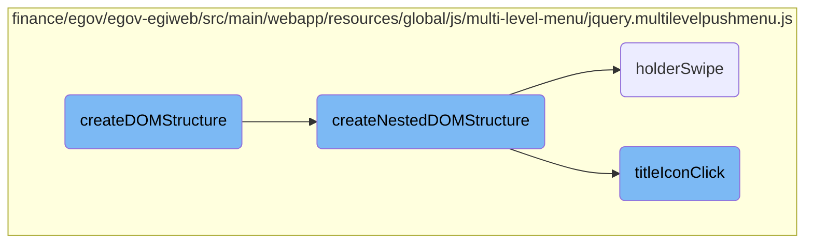

In this document, we will explain the role and functionality of the <SwmToken path="finance/egov/egov-egiweb/src/main/webapp/resources/js/app/custom-menu.js" pos="149:1:1" line-data="        onBackItemClick: function () {">`onBackItemClick`</SwmToken> function within the <SwmToken path="finance/egov/egov-egiweb/src/main/webapp/resources/global/js/multi-level-menu/jquery.multilevelpushmenu.js" pos="8:5:7" line-data=" * http://multi-level-push-menu.make.rs">`multi-level`</SwmToken> push menu system. This function is crucial for handling user interactions when navigating back through menu levels.

The <SwmToken path="finance/egov/egov-egiweb/src/main/webapp/resources/js/app/custom-menu.js" pos="149:1:1" line-data="        onBackItemClick: function () {">`onBackItemClick`</SwmToken> function is triggered when a user clicks on a back item in the menu. It ensures that the menu's overflow property is set to 'auto' and displays the search bar if the title of the menu level is 'Applications' or 'Favourites'. This helps in maintaining a smooth user experience by properly managing the visibility of menu elements and ensuring that the search bar is available when needed.

Here is a high level diagram of the flow, showing only the most important functions:

```mermaid
graph TD;
      subgraph finance/egov/egov-egiweb/src/main/webapp/resources
5906b9abbe6734440934727d0b0cd97b00ec34845df34d95738752b907d9dbb3(onBackItemClick):::mainFlowStyle --> 1b99fefd7cd3f05b67b4cbe07e56f7b8361321058a9c8009033d71dd15868ade(multilevelpushmenu):::mainFlowStyle
end

subgraph finance/egov/egov-egiweb/src/main/webapp/resources
1b99fefd7cd3f05b67b4cbe07e56f7b8361321058a9c8009033d71dd15868ade(multilevelpushmenu):::mainFlowStyle --> f841a90ee05dae8416180c646e594e34507bf62a32f480373583d13df199bf51(updateDOMStructure)
end

subgraph finance/egov/egov-egiweb/src/main/webapp/resources
1b99fefd7cd3f05b67b4cbe07e56f7b8361321058a9c8009033d71dd15868ade(multilevelpushmenu):::mainFlowStyle --> 1c9f1e2a974bbfd6770bef0c262344f206a697c5927f46d7d62431ac9ed4e586(updateNestedDOMStructure)
end

subgraph finance/egov/egov-egiweb/src/main/webapp/resources
1b99fefd7cd3f05b67b4cbe07e56f7b8361321058a9c8009033d71dd15868ade(multilevelpushmenu):::mainFlowStyle --> 6d21ca54ade48cc8572a1960a5742a2326ec1be10e8bb7bf90f5530371f94904(holderSwipe)
end

subgraph finance/egov/egov-egiweb/src/main/webapp/resources
1b99fefd7cd3f05b67b4cbe07e56f7b8361321058a9c8009033d71dd15868ade(multilevelpushmenu):::mainFlowStyle --> f5202bb4ef9ad5b52958d070f45a3ea1842d8ca950fb9baa38758a55629c7aea(createDOMStructure):::mainFlowStyle
end

subgraph finance/egov/egov-egiweb/src/main/webapp/resources
f5202bb4ef9ad5b52958d070f45a3ea1842d8ca950fb9baa38758a55629c7aea(createDOMStructure):::mainFlowStyle --> ff513e290dd64604e1153774883c0607860c39fe01f07f967d7fcddfcda3fae2(createNestedDOMStructure):::mainFlowStyle
end

subgraph finance/egov/egov-egiweb/src/main/webapp/resources
ff513e290dd64604e1153774883c0607860c39fe01f07f967d7fcddfcda3fae2(createNestedDOMStructure):::mainFlowStyle --> 6d21ca54ade48cc8572a1960a5742a2326ec1be10e8bb7bf90f5530371f94904(holderSwipe)
end

subgraph finance/egov/egov-egiweb/src/main/webapp/resources
ff513e290dd64604e1153774883c0607860c39fe01f07f967d7fcddfcda3fae2(createNestedDOMStructure):::mainFlowStyle --> 7c542acc4fbad5c7793a5797531cd678eab4b12719f503346f752ba3025d4e60(titleIconClick):::mainFlowStyle
end


      classDef mainFlowStyle color:#000000,fill:#7CB9F4
classDef rootsStyle color:#000000,fill:#00FFF4
classDef Style1 color:#000000,fill:#00FFAA
classDef Style2 color:#000000,fill:#FFFF00
classDef Style3 color:#000000,fill:#AA7CB9

%% Swimm:
%% graph TD;
%%       subgraph <SwmPath>[finance/egov/egov-egiweb/src/main/webapp/resources/](finance/egov/egov-egiweb/src/main/webapp/resources/)</SwmPath>
%% 5906b9abbe6734440934727d0b0cd97b00ec34845df34d95738752b907d9dbb3(onBackItemClick):::mainFlowStyle --> 1b99fefd7cd3f05b67b4cbe07e56f7b8361321058a9c8009033d71dd15868ade(multilevelpushmenu):::mainFlowStyle
%% end
%% 
%% subgraph <SwmPath>[finance/egov/egov-egiweb/src/main/webapp/resources/](finance/egov/egov-egiweb/src/main/webapp/resources/)</SwmPath>
%% 1b99fefd7cd3f05b67b4cbe07e56f7b8361321058a9c8009033d71dd15868ade(multilevelpushmenu):::mainFlowStyle --> f841a90ee05dae8416180c646e594e34507bf62a32f480373583d13df199bf51(updateDOMStructure)
%% end
%% 
%% subgraph <SwmPath>[finance/egov/egov-egiweb/src/main/webapp/resources/](finance/egov/egov-egiweb/src/main/webapp/resources/)</SwmPath>
%% 1b99fefd7cd3f05b67b4cbe07e56f7b8361321058a9c8009033d71dd15868ade(multilevelpushmenu):::mainFlowStyle --> 1c9f1e2a974bbfd6770bef0c262344f206a697c5927f46d7d62431ac9ed4e586(updateNestedDOMStructure)
%% end
%% 
%% subgraph <SwmPath>[finance/egov/egov-egiweb/src/main/webapp/resources/](finance/egov/egov-egiweb/src/main/webapp/resources/)</SwmPath>
%% 1b99fefd7cd3f05b67b4cbe07e56f7b8361321058a9c8009033d71dd15868ade(multilevelpushmenu):::mainFlowStyle --> 6d21ca54ade48cc8572a1960a5742a2326ec1be10e8bb7bf90f5530371f94904(holderSwipe)
%% end
%% 
%% subgraph <SwmPath>[finance/egov/egov-egiweb/src/main/webapp/resources/](finance/egov/egov-egiweb/src/main/webapp/resources/)</SwmPath>
%% 1b99fefd7cd3f05b67b4cbe07e56f7b8361321058a9c8009033d71dd15868ade(multilevelpushmenu):::mainFlowStyle --> f5202bb4ef9ad5b52958d070f45a3ea1842d8ca950fb9baa38758a55629c7aea(createDOMStructure):::mainFlowStyle
%% end
%% 
%% subgraph <SwmPath>[finance/egov/egov-egiweb/src/main/webapp/resources/](finance/egov/egov-egiweb/src/main/webapp/resources/)</SwmPath>
%% f5202bb4ef9ad5b52958d070f45a3ea1842d8ca950fb9baa38758a55629c7aea(createDOMStructure):::mainFlowStyle --> ff513e290dd64604e1153774883c0607860c39fe01f07f967d7fcddfcda3fae2(createNestedDOMStructure):::mainFlowStyle
%% end
%% 
%% subgraph <SwmPath>[finance/egov/egov-egiweb/src/main/webapp/resources/](finance/egov/egov-egiweb/src/main/webapp/resources/)</SwmPath>
%% ff513e290dd64604e1153774883c0607860c39fe01f07f967d7fcddfcda3fae2(createNestedDOMStructure):::mainFlowStyle --> 6d21ca54ade48cc8572a1960a5742a2326ec1be10e8bb7bf90f5530371f94904(holderSwipe)
%% end
%% 
%% subgraph <SwmPath>[finance/egov/egov-egiweb/src/main/webapp/resources/](finance/egov/egov-egiweb/src/main/webapp/resources/)</SwmPath>
%% ff513e290dd64604e1153774883c0607860c39fe01f07f967d7fcddfcda3fae2(createNestedDOMStructure):::mainFlowStyle --> 7c542acc4fbad5c7793a5797531cd678eab4b12719f503346f752ba3025d4e60(titleIconClick):::mainFlowStyle
%% end
%% 
%% 
%%       classDef mainFlowStyle color:#000000,fill:#7CB9F4
%% classDef rootsStyle color:#000000,fill:#00FFF4
%% classDef Style1 color:#000000,fill:#00FFAA
%% classDef Style2 color:#000000,fill:#FFFF00
%% classDef Style3 color:#000000,fill:#AA7CB9
```



# Flow drill down

First, we'll zoom into this section of the flow:

```mermaid
graph TD;
      subgraph finance/egov/egov-egiweb/src/main/webapp/resources
5906b9abbe6734440934727d0b0cd97b00ec34845df34d95738752b907d9dbb3(onBackItemClick):::mainFlowStyle --> 1b99fefd7cd3f05b67b4cbe07e56f7b8361321058a9c8009033d71dd15868ade(multilevelpushmenu):::mainFlowStyle
end

subgraph finance/egov/egov-egiweb/src/main/webapp/resources
1b99fefd7cd3f05b67b4cbe07e56f7b8361321058a9c8009033d71dd15868ade(multilevelpushmenu):::mainFlowStyle --> f841a90ee05dae8416180c646e594e34507bf62a32f480373583d13df199bf51(updateDOMStructure)
end

subgraph finance/egov/egov-egiweb/src/main/webapp/resources
1b99fefd7cd3f05b67b4cbe07e56f7b8361321058a9c8009033d71dd15868ade(multilevelpushmenu):::mainFlowStyle --> 1c9f1e2a974bbfd6770bef0c262344f206a697c5927f46d7d62431ac9ed4e586(updateNestedDOMStructure)
end

subgraph finance/egov/egov-egiweb/src/main/webapp/resources
1b99fefd7cd3f05b67b4cbe07e56f7b8361321058a9c8009033d71dd15868ade(multilevelpushmenu):::mainFlowStyle --> 6d21ca54ade48cc8572a1960a5742a2326ec1be10e8bb7bf90f5530371f94904(holderSwipe)
end

subgraph finance/egov/egov-egiweb/src/main/webapp/resources
1b99fefd7cd3f05b67b4cbe07e56f7b8361321058a9c8009033d71dd15868ade(multilevelpushmenu):::mainFlowStyle --> f5202bb4ef9ad5b52958d070f45a3ea1842d8ca950fb9baa38758a55629c7aea(createDOMStructure):::mainFlowStyle
end

subgraph finance/egov/egov-egiweb/src/main/webapp/resources
f5202bb4ef9ad5b52958d070f45a3ea1842d8ca950fb9baa38758a55629c7aea(createDOMStructure):::mainFlowStyle --> 9py83(...)
end

subgraph finance/egov/egov-egiweb/src/main/webapp/resources
1c9f1e2a974bbfd6770bef0c262344f206a697c5927f46d7d62431ac9ed4e586(updateNestedDOMStructure) --> 6d21ca54ade48cc8572a1960a5742a2326ec1be10e8bb7bf90f5530371f94904(holderSwipe)
end

subgraph finance/egov/egov-egiweb/src/main/webapp/resources
f841a90ee05dae8416180c646e594e34507bf62a32f480373583d13df199bf51(updateDOMStructure) --> 1c9f1e2a974bbfd6770bef0c262344f206a697c5927f46d7d62431ac9ed4e586(updateNestedDOMStructure)
end


      classDef mainFlowStyle color:#000000,fill:#7CB9F4
classDef rootsStyle color:#000000,fill:#00FFF4
classDef Style1 color:#000000,fill:#00FFAA
classDef Style2 color:#000000,fill:#FFFF00
classDef Style3 color:#000000,fill:#AA7CB9

%% Swimm:
%% graph TD;
%%       subgraph <SwmPath>[finance/egov/egov-egiweb/src/main/webapp/resources/](finance/egov/egov-egiweb/src/main/webapp/resources/)</SwmPath>
%% 5906b9abbe6734440934727d0b0cd97b00ec34845df34d95738752b907d9dbb3(onBackItemClick):::mainFlowStyle --> 1b99fefd7cd3f05b67b4cbe07e56f7b8361321058a9c8009033d71dd15868ade(multilevelpushmenu):::mainFlowStyle
%% end
%% 
%% subgraph <SwmPath>[finance/egov/egov-egiweb/src/main/webapp/resources/](finance/egov/egov-egiweb/src/main/webapp/resources/)</SwmPath>
%% 1b99fefd7cd3f05b67b4cbe07e56f7b8361321058a9c8009033d71dd15868ade(multilevelpushmenu):::mainFlowStyle --> f841a90ee05dae8416180c646e594e34507bf62a32f480373583d13df199bf51(updateDOMStructure)
%% end
%% 
%% subgraph <SwmPath>[finance/egov/egov-egiweb/src/main/webapp/resources/](finance/egov/egov-egiweb/src/main/webapp/resources/)</SwmPath>
%% 1b99fefd7cd3f05b67b4cbe07e56f7b8361321058a9c8009033d71dd15868ade(multilevelpushmenu):::mainFlowStyle --> 1c9f1e2a974bbfd6770bef0c262344f206a697c5927f46d7d62431ac9ed4e586(updateNestedDOMStructure)
%% end
%% 
%% subgraph <SwmPath>[finance/egov/egov-egiweb/src/main/webapp/resources/](finance/egov/egov-egiweb/src/main/webapp/resources/)</SwmPath>
%% 1b99fefd7cd3f05b67b4cbe07e56f7b8361321058a9c8009033d71dd15868ade(multilevelpushmenu):::mainFlowStyle --> 6d21ca54ade48cc8572a1960a5742a2326ec1be10e8bb7bf90f5530371f94904(holderSwipe)
%% end
%% 
%% subgraph <SwmPath>[finance/egov/egov-egiweb/src/main/webapp/resources/](finance/egov/egov-egiweb/src/main/webapp/resources/)</SwmPath>
%% 1b99fefd7cd3f05b67b4cbe07e56f7b8361321058a9c8009033d71dd15868ade(multilevelpushmenu):::mainFlowStyle --> f5202bb4ef9ad5b52958d070f45a3ea1842d8ca950fb9baa38758a55629c7aea(createDOMStructure):::mainFlowStyle
%% end
%% 
%% subgraph <SwmPath>[finance/egov/egov-egiweb/src/main/webapp/resources/](finance/egov/egov-egiweb/src/main/webapp/resources/)</SwmPath>
%% f5202bb4ef9ad5b52958d070f45a3ea1842d8ca950fb9baa38758a55629c7aea(createDOMStructure):::mainFlowStyle --> 9py83(...)
%% end
%% 
%% subgraph <SwmPath>[finance/egov/egov-egiweb/src/main/webapp/resources/](finance/egov/egov-egiweb/src/main/webapp/resources/)</SwmPath>
%% 1c9f1e2a974bbfd6770bef0c262344f206a697c5927f46d7d62431ac9ed4e586(updateNestedDOMStructure) --> 6d21ca54ade48cc8572a1960a5742a2326ec1be10e8bb7bf90f5530371f94904(holderSwipe)
%% end
%% 
%% subgraph <SwmPath>[finance/egov/egov-egiweb/src/main/webapp/resources/](finance/egov/egov-egiweb/src/main/webapp/resources/)</SwmPath>
%% f841a90ee05dae8416180c646e594e34507bf62a32f480373583d13df199bf51(updateDOMStructure) --> 1c9f1e2a974bbfd6770bef0c262344f206a697c5927f46d7d62431ac9ed4e586(updateNestedDOMStructure)
%% end
%% 
%% 
%%       classDef mainFlowStyle color:#000000,fill:#7CB9F4
%% classDef rootsStyle color:#000000,fill:#00FFF4
%% classDef Style1 color:#000000,fill:#00FFAA
%% classDef Style2 color:#000000,fill:#FFFF00
%% classDef Style3 color:#000000,fill:#AA7CB9
```



<SwmSnippet path="/finance/egov/egov-egiweb/src/main/webapp/resources/js/app/custom-menu.js" line="149">

---

## Handling Back Item Click

The <SwmToken path="finance/egov/egov-egiweb/src/main/webapp/resources/js/app/custom-menu.js" pos="149:1:1" line-data="        onBackItemClick: function () {">`onBackItemClick`</SwmToken> function handles the event when a back item in the menu is clicked. It ensures that the menu's overflow property is set to 'auto' and displays the search bar if the title of the menu level is 'Applications' or 'Favourites'.

```javascript
        onBackItemClick: function () {
            $('#menu_multilevelpushmenu ul').css('overflow-y', 'auto');
            var event = arguments[0],
                $menuLevelHolder = arguments[1],
                options = arguments[2],
                title = $menuLevelHolder.find('h2:first').text();
            if (title == 'Applications' || title == 'Favourites') {
                $('.search').show();
            }
        },
```

---

</SwmSnippet>

<SwmSnippet path="/finance/egov/egov-egiweb/src/main/webapp/resources/global/js/multi-level-menu/jquery.multilevelpushmenu.js" line="12">

---

## Initializing <SwmToken path="finance/egov/egov-egiweb/src/main/webapp/resources/global/js/multi-level-menu/jquery.multilevelpushmenu.js" pos="8:5:7" line-data=" * http://multi-level-push-menu.make.rs">`multi-level`</SwmToken> Push Menu

The <SwmToken path="finance/egov/egov-egiweb/src/main/webapp/resources/global/js/multi-level-menu/jquery.multilevelpushmenu.js" pos="12:4:4" line-data="	$.fn.multilevelpushmenu = function( options ) {">`multilevelpushmenu`</SwmToken> function initializes the <SwmToken path="finance/egov/egov-egiweb/src/main/webapp/resources/global/js/multi-level-menu/jquery.multilevelpushmenu.js" pos="8:5:7" line-data=" * http://multi-level-push-menu.make.rs">`multi-level`</SwmToken> push menu. It sets up the container and menu elements and provides various methods for menu operations such as collapsing, expanding, and finding menu items.

```javascript
	$.fn.multilevelpushmenu = function( options ) {
		"use strict";
		var args = arguments,
			returnValue = null;
```

---

</SwmSnippet>

<SwmSnippet path="/finance/egov/egov-egiweb/src/main/webapp/resources/global/js/multi-level-menu/jquery.multilevelpushmenu.js" line="205">

---

### Updating DOM Structure

The <SwmToken path="finance/egov/egov-egiweb/src/main/webapp/resources/global/js/multi-level-menu/jquery.multilevelpushmenu.js" pos="206:3:3" line-data="			function updateDOMStructure() {">`updateDOMStructure`</SwmToken> function updates the DOM structure of the menu if it already exists. It sets the ID and class of the main wrapper and calls <SwmToken path="finance/egov/egov-egiweb/src/main/webapp/resources/global/js/multi-level-menu/jquery.multilevelpushmenu.js" pos="210:1:1" line-data="				updateNestedDOMStructure( $mainWrapper );">`updateNestedDOMStructure`</SwmToken> to update the nested structure.

```javascript
			// Update DOM structure if it already exists in container (input: HTML markup)
			function updateDOMStructure() {
				var $mainWrapper = ( instance.settings.container.find( 'nav' ).length > 0 ) ? instance.settings.container.find( 'nav' ) : instance.settings.menu;
				if( $mainWrapper.length == 0 ) return false;
				$mainWrapper.prop( { "id" : instance.settings.menuID, "className" : instance.settings.wrapperClass } );
				updateNestedDOMStructure( $mainWrapper );
			}
```

---

</SwmSnippet>

<SwmSnippet path="/finance/egov/egov-egiweb/src/main/webapp/resources/global/js/multi-level-menu/jquery.multilevelpushmenu.js" line="212">

---

### Updating Nested DOM Structure

The <SwmToken path="finance/egov/egov-egiweb/src/main/webapp/resources/global/js/multi-level-menu/jquery.multilevelpushmenu.js" pos="212:3:3" line-data="			function updateNestedDOMStructure( $wrapper ){">`updateNestedDOMStructure`</SwmToken> function updates the nested structure of the menu. It iterates through each wrapper element, sets up the level holder, binds swipe events, and handles the creation of back items and item groups.

```javascript
			function updateNestedDOMStructure( $wrapper ){
				if( $wrapper.level == undefined ) $wrapper.level = 0;
				$.each( $wrapper, function(){
					var $levelHolder = $( "<div />" )
					    .attr( { "class" : "levelHolderClass" + ( ( instance.settings.direction == 'rtl' ) ? " rtl" : " ltr" ), "data-level" : $wrapper.level, "style" : ( ( instance.settings.direction == 'rtl' ) ? "margin-right: " : "margin-left: " ) + ( ( $wrapper.level == 0 && !instance.settings.collapsed ) ? 0 : "-200%" ) } )
					    .appendTo( $wrapper ),
					    extWidth = ( isValidDim( instance.settings.menuWidth ) || ( isInt( instance.settings.menuWidth ) && instance.settings.menuWidth > 0 ) );
					$levelHolder.bind( dragEventType ,  function(e){
						holderSwipe( e, $levelHolder );
					});
					var $title = $wrapper.children( 'h2' );
					$title.attr( { "style" : "text-align: " + ( ( instance.settings.direction == 'rtl' ) ? "right" : "left" ) } );
					$title.appendTo( $levelHolder );
					var $titleIcon = $title.children( 'i' );
					$titleIcon.addClass( ( ( instance.settings.direction == 'rtl' ) ? "floatLeft" : "floatRight" ) + " cursorPointer" );
					$titleIcon.bind( clickEventType , function(e){
						titleIconClick(e, $levelHolder, $wrapper);
					});
					if( $wrapper.level > 0 ) createBackItem( $levelHolder );
					var $itemGroup = $wrapper.children( 'ul' );
					$itemGroup.appendTo( $levelHolder );
```

---

</SwmSnippet>

<SwmSnippet path="/finance/egov/egov-egiweb/src/main/webapp/resources/global/js/multi-level-menu/jquery.multilevelpushmenu.js" line="372">

---

### Handling Holder Swipe

The <SwmToken path="finance/egov/egov-egiweb/src/main/webapp/resources/global/js/multi-level-menu/jquery.multilevelpushmenu.js" pos="373:3:3" line-data="			function holderSwipe( emd, $levelHolder ) {">`holderSwipe`</SwmToken> function handles swipe or drag events for the menu holders. It determines the direction and significance of the swipe and either expands or collapses the menu based on the swipe gesture.

```javascript
			// Swipe/Drag event for holders
			function holderSwipe( emd, $levelHolder ) {
				var extRes = instance.settings.onMenuSwipe.apply(this, Array.prototype.slice.call([emd, $levelHolder, instance.settings]));
				if( extRes == false ) return false;
				if( $(instance).find( 'div.levelHolderClass' ).is(':animated') ) return false;
				var level = ( $levelHolder.attr( 'data-level' ) > 0 ) ? $levelHolder.attr( 'data-level' ) - 1 : undefined;
				if( emd.type == 'touchmove' && instance.settings.swipe != 'desktop' ) {
					stopEventPropagation( emd );
					emd = ( emd.touches ) ? emd : emd.originalEvent;
					if( !emd.touches || emd.touches.length <= 0 ) return false;
					var touch = emd.touches[0];
					instance.settings.container.unbind( 'touchend' );
					instance.settings.container.bind( 'touchend' , function( emm ) {
						stopEventPropagation( emm );
						$levelHolder.significance = 0;
						$levelHolder.swipeStart = 0;
						instance.settings.container.unbind( 'touchend' );
					});
					if ( $levelHolder.swipeStart != undefined && $levelHolder.swipeStart != 0 ) {
						$levelHolder.significance = touch.pageX - $levelHolder.swipeStart;
					}
```

---

</SwmSnippet>

Now, lets zoom into this section of the flow:



<SwmSnippet path="/finance/egov/egov-egiweb/src/main/webapp/resources/global/js/multi-level-menu/jquery.multilevelpushmenu.js" line="168">

---

## Creating the DOM Structure

The <SwmToken path="finance/egov/egov-egiweb/src/main/webapp/resources/global/js/multi-level-menu/jquery.multilevelpushmenu.js" pos="169:3:3" line-data="			function createDOMStructure() {">`createDOMStructure`</SwmToken> function initializes the main navigation structure by creating a `<nav>` element and appending it to the container. It then calls <SwmToken path="finance/egov/egov-egiweb/src/main/webapp/resources/global/js/multi-level-menu/jquery.multilevelpushmenu.js" pos="173:1:1" line-data="				createNestedDOMStructure( instance.settings.menu, $mainWrapper );">`createNestedDOMStructure`</SwmToken> to build the nested menu levels.

```javascript
			// Create DOM structure if it does not already exist within the container (input: array)
			function createDOMStructure() {
				var $mainWrapper = $( "<nav />" )
				    .prop( { "id" : instance.settings.menuID, "className" : instance.settings.wrapperClass } )
				    .appendTo( instance.settings.container );
				createNestedDOMStructure( instance.settings.menu, $mainWrapper );
			}
```

---

</SwmSnippet>

<SwmSnippet path="/finance/egov/egov-egiweb/src/main/webapp/resources/global/js/multi-level-menu/jquery.multilevelpushmenu.js" line="175">

---

## Creating Nested DOM Structure

The <SwmToken path="finance/egov/egov-egiweb/src/main/webapp/resources/global/js/multi-level-menu/jquery.multilevelpushmenu.js" pos="175:3:3" line-data="			function createNestedDOMStructure( menus, $wrapper ){">`createNestedDOMStructure`</SwmToken> function is responsible for creating the nested levels of the menu. It iterates over the menu items, creating a <SwmToken path="finance/egov/egov-egiweb/src/main/webapp/resources/global/js/multi-level-menu/jquery.multilevelpushmenu.js" pos="178:13:13" line-data="					var $levelHolder = $( &quot;&lt;div /&gt;&quot; )">`div`</SwmToken> for each level and binding swipe and click events to handle user interactions.

```javascript
			function createNestedDOMStructure( menus, $wrapper ){
				if( menus.level == undefined ) menus.level = 0;
				$.each( menus, function(){
					var $levelHolder = $( "<div />" )
					    .attr( { "class" : "levelHolderClass" + ( ( instance.settings.direction == 'rtl' ) ? " rtl" : " ltr" ), "data-level" : menus.level, "style" : ( ( instance.settings.direction == 'rtl' ) ? "margin-right: " : "margin-left: " ) + ( ( menus.level == 0 && !instance.settings.collapsed ) ? 0 : "-200%" ) } )
					    .appendTo( $wrapper ),
					    extWidth = ( isValidDim( instance.settings.menuWidth ) || ( isInt( instance.settings.menuWidth ) && instance.settings.menuWidth > 0 ) );
					$levelHolder.bind( dragEventType ,  function(e){
						holderSwipe( e, $levelHolder );
					});
					if( this.id != undefined ) $levelHolder.attr( { "id" : this.id } );
					var $title = $( "<h2 />" )
						.attr( { "style" : "text-align: " + ( ( instance.settings.direction == 'rtl' ) ? "right" : "left" ) } )
					    .text( this.title )
					    .appendTo( $levelHolder ),
					    $titleIcon = $( "<i />" )
					    .prop( { "class" : ( ( instance.settings.direction == 'rtl' ) ? "floatLeft" : "floatRight" ) + " cursorPointer " + this.icon } )
					    .prependTo( $title );
					$titleIcon.bind( clickEventType ,  function(e){
						titleIconClick(e, $levelHolder, menus);
					});
```

---

</SwmSnippet>

<SwmSnippet path="/finance/egov/egov-egiweb/src/main/webapp/resources/global/js/multi-level-menu/jquery.multilevelpushmenu.js" line="255">

---

### Handling Title Icon Click

The <SwmToken path="finance/egov/egov-egiweb/src/main/webapp/resources/global/js/multi-level-menu/jquery.multilevelpushmenu.js" pos="256:3:3" line-data="			function titleIconClick( e, $levelHolder, menus ) {">`titleIconClick`</SwmToken> function handles the click event on the title icon. It checks if any animations are in progress, then either expands or collapses the menu based on the current state and level of the clicked item.

```javascript
			// Click event for title icon
			function titleIconClick( e, $levelHolder, menus ) {
				if( $(instance).find( 'div.levelHolderClass' ).is(':animated') ) return false;
				instance.settings.onTitleItemClick.apply(this, Array.prototype.slice.call([e, $levelHolder, instance.settings]));
				stopEventPropagation(e);
				var instanceFC = ( instance.settings.direction == 'rtl' ) ?
					parseInt( $levelHolder.css( 'margin-right' ) ) < 0
					:
					parseInt( $levelHolder.css( 'margin-left' ) ) < 0;
				if( menus.level == 0 && instanceFC ) {
					expandMenu();
				}
				else {
					var $nextLevelHolders = instance.settings.container
						.find( '#' + instance.settings.menuID + ' div.levelHolderClass' )
						.filter(function(){
							var retObjs = ( instance.settings.direction == 'rtl' ) ?
							(($( this ).attr( 'data-level' ) > $levelHolder.attr( 'data-level' )) && ( parseInt( $( this ).css( 'margin-right' ) ) >= 0 ) )
							:
							(($( this ).attr( 'data-level' ) > $levelHolder.attr( 'data-level' )) && ( parseInt( $( this ).css( 'margin-left' ) ) >= 0 ) );
							return retObjs;
```

---

</SwmSnippet>

&nbsp;

*This is an auto-generated document by Swimm AI 🌊 and has not yet been verified by a human*

<SwmMeta version="3.0.0" repo-id="Z2l0aHViJTNBJTNBRElHSVQtT1NTJTNBJTNBU3dpbW0tRGVtbw==" repo-name="DIGIT-OSS" doc-type="flows"><sup>Powered by [Swimm](/)</sup></SwmMeta>
