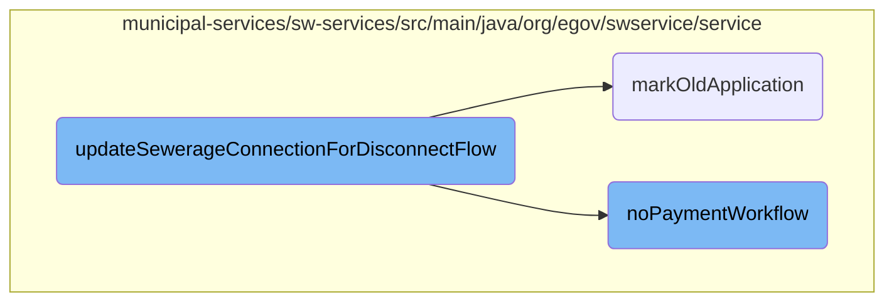

```mermaid
graph TD;
      subgraph municipal-services/sw-services/src/main/java/org/egov/swservice/service/SewerageServiceImpl.java
713301337c25c968ca403198295d21b20ce8b1c1ebc1b7f57f6de2b73deb3f94(updateSewerageConnection):::mainFlowStyle --> 1da219470950547c57b1d788a8f81b46b1c5bda6f974b70afd86052fc68d4163(modifySewerageConnection)
end

subgraph municipal-services/sw-services/src/main/java/org/egov/swservice/service/SewerageServiceImpl.java
713301337c25c968ca403198295d21b20ce8b1c1ebc1b7f57f6de2b73deb3f94(updateSewerageConnection):::mainFlowStyle --> d580d9ebe9477745fa2ec4d5e3da5de5c9194294caf27c7c5cdfa9d2b970772e(updateSewerageConnectionForDisconnectFlow):::mainFlowStyle
end

subgraph municipal-services/sw-services/src/main/java/org/egov/swservice/service/SewerageServiceImpl.java
d580d9ebe9477745fa2ec4d5e3da5de5c9194294caf27c7c5cdfa9d2b970772e(updateSewerageConnectionForDisconnectFlow):::mainFlowStyle --> jjppn(...)
end

subgraph municipal-services/sw-services/src/main/java/org/egov/swservice/service/SewerageServiceImpl.java
1da219470950547c57b1d788a8f81b46b1c5bda6f974b70afd86052fc68d4163(modifySewerageConnection) --> a8f696dd7d3e14331727fc0c276864880a0650ce4e4eb270ac2c56e77d90ce88(markOldApplication)
end


      classDef mainFlowStyle color:#000000,fill:#7CB9F4
classDef rootsStyle color:#000000,fill:#00FFF4
classDef Style1 color:#000000,fill:#00FFAA
classDef Style2 color:#000000,fill:#FFFF00
classDef Style3 color:#000000,fill:#AA7CB9

%% Swimm:
%% graph TD;
%%       subgraph <SwmPath>[municipal-services/sw-services/src/main/java/org/egov/swservice/service/SewerageServiceImpl.java](municipal-services/sw-services/src/main/java/org/egov/swservice/service/SewerageServiceImpl.java)</SwmPath>
%% 713301337c25c968ca403198295d21b20ce8b1c1ebc1b7f57f6de2b73deb3f94(updateSewerageConnection):::mainFlowStyle --> 1da219470950547c57b1d788a8f81b46b1c5bda6f974b70afd86052fc68d4163(modifySewerageConnection)
%% end
%% 
%% subgraph <SwmPath>[municipal-services/sw-services/src/main/java/org/egov/swservice/service/SewerageServiceImpl.java](municipal-services/sw-services/src/main/java/org/egov/swservice/service/SewerageServiceImpl.java)</SwmPath>
%% 713301337c25c968ca403198295d21b20ce8b1c1ebc1b7f57f6de2b73deb3f94(updateSewerageConnection):::mainFlowStyle --> d580d9ebe9477745fa2ec4d5e3da5de5c9194294caf27c7c5cdfa9d2b970772e(updateSewerageConnectionForDisconnectFlow):::mainFlowStyle
%% end
%% 
%% subgraph <SwmPath>[municipal-services/sw-services/src/main/java/org/egov/swservice/service/SewerageServiceImpl.java](municipal-services/sw-services/src/main/java/org/egov/swservice/service/SewerageServiceImpl.java)</SwmPath>
%% d580d9ebe9477745fa2ec4d5e3da5de5c9194294caf27c7c5cdfa9d2b970772e(updateSewerageConnectionForDisconnectFlow):::mainFlowStyle --> jjppn(...)
%% end
%% 
%% subgraph <SwmPath>[municipal-services/sw-services/src/main/java/org/egov/swservice/service/SewerageServiceImpl.java](municipal-services/sw-services/src/main/java/org/egov/swservice/service/SewerageServiceImpl.java)</SwmPath>
%% 1da219470950547c57b1d788a8f81b46b1c5bda6f974b70afd86052fc68d4163(modifySewerageConnection) --> a8f696dd7d3e14331727fc0c276864880a0650ce4e4eb270ac2c56e77d90ce88(markOldApplication)
%% end
%% 
%% 
%%       classDef mainFlowStyle color:#000000,fill:#7CB9F4
%% classDef rootsStyle color:#000000,fill:#00FFF4
%% classDef Style1 color:#000000,fill:#00FFAA
%% classDef Style2 color:#000000,fill:#FFFF00
%% classDef Style3 color:#000000,fill:#AA7CB9
```

This document explains the flow of handling sewerage connection records, starting from listening to Kafka topics to sending notifications and updating the sewerage connection status. The process involves consuming records, processing payment updates, sending notifications, and updating the sewerage connection details.

The flow begins by listening to Kafka topics for any new sewerage connection records. Once a record is received, it is converted into a request object. The system checks if notifications are enabled for the current application status. If the user is not a citizen, the connection holder information is decrypted. The request is then processed to handle payment updates, which involves verifying the payment service, fetching user information, and updating the application status. Notifications are sent if the payment service matches the sewerage service. Finally, the sewerage connection details are updated in the database, and any previous applications are marked as outdated if the current application is approved.

Here is a high level diagram of the flow, showing only the most important functions:

```mermaid
graph TD;
      subgraph municipal-services/sw-services/src/main/java/org/egov/swservice/service
de012992f35d6914a0b9391e83d9ff33365f26764fd4dbacd34e8f47421bbc5d(listen):::mainFlowStyle --> 34f5ca8b2a1f58552173a09274daadad1844bc01cfe1d16ff330f637789125f7(process):::mainFlowStyle
end

subgraph municipal-services/sw-services/src/main/java/org/egov/swservice/service
34f5ca8b2a1f58552173a09274daadad1844bc01cfe1d16ff330f637789125f7(process):::mainFlowStyle --> 7cb98bdcddccf0af5741fc43853dd808ee47169b13bde77dd98a86355fc64d99(sendNotificationForPayment)
end

subgraph municipal-services/sw-services/src/main/java/org/egov/swservice/service
34f5ca8b2a1f58552173a09274daadad1844bc01cfe1d16ff330f637789125f7(process):::mainFlowStyle --> 713301337c25c968ca403198295d21b20ce8b1c1ebc1b7f57f6de2b73deb3f94(updateSewerageConnection):::mainFlowStyle
end

subgraph municipal-services/sw-services/src/main/java/org/egov/swservice/service
713301337c25c968ca403198295d21b20ce8b1c1ebc1b7f57f6de2b73deb3f94(updateSewerageConnection):::mainFlowStyle --> 1da219470950547c57b1d788a8f81b46b1c5bda6f974b70afd86052fc68d4163(modifySewerageConnection)
end

subgraph municipal-services/sw-services/src/main/java/org/egov/swservice/service
713301337c25c968ca403198295d21b20ce8b1c1ebc1b7f57f6de2b73deb3f94(updateSewerageConnection):::mainFlowStyle --> d580d9ebe9477745fa2ec4d5e3da5de5c9194294caf27c7c5cdfa9d2b970772e(updateSewerageConnectionForDisconnectFlow):::mainFlowStyle
end

subgraph municipal-services/sw-services/src/main/java/org/egov/swservice/service
d580d9ebe9477745fa2ec4d5e3da5de5c9194294caf27c7c5cdfa9d2b970772e(updateSewerageConnectionForDisconnectFlow):::mainFlowStyle --> a8f696dd7d3e14331727fc0c276864880a0650ce4e4eb270ac2c56e77d90ce88(markOldApplication)
end

subgraph municipal-services/sw-services/src/main/java/org/egov/swservice/service
d580d9ebe9477745fa2ec4d5e3da5de5c9194294caf27c7c5cdfa9d2b970772e(updateSewerageConnectionForDisconnectFlow):::mainFlowStyle --> bbfba581467c7946f15bb54fa48610977976403e30f5116f8551b3d3d8a13b01(noPaymentWorkflow):::mainFlowStyle
end


      classDef mainFlowStyle color:#000000,fill:#7CB9F4
classDef rootsStyle color:#000000,fill:#00FFF4
classDef Style1 color:#000000,fill:#00FFAA
classDef Style2 color:#000000,fill:#FFFF00
classDef Style3 color:#000000,fill:#AA7CB9

%% Swimm:
%% graph TD;
%%       subgraph <SwmPath>[municipal-services/sw-services/src/main/java/org/egov/swservice/service/](municipal-services/sw-services/src/main/java/org/egov/swservice/service/)</SwmPath>
%% de012992f35d6914a0b9391e83d9ff33365f26764fd4dbacd34e8f47421bbc5d(listen):::mainFlowStyle --> 34f5ca8b2a1f58552173a09274daadad1844bc01cfe1d16ff330f637789125f7(process):::mainFlowStyle
%% end
%% 
%% subgraph <SwmPath>[municipal-services/sw-services/src/main/java/org/egov/swservice/service/](municipal-services/sw-services/src/main/java/org/egov/swservice/service/)</SwmPath>
%% 34f5ca8b2a1f58552173a09274daadad1844bc01cfe1d16ff330f637789125f7(process):::mainFlowStyle --> 7cb98bdcddccf0af5741fc43853dd808ee47169b13bde77dd98a86355fc64d99(sendNotificationForPayment)
%% end
%% 
%% subgraph <SwmPath>[municipal-services/sw-services/src/main/java/org/egov/swservice/service/](municipal-services/sw-services/src/main/java/org/egov/swservice/service/)</SwmPath>
%% 34f5ca8b2a1f58552173a09274daadad1844bc01cfe1d16ff330f637789125f7(process):::mainFlowStyle --> 713301337c25c968ca403198295d21b20ce8b1c1ebc1b7f57f6de2b73deb3f94(updateSewerageConnection):::mainFlowStyle
%% end
%% 
%% subgraph <SwmPath>[municipal-services/sw-services/src/main/java/org/egov/swservice/service/](municipal-services/sw-services/src/main/java/org/egov/swservice/service/)</SwmPath>
%% 713301337c25c968ca403198295d21b20ce8b1c1ebc1b7f57f6de2b73deb3f94(updateSewerageConnection):::mainFlowStyle --> 1da219470950547c57b1d788a8f81b46b1c5bda6f974b70afd86052fc68d4163(modifySewerageConnection)
%% end
%% 
%% subgraph <SwmPath>[municipal-services/sw-services/src/main/java/org/egov/swservice/service/](municipal-services/sw-services/src/main/java/org/egov/swservice/service/)</SwmPath>
%% 713301337c25c968ca403198295d21b20ce8b1c1ebc1b7f57f6de2b73deb3f94(updateSewerageConnection):::mainFlowStyle --> d580d9ebe9477745fa2ec4d5e3da5de5c9194294caf27c7c5cdfa9d2b970772e(updateSewerageConnectionForDisconnectFlow):::mainFlowStyle
%% end
%% 
%% subgraph <SwmPath>[municipal-services/sw-services/src/main/java/org/egov/swservice/service/](municipal-services/sw-services/src/main/java/org/egov/swservice/service/)</SwmPath>
%% d580d9ebe9477745fa2ec4d5e3da5de5c9194294caf27c7c5cdfa9d2b970772e(updateSewerageConnectionForDisconnectFlow):::mainFlowStyle --> a8f696dd7d3e14331727fc0c276864880a0650ce4e4eb270ac2c56e77d90ce88(markOldApplication)
%% end
%% 
%% subgraph <SwmPath>[municipal-services/sw-services/src/main/java/org/egov/swservice/service/](municipal-services/sw-services/src/main/java/org/egov/swservice/service/)</SwmPath>
%% d580d9ebe9477745fa2ec4d5e3da5de5c9194294caf27c7c5cdfa9d2b970772e(updateSewerageConnectionForDisconnectFlow):::mainFlowStyle --> bbfba581467c7946f15bb54fa48610977976403e30f5116f8551b3d3d8a13b01(noPaymentWorkflow):::mainFlowStyle
%% end
%% 
%% 
%%       classDef mainFlowStyle color:#000000,fill:#7CB9F4
%% classDef rootsStyle color:#000000,fill:#00FFF4
%% classDef Style1 color:#000000,fill:#00FFAA
%% classDef Style2 color:#000000,fill:#FFFF00
%% classDef Style3 color:#000000,fill:#AA7CB9
```



# Flow drill down

First, we'll zoom into this section of the flow:

```mermaid
graph TD;
      subgraph municipal-services/sw-services/src/main/java/org/egov/swservice/service
de012992f35d6914a0b9391e83d9ff33365f26764fd4dbacd34e8f47421bbc5d(listen):::mainFlowStyle --> 34f5ca8b2a1f58552173a09274daadad1844bc01cfe1d16ff330f637789125f7(process):::mainFlowStyle
end

subgraph municipal-services/sw-services/src/main/java/org/egov/swservice/service
34f5ca8b2a1f58552173a09274daadad1844bc01cfe1d16ff330f637789125f7(process):::mainFlowStyle --> 7cb98bdcddccf0af5741fc43853dd808ee47169b13bde77dd98a86355fc64d99(sendNotificationForPayment)
end

subgraph municipal-services/sw-services/src/main/java/org/egov/swservice/service
34f5ca8b2a1f58552173a09274daadad1844bc01cfe1d16ff330f637789125f7(process):::mainFlowStyle --> 713301337c25c968ca403198295d21b20ce8b1c1ebc1b7f57f6de2b73deb3f94(updateSewerageConnection):::mainFlowStyle
end

subgraph municipal-services/sw-services/src/main/java/org/egov/swservice/service
713301337c25c968ca403198295d21b20ce8b1c1ebc1b7f57f6de2b73deb3f94(updateSewerageConnection):::mainFlowStyle --> 43vfe(...)
end

subgraph municipal-services/sw-services/src/main/java/org/egov/swservice/service
7cb98bdcddccf0af5741fc43853dd808ee47169b13bde77dd98a86355fc64d99(sendNotificationForPayment) --> 724b52908bfdd38128c6f9b8399d070fdcebc7056ac393da39470ae27ea62b20(sendPaymentNotification)
end


      classDef mainFlowStyle color:#000000,fill:#7CB9F4
classDef rootsStyle color:#000000,fill:#00FFF4
classDef Style1 color:#000000,fill:#00FFAA
classDef Style2 color:#000000,fill:#FFFF00
classDef Style3 color:#000000,fill:#AA7CB9

%% Swimm:
%% graph TD;
%%       subgraph <SwmPath>[municipal-services/sw-services/src/main/java/org/egov/swservice/service/](municipal-services/sw-services/src/main/java/org/egov/swservice/service/)</SwmPath>
%% de012992f35d6914a0b9391e83d9ff33365f26764fd4dbacd34e8f47421bbc5d(listen):::mainFlowStyle --> 34f5ca8b2a1f58552173a09274daadad1844bc01cfe1d16ff330f637789125f7(process):::mainFlowStyle
%% end
%% 
%% subgraph <SwmPath>[municipal-services/sw-services/src/main/java/org/egov/swservice/service/](municipal-services/sw-services/src/main/java/org/egov/swservice/service/)</SwmPath>
%% 34f5ca8b2a1f58552173a09274daadad1844bc01cfe1d16ff330f637789125f7(process):::mainFlowStyle --> 7cb98bdcddccf0af5741fc43853dd808ee47169b13bde77dd98a86355fc64d99(sendNotificationForPayment)
%% end
%% 
%% subgraph <SwmPath>[municipal-services/sw-services/src/main/java/org/egov/swservice/service/](municipal-services/sw-services/src/main/java/org/egov/swservice/service/)</SwmPath>
%% 34f5ca8b2a1f58552173a09274daadad1844bc01cfe1d16ff330f637789125f7(process):::mainFlowStyle --> 713301337c25c968ca403198295d21b20ce8b1c1ebc1b7f57f6de2b73deb3f94(updateSewerageConnection):::mainFlowStyle
%% end
%% 
%% subgraph <SwmPath>[municipal-services/sw-services/src/main/java/org/egov/swservice/service/](municipal-services/sw-services/src/main/java/org/egov/swservice/service/)</SwmPath>
%% 713301337c25c968ca403198295d21b20ce8b1c1ebc1b7f57f6de2b73deb3f94(updateSewerageConnection):::mainFlowStyle --> 43vfe(...)
%% end
%% 
%% subgraph <SwmPath>[municipal-services/sw-services/src/main/java/org/egov/swservice/service/](municipal-services/sw-services/src/main/java/org/egov/swservice/service/)</SwmPath>
%% 7cb98bdcddccf0af5741fc43853dd808ee47169b13bde77dd98a86355fc64d99(sendNotificationForPayment) --> 724b52908bfdd38128c6f9b8399d070fdcebc7056ac393da39470ae27ea62b20(sendPaymentNotification)
%% end
%% 
%% 
%%       classDef mainFlowStyle color:#000000,fill:#7CB9F4
%% classDef rootsStyle color:#000000,fill:#00FFF4
%% classDef Style1 color:#000000,fill:#00FFAA
%% classDef Style2 color:#000000,fill:#FFFF00
%% classDef Style3 color:#000000,fill:#AA7CB9
```



<SwmSnippet path="/municipal-services/sw-services/src/main/java/org/egov/swservice/consumer/WorkflowNotificationConsumer.java" line="39">

---

## Listening to Kafka Topics

The <SwmToken path="municipal-services/sw-services/src/main/java/org/egov/swservice/consumer/WorkflowNotificationConsumer.java" pos="49:5:5" line-data="	public void listen(final HashMap&lt;String, Object&gt; record, @Header(KafkaHeaders.RECEIVED_TOPIC) String topic) {">`listen`</SwmToken> method consumes records from specified Kafka topics related to sewerage connections. It converts the record into a <SwmToken path="municipal-services/sw-services/src/main/java/org/egov/swservice/consumer/WorkflowNotificationConsumer.java" pos="51:1:1" line-data="			SewerageConnectionRequest sewerageConnectionRequest = mapper.convertValue(record,">`SewerageConnectionRequest`</SwmToken> object and checks if notifications are enabled for the current application status. If the user role is not a citizen, it decrypts the connection holder information. Finally, it processes the request using the <SwmToken path="municipal-services/sw-services/src/main/java/org/egov/swservice/consumer/WorkflowNotificationConsumer.java" pos="7:10:10" line-data="import org.egov.swservice.service.WorkflowNotificationService;">`WorkflowNotificationService`</SwmToken>.

```java
	/**
	 * Consumes the sewerage connection record and send notification
	 * 
	 * @param record - Received record from Kafka Topic
	 *
	 * @param topic - Received Topic Name
	 */

	@KafkaListener(topics = { "${egov.sewarageservice.createconnection.topic}", "${egov.sewarageservice.updateconnection.topic}",
			"${egov.sewerageservice.updatesewerageconnection.workflow.topic}" })
	public void listen(final HashMap<String, Object> record, @Header(KafkaHeaders.RECEIVED_TOPIC) String topic) {
		try {
			SewerageConnectionRequest sewerageConnectionRequest = mapper.convertValue(record,
					SewerageConnectionRequest.class);
			SewerageConnection sewerageConnection = sewerageConnectionRequest.getSewerageConnection();
			String applicationStatus = sewerageConnection.getApplicationStatus();
			if (!SWConstants.NOTIFICATION_ENABLE_FOR_STATUS.contains(sewerageConnection.getProcessInstance().getAction()+"_"+applicationStatus)) {
				log.info("Workflow Notification Disabled For State :" + sewerageConnection.getProcessInstance().getAction()+"_"+applicationStatus);
				return;
			}
			List<Role> roles = sewerageConnectionRequest.getRequestInfo().getUserInfo().getRoles();
```

---

</SwmSnippet>

<SwmSnippet path="/municipal-services/sw-services/src/main/java/org/egov/swservice/service/PaymentUpdateService.java" line="77">

---

## Processing Payment Updates

The <SwmToken path="municipal-services/sw-services/src/main/java/org/egov/swservice/service/PaymentUpdateService.java" pos="83:5:5" line-data="	public void process(HashMap&lt;String, Object&gt; record) {">`process`</SwmToken> method handles payment updates by converting the record into a <SwmToken path="municipal-services/sw-services/src/main/java/org/egov/swservice/service/PaymentUpdateService.java" pos="85:1:1" line-data="			PaymentRequest paymentRequest = mapper.convertValue(record, PaymentRequest.class);">`PaymentRequest`</SwmToken> object. It verifies if the payment service matches the configured business service. If matched, it fetches the user information and searches for the corresponding sewerage connection. The method then updates the application status to 'PAY' and calls the workflow integrator to update the connection status. Finally, it sends a notification for the payment.

```java
	/**
	 * After payment change the application status
	 *
	 * @param record
	 *            payment request
	 */
	public void process(HashMap<String, Object> record) {
		try {
			PaymentRequest paymentRequest = mapper.convertValue(record, PaymentRequest.class);
			boolean isServiceMatched = false;
			for (PaymentDetail paymentDetail : paymentRequest.getPayment().getPaymentDetails()) {
				if (paymentDetail.getBusinessService().equalsIgnoreCase(config.getReceiptBusinessservice()) ||
						SEWERAGE_SERVICE_BUSINESS_ID.equals(paymentDetail.getBusinessService())) {
					isServiceMatched = true;
				}
			}
			if (!isServiceMatched)
				return;
			paymentRequest.getRequestInfo().setUserInfo(fetchUser(
					paymentRequest.getRequestInfo().getUserInfo().getUuid(), paymentRequest.getRequestInfo()));
			for (PaymentDetail paymentDetail : paymentRequest.getPayment().getPaymentDetails()) {
```

---

</SwmSnippet>

<SwmSnippet path="/municipal-services/sw-services/src/main/java/org/egov/swservice/service/PaymentUpdateService.java" line="172">

---

## Sending Payment Notifications

The <SwmToken path="municipal-services/sw-services/src/main/java/org/egov/swservice/service/PaymentUpdateService.java" pos="176:5:5" line-data="	public void sendNotificationForPayment(PaymentRequest paymentRequest) {">`sendNotificationForPayment`</SwmToken> method processes the payment request to send notifications. It checks if the payment service matches the sewerage service. If matched, it searches for the corresponding sewerage connection and sends a payment notification using the <SwmToken path="municipal-services/sw-services/src/main/java/org/egov/swservice/service/PaymentUpdateService.java" pos="228:5:5" line-data="	public void sendPaymentNotification(SewerageConnectionRequest sewerageConnectionRequest, PaymentDetail paymentDetail) {">`sendPaymentNotification`</SwmToken> method.

```java
	/**
	 * consume payment request for processing the notification of payment
	 * @param paymentRequest
	 */
	public void sendNotificationForPayment(PaymentRequest paymentRequest) {
		try {
			log.info("Payment Notification consumer :");
			boolean isServiceMatched = false;
			for (PaymentDetail paymentDetail : paymentRequest.getPayment().getPaymentDetails()) {
                String businessservice = paymentDetail.getBusinessService();
                if (SEWERAGE_SERVICE_BUSINESS_ID.equals(businessservice) || SEWERAGE_SERVICE_ONE_TIME_FEE_BUSINESS_ID.equals(businessservice)) {
					isServiceMatched = true;
				}
			}
			if (!isServiceMatched)
				return;
			for (PaymentDetail paymentDetail : paymentRequest.getPayment().getPaymentDetails()) {
				log.info("Consuming Business Service : {}", paymentDetail.getBusinessService());
				if (SEWERAGE_SERVICE_BUSINESS_ID.equals(paymentDetail.getBusinessService()) ||
						config.getReceiptBusinessservice().equals(paymentDetail.getBusinessService())) {
					SearchCriteria criteria = new SearchCriteria();
```

---

</SwmSnippet>

<SwmSnippet path="/municipal-services/sw-services/src/main/java/org/egov/swservice/service/PaymentUpdateService.java" line="223">

---

### Sending Payment Notification

The <SwmToken path="municipal-services/sw-services/src/main/java/org/egov/swservice/service/PaymentUpdateService.java" pos="228:5:5" line-data="	public void sendPaymentNotification(SewerageConnectionRequest sewerageConnectionRequest, PaymentDetail paymentDetail) {">`sendPaymentNotification`</SwmToken> method sends notifications through various channels like events, SMS, and email. It fetches the configured channels and sends notifications if they are enabled in the configuration.

```java
	/**
	 *
	 * @param sewerageConnectionRequest
	 * @param paymentDetail
	 */
	public void sendPaymentNotification(SewerageConnectionRequest sewerageConnectionRequest, PaymentDetail paymentDetail) {
		User userInfoCopy = sewerageConnectionRequest.getRequestInfo().getUserInfo();
		User userInfo = notificationUtil.getInternalMicroserviceUser(sewerageConnectionRequest.getSewerageConnection().getTenantId());
		sewerageConnectionRequest.getRequestInfo().setUserInfo(userInfo);
		Property property = validateProperty.getOrValidateProperty(sewerageConnectionRequest);
		sewerageConnectionRequest.getRequestInfo().setUserInfo(userInfoCopy);

		List<String> configuredChannelNames =  notificationUtil.fetchChannelList(sewerageConnectionRequest.getRequestInfo(), sewerageConnectionRequest.getSewerageConnection().getTenantId(), SEWERAGE_SERVICE_BUSINESS_ID, sewerageConnectionRequest.getSewerageConnection().getProcessInstance().getAction());

		if(configuredChannelNames.contains(CHANNEL_NAME_EVENT)) {
			if (config.getIsUserEventsNotificationEnabled() != null && config.getIsUserEventsNotificationEnabled()) {
				EventRequest eventRequest = getEventRequest(sewerageConnectionRequest, property, paymentDetail);
				if (eventRequest != null) {
					notificationUtil.sendEventNotification(eventRequest);
				}
			}
```

---

</SwmSnippet>

Now, lets zoom into this section of the flow:



<SwmSnippet path="/municipal-services/sw-services/src/main/java/org/egov/swservice/service/SewerageServiceImpl.java" line="276">

---

## <SwmToken path="municipal-services/sw-services/src/main/java/org/egov/swservice/consumer/WorkflowNotificationConsumer.java" pos="48:8:8" line-data="			&quot;${egov.sewerageservice.updatesewerageconnection.workflow.topic}&quot; })">`updatesewerageconnection`</SwmToken>

The <SwmToken path="municipal-services/sw-services/src/main/java/org/egov/swservice/consumer/WorkflowNotificationConsumer.java" pos="48:8:8" line-data="			&quot;${egov.sewerageservice.updatesewerageconnection.workflow.topic}&quot; })">`updatesewerageconnection`</SwmToken> method first checks if the request is for disconnection. If true, it delegates the task to <SwmToken path="municipal-services/sw-services/src/main/java/org/egov/swservice/service/SewerageServiceImpl.java" pos="277:3:3" line-data="			return updateSewerageConnectionForDisconnectFlow(sewerageConnectionRequest);">`updateSewerageConnectionForDisconnectFlow`</SwmToken>.

```java
		if(sewerageConnectionRequest.isDisconnectRequest()) {
			return updateSewerageConnectionForDisconnectFlow(sewerageConnectionRequest);
		}
```

---

</SwmSnippet>

<SwmSnippet path="/municipal-services/sw-services/src/main/java/org/egov/swservice/service/SewerageServiceImpl.java" line="281">

---

If the request is for modifying the connection, it calls <SwmToken path="municipal-services/sw-services/src/main/java/org/egov/swservice/service/SewerageServiceImpl.java" pos="282:3:3" line-data="			return modifySewerageConnection(sewerageConnectionRequest);">`modifySewerageConnection`</SwmToken> to handle the modification logic.

```java
		if(sewerageServicesUtil.isModifyConnectionRequest(sewerageConnectionRequest)){
			return modifySewerageConnection(sewerageConnectionRequest);
		}
```

---

</SwmSnippet>

<SwmSnippet path="/municipal-services/sw-services/src/main/java/org/egov/swservice/service/SewerageServiceImpl.java" line="284">

---

The method then validates the sewerage connection and property details, retrieves the previous application status, and enriches the request with necessary data before proceeding with the update.

```java
		sewerageConnectionValidator.validateSewerageConnection(sewerageConnectionRequest, SWConstants.UPDATE_APPLICATION);
		mDMSValidator.validateMasterData(sewerageConnectionRequest, SWConstants.UPDATE_APPLICATION);
		Property property = validateProperty.getOrValidateProperty(sewerageConnectionRequest);
		validateProperty.validatePropertyFields(property,sewerageConnectionRequest.getRequestInfo());
		String previousApplicationStatus = workflowService.getApplicationStatus(
				sewerageConnectionRequest.getRequestInfo(),
				sewerageConnectionRequest.getSewerageConnection().getApplicationNo(),
				sewerageConnectionRequest.getSewerageConnection().getTenantId(), config.getBusinessServiceValue());
		BusinessService businessService = workflowService.getBusinessService(config.getBusinessServiceValue(),
				sewerageConnectionRequest.getSewerageConnection().getTenantId(),
				sewerageConnectionRequest.getRequestInfo());
		SewerageConnection searchResult = getConnectionForUpdateRequest(
				sewerageConnectionRequest.getSewerageConnection().getId(), sewerageConnectionRequest.getRequestInfo());

		Boolean isStateUpdatable = sewerageServicesUtil.getStatusForUpdate(businessService, previousApplicationStatus);

		boolean isPlumberSwapped = unmaskingUtil.getUnmaskedPlumberInfo(sewerageConnectionRequest.getSewerageConnection().getPlumberInfo(), searchResult.getPlumberInfo());
		if (isPlumberSwapped)
			sewerageConnectionRequest.setSewerageConnection(encryptionDecryptionUtil.decryptObject(sewerageConnectionRequest.getSewerageConnection(), "WnSConnectionPlumberDecrypDisabled", SewerageConnection.class, sewerageConnectionRequest.getRequestInfo()));

		enrichmentService.enrichUpdateSewerageConnection(sewerageConnectionRequest);
```

---

</SwmSnippet>

<SwmSnippet path="/municipal-services/sw-services/src/main/java/org/egov/swservice/service/SewerageServiceImpl.java" line="308">

---

It calculates the fee, generates demand, sends notifications, updates user information, and finally updates the sewerage connection details in the database.

```java
		sewerageDaoImpl.pushForEditNotification(sewerageConnectionRequest, isStateUpdatable);
		userService.updateUser(sewerageConnectionRequest, searchResult);
		//Enriching the property details
		List<SewerageConnection> sewerageConnectionList = new ArrayList<>();
		sewerageConnectionList.add(sewerageConnectionRequest.getSewerageConnection());
		criteria.setTenantId(sewerageConnectionRequest.getSewerageConnection().getTenantId());
		sewerageConnectionRequest.setSewerageConnection(enrichmentService.enrichPropertyDetails(sewerageConnectionList, criteria, sewerageConnectionRequest.getRequestInfo()).get(0));

		// Call workflow
		wfIntegrator.callWorkFlow(sewerageConnectionRequest, property);
		// Enrich file store Id After payment
		enrichmentService.enrichFileStoreIds(sewerageConnectionRequest);
		enrichmentService.postStatusEnrichment(sewerageConnectionRequest);

		/* encrypt here */
		sewerageConnectionRequest.setSewerageConnection(encryptConnectionDetails(sewerageConnectionRequest.getSewerageConnection()));
		/* encrypt here for connection holder details */
		sewerageConnectionRequest.setSewerageConnection(encryptConnectionHolderDetails(sewerageConnectionRequest.getSewerageConnection()));

		sewerageDao.updateSewerageConnection(sewerageConnectionRequest, isStateUpdatable);
```

---

</SwmSnippet>

<SwmSnippet path="/municipal-services/sw-services/src/main/java/org/egov/swservice/service/SewerageServiceImpl.java" line="443">

---

## <SwmToken path="municipal-services/sw-services/src/main/java/org/egov/swservice/service/SewerageServiceImpl.java" pos="448:8:8" line-data="	private List&lt;SewerageConnection&gt; modifySewerageConnection(SewerageConnectionRequest sewerageConnectionRequest) {">`modifySewerageConnection`</SwmToken>

The <SwmToken path="municipal-services/sw-services/src/main/java/org/egov/swservice/service/SewerageServiceImpl.java" pos="448:8:8" line-data="	private List&lt;SewerageConnection&gt; modifySewerageConnection(SewerageConnectionRequest sewerageConnectionRequest) {">`modifySewerageConnection`</SwmToken> method handles the modification of an existing sewerage connection. It validates the request, retrieves the previous application status, enriches the request, and updates the connection details in the database. It also marks the old application as outdated.

```java
	/**
	 *
	 * @param sewerageConnectionRequest
	 * @return list of sewerage connection
	 */
	private List<SewerageConnection> modifySewerageConnection(SewerageConnectionRequest sewerageConnectionRequest) {
		sewerageConnectionValidator.validateSewerageConnection(sewerageConnectionRequest, SWConstants.MODIFY_CONNECTION);
		mDMSValidator.validateMasterData(sewerageConnectionRequest, SWConstants.MODIFY_CONNECTION);
		Property property = validateProperty.getOrValidateProperty(sewerageConnectionRequest);
		validateProperty.validatePropertyFields(property,sewerageConnectionRequest.getRequestInfo());
		String previousApplicationStatus = workflowService.getApplicationStatus(
				sewerageConnectionRequest.getRequestInfo(),
				sewerageConnectionRequest.getSewerageConnection().getApplicationNo(),
				sewerageConnectionRequest.getSewerageConnection().getTenantId(), config.getModifySWBusinessServiceName());
		BusinessService businessService = workflowService.getBusinessService(config.getModifySWBusinessServiceName(),
				sewerageConnectionRequest.getSewerageConnection().getTenantId(),
				sewerageConnectionRequest.getRequestInfo());
		SewerageConnection searchResult = getConnectionForUpdateRequest(
				sewerageConnectionRequest.getSewerageConnection().getId(), sewerageConnectionRequest.getRequestInfo());

		Boolean isStateUpdatable = sewerageServicesUtil.getStatusForUpdate(businessService, previousApplicationStatus);
```

---

</SwmSnippet>

<SwmSnippet path="/municipal-services/sw-services/src/main/java/org/egov/swservice/service/SewerageServiceImpl.java" line="492">

---

## <SwmToken path="municipal-services/sw-services/src/main/java/org/egov/swservice/service/SewerageServiceImpl.java" pos="492:5:5" line-data="	public void markOldApplication(SewerageConnectionRequest sewerageConnectionRequest) {">`markOldApplication`</SwmToken>

The <SwmToken path="municipal-services/sw-services/src/main/java/org/egov/swservice/service/SewerageServiceImpl.java" pos="492:5:5" line-data="	public void markOldApplication(SewerageConnectionRequest sewerageConnectionRequest) {">`markOldApplication`</SwmToken> method marks previous applications as outdated if the current application is approved. It iterates through all sewerage applications and updates the <SwmToken path="municipal-services/sw-services/src/main/java/org/egov/swservice/service/SewerageServiceImpl.java" pos="388:5:5" line-data="		// setting oldApplication Flag">`oldApplication`</SwmToken> flag for the relevant records.

```java
	public void markOldApplication(SewerageConnectionRequest sewerageConnectionRequest) {
		if (sewerageConnectionRequest.getSewerageConnection().getProcessInstance().getAction().equalsIgnoreCase(APPROVE_CONNECTION)) {
			String currentModifiedApplicationNo = sewerageConnectionRequest.getSewerageConnection().getApplicationNo();
			List<SewerageConnection> sewerageConnectionList = getAllSewerageApplications(sewerageConnectionRequest);

			for(SewerageConnection sewerageConnection:sewerageConnectionList){
				if(!sewerageConnection.getOldApplication() && !(sewerageConnection.getApplicationNo().equalsIgnoreCase(currentModifiedApplicationNo))){
					sewerageConnection.setOldApplication(Boolean.TRUE);
					sewerageConnection = encryptConnectionDetails(sewerageConnection);
					SewerageConnectionRequest previousSewerageConnectionRequest = SewerageConnectionRequest.builder().requestInfo(sewerageConnectionRequest.getRequestInfo())
							.sewerageConnection(sewerageConnection).build();
					sewerageDaoImpl.updateSewerageConnection(previousSewerageConnectionRequest,Boolean.TRUE);
				}
			}
		}
	}
```

---

</SwmSnippet>

Now, lets zoom into this section of the flow:



<SwmSnippet path="/municipal-services/sw-services/src/main/java/org/egov/swservice/service/SewerageServiceImpl.java" line="339">

---

## <SwmToken path="municipal-services/sw-services/src/main/java/org/egov/swservice/service/SewerageServiceImpl.java" pos="339:8:8" line-data="	private List&lt;SewerageConnection&gt; updateSewerageConnectionForDisconnectFlow(SewerageConnectionRequest sewerageConnectionRequest) {">`updateSewerageConnectionForDisconnectFlow`</SwmToken>

The <SwmToken path="municipal-services/sw-services/src/main/java/org/egov/swservice/service/SewerageServiceImpl.java" pos="339:8:8" line-data="	private List&lt;SewerageConnection&gt; updateSewerageConnectionForDisconnectFlow(SewerageConnectionRequest sewerageConnectionRequest) {">`updateSewerageConnectionForDisconnectFlow`</SwmToken> method handles the logic for updating a sewerage connection during the disconnection process. It validates the sewerage connection request, checks the previous application status, and enriches the request with necessary details. The method also calculates any fees and generates demands, pushes notifications, updates user information, and calls the workflow service. If there are no payment dues, it triggers the <SwmToken path="municipal-services/sw-services/src/main/java/org/egov/swservice/service/PaymentUpdateService.java" pos="567:5:5" line-data="	public void noPaymentWorkflow(SewerageConnectionRequest request, Property property, RequestInfo requestInfo) {">`noPaymentWorkflow`</SwmToken> method to update the workflow status accordingly.

```java
	private List<SewerageConnection> updateSewerageConnectionForDisconnectFlow(SewerageConnectionRequest sewerageConnectionRequest) {
		SearchCriteria criteria = new SearchCriteria();

		sewerageConnectionValidator.validateSewerageConnection(sewerageConnectionRequest, SWConstants.DISCONNECT_CONNECTION);
		mDMSValidator.validateMasterData(sewerageConnectionRequest, SWConstants.DISCONNECT_CONNECTION);
		Property property = validateProperty.getOrValidateProperty(sewerageConnectionRequest);
		validateProperty.validatePropertyFields(property,sewerageConnectionRequest.getRequestInfo());
		String previousApplicationStatus = workflowService.getApplicationStatus(
				sewerageConnectionRequest.getRequestInfo(),
				sewerageConnectionRequest.getSewerageConnection().getApplicationNo(),
				sewerageConnectionRequest.getSewerageConnection().getTenantId(),config.getDisconnectBusinessServiceName() );
		BusinessService businessService = workflowService.getBusinessService(config.getDisconnectBusinessServiceName(),
				sewerageConnectionRequest.getSewerageConnection().getTenantId(),
				sewerageConnectionRequest.getRequestInfo());
		SewerageConnection searchResult = getConnectionForUpdateRequest(
				sewerageConnectionRequest.getSewerageConnection().getId(), sewerageConnectionRequest.getRequestInfo());

		Boolean isStateUpdatable = sewerageServicesUtil.getStatusForUpdate(businessService, previousApplicationStatus);

		boolean isPlumberSwapped = unmaskingUtil.getUnmaskedPlumberInfo(sewerageConnectionRequest.getSewerageConnection().getPlumberInfo(), searchResult.getPlumberInfo());
		if (isPlumberSwapped)
```

---

</SwmSnippet>

<SwmSnippet path="/municipal-services/sw-services/src/main/java/org/egov/swservice/service/SewerageServiceImpl.java" line="342">

---

### Validating and Enriching the Request

The initial steps involve validating the sewerage connection request and property details. The request is enriched with additional information, and the previous application status is retrieved to determine if the state is updatable.

```java
		sewerageConnectionValidator.validateSewerageConnection(sewerageConnectionRequest, SWConstants.DISCONNECT_CONNECTION);
		mDMSValidator.validateMasterData(sewerageConnectionRequest, SWConstants.DISCONNECT_CONNECTION);
		Property property = validateProperty.getOrValidateProperty(sewerageConnectionRequest);
		validateProperty.validatePropertyFields(property,sewerageConnectionRequest.getRequestInfo());
		String previousApplicationStatus = workflowService.getApplicationStatus(
				sewerageConnectionRequest.getRequestInfo(),
				sewerageConnectionRequest.getSewerageConnection().getApplicationNo(),
				sewerageConnectionRequest.getSewerageConnection().getTenantId(),config.getDisconnectBusinessServiceName() );
		BusinessService businessService = workflowService.getBusinessService(config.getDisconnectBusinessServiceName(),
				sewerageConnectionRequest.getSewerageConnection().getTenantId(),
				sewerageConnectionRequest.getRequestInfo());
		SewerageConnection searchResult = getConnectionForUpdateRequest(
				sewerageConnectionRequest.getSewerageConnection().getId(), sewerageConnectionRequest.getRequestInfo());

		Boolean isStateUpdatable = sewerageServicesUtil.getStatusForUpdate(businessService, previousApplicationStatus);

		boolean isPlumberSwapped = unmaskingUtil.getUnmaskedPlumberInfo(sewerageConnectionRequest.getSewerageConnection().getPlumberInfo(), searchResult.getPlumberInfo());
		if (isPlumberSwapped)
			sewerageConnectionRequest.setSewerageConnection(encryptionDecryptionUtil.decryptObject(sewerageConnectionRequest.getSewerageConnection(), "WnSConnectionPlumberDecrypDisabled", SewerageConnection.class, sewerageConnectionRequest.getRequestInfo()));

		enrichmentService.enrichUpdateSewerageConnection(sewerageConnectionRequest);
```

---

</SwmSnippet>

<SwmSnippet path="/municipal-services/sw-services/src/main/java/org/egov/swservice/service/SewerageServiceImpl.java" line="367">

---

### Calculating Fees and Generating Demands

The method calculates any applicable fees and generates demands. It also checks if there are any payment dues. If no payment is required, it sets a specific comment in the process instance.

```java
		calculationService.calculateFeeAndGenerateDemand(sewerageConnectionRequest, property);
		//check whether amount is due
		boolean isNoPayment = false;
		SewerageConnection sewerageConnection = sewerageConnectionRequest.getSewerageConnection();
		ProcessInstance processInstance = sewerageConnection.getProcessInstance();
		if (SWConstants.APPROVE_DISCONNECTION_CONST.equalsIgnoreCase(processInstance.getAction())) {
			isNoPayment = calculationService.fetchBill(sewerageConnection.getTenantId(), sewerageConnection.getConnectionNo(), sewerageConnectionRequest.getRequestInfo());
			if (isNoPayment) {
				processInstance.setComment(WORKFLOW_NO_PAYMENT_CODE);
			}
		}
```

---

</SwmSnippet>

<SwmSnippet path="/municipal-services/sw-services/src/main/java/org/egov/swservice/service/SewerageServiceImpl.java" line="379">

---

### Calling the Workflow and Updating the Connection

The workflow service is called to update the workflow status. The sewerage connection details are encrypted before updating the connection in the database.

```java
		wfIntegrator.callWorkFlow(sewerageConnectionRequest, property);

		/* encrypt here */
		sewerageConnectionRequest.setSewerageConnection(encryptConnectionDetails(sewerageConnectionRequest.getSewerageConnection()));
		/* encrypt here for connection holder details */
		sewerageConnectionRequest.setSewerageConnection(encryptConnectionHolderDetails(sewerageConnectionRequest.getSewerageConnection()));

		sewerageDao.updateSewerageConnection(sewerageConnectionRequest, isStateUpdatable);
```

---

</SwmSnippet>

<SwmSnippet path="/municipal-services/sw-services/src/main/java/org/egov/swservice/service/PaymentUpdateService.java" line="567">

---

## <SwmToken path="municipal-services/sw-services/src/main/java/org/egov/swservice/service/PaymentUpdateService.java" pos="567:5:5" line-data="	public void noPaymentWorkflow(SewerageConnectionRequest request, Property property, RequestInfo requestInfo) {">`noPaymentWorkflow`</SwmToken>

The <SwmToken path="municipal-services/sw-services/src/main/java/org/egov/swservice/service/PaymentUpdateService.java" pos="567:5:5" line-data="	public void noPaymentWorkflow(SewerageConnectionRequest request, Property property, RequestInfo requestInfo) {">`noPaymentWorkflow`</SwmToken> method is triggered when there are no payment dues. It updates the workflow status from 'approve for disconnection' to 'pending for disconnection execution'. The method enriches the request with necessary details, updates the workflow, and saves the updated sewerage connection in the database.

```java
	public void noPaymentWorkflow(SewerageConnectionRequest request, Property property, RequestInfo requestInfo) {
		//Updating the workflow from approve for disconnection to pending for disconnection execution when there are no dues
		SearchCriteria criteria = new SearchCriteria();
		SewerageConnection sewerageRequest = request.getSewerageConnection();
		criteria = SearchCriteria.builder()
				.tenantId(sewerageRequest.getTenantId())
				.connectionNumber(Stream.of(sewerageRequest.getConnectionNo().toString()).collect(Collectors.toSet()))
				.applicationStatus(Collections.singleton(PENDING_FOR_PAYMENT_STATUS_CODE)).build();
		List<SewerageConnection> sewerageConnections = sewerageService.search(criteria,
				requestInfo);
		sewerageConnections.forEach(sewerageConnection -> sewerageConnection.getProcessInstance().setAction((SWConstants.ACTION_PAY)));
		Optional<SewerageConnection> connections = sewerageConnections.stream().findFirst();
		SewerageConnection connection = connections.get();
		SewerageConnectionRequest sewerageConnectionRequest = SewerageConnectionRequest.builder()
				.sewerageConnection(connection).requestInfo(requestInfo)
				.build();
		ProcessInstance processInstanceReq = sewerageConnectionRequest.getSewerageConnection().getProcessInstance();
		processInstanceReq.setComment(WORKFLOW_NO_PAYMENT_CODE + " : " +WORKFLOW_NODUE_COMMENT);
		// Enrich tenantId in userInfo for workflow call
		Role role = Role.builder().code("SYSTEM_PAYMENT").tenantId(property.getTenantId()).build();
		Role counterEmployeeRole = Role.builder().name(COUNTER_EMPLOYEE_ROLE_NAME).code(COUNTER_EMPLOYEE_ROLE_CODE).tenantId(property.getTenantId()).build();
```

---

</SwmSnippet>

&nbsp;

*This is an auto-generated document by Swimm AI 🌊 and has not yet been verified by a human*

<SwmMeta version="3.0.0" repo-id="Z2l0aHViJTNBJTNBRElHSVQtT1NTJTNBJTNBU3dpbW0tRGVtbw==" repo-name="DIGIT-OSS" doc-type="flows"><sup>Powered by [Swimm](/)</sup></SwmMeta>
