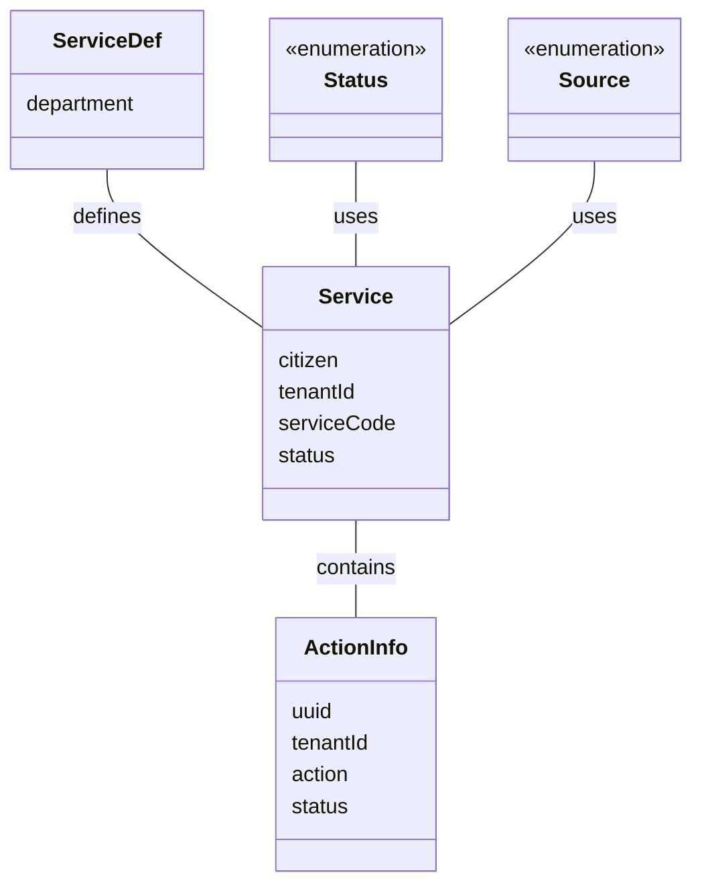

# Introduction

This document provides an introduction to the data models used in the Rainmaker PGR module. These models represent the data structures and entities essential for handling service requests and actions within the module.

# Overview of Data Models

The data models in Rainmaker PGR include various classes and enums that define the structure and properties of different entities. These models are annotated with JSON and validation annotations to facilitate serialization, deserialization, and validation of data.

# Classes

Classes such as <SwmToken path="municipal-services/rainmaker-pgr/src/main/java/org/egov/pgr/model/ServiceDef.java" pos="22:26:26" line-data=" *  This will be the MDMS data.  Defines the structure of a service provided by the administration. This is based on Open311 standard, but extends it in follwoing important ways -  1. metadata is changed from boolean to strign and represents a valid swgger 2.0 definition url of the metadata definition. If this is null then it is assumed taht service does not have any metadata, else the metadata is defined in the OpenAPI definition. This allows for a well structured powerful metadata definition.  2. Due to this ServiceRequest object has been enhanced to include metadata values (aka attribute value in Open311) as an JSON object. ">`service`</SwmToken>, <SwmToken path="municipal-services/rainmaker-pgr/src/main/java/org/egov/pgr/model/ServiceDef.java" pos="31:4:4" line-data="public class ServiceDef   {">`ServiceDef`</SwmToken>, `ActionInfo`, `ActionHistory`, `Email`, and `AuditDetails` define the structure and properties of different entities. For example, the <SwmToken path="municipal-services/rainmaker-pgr/src/main/java/org/egov/pgr/model/ServiceDef.java" pos="22:26:26" line-data=" *  This will be the MDMS data.  Defines the structure of a service provided by the administration. This is based on Open311 standard, but extends it in follwoing important ways -  1. metadata is changed from boolean to strign and represents a valid swgger 2.0 definition url of the metadata definition. If this is null then it is assumed taht service does not have any metadata, else the metadata is defined in the OpenAPI definition. This allows for a well structured powerful metadata definition.  2. Due to this ServiceRequest object has been enhanced to include metadata values (aka attribute value in Open311) as an JSON object. ">`service`</SwmToken> class includes properties like `citizen`, <SwmToken path="municipal-services/rainmaker-pgr/src/main/java/org/egov/pgr/model/ServiceDef.java" pos="32:5:5" line-data="  @JsonProperty(&quot;tenantId&quot;)">`tenantId`</SwmToken>, <SwmToken path="municipal-services/rainmaker-pgr/src/main/java/org/egov/pgr/model/ServiceDef.java" pos="35:5:5" line-data="  @JsonProperty(&quot;serviceCode&quot;)">`serviceCode`</SwmToken>, and <SwmToken path="municipal-services/rainmaker-pgr/src/main/java/org/egov/pgr/model/Status.java" pos="46:4:4" line-data="public enum Status {">`Status`</SwmToken>, which are essential for handling service requests.

<SwmSnippet path="/municipal-services/rainmaker-pgr/src/main/java/org/egov/pgr/model/ServiceDef.java" line="233">

---

The <SwmToken path="municipal-services/rainmaker-pgr/src/main/java/org/egov/pgr/model/ServiceDef.java" pos="31:4:4" line-data="public class ServiceDef   {">`ServiceDef`</SwmToken> class captures department details, which are crucial for defining the structure of service entities.

```java
   * This field we will use to capture department.
```

---

</SwmSnippet>

# Enums

Enums like `Source` and <SwmToken path="municipal-services/rainmaker-pgr/src/main/java/org/egov/pgr/model/Status.java" pos="46:4:4" line-data="public enum Status {">`Status`</SwmToken> represent predefined sets of constants, ensuring consistency and type safety across the application. These enums help maintain uniformity in the data models.

<SwmSnippet path="/municipal-services/rainmaker-pgr/src/main/java/org/egov/pgr/model/Status.java" line="35">

---

The <SwmToken path="municipal-services/rainmaker-pgr/src/main/java/org/egov/pgr/model/Status.java" pos="46:4:4" line-data="public enum Status {">`Status`</SwmToken> enum is used to represent the various states a service request can be in, ensuring consistency in status representation.

```java
 *         with regards to rights under trademark law for use of the trade names
```

---

</SwmSnippet>

&nbsp;

*This is an auto-generated document by Swimm AI 🌊 and has not yet been verified by a human*

<SwmMeta version="3.0.0" repo-id="Z2l0aHViJTNBJTNBRElHSVQtT1NTJTNBJTNBU3dpbW0tRGVtbw==" repo-name="DIGIT-OSS" doc-type="overview"><sup>Powered by [Swimm](/)</sup></SwmMeta>
