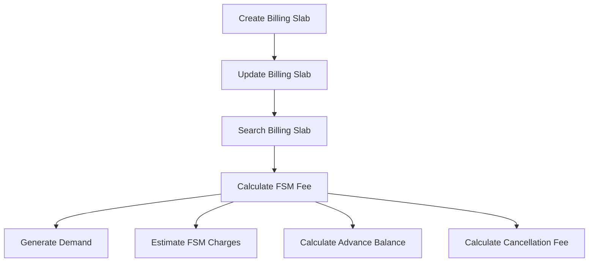

# Introduction

The FSM Calculator is a system that enables FSM Admin to create billing slabs for FSM applications with different combinations of property types, slum status, tank capacity, and other factors. It generates the demand after calculating the charges for the given application using the pre-configured billing slab. The FSM Calculator contains APIs to create, update, and search billing slabs with specific combinations. It also includes APIs to calculate and generate demand for FSM applications and return the estimate of the charges for a given FSM.

# Creating Billing Slabs

FSM Admin can create billing slabs for FSM applications by specifying different combinations of property types, slum status, tank capacity, and other factors.

# Generating Demand

The FSM Calculator generates the demand by calculating the charges for the given application using the pre-configured billing slab.

# API Usage

The FSM Calculator provides APIs to create, update, and search billing slabs, as well as to calculate and generate demand for FSM applications.

# Main Functions

There are several main functions in this folder. Some of them are <SwmToken path="municipal-services/fsm-calculator/src/main/java/org/egov/fsm/calculator/web/controllers/CalculatorController.java" pos="62:8:8" line-data="	public ResponseEntity&lt;CalculationRes&gt; calculate(@Valid @RequestBody CalculationReq calculationReq) {">`calculate`</SwmToken>, <SwmToken path="municipal-services/fsm-calculator/src/main/java/org/egov/fsm/calculator/web/controllers/CalculatorController.java" pos="105:8:8" line-data="	public ResponseEntity&lt;CalculationRes&gt; estimate(@Valid @RequestBody CalculationReq calculationReq) {">`estimate`</SwmToken>, and `createBillingSlab`. We will dive a little into <SwmToken path="municipal-services/fsm-calculator/src/main/java/org/egov/fsm/calculator/web/controllers/CalculatorController.java" pos="62:8:8" line-data="	public ResponseEntity&lt;CalculationRes&gt; calculate(@Valid @RequestBody CalculationReq calculationReq) {">`calculate`</SwmToken> and <SwmToken path="municipal-services/fsm-calculator/src/main/java/org/egov/fsm/calculator/web/controllers/CalculatorController.java" pos="105:8:8" line-data="	public ResponseEntity&lt;CalculationRes&gt; estimate(@Valid @RequestBody CalculationReq calculationReq) {">`estimate`</SwmToken>.

## calculate

The <SwmToken path="municipal-services/fsm-calculator/src/main/java/org/egov/fsm/calculator/web/controllers/CalculatorController.java" pos="62:8:8" line-data="	public ResponseEntity&lt;CalculationRes&gt; calculate(@Valid @RequestBody CalculationReq calculationReq) {">`calculate`</SwmToken> function calculates the TRIP Charge fees based on the billing slab identified for FSM Application.

## estimate

The <SwmToken path="municipal-services/fsm-calculator/src/main/java/org/egov/fsm/calculator/web/controllers/CalculatorController.java" pos="105:8:8" line-data="	public ResponseEntity&lt;CalculationRes&gt; estimate(@Valid @RequestBody CalculationReq calculationReq) {">`estimate`</SwmToken> function returns the estimate of the TRIP Charges for the given FSM Application.

## createBillingSlab

The `createBillingSlab` function creates a <SwmToken path="municipal-services/fsm-calculator/src/main/java/org/egov/fsm/calculator/web/controllers/BillingSlabController.java" pos="47:1:1" line-data="		BillingSlab billingSlab = billingSlabService.create(billingSlabRequest);">`BillingSlab`</SwmToken> with the combination of tankCapacity, Slum, and propertyType.

# Endpoints of FSM Calculator

The FSM Calculator has several endpoints for managing billing slabs and calculating fees.

## Billing Slab Endpoints

The <SwmToken path="municipal-services/fsm-calculator/src/main/java/org/egov/fsm/calculator/web/controllers/BillingSlabController.java" pos="44:8:8" line-data="	public ResponseEntity&lt;BillingSlabResponse&gt; create(@Valid @RequestBody BillingSlabRequest billingSlabRequest) {">`create`</SwmToken> endpoint allows the creation of a new billing slab with a combination of tank capacity, slum status, and property type. It uses the <SwmToken path="municipal-services/fsm-calculator/src/main/java/org/egov/fsm/calculator/web/controllers/BillingSlabController.java" pos="47:7:7" line-data="		BillingSlab billingSlab = billingSlabService.create(billingSlabRequest);">`billingSlabService`</SwmToken> to handle the creation logic and returns a <SwmToken path="municipal-services/fsm-calculator/src/main/java/org/egov/fsm/calculator/web/controllers/BillingSlabController.java" pos="44:5:5" line-data="	public ResponseEntity&lt;BillingSlabResponse&gt; create(@Valid @RequestBody BillingSlabRequest billingSlabRequest) {">`BillingSlabResponse`</SwmToken>.

<SwmSnippet path="/municipal-services/fsm-calculator/src/main/java/org/egov/fsm/calculator/web/controllers/BillingSlabController.java" line="43">

---

The <SwmToken path="municipal-services/fsm-calculator/src/main/java/org/egov/fsm/calculator/web/controllers/BillingSlabController.java" pos="44:8:8" line-data="	public ResponseEntity&lt;BillingSlabResponse&gt; create(@Valid @RequestBody BillingSlabRequest billingSlabRequest) {">`create`</SwmToken> endpoint in the <SwmToken path="municipal-services/fsm-calculator/src/main/java/org/egov/fsm/calculator/web/controllers/BillingSlabController.java" pos="32:4:4" line-data="public class BillingSlabController {">`BillingSlabController`</SwmToken> handles the creation of a new billing slab.

```java
	@PostMapping(value = "/_create")
	public ResponseEntity<BillingSlabResponse> create(@Valid @RequestBody BillingSlabRequest billingSlabRequest) {

		billigSlabUtil.defaultJsonPathConfig();
		BillingSlab billingSlab = billingSlabService.create(billingSlabRequest);
		List<BillingSlab> billingSlabList = new ArrayList<>();
		billingSlabList.add(billingSlab);
		BillingSlabResponse response = BillingSlabResponse.builder().billingSlab(billingSlabList).responseInfo(
				responseInfoFactory.createResponseInfoFromRequestInfo(billingSlabRequest.getRequestInfo(), true))
				.build();
		return new ResponseEntity<>(response, HttpStatus.OK);
	}
```

---

</SwmSnippet>

The <SwmToken path="municipal-services/fsm-calculator/src/main/java/org/egov/fsm/calculator/web/controllers/BillingSlabController.java" pos="57:8:8" line-data="	public ResponseEntity&lt;BillingSlabResponse&gt; update(@Valid @RequestBody BillingSlabRequest billingSlabRequest) {">`update`</SwmToken> endpoint allows updating an existing billing slab with the given combination of tank capacity, slum status, and property type. It uses the <SwmToken path="municipal-services/fsm-calculator/src/main/java/org/egov/fsm/calculator/web/controllers/BillingSlabController.java" pos="47:7:7" line-data="		BillingSlab billingSlab = billingSlabService.create(billingSlabRequest);">`billingSlabService`</SwmToken> to handle the update logic and returns a <SwmToken path="municipal-services/fsm-calculator/src/main/java/org/egov/fsm/calculator/web/controllers/BillingSlabController.java" pos="44:5:5" line-data="	public ResponseEntity&lt;BillingSlabResponse&gt; create(@Valid @RequestBody BillingSlabRequest billingSlabRequest) {">`BillingSlabResponse`</SwmToken>.

<SwmSnippet path="/municipal-services/fsm-calculator/src/main/java/org/egov/fsm/calculator/web/controllers/BillingSlabController.java" line="56">

---

The <SwmToken path="municipal-services/fsm-calculator/src/main/java/org/egov/fsm/calculator/web/controllers/BillingSlabController.java" pos="57:8:8" line-data="	public ResponseEntity&lt;BillingSlabResponse&gt; update(@Valid @RequestBody BillingSlabRequest billingSlabRequest) {">`update`</SwmToken> endpoint in the <SwmToken path="municipal-services/fsm-calculator/src/main/java/org/egov/fsm/calculator/web/controllers/BillingSlabController.java" pos="32:4:4" line-data="public class BillingSlabController {">`BillingSlabController`</SwmToken> handles the updating of an existing billing slab.

```java
	@PostMapping(value = "/_update")
	public ResponseEntity<BillingSlabResponse> update(@Valid @RequestBody BillingSlabRequest billingSlabRequest) {

		billigSlabUtil.defaultJsonPathConfig();
		BillingSlab billingSlab = billingSlabService.update(billingSlabRequest);
		List<BillingSlab> billingSlabList = new ArrayList<>();
		billingSlabList.add(billingSlab);
		BillingSlabResponse response = BillingSlabResponse.builder().billingSlab(billingSlabList).responseInfo(
				responseInfoFactory.createResponseInfoFromRequestInfo(billingSlabRequest.getRequestInfo(), true))
				.build();
		return new ResponseEntity<>(response, HttpStatus.OK);
	}
```

---

</SwmSnippet>

The <SwmToken path="municipal-services/fsm-calculator/src/main/java/org/egov/fsm/calculator/web/controllers/BillingSlabController.java" pos="70:8:8" line-data="	public ResponseEntity&lt;BillingSlabResponse&gt; search(@Valid @RequestBody RequestInfoWrapper requestInfoWrapper,">`search`</SwmToken> endpoint allows searching for billing slabs based on the provided search criteria. It uses the <SwmToken path="municipal-services/fsm-calculator/src/main/java/org/egov/fsm/calculator/web/controllers/BillingSlabController.java" pos="47:7:7" line-data="		BillingSlab billingSlab = billingSlabService.create(billingSlabRequest);">`billingSlabService`</SwmToken> to handle the search logic and returns a <SwmToken path="municipal-services/fsm-calculator/src/main/java/org/egov/fsm/calculator/web/controllers/BillingSlabController.java" pos="44:5:5" line-data="	public ResponseEntity&lt;BillingSlabResponse&gt; create(@Valid @RequestBody BillingSlabRequest billingSlabRequest) {">`BillingSlabResponse`</SwmToken>.

<SwmSnippet path="/municipal-services/fsm-calculator/src/main/java/org/egov/fsm/calculator/web/controllers/BillingSlabController.java" line="69">

---

The <SwmToken path="municipal-services/fsm-calculator/src/main/java/org/egov/fsm/calculator/web/controllers/BillingSlabController.java" pos="70:8:8" line-data="	public ResponseEntity&lt;BillingSlabResponse&gt; search(@Valid @RequestBody RequestInfoWrapper requestInfoWrapper,">`search`</SwmToken> endpoint in the <SwmToken path="municipal-services/fsm-calculator/src/main/java/org/egov/fsm/calculator/web/controllers/BillingSlabController.java" pos="32:4:4" line-data="public class BillingSlabController {">`BillingSlabController`</SwmToken> handles the searching of billing slabs.

```java
	@PostMapping(value = "/_search")
	public ResponseEntity<BillingSlabResponse> search(@Valid @RequestBody RequestInfoWrapper requestInfoWrapper,
			@Valid @ModelAttribute BillingSlabSearchCriteria criteria) throws JsonProcessingException {

		List<BillingSlab> billingSlabList = billingSlabService.search(criteria, requestInfoWrapper.getRequestInfo());

		BillingSlabResponse response = BillingSlabResponse.builder().billingSlab(billingSlabList).responseInfo(
				responseInfoFactory.createResponseInfoFromRequestInfo(requestInfoWrapper.getRequestInfo(), true))
				.build();
		return new ResponseEntity<>(response, HttpStatus.OK);
	}
```

---

</SwmSnippet>

## Calculation Endpoints

The <SwmToken path="municipal-services/fsm-calculator/src/main/java/org/egov/fsm/calculator/web/controllers/CalculatorController.java" pos="61:10:10" line-data="	@PostMapping(value = &quot;/_calculate&quot;)">`_calculate`</SwmToken> endpoint calculates the FSM fee and creates a demand based on the provided <SwmToken path="municipal-services/fsm-calculator/src/main/java/org/egov/fsm/calculator/web/controllers/CalculatorController.java" pos="62:16:16" line-data="	public ResponseEntity&lt;CalculationRes&gt; calculate(@Valid @RequestBody CalculationReq calculationReq) {">`CalculationReq`</SwmToken>. It uses the <SwmToken path="municipal-services/fsm-calculator/src/main/java/org/egov/fsm/calculator/web/controllers/CalculatorController.java" pos="64:10:10" line-data="		List&lt;Calculation&gt; calculations = calculationService.calculate(calculationReq);">`calculationService`</SwmToken> to perform the calculation and returns a <SwmToken path="municipal-services/fsm-calculator/src/main/java/org/egov/fsm/calculator/web/controllers/CalculatorController.java" pos="62:5:5" line-data="	public ResponseEntity&lt;CalculationRes&gt; calculate(@Valid @RequestBody CalculationReq calculationReq) {">`CalculationRes`</SwmToken>.

<SwmSnippet path="/municipal-services/fsm-calculator/src/main/java/org/egov/fsm/calculator/web/controllers/CalculatorController.java" line="61">

---

The <SwmToken path="municipal-services/fsm-calculator/src/main/java/org/egov/fsm/calculator/web/controllers/CalculatorController.java" pos="61:10:10" line-data="	@PostMapping(value = &quot;/_calculate&quot;)">`_calculate`</SwmToken> endpoint in the <SwmToken path="municipal-services/fsm-calculator/src/main/java/org/egov/fsm/calculator/web/controllers/CalculatorController.java" pos="33:4:4" line-data="public class CalculatorController {">`CalculatorController`</SwmToken> handles the calculation of FSM fees.

```java
	@PostMapping(value = "/_calculate")
	public ResponseEntity<CalculationRes> calculate(@Valid @RequestBody CalculationReq calculationReq) {
		log.debug("CalculationReaquest:: " + calculationReq);
		List<Calculation> calculations = calculationService.calculate(calculationReq);
		CalculationRes calculationRes = CalculationRes.builder().calculations(calculations).build();
		return new ResponseEntity<CalculationRes>(calculationRes, HttpStatus.OK);
	}
```

---

</SwmSnippet>

The <SwmToken path="municipal-services/fsm-calculator/src/main/java/org/egov/fsm/calculator/web/controllers/CalculatorController.java" pos="75:10:10" line-data="	@PostMapping(value = &quot;/_advancebalancecalculate&quot;)">`_advancebalancecalculate`</SwmToken> endpoint calculates the advance balance for the FSM fee and creates a demand. It uses the <SwmToken path="municipal-services/fsm-calculator/src/main/java/org/egov/fsm/calculator/web/controllers/CalculatorController.java" pos="64:10:10" line-data="		List&lt;Calculation&gt; calculations = calculationService.calculate(calculationReq);">`calculationService`</SwmToken> to perform the calculation and returns an <SwmToken path="municipal-services/fsm-calculator/src/main/java/org/egov/fsm/calculator/web/controllers/CalculatorController.java" pos="76:5:5" line-data="	public ResponseEntity&lt;AdvanceAmountResponse&gt; advanceBalanceCalculate(@Valid BigDecimal totalTripAmount, @Valid String tenantId,">`AdvanceAmountResponse`</SwmToken>.

<SwmSnippet path="/municipal-services/fsm-calculator/src/main/java/org/egov/fsm/calculator/web/controllers/CalculatorController.java" line="75">

---

The <SwmToken path="municipal-services/fsm-calculator/src/main/java/org/egov/fsm/calculator/web/controllers/CalculatorController.java" pos="75:10:10" line-data="	@PostMapping(value = &quot;/_advancebalancecalculate&quot;)">`_advancebalancecalculate`</SwmToken> endpoint in the <SwmToken path="municipal-services/fsm-calculator/src/main/java/org/egov/fsm/calculator/web/controllers/CalculatorController.java" pos="33:4:4" line-data="public class CalculatorController {">`CalculatorController`</SwmToken> handles the calculation of advance balance for FSM fees.

```java
	@PostMapping(value = "/_advancebalancecalculate")
	public ResponseEntity<AdvanceAmountResponse> advanceBalanceCalculate(@Valid BigDecimal totalTripAmount, @Valid String tenantId,
			RequestInfo requestInfo) {
		BigDecimal advanceAmount = calculationService.advanceCalculate(totalTripAmount, tenantId, requestInfo);
		
		AdvanceAmountResponse response = AdvanceAmountResponse.builder().responseInfo(
				responseInfoFactory.createResponseInfoFromRequestInfo(requestInfo, true)).advanceAmount(advanceAmount)
				.build();
		return new ResponseEntity<AdvanceAmountResponse>(response, HttpStatus.OK);
	}
```

---

</SwmSnippet>

The <SwmToken path="municipal-services/fsm-calculator/src/main/java/org/egov/fsm/calculator/web/controllers/CalculatorController.java" pos="92:10:10" line-data="	@PostMapping(value = &quot;/_cancellationfee&quot;)">`_cancellationfee`</SwmToken> endpoint calculates the cancellation fee for the FSM and creates a demand. It uses the <SwmToken path="municipal-services/fsm-calculator/src/main/java/org/egov/fsm/calculator/web/controllers/CalculatorController.java" pos="64:10:10" line-data="		List&lt;Calculation&gt; calculations = calculationService.calculate(calculationReq);">`calculationService`</SwmToken> to perform the calculation and returns a <SwmToken path="municipal-services/fsm-calculator/src/main/java/org/egov/fsm/calculator/web/controllers/CalculatorController.java" pos="93:5:5" line-data="	public ResponseEntity&lt;CancellationAmountResponse&gt; cancellationFee(@Valid BigDecimal totalTripAmount, @Valid String tenantId,">`CancellationAmountResponse`</SwmToken>.

<SwmSnippet path="/municipal-services/fsm-calculator/src/main/java/org/egov/fsm/calculator/web/controllers/CalculatorController.java" line="92">

---

The <SwmToken path="municipal-services/fsm-calculator/src/main/java/org/egov/fsm/calculator/web/controllers/CalculatorController.java" pos="92:10:10" line-data="	@PostMapping(value = &quot;/_cancellationfee&quot;)">`_cancellationfee`</SwmToken> endpoint in the <SwmToken path="municipal-services/fsm-calculator/src/main/java/org/egov/fsm/calculator/web/controllers/CalculatorController.java" pos="33:4:4" line-data="public class CalculatorController {">`CalculatorController`</SwmToken> handles the calculation of cancellation fees for FSM.

```java
	@PostMapping(value = "/_cancellationfee")
	public ResponseEntity<CancellationAmountResponse> cancellationFee(@Valid BigDecimal totalTripAmount, @Valid String tenantId,
			RequestInfo requestInfo) {
		
		BigDecimal cancellationAmount = calculationService.cancellationAmount(totalTripAmount, tenantId, requestInfo);
		
		CancellationAmountResponse response = CancellationAmountResponse.builder().responseInfo(
				responseInfoFactory.createResponseInfoFromRequestInfo(requestInfo, true)).cancellationAmount(cancellationAmount)
				.build();
		return new ResponseEntity<CancellationAmountResponse>(response, HttpStatus.OK);
	}
```

---

</SwmSnippet>

The <SwmToken path="municipal-services/fsm-calculator/src/main/java/org/egov/fsm/calculator/web/controllers/CalculatorController.java" pos="104:10:10" line-data="	@PostMapping(value = &quot;/_estimate&quot;)">`_estimate`</SwmToken> endpoint returns an estimate of the FSM charges based on the provided <SwmToken path="municipal-services/fsm-calculator/src/main/java/org/egov/fsm/calculator/web/controllers/CalculatorController.java" pos="62:16:16" line-data="	public ResponseEntity&lt;CalculationRes&gt; calculate(@Valid @RequestBody CalculationReq calculationReq) {">`CalculationReq`</SwmToken>. It uses the <SwmToken path="municipal-services/fsm-calculator/src/main/java/org/egov/fsm/calculator/web/controllers/CalculatorController.java" pos="64:10:10" line-data="		List&lt;Calculation&gt; calculations = calculationService.calculate(calculationReq);">`calculationService`</SwmToken> to perform the estimation and returns a <SwmToken path="municipal-services/fsm-calculator/src/main/java/org/egov/fsm/calculator/web/controllers/CalculatorController.java" pos="62:5:5" line-data="	public ResponseEntity&lt;CalculationRes&gt; calculate(@Valid @RequestBody CalculationReq calculationReq) {">`CalculationRes`</SwmToken>.

<SwmSnippet path="/municipal-services/fsm-calculator/src/main/java/org/egov/fsm/calculator/web/controllers/CalculatorController.java" line="104">

---

The <SwmToken path="municipal-services/fsm-calculator/src/main/java/org/egov/fsm/calculator/web/controllers/CalculatorController.java" pos="104:10:10" line-data="	@PostMapping(value = &quot;/_estimate&quot;)">`_estimate`</SwmToken> endpoint in the <SwmToken path="municipal-services/fsm-calculator/src/main/java/org/egov/fsm/calculator/web/controllers/CalculatorController.java" pos="33:4:4" line-data="public class CalculatorController {">`CalculatorController`</SwmToken> handles the estimation of FSM charges.

```java
	@PostMapping(value = "/_estimate")
	public ResponseEntity<CalculationRes> estimate(@Valid @RequestBody CalculationReq calculationReq) {
		log.debug("CalculationReaquest:: " + calculationReq);
		List<Calculation> calculations = calculationService.estimate(calculationReq);
		CalculationRes calculationRes = CalculationRes.builder().calculations(calculations).build();
		return new ResponseEntity<CalculationRes>(calculationRes, HttpStatus.OK);
	}
```

---

</SwmSnippet>

&nbsp;

*This is an auto-generated document by Swimm AI 🌊 and has not yet been verified by a human*

<SwmMeta version="3.0.0" repo-id="Z2l0aHViJTNBJTNBRElHSVQtT1NTJTNBJTNBU3dpbW0tRGVtbw==" repo-name="DIGIT-OSS" doc-type="overview"><sup>Powered by [Swimm](/)</sup></SwmMeta>
