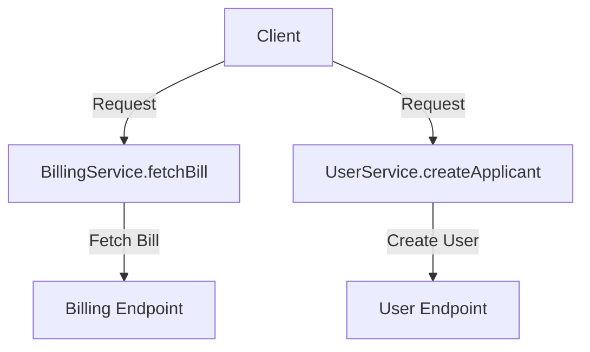

# Introduction to FSM Service

The FSM (Field Service Management) Service in DIGIT is responsible for handling the creation and updating of FSM records. It performs validations, enriches requests, integrates with workflows, and interacts with repositories to save or update FSM data. Additionally, <SwmToken path="municipal-services/fsm/src/main/java/org/egov/fsm/service/FSMService.java" pos="61:4:4" line-data="public class FSMService {">`FSMService`</SwmToken> coordinates with other services like <SwmToken path="municipal-services/fsm/src/main/java/org/egov/fsm/service/FSMService.java" pos="24:12:12" line-data="import org.egov.fsm.service.notification.NotificationService;">`NotificationService`</SwmToken>, <SwmToken path="municipal-services/fsm/src/main/java/org/egov/fsm/service/FSMService.java" pos="117:1:1" line-data="	BillingService billingService;">`BillingService`</SwmToken>, and <SwmToken path="municipal-services/fsm/src/main/java/org/egov/fsm/service/FSMService.java" pos="90:3:3" line-data="	private VehicleTripService vehicleTripService;">`VehicleTripService`</SwmToken> to ensure the complete processing of FSM requests.

# Service Details

Services like ws-services provide functionalities such as applying for water connections, searching for water connections, and taking actions based on the state of the application. These services are accessed via specific API endpoints.

<SwmSnippet path="/municipal-services/fsm/src/main/java/org/egov/fsm/service/UserService.java" line="36">

---

The <SwmToken path="municipal-services/fsm/src/main/java/org/egov/fsm/service/UserService.java" pos="38:4:4" line-data="public class UserService {">`UserService`</SwmToken> class is annotated with @Service, indicating that it is a Spring service component. This class handles operations related to user management, such as creating and updating user details.

```java
@Service
@Slf4j
public class UserService {
```

---

</SwmSnippet>

<SwmSnippet path="/municipal-services/fsm/src/main/java/org/egov/fsm/service/CalculationService.java" line="14">

---

The <SwmToken path="municipal-services/fsm/src/main/java/org/egov/fsm/service/CalculationService.java" pos="15:4:4" line-data="public class CalculationService {">`CalculationService`</SwmToken> class handles the calculation of fees and charges related to FSM requests.

```java
@Service
public class CalculationService {
```

---

</SwmSnippet>

<SwmSnippet path="/municipal-services/fsm/src/main/java/org/egov/fsm/service/BoundaryService.java" line="25">

---

The <SwmToken path="municipal-services/fsm/src/main/java/org/egov/fsm/service/BoundaryService.java" pos="27:4:4" line-data="public class BoundaryService {">`BoundaryService`</SwmToken> class is responsible for enriching locality data by calling external location services. This service ensures that the address information in FSM requests is accurate and complete.

```java
@Service
@Slf4j
public class BoundaryService {
```

---

</SwmSnippet>

<SwmSnippet path="/municipal-services/fsm/src/main/java/org/egov/fsm/service/VehicleService.java" line="24">

---

The <SwmToken path="municipal-services/fsm/src/main/java/org/egov/fsm/service/VehicleService.java" pos="26:4:4" line-data="public class VehicleService {">`VehicleService`</SwmToken> class handles operations related to vehicle management, such as validating vehicle details and fetching vehicle information from external services.

```java
@Service
@Slf4j
public class VehicleService {
```

---

</SwmSnippet>

# Main Functions

There are several main functions in the <SwmToken path="municipal-services/fsm/src/main/java/org/egov/fsm/service/FSMService.java" pos="61:4:4" line-data="public class FSMService {">`FSMService`</SwmToken> class. Some of them are create, update, <SwmToken path="municipal-services/fsm/src/main/java/org/egov/fsm/service/FSMService.java" pos="126:3:3" line-data="		enrichmentService.enrichFSMCreateRequest(fsmRequest);">`enrichFSMCreateRequest`</SwmToken>, <SwmToken path="municipal-services/fsm/src/main/java/org/egov/fsm/service/VehicleService.java" pos="60:5:5" line-data="	public Vehicle validateVehicle(FSMRequest fsmRequest) {">`validateVehicle`</SwmToken>, <SwmToken path="municipal-services/fsm/src/main/java/org/egov/fsm/service/FSMService.java" pos="298:9:9" line-data="		Vendor vendor = dsoService.getVendor(vendorSearchCriteria, fsmRequest.getRequestInfo());">`getVendor`</SwmToken>, <SwmToken path="municipal-services/fsm/src/main/java/org/egov/fsm/service/BillingService.java" pos="34:5:5" line-data="	public BillResponse fetchBill(FSM fsmRequest, RequestInfo requestInfo) {">`fetchBill`</SwmToken>, process, and getEvents. We will dive a little into create and update.

<SwmSnippet path="/municipal-services/fsm/src/main/java/org/egov/fsm/service/FSMService.java" line="119">

---

## create

The <SwmToken path="municipal-services/fsm/src/main/java/org/egov/fsm/service/FSMService.java" pos="119:5:5" line-data="	public FSM create(FSMRequest fsmRequest) {">`create`</SwmToken> function is responsible for handling the creation of FSM records. It performs necessary validations and enrichments before saving the FSM data to the repository.

```java
	public FSM create(FSMRequest fsmRequest) {
		RequestInfo requestInfo = fsmRequest.getRequestInfo();
		Object mdmsData = util.mDMSCall(requestInfo, fsmRequest.getFsm().getTenantId());
```

---

</SwmSnippet>

# Service Endpoints

Service endpoints are crucial for accessing various functionalities provided by the <SwmToken path="municipal-services/fsm/src/main/java/org/egov/fsm/service/FSMService.java" pos="61:4:4" line-data="public class FSMService {">`FSMService`</SwmToken>. Below are some key endpoints and their purposes.

<SwmSnippet path="/municipal-services/fsm/src/main/java/org/egov/fsm/service/BillingService.java" line="34">

---

## <SwmToken path="municipal-services/fsm/src/main/java/org/egov/fsm/service/BillingService.java" pos="34:5:5" line-data="	public BillResponse fetchBill(FSM fsmRequest, RequestInfo requestInfo) {">`fetchBill`</SwmToken>

The <SwmToken path="municipal-services/fsm/src/main/java/org/egov/fsm/service/BillingService.java" pos="34:5:5" line-data="	public BillResponse fetchBill(FSM fsmRequest, RequestInfo requestInfo) {">`fetchBill`</SwmToken> method in <SwmToken path="municipal-services/fsm/src/main/java/org/egov/fsm/service/FSMService.java" pos="117:1:1" line-data="	BillingService billingService;">`BillingService`</SwmToken> constructs a URL to fetch billing information for a given FSM request. It appends the tenant ID, business service, and consumer code to the base URL and makes a call to the billing service endpoint.

```java
	public BillResponse fetchBill(FSM fsmRequest, RequestInfo requestInfo) {

		StringBuilder uri = new StringBuilder(billingHost);
		uri.append(fetchBillEndpoint);
		uri.append("?").append("tenantId=").append(fsmRequest.getTenantId());
		uri.append("&businessService=").append(FSMConstants.FSM_PAY_BUSINESS_SERVICE);
		uri.append("&consumerCode=").append(fsmRequest.getApplicationNo());

		try {
			
			Optional<Object> response = serviceRequestRepository.fetchApiResult(uri,
					RequestInfoWrapper.builder().requestInfo(requestInfo).build());

			if (response.isPresent()) {
				LinkedHashMap<String, Object> responseMap = (LinkedHashMap<String, Object>) response.get();
				return mapper.convertValue(responseMap, BillResponse.class);
			} else {
				throw new CustomException("IllegalArgumentException",
						"Did not get any response from the billing services");

			}
```

---

</SwmSnippet>

<SwmSnippet path="/municipal-services/fsm/src/main/java/org/egov/fsm/service/UserService.java" line="120">

---

## <SwmToken path="municipal-services/fsm/src/main/java/org/egov/fsm/service/UserService.java" pos="120:5:5" line-data="	private UserDetailResponse createApplicant(User applicant, RequestInfo requestInfo, Boolean newUser) {">`createApplicant`</SwmToken>

The <SwmToken path="municipal-services/fsm/src/main/java/org/egov/fsm/service/UserService.java" pos="120:5:5" line-data="	private UserDetailResponse createApplicant(User applicant, RequestInfo requestInfo, Boolean newUser) {">`createApplicant`</SwmToken> method in <SwmToken path="municipal-services/fsm/src/main/java/org/egov/fsm/service/UserService.java" pos="38:4:4" line-data="public class UserService {">`UserService`</SwmToken> constructs a URL to create a new user. It appends the user host and context path to the base URL and makes a call to the user service endpoint with the applicant's details.

```java
	private UserDetailResponse createApplicant(User applicant, RequestInfo requestInfo, Boolean newUser) {
		Role role = getCitizenRole();
		addUserDefaultFields(applicant.getTenantId(), role, applicant);
		StringBuilder uri = new StringBuilder(config.getUserHost()).append(config.getUserContextPath())
				.append(config.getUserCreateEndpoint());
		setUserName(applicant);
		if (newUser) {
			applicant.setUserName(applicant.getMobileNumber());
		}
		applicant.setType(FSMConstants.CITIZEN);
		UserDetailResponse userDetailResponse = userCall(new CreateUserRequest(requestInfo, applicant), uri);
		log.debug("owner created --> " + userDetailResponse.getUser().get(0).getUuid());
		return userDetailResponse;
```

---

</SwmSnippet>

&nbsp;

*This is an auto-generated document by Swimm AI 🌊 and has not yet been verified by a human*

<SwmMeta version="3.0.0" repo-id="Z2l0aHViJTNBJTNBRElHSVQtT1NTJTNBJTNBU3dpbW0tRGVtbw==" repo-name="DIGIT-OSS" doc-type="overview"><sup>Powered by [Swimm](/)</sup></SwmMeta>
