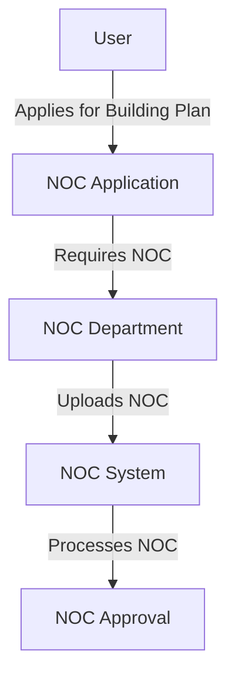

# Introduction to Noc Services

Noc services refer to the module used to apply for a No Objection Certificate (NOC) for approval by respective NOC users. For every building plan service applied, there is a need to get the No Objection Certificate from concerned departments. Based on the configuration for the NOCs, each application will have a set of required NOCs.

# User Interaction

There is a provision to allow the NOC department user to log in to the system and upload the required NOC. A user is provided to one NOC department, and based on the workflow mode (online/offline) of each NOC type, the NOC department user can perform actions.

# NOC Service Endpoints

The NOC services module provides endpoints to create and update NOC applications.

<SwmSnippet path="/municipal-services/noc-services/src/main/java/org/egov/noc/web/controller/NOCController.java" line="72">

---

## /v1/noc/\_create

The `/v1/noc/_create` endpoint allows users to create a new NOC application. The <SwmToken path="municipal-services/noc-services/src/main/java/org/egov/noc/web/controller/NOCController.java" pos="73:8:8" line-data="	public ResponseEntity&lt;NocResponse&gt; create(@Valid @RequestBody NocRequest nocRequest) {">`create`</SwmToken> method in <SwmToken path="municipal-services/noc-services/src/main/java/org/egov/noc/web/controller/NOCController.java" pos="64:4:4" line-data="public class NOCController {">`NOCController`</SwmToken> handles the request by calling the <SwmToken path="municipal-services/noc-services/src/main/java/org/egov/noc/web/controller/NOCController.java" pos="73:8:8" line-data="	public ResponseEntity&lt;NocResponse&gt; create(@Valid @RequestBody NocRequest nocRequest) {">`create`</SwmToken> method in <SwmToken path="municipal-services/noc-services/src/main/java/org/egov/noc/web/controller/NOCController.java" pos="74:10:10" line-data="		List&lt;Noc&gt; nocList = nocService.create(nocRequest);">`nocService`</SwmToken>, which processes the NOC request and saves it to the repository.

```java
	@PostMapping(value = "/_create")
	public ResponseEntity<NocResponse> create(@Valid @RequestBody NocRequest nocRequest) {
		List<Noc> nocList = nocService.create(nocRequest);
		NocResponse response = NocResponse.builder().noc(nocList)
				.responseInfo(responseInfoFactory.createResponseInfoFromRequestInfo(nocRequest.getRequestInfo(), true))
				.build();
		return new ResponseEntity<>(response, HttpStatus.OK);
	}
```

---

</SwmSnippet>

<SwmSnippet path="/municipal-services/noc-services/src/main/java/org/egov/noc/web/controller/NOCController.java" line="81">

---

## /v1/noc/\_update

The `/v1/noc/_update` endpoint allows users to update an existing NOC application. The <SwmToken path="municipal-services/noc-services/src/main/java/org/egov/noc/web/controller/NOCController.java" pos="82:8:8" line-data="	public ResponseEntity&lt;NocResponse&gt; update(@Valid @RequestBody NocRequest nocRequest) {">`update`</SwmToken> method in <SwmToken path="municipal-services/noc-services/src/main/java/org/egov/noc/web/controller/NOCController.java" pos="64:4:4" line-data="public class NOCController {">`NOCController`</SwmToken> handles the request by calling the <SwmToken path="municipal-services/noc-services/src/main/java/org/egov/noc/web/controller/NOCController.java" pos="82:8:8" line-data="	public ResponseEntity&lt;NocResponse&gt; update(@Valid @RequestBody NocRequest nocRequest) {">`update`</SwmToken> method in <SwmToken path="municipal-services/noc-services/src/main/java/org/egov/noc/web/controller/NOCController.java" pos="83:10:10" line-data="		List&lt;Noc&gt; nocList = nocService.update(nocRequest);">`nocService`</SwmToken>, which validates and updates the NOC request in the repository.

```java
	@PostMapping(value = "/_update")
	public ResponseEntity<NocResponse> update(@Valid @RequestBody NocRequest nocRequest) {
		List<Noc> nocList = nocService.update(nocRequest);
		NocResponse response = NocResponse.builder().noc(nocList)
				.responseInfo(responseInfoFactory.createResponseInfoFromRequestInfo(nocRequest.getRequestInfo(), true))
				.build();
		return new ResponseEntity<>(response, HttpStatus.OK);
```

---

</SwmSnippet>

&nbsp;

*This is an auto-generated document by Swimm AI 🌊 and has not yet been verified by a human*

<SwmMeta version="3.0.0" repo-id="Z2l0aHViJTNBJTNBRElHSVQtT1NTJTNBJTNBU3dpbW0tRGVtbw==" repo-name="DIGIT-OSS" doc-type="overview"><sup>Powered by [Swimm](/)</sup></SwmMeta>
