```mermaid
classDiagram
    class vehicleTrip {
        +String id
        +String tenantId
        +User tripOwner
        +User driver
        +Vehicle vehicle
        +String applicationNo
        +Status status
        +String BusinessService
        +String applicationStatus
        +Map additionalDetails
        +List tripDetails
        +Date tripStartTime
        +Date tripEndTime
        +Double volumeCarried
        +AuditDetails auditDetails
    }
    class VehicleTripRequest {
        +RequestInfo RequestInfo
        +List vehicleTrip
    }
    class VehicleTripRepository {
        +VehicleProducer producer
        +VehicleConfiguration config
        +JdbcTemplate JdbcTemplate
        +VehicleTripRowMapper mapper
        +TripDetailRowMapper detailMapper
        +VehicleTripQueryBuilder queryBuilder
    }
    class VehicleTripService {
        +VehicleTripRepository vehicleLogRepository
    }
    class VehicleTripController {
        +ResponseInfoFactory ResponseInfoFactory
        +VehicleUtil vehicleLogUtil
        +VehicleTripService VehicleTripService
    }
    VehicleTripRequest --> vehicleTrip
    VehicleTripRepository --> vehicleTrip
    VehicleTripService --> VehicleTripRepository
    VehicleTripController --> VehicleTripService

%% Swimm:
%% classDiagram
%%     class <SwmToken path="municipal-services/vehicle/src/main/java/org/egov/vehicle/trip/web/model/VehicleTripRequest.java" pos="35:7:7" line-data="	//	@JsonProperty(&quot;vehicleTrip&quot;)">`vehicleTrip`</SwmToken> {
%%         +String id
%%         +String <SwmToken path="municipal-services/vehicle/src/main/java/org/egov/vehicle/trip/service/VehicleTripService.java" pos="165:2:2" line-data="				.tenantId(criteria.getTenantId()).ids(ids).build();">`tenantId`</SwmToken>
%%         +User tripOwner
%%         +User driver
%%         +Vehicle vehicle
%%         +String applicationNo
%%         +Status status
%%         +String <SwmToken path="municipal-services/vehicle/src/main/java/org/egov/vehicle/trip/service/VehicleTripService.java" pos="19:16:16" line-data="import org.egov.vehicle.trip.web.model.workflow.BusinessService;">`BusinessService`</SwmToken>
%%         +String applicationStatus
%%         +Map additionalDetails
%%         +List <SwmToken path="municipal-services/vehicle/src/main/java/org/egov/vehicle/trip/repository/VehicleTripRepository.java" pos="90:6:6" line-data="		List&lt;VehicleTripDetail&gt; tripDetails = null;">`tripDetails`</SwmToken>
%%         +Date tripStartTime
%%         +Date tripEndTime
%%         +Double volumeCarried
%%         +AuditDetails auditDetails
%%     }
%%     class <SwmToken path="municipal-services/vehicle/src/main/java/org/egov/vehicle/trip/web/model/VehicleTripRequest.java" pos="27:4:4" line-data="public class VehicleTripRequest {">`VehicleTripRequest`</SwmToken> {
%%         +RequestInfo <SwmToken path="municipal-services/vehicle/src/main/java/org/egov/vehicle/trip/web/model/VehicleTripRequest.java" pos="30:5:5" line-data="	@JsonProperty(&quot;RequestInfo&quot;)">`RequestInfo`</SwmToken>
%%         +List <SwmToken path="municipal-services/vehicle/src/main/java/org/egov/vehicle/trip/web/model/VehicleTripRequest.java" pos="35:7:7" line-data="	//	@JsonProperty(&quot;vehicleTrip&quot;)">`vehicleTrip`</SwmToken>
%%     }
%%     class <SwmToken path="municipal-services/vehicle/src/main/java/org/egov/vehicle/trip/repository/VehicleTripRepository.java" pos="29:4:4" line-data="public class VehicleTripRepository {">`VehicleTripRepository`</SwmToken> {
%%         +VehicleProducer producer
%%         +VehicleConfiguration config
%%         +JdbcTemplate <SwmToken path="municipal-services/vehicle/src/main/java/org/egov/vehicle/trip/repository/VehicleTripRepository.java" pos="38:3:3" line-data="	private JdbcTemplate jdbcTemplate;">`JdbcTemplate`</SwmToken>
%%         +VehicleTripRowMapper mapper
%%         +TripDetailRowMapper <SwmToken path="municipal-services/vehicle/src/main/java/org/egov/vehicle/trip/repository/VehicleTripRepository.java" pos="43:5:5" line-data="	private TripDetailRowMapper detailMapper;">`detailMapper`</SwmToken>
%%         +VehicleTripQueryBuilder <SwmToken path="municipal-services/vehicle/src/main/java/org/egov/vehicle/trip/repository/VehicleTripRepository.java" pos="46:5:5" line-data="	private VehicleTripQueryBuilder queryBuilder;">`queryBuilder`</SwmToken>
%%     }
%%     class <SwmToken path="municipal-services/vehicle/src/main/java/org/egov/vehicle/trip/service/VehicleTripService.java" pos="31:4:4" line-data="public class VehicleTripService {">`VehicleTripService`</SwmToken> {
%%         +VehicleTripRepository <SwmToken path="municipal-services/vehicle/src/main/java/org/egov/vehicle/trip/service/VehicleTripService.java" pos="34:5:5" line-data="	private VehicleTripRepository vehicleLogRepository;">`vehicleLogRepository`</SwmToken>
%%     }
%%     class <SwmToken path="municipal-services/vehicle/src/main/java/org/egov/vehicle/trip/controller/VehicleTripController.java" pos="26:4:4" line-data="public class VehicleTripController {">`VehicleTripController`</SwmToken> {
%%         +ResponseInfoFactory <SwmToken path="municipal-services/vehicle/src/main/java/org/egov/vehicle/trip/controller/VehicleTripController.java" pos="29:3:3" line-data="	private ResponseInfoFactory responseInfoFactory;">`ResponseInfoFactory`</SwmToken>
%%         +VehicleUtil <SwmToken path="municipal-services/vehicle/src/main/java/org/egov/vehicle/trip/controller/VehicleTripController.java" pos="32:5:5" line-data="	private VehicleUtil vehicleLogUtil;">`vehicleLogUtil`</SwmToken>
%%         +VehicleTripService <SwmToken path="municipal-services/vehicle/src/main/java/org/egov/vehicle/trip/service/VehicleTripService.java" pos="31:4:4" line-data="public class VehicleTripService {">`VehicleTripService`</SwmToken>
%%     }
%%     <SwmToken path="municipal-services/vehicle/src/main/java/org/egov/vehicle/trip/web/model/VehicleTripRequest.java" pos="27:4:4" line-data="public class VehicleTripRequest {">`VehicleTripRequest`</SwmToken> --> <SwmToken path="municipal-services/vehicle/src/main/java/org/egov/vehicle/trip/web/model/VehicleTripRequest.java" pos="35:7:7" line-data="	//	@JsonProperty(&quot;vehicleTrip&quot;)">`vehicleTrip`</SwmToken>
%%     <SwmToken path="municipal-services/vehicle/src/main/java/org/egov/vehicle/trip/repository/VehicleTripRepository.java" pos="29:4:4" line-data="public class VehicleTripRepository {">`VehicleTripRepository`</SwmToken> --> <SwmToken path="municipal-services/vehicle/src/main/java/org/egov/vehicle/trip/web/model/VehicleTripRequest.java" pos="35:7:7" line-data="	//	@JsonProperty(&quot;vehicleTrip&quot;)">`vehicleTrip`</SwmToken>
%%     <SwmToken path="municipal-services/vehicle/src/main/java/org/egov/vehicle/trip/service/VehicleTripService.java" pos="31:4:4" line-data="public class VehicleTripService {">`VehicleTripService`</SwmToken> --> <SwmToken path="municipal-services/vehicle/src/main/java/org/egov/vehicle/trip/repository/VehicleTripRepository.java" pos="29:4:4" line-data="public class VehicleTripRepository {">`VehicleTripRepository`</SwmToken>
%%     <SwmToken path="municipal-services/vehicle/src/main/java/org/egov/vehicle/trip/controller/VehicleTripController.java" pos="26:4:4" line-data="public class VehicleTripController {">`VehicleTripController`</SwmToken> --> <SwmToken path="municipal-services/vehicle/src/main/java/org/egov/vehicle/trip/service/VehicleTripService.java" pos="31:4:4" line-data="public class VehicleTripService {">`VehicleTripService`</SwmToken>
```

# Introduction to Vehicle Trip

The <SwmToken path="municipal-services/vehicle/src/main/java/org/egov/vehicle/trip/web/model/VehicleTripRequest.java" pos="35:7:7" line-data="	//	@JsonProperty(&quot;vehicleTrip&quot;)">`vehicleTrip`</SwmToken> class represents a trip made by a vehicle. It includes various attributes such as the trip owner, driver, vehicle, and trip details. This class is fundamental in managing and processing vehicle trip data across different components of the system.

## <SwmToken path="municipal-services/vehicle/src/main/java/org/egov/vehicle/trip/web/model/VehicleTripRequest.java" pos="35:7:7" line-data="	//	@JsonProperty(&quot;vehicleTrip&quot;)">`vehicleTrip`</SwmToken> Class

The <SwmToken path="municipal-services/vehicle/src/main/java/org/egov/vehicle/trip/web/model/VehicleTripRequest.java" pos="35:7:7" line-data="	//	@JsonProperty(&quot;vehicleTrip&quot;)">`vehicleTrip`</SwmToken> class defines the structure of a trip, including fields like <SwmToken path="municipal-services/vehicle/src/main/java/org/egov/vehicle/trip/repository/VehicleTripRepository.java" pos="120:10:10" line-data="		return jdbcTemplate.query(&quot;SELECT id from eg_vehicle_trip ORDER BY createdtime offset &quot; + &quot; ? &quot; + &quot;limit ? &quot;,">`id`</SwmToken>, <SwmToken path="municipal-services/vehicle/src/main/java/org/egov/vehicle/trip/service/VehicleTripService.java" pos="165:2:2" line-data="				.tenantId(criteria.getTenantId()).ids(ids).build();">`tenantId`</SwmToken>, `tripOwner`, `driver`, <SwmToken path="municipal-services/vehicle/src/main/java/org/egov/vehicle/trip/service/VehicleTripService.java" pos="14:6:6" line-data="import org.egov.vehicle.trip.validator.VehicleTripValidator;">`vehicle`</SwmToken>, `applicationNo`, `status`, <SwmToken path="municipal-services/vehicle/src/main/java/org/egov/vehicle/trip/service/VehicleTripService.java" pos="19:16:16" line-data="import org.egov.vehicle.trip.web.model.workflow.BusinessService;">`BusinessService`</SwmToken>, `applicationStatus`, `additionalDetails`, <SwmToken path="municipal-services/vehicle/src/main/java/org/egov/vehicle/trip/repository/VehicleTripRepository.java" pos="90:6:6" line-data="		List&lt;VehicleTripDetail&gt; tripDetails = null;">`tripDetails`</SwmToken>, `tripStartTime`, `tripEndTime`, `volumeCarried`, and `auditDetails`. The `status` field is an enum that can be either `ACTIVE` or `INACTIVE`, indicating the current state of the trip. The <SwmToken path="municipal-services/vehicle/src/main/java/org/egov/vehicle/trip/repository/VehicleTripRepository.java" pos="90:6:6" line-data="		List&lt;VehicleTripDetail&gt; tripDetails = null;">`tripDetails`</SwmToken> field is a list of <SwmToken path="municipal-services/vehicle/src/main/java/org/egov/vehicle/trip/repository/VehicleTripRepository.java" pos="16:14:14" line-data="import org.egov.vehicle.trip.web.model.VehicleTripDetail;">`VehicleTripDetail`</SwmToken> objects, which provide more granular details about the trip.

## <SwmToken path="municipal-services/vehicle/src/main/java/org/egov/vehicle/trip/web/model/VehicleTripRequest.java" pos="27:4:4" line-data="public class VehicleTripRequest {">`VehicleTripRequest`</SwmToken> Class

The <SwmToken path="municipal-services/vehicle/src/main/java/org/egov/vehicle/trip/web/model/VehicleTripRequest.java" pos="27:4:4" line-data="public class VehicleTripRequest {">`VehicleTripRequest`</SwmToken> class is used to encapsulate the request data for creating or updating a vehicle trip. It includes a list of <SwmToken path="municipal-services/vehicle/src/main/java/org/egov/vehicle/trip/web/model/VehicleTripRequest.java" pos="35:7:7" line-data="	//	@JsonProperty(&quot;vehicleTrip&quot;)">`vehicleTrip`</SwmToken> objects and other relevant information like <SwmToken path="municipal-services/vehicle/src/main/java/org/egov/vehicle/trip/web/model/VehicleTripRequest.java" pos="30:5:5" line-data="	@JsonProperty(&quot;RequestInfo&quot;)">`RequestInfo`</SwmToken> and <SwmToken path="municipal-services/vehicle/src/main/java/org/egov/vehicle/trip/service/VehicleTripService.java" pos="19:14:14" line-data="import org.egov.vehicle.trip.web.model.workflow.BusinessService;">`workflow`</SwmToken>.

<SwmSnippet path="/municipal-services/vehicle/src/main/java/org/egov/vehicle/trip/web/model/VehicleTripRequest.java" line="24">

---

The <SwmToken path="municipal-services/vehicle/src/main/java/org/egov/vehicle/trip/web/model/VehicleTripRequest.java" pos="27:4:4" line-data="public class VehicleTripRequest {">`VehicleTripRequest`</SwmToken> class is annotated with <SwmToken path="municipal-services/vehicle/src/main/java/org/egov/vehicle/trip/web/model/VehicleTripRequest.java" pos="24:0:1" line-data="@Builder">`@Builder`</SwmToken>, <SwmToken path="municipal-services/vehicle/src/main/java/org/egov/vehicle/trip/web/model/VehicleTripRequest.java" pos="25:0:1" line-data="@Getter">`@Getter`</SwmToken>, and <SwmToken path="municipal-services/vehicle/src/main/java/org/egov/vehicle/trip/web/model/VehicleTripRequest.java" pos="26:0:1" line-data="@Setter">`@Setter`</SwmToken>. It includes fields such as <SwmToken path="municipal-services/vehicle/src/main/java/org/egov/vehicle/trip/web/model/VehicleTripRequest.java" pos="30:5:5" line-data="	@JsonProperty(&quot;RequestInfo&quot;)">`RequestInfo`</SwmToken> and a list of <SwmToken path="municipal-services/vehicle/src/main/java/org/egov/vehicle/trip/web/model/VehicleTripRequest.java" pos="35:7:7" line-data="	//	@JsonProperty(&quot;vehicleTrip&quot;)">`vehicleTrip`</SwmToken> objects.

```java
@Builder
@Getter
@Setter
public class VehicleTripRequest {

	@NotNull
	@JsonProperty("RequestInfo")
	private RequestInfo requestInfo;
	
	//	@NotNull
	//	@Valid
	//	@JsonProperty("vehicleTrip")
	//	private VehicleTrip vehicleTrip;
	
	@NotNull
	@NotEmpty
	@Valid
	@JsonProperty("vehicleTrip")
	private List<VehicleTrip> vehicleTrip;
```

---

</SwmSnippet>

## <SwmToken path="municipal-services/vehicle/src/main/java/org/egov/vehicle/trip/web/model/VehicleTripRequest.java" pos="35:7:7" line-data="	//	@JsonProperty(&quot;vehicleTrip&quot;)">`vehicleTrip`</SwmToken> in Repository

The <SwmToken path="municipal-services/vehicle/src/main/java/org/egov/vehicle/trip/repository/VehicleTripRepository.java" pos="29:4:4" line-data="public class VehicleTripRepository {">`VehicleTripRepository`</SwmToken> class handles the persistence of <SwmToken path="municipal-services/vehicle/src/main/java/org/egov/vehicle/trip/web/model/VehicleTripRequest.java" pos="35:7:7" line-data="	//	@JsonProperty(&quot;vehicleTrip&quot;)">`vehicleTrip`</SwmToken> objects. It includes methods for saving, updating, and retrieving trip data from the database.

<SwmSnippet path="/municipal-services/vehicle/src/main/java/org/egov/vehicle/trip/repository/VehicleTripRepository.java" line="27">

---

The <SwmToken path="municipal-services/vehicle/src/main/java/org/egov/vehicle/trip/repository/VehicleTripRepository.java" pos="29:4:4" line-data="public class VehicleTripRepository {">`VehicleTripRepository`</SwmToken> class is annotated with <SwmToken path="municipal-services/vehicle/src/main/java/org/egov/vehicle/trip/repository/VehicleTripRepository.java" pos="27:0:1" line-data="@Repository">`@Repository`</SwmToken> and <SwmToken path="municipal-services/vehicle/src/main/java/org/egov/vehicle/trip/repository/VehicleTripRepository.java" pos="28:0:1" line-data="@Slf4j">`@Slf4j`</SwmToken>. It includes dependencies such as <SwmToken path="municipal-services/vehicle/src/main/java/org/egov/vehicle/trip/repository/VehicleTripRepository.java" pos="32:3:3" line-data="	private VehicleProducer producer;">`VehicleProducer`</SwmToken>, <SwmToken path="municipal-services/vehicle/src/main/java/org/egov/vehicle/trip/repository/VehicleTripRepository.java" pos="35:3:3" line-data="	private VehicleConfiguration config;">`VehicleConfiguration`</SwmToken>, <SwmToken path="municipal-services/vehicle/src/main/java/org/egov/vehicle/trip/repository/VehicleTripRepository.java" pos="38:3:3" line-data="	private JdbcTemplate jdbcTemplate;">`JdbcTemplate`</SwmToken>, <SwmToken path="municipal-services/vehicle/src/main/java/org/egov/vehicle/trip/repository/VehicleTripRepository.java" pos="40:3:3" line-data="	private VehicleTripRowMapper mapper;">`VehicleTripRowMapper`</SwmToken>, <SwmToken path="municipal-services/vehicle/src/main/java/org/egov/vehicle/trip/repository/VehicleTripRepository.java" pos="43:3:3" line-data="	private TripDetailRowMapper detailMapper;">`TripDetailRowMapper`</SwmToken>, and <SwmToken path="municipal-services/vehicle/src/main/java/org/egov/vehicle/trip/repository/VehicleTripRepository.java" pos="46:3:3" line-data="	private VehicleTripQueryBuilder queryBuilder;">`VehicleTripQueryBuilder`</SwmToken>.

```java
@Repository
@Slf4j
public class VehicleTripRepository {

	@Autowired
	private VehicleProducer producer;

	@Autowired
	private VehicleConfiguration config;

	@Autowired
	private JdbcTemplate jdbcTemplate;
	@Autowired
	private VehicleTripRowMapper mapper;

	@Autowired
	private TripDetailRowMapper detailMapper;

	@Autowired
	private VehicleTripQueryBuilder queryBuilder;
```

---

</SwmSnippet>

## <SwmToken path="municipal-services/vehicle/src/main/java/org/egov/vehicle/trip/web/model/VehicleTripRequest.java" pos="35:7:7" line-data="	//	@JsonProperty(&quot;vehicleTrip&quot;)">`vehicleTrip`</SwmToken> in Service

The <SwmToken path="municipal-services/vehicle/src/main/java/org/egov/vehicle/trip/service/VehicleTripService.java" pos="31:4:4" line-data="public class VehicleTripService {">`VehicleTripService`</SwmToken> class provides business logic for managing vehicle trips. It includes methods for creating, updating, and searching for trips.

<SwmSnippet path="/municipal-services/vehicle/src/main/java/org/egov/vehicle/trip/service/VehicleTripService.java" line="14">

---

The <SwmToken path="municipal-services/vehicle/src/main/java/org/egov/vehicle/trip/service/VehicleTripService.java" pos="31:4:4" line-data="public class VehicleTripService {">`VehicleTripService`</SwmToken> class is annotated with <SwmToken path="municipal-services/vehicle/src/main/java/org/egov/vehicle/trip/service/VehicleTripService.java" pos="29:0:1" line-data="@Service">`@Service`</SwmToken> and <SwmToken path="municipal-services/vehicle/src/main/java/org/egov/vehicle/trip/service/VehicleTripService.java" pos="30:0:1" line-data="@Slf4j">`@Slf4j`</SwmToken>. It includes dependencies such as <SwmToken path="municipal-services/vehicle/src/main/java/org/egov/vehicle/trip/service/VehicleTripService.java" pos="34:3:3" line-data="	private VehicleTripRepository vehicleLogRepository;">`VehicleTripRepository`</SwmToken>.

```java
import org.egov.vehicle.trip.validator.VehicleTripValidator;
import org.egov.vehicle.trip.web.model.VehicleTrip;
import org.egov.vehicle.trip.web.model.VehicleTripRequest;
import org.egov.vehicle.trip.web.model.VehicleTripResponse;
import org.egov.vehicle.trip.web.model.VehicleTripSearchCriteria;
import org.egov.vehicle.trip.web.model.workflow.BusinessService;
import org.egov.vehicle.trip.workflow.ActionValidator;
import org.egov.vehicle.trip.workflow.WorkflowIntegrator;
import org.egov.vehicle.trip.workflow.WorkflowService;
import org.springframework.beans.factory.annotation.Autowired;
import org.springframework.stereotype.Service;
import org.springframework.util.CollectionUtils;

import lombok.extern.slf4j.Slf4j;

@Service
@Slf4j
public class VehicleTripService {

	@Autowired
	private VehicleTripRepository vehicleLogRepository;
```

---

</SwmSnippet>

## <SwmToken path="municipal-services/vehicle/src/main/java/org/egov/vehicle/trip/web/model/VehicleTripRequest.java" pos="35:7:7" line-data="	//	@JsonProperty(&quot;vehicleTrip&quot;)">`vehicleTrip`</SwmToken> in Controller

The <SwmToken path="municipal-services/vehicle/src/main/java/org/egov/vehicle/trip/controller/VehicleTripController.java" pos="26:4:4" line-data="public class VehicleTripController {">`VehicleTripController`</SwmToken> class exposes REST endpoints for creating, updating, and searching vehicle trips. It interacts with the <SwmToken path="municipal-services/vehicle/src/main/java/org/egov/vehicle/trip/service/VehicleTripService.java" pos="31:4:4" line-data="public class VehicleTripService {">`VehicleTripService`</SwmToken> to process incoming requests.

<SwmSnippet path="/municipal-services/vehicle/src/main/java/org/egov/vehicle/trip/controller/VehicleTripController.java" line="24">

---

The <SwmToken path="municipal-services/vehicle/src/main/java/org/egov/vehicle/trip/controller/VehicleTripController.java" pos="26:4:4" line-data="public class VehicleTripController {">`VehicleTripController`</SwmToken> class is annotated with <SwmToken path="municipal-services/vehicle/src/main/java/org/egov/vehicle/trip/controller/VehicleTripController.java" pos="24:0:1" line-data="@RestController">`@RestController`</SwmToken> and <SwmToken path="municipal-services/vehicle/src/main/java/org/egov/vehicle/trip/controller/VehicleTripController.java" pos="25:0:9" line-data="@RequestMapping(&quot;/trip/v1&quot;)">`@RequestMapping("/trip/v1")`</SwmToken>. It includes methods for creating and searching vehicle trips.

```java
@RestController
@RequestMapping("/trip/v1")
public class VehicleTripController {

	@Autowired
	private ResponseInfoFactory responseInfoFactory;

	@Autowired
	private VehicleUtil vehicleLogUtil;

	@Autowired
	private VehicleTripService vehicleTripService;

	@PostMapping(value = "/_create")
	public ResponseEntity<VehicleTripResponse> create(@Valid @RequestBody VehicleTripRequest request) {

		vehicleLogUtil.defaultJsonPathConfig();
		List<VehicleTrip> vehicleLog = vehicleTripService.create(request);
		VehicleTripResponse response = VehicleTripResponse.builder().vehicleTrip(vehicleLog)
				.responseInfo(responseInfoFactory.createResponseInfoFromRequestInfo(request.getRequestInfo(), true))
				.build();
```

---

</SwmSnippet>

## Trip Endpoints

The <SwmToken path="municipal-services/vehicle/src/main/java/org/egov/vehicle/trip/controller/VehicleTripController.java" pos="26:4:4" line-data="public class VehicleTripController {">`VehicleTripController`</SwmToken> class provides endpoints for creating and searching vehicle trips.

### /trip/v1/\_create

The `/trip/v1/_create` endpoint is used to create a new vehicle trip. It accepts a <SwmToken path="municipal-services/vehicle/src/main/java/org/egov/vehicle/trip/web/model/VehicleTripRequest.java" pos="27:4:4" line-data="public class VehicleTripRequest {">`VehicleTripRequest`</SwmToken> object in the request body, processes it using the <SwmToken path="municipal-services/vehicle/src/main/java/org/egov/vehicle/trip/controller/VehicleTripController.java" pos="41:10:12" line-data="		List&lt;VehicleTrip&gt; vehicleLog = vehicleTripService.create(request);">`vehicleTripService.create`</SwmToken> method, and returns a <SwmToken path="municipal-services/vehicle/src/main/java/org/egov/vehicle/trip/service/VehicleTripService.java" pos="17:14:14" line-data="import org.egov.vehicle.trip.web.model.VehicleTripResponse;">`VehicleTripResponse`</SwmToken> object containing the created trip details.

<SwmSnippet path="/municipal-services/vehicle/src/main/java/org/egov/vehicle/trip/controller/VehicleTripController.java" line="37">

---

The `/trip/v1/_create` endpoint in the <SwmToken path="municipal-services/vehicle/src/main/java/org/egov/vehicle/trip/controller/VehicleTripController.java" pos="26:4:4" line-data="public class VehicleTripController {">`VehicleTripController`</SwmToken> class processes the creation of a new vehicle trip.

```java
	@PostMapping(value = "/_create")
	public ResponseEntity<VehicleTripResponse> create(@Valid @RequestBody VehicleTripRequest request) {

		vehicleLogUtil.defaultJsonPathConfig();
		List<VehicleTrip> vehicleLog = vehicleTripService.create(request);
		VehicleTripResponse response = VehicleTripResponse.builder().vehicleTrip(vehicleLog)
				.responseInfo(responseInfoFactory.createResponseInfoFromRequestInfo(request.getRequestInfo(), true))
				.build();
		return new ResponseEntity<>(response, HttpStatus.OK);
```

---

</SwmSnippet>

### /trip/v1/\_search

The `/trip/v1/_search` endpoint is used to search for vehicle trips based on specific criteria. It accepts a <SwmToken path="municipal-services/vehicle/src/main/java/org/egov/vehicle/trip/controller/VehicleTripController.java" pos="61:16:16" line-data="	public ResponseEntity&lt;VehicleTripResponse&gt; search(@Valid @RequestBody RequestInfoWrapper requestInfoWrapper,">`RequestInfoWrapper`</SwmToken> and <SwmToken path="municipal-services/vehicle/src/main/java/org/egov/vehicle/trip/service/VehicleTripService.java" pos="18:14:14" line-data="import org.egov.vehicle.trip.web.model.VehicleTripSearchCriteria;">`VehicleTripSearchCriteria`</SwmToken> as input, processes the search using the <SwmToken path="municipal-services/vehicle/src/main/java/org/egov/vehicle/trip/controller/VehicleTripController.java" pos="64:7:9" line-data="		VehicleTripResponse response = vehicleTripService.search(criteria, requestInfoWrapper.getRequestInfo());">`vehicleTripService.search`</SwmToken> method, and returns a <SwmToken path="municipal-services/vehicle/src/main/java/org/egov/vehicle/trip/service/VehicleTripService.java" pos="17:14:14" line-data="import org.egov.vehicle.trip.web.model.VehicleTripResponse;">`VehicleTripResponse`</SwmToken> object containing the search results.

<SwmSnippet path="/municipal-services/vehicle/src/main/java/org/egov/vehicle/trip/controller/VehicleTripController.java" line="60">

---

The `/trip/v1/_search` endpoint in the <SwmToken path="municipal-services/vehicle/src/main/java/org/egov/vehicle/trip/controller/VehicleTripController.java" pos="26:4:4" line-data="public class VehicleTripController {">`VehicleTripController`</SwmToken> class processes the search for vehicle trips based on specific criteria.

```java
	@PostMapping(value = "/_search")
	public ResponseEntity<VehicleTripResponse> search(@Valid @RequestBody RequestInfoWrapper requestInfoWrapper,
			@Valid @ModelAttribute VehicleTripSearchCriteria criteria) {

		VehicleTripResponse response = vehicleTripService.search(criteria, requestInfoWrapper.getRequestInfo());

		response.setResponseInfo(
				responseInfoFactory.createResponseInfoFromRequestInfo(requestInfoWrapper.getRequestInfo(), true));
		return new ResponseEntity<>(response, HttpStatus.OK);
	}
```

---

</SwmSnippet>

&nbsp;

*This is an auto-generated document by Swimm AI 🌊 and has not yet been verified by a human*

<SwmMeta version="3.0.0" repo-id="Z2l0aHViJTNBJTNBRElHSVQtT1NTJTNBJTNBU3dpbW0tRGVtbw==" repo-name="DIGIT-OSS" doc-type="overview"><sup>Powered by [Swimm](/)</sup></SwmMeta>
