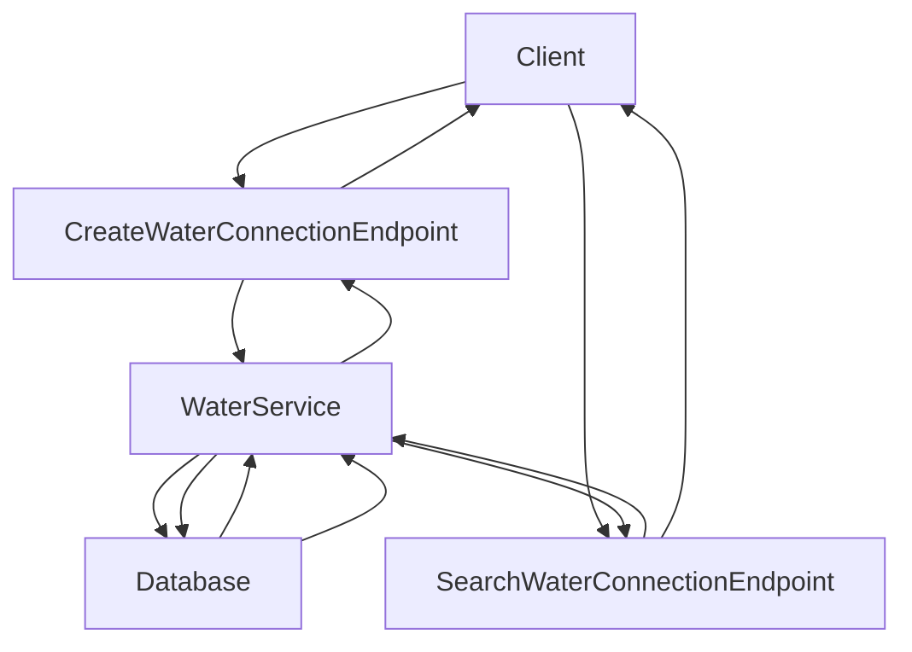

# Introduction to Web Models

Web models refer to the components and data structures used in web interactions within the water connection services. These models define the structure and behavior of data, ensuring proper handling and serialization.

## Web Components

The web components include various models such as `BusinessService`, `Document`, `Locality`, `Connection`, and `Unit`. These models are annotated with JSON properties and validation constraints to ensure proper data handling and serialization.

<SwmSnippet path="/municipal-services/ws-services/src/main/java/org/egov/waterconnection/web/models/EventRequest.java" line="35">

---

The `BusinessService` model includes properties like `tenantId`, `uuid`, `businessService`, and URIs for GET and POST requests, which are essential for workflow management.

```java
 *         with regards to rights under trademark law for use of the trade names
```

---

</SwmSnippet>

## Data Handling and Serialization

These models are annotated with JSON properties and validation constraints to ensure proper data handling and serialization.

## Example Models

For example, the `BusinessService` model includes properties like `tenantId`, `uuid`, `businessService`, and URIs for GET and POST requests, which are essential for workflow management. Similarly, the `Document` model defines attributes like `id`, `documentType`, `fileStoreId`, and `auditDetails` to manage document-related data.

## Water Connection APIs

The Water Connection APIs provide endpoints for creating and searching water connections.

### /wc/\_create

The `/wc/_create` endpoint is used to create a new water connection. It accepts a POST request with a <SwmToken path="municipal-services/ws-services/src/main/java/org/egov/waterconnection/web/controller/WaterController.java" pos="47:7:7" line-data="			@Valid @RequestBody WaterConnectionRequest waterConnectionRequest) {">`WaterConnectionRequest`</SwmToken> payload, processes the request by calling the <SwmToken path="municipal-services/ws-services/src/main/java/org/egov/waterconnection/web/controller/WaterController.java" pos="46:8:8" line-data="	public ResponseEntity&lt;WaterConnectionResponse&gt; createWaterConnection(">`createWaterConnection`</SwmToken> method of the <SwmToken path="municipal-services/ws-services/src/main/java/org/egov/waterconnection/web/controller/WaterController.java" pos="49:10:10" line-data="		List&lt;WaterConnection&gt; waterConnection = waterService.createWaterConnection(waterConnectionRequest);">`waterService`</SwmToken>, and returns a <SwmToken path="municipal-services/ws-services/src/main/java/org/egov/waterconnection/web/controller/WaterController.java" pos="46:5:5" line-data="	public ResponseEntity&lt;WaterConnectionResponse&gt; createWaterConnection(">`WaterConnectionResponse`</SwmToken> with the created water connection details.

<SwmSnippet path="/municipal-services/ws-services/src/main/java/org/egov/waterconnection/web/controller/WaterController.java" line="45">

---

The <SwmToken path="municipal-services/ws-services/src/main/java/org/egov/waterconnection/web/controller/WaterController.java" pos="46:8:8" line-data="	public ResponseEntity&lt;WaterConnectionResponse&gt; createWaterConnection(">`createWaterConnection`</SwmToken> method in the <SwmToken path="municipal-services/ws-services/src/main/java/org/egov/waterconnection/web/controller/WaterController.java" pos="34:4:4" line-data="public class WaterController {">`WaterController`</SwmToken> handles the creation of a new water connection.

```java
	@RequestMapping(value = "/_create", method = RequestMethod.POST, produces = "application/json")
	public ResponseEntity<WaterConnectionResponse> createWaterConnection(
			@Valid @RequestBody WaterConnectionRequest waterConnectionRequest) {
		waterConnectionRequest.setCreateCall(true);
		List<WaterConnection> waterConnection = waterService.createWaterConnection(waterConnectionRequest);
		WaterConnectionResponse response = WaterConnectionResponse.builder().waterConnection(waterConnection)
				.responseInfo(responseInfoFactory
						.createResponseInfoFromRequestInfo(waterConnectionRequest.getRequestInfo(), true))
				.build();
		return new ResponseEntity<>(response, HttpStatus.OK);
	}
```

---

</SwmSnippet>

### /wc/\_search

The `/wc/_search` endpoint is used to search for existing water connections based on specified criteria. It accepts a POST request with a <SwmToken path="municipal-services/ws-services/src/main/java/org/egov/waterconnection/web/controller/WaterController.java" pos="58:16:16" line-data="	public ResponseEntity&lt;WaterConnectionResponse&gt; search(@Valid @RequestBody RequestInfoWrapper requestInfoWrapper,">`RequestInfoWrapper`</SwmToken> and <SwmToken path="municipal-services/ws-services/src/main/java/org/egov/waterconnection/web/controller/WaterController.java" pos="59:7:7" line-data="			@Valid @ModelAttribute SearchCriteria criteria) {">`SearchCriteria`</SwmToken> payload, processes the request by calling the <SwmToken path="municipal-services/ws-services/src/main/java/org/egov/waterconnection/web/controller/WaterController.java" pos="58:8:8" line-data="	public ResponseEntity&lt;WaterConnectionResponse&gt; search(@Valid @RequestBody RequestInfoWrapper requestInfoWrapper,">`search`</SwmToken> method of the <SwmToken path="municipal-services/ws-services/src/main/java/org/egov/waterconnection/web/controller/WaterController.java" pos="49:10:10" line-data="		List&lt;WaterConnection&gt; waterConnection = waterService.createWaterConnection(waterConnectionRequest);">`waterService`</SwmToken>, and returns a <SwmToken path="municipal-services/ws-services/src/main/java/org/egov/waterconnection/web/controller/WaterController.java" pos="46:5:5" line-data="	public ResponseEntity&lt;WaterConnectionResponse&gt; createWaterConnection(">`WaterConnectionResponse`</SwmToken> with the list of matching water connections and the total count.

<SwmSnippet path="/municipal-services/ws-services/src/main/java/org/egov/waterconnection/web/controller/WaterController.java" line="57">

---

The <SwmToken path="municipal-services/ws-services/src/main/java/org/egov/waterconnection/web/controller/WaterController.java" pos="58:8:8" line-data="	public ResponseEntity&lt;WaterConnectionResponse&gt; search(@Valid @RequestBody RequestInfoWrapper requestInfoWrapper,">`search`</SwmToken> method in the <SwmToken path="municipal-services/ws-services/src/main/java/org/egov/waterconnection/web/controller/WaterController.java" pos="34:4:4" line-data="public class WaterController {">`WaterController`</SwmToken> handles the search for existing water connections.

```java
	@RequestMapping(value = "/_search", method = RequestMethod.POST)
	public ResponseEntity<WaterConnectionResponse> search(@Valid @RequestBody RequestInfoWrapper requestInfoWrapper,
			@Valid @ModelAttribute SearchCriteria criteria) {
		List<WaterConnection> waterConnectionList = waterService.search(criteria, requestInfoWrapper.getRequestInfo());
		Integer count = waterService.countAllWaterApplications(criteria, requestInfoWrapper.getRequestInfo());
		WaterConnectionResponse response = WaterConnectionResponse.builder().waterConnection(waterConnectionList)
				.totalCount(count)
				.responseInfo(responseInfoFactory.createResponseInfoFromRequestInfo(requestInfoWrapper.getRequestInfo(),
						true))
				.build();
		return new ResponseEntity<>(response, HttpStatus.OK);
	}
```

---

</SwmSnippet>

&nbsp;

*This is an auto-generated document by Swimm AI 🌊 and has not yet been verified by a human*

<SwmMeta version="3.0.0" repo-id="Z2l0aHViJTNBJTNBRElHSVQtT1NTJTNBJTNBU3dpbW0tRGVtbw==" repo-name="DIGIT-OSS" doc-type="overview"><sup>Powered by [Swimm](/)</sup></SwmMeta>
