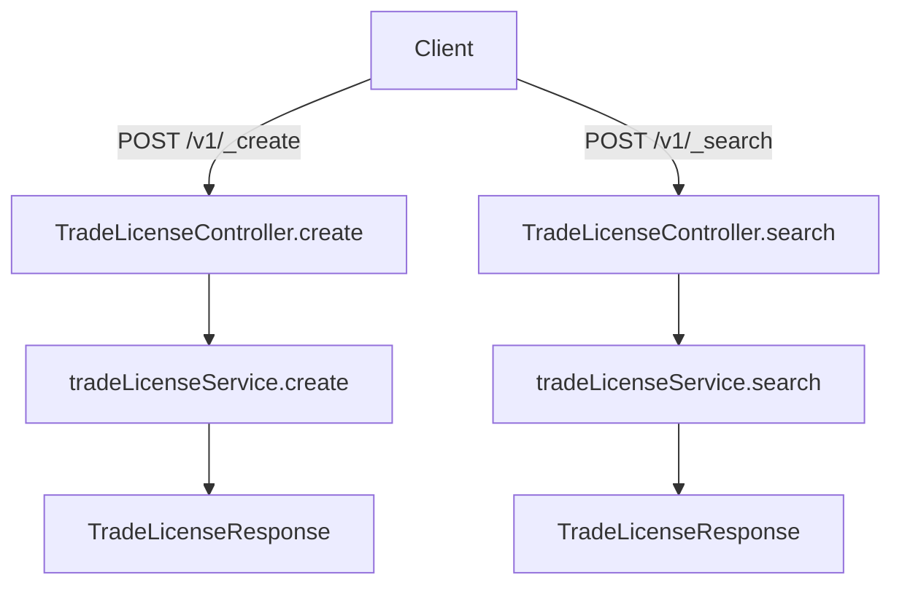

# Introduction to Web Models

Web models are essential components in the Trade License (Tl) services, defining the structure and properties of data used in web transactions. These models ensure that data is correctly structured and validated for web-based requests and responses.

## User Model

The <SwmToken path="municipal-services/tl-services/src/main/java/org/egov/tl/web/models/uservevents/Status.java" pos="34:24:24" line-data=" *      3) This license does not grant any rights to any user of the program">`user`</SwmToken> model encapsulates user-related information such as ID, username, password, contact details, and roles. This model is crucial for managing user data and authentication in web interactions.

## BusinessService Model

The `BusinessService` model holds details about business services, including tenant ID, UUID, service URIs, and states. This model is used to manage and track various business services within the application.

<SwmSnippet path="/municipal-services/tl-services/src/main/java/org/egov/tl/web/models/uservevents/Status.java" line="35">

---

The `BusinessService` model is defined in the <SwmToken path="municipal-services/tl-services/src/main/java/org/egov/tl/web/models/uservevents/Status.java" pos="46:4:4" line-data="public enum Status {">`Status`</SwmToken> class, which manages the status of business services.

```java
 *         with regards to rights under trademark law for use of the trade names
```

---

</SwmSnippet>

<SwmSnippet path="/municipal-services/tl-services/src/main/java/org/egov/tl/web/models/EventRequest.java" line="35">

---

The `Source` enum is defined in the <SwmToken path="municipal-services/tl-services/src/main/java/org/egov/tl/web/models/EventRequest.java" pos="65:4:4" line-data="public class EventRequest {">`EventRequest`</SwmToken> class, which handles different types of requests.

```java
 *         with regards to rights under trademark law for use of the trade names
```

---

</SwmSnippet>

## BillDetail Model

The `BillDetail` model is used to define the structure and properties of billing details in web transactions. This model ensures that billing information is accurately captured and processed.

## Status Model

The <SwmToken path="municipal-services/tl-services/src/main/java/org/egov/tl/web/models/uservevents/Status.java" pos="46:4:4" line-data="public enum Status {">`Status`</SwmToken> model represents the status of various entities in web interactions, ensuring proper tracking and management. This model is essential for monitoring the state of different processes and entities.

<SwmSnippet path="/municipal-services/tl-services/src/main/java/org/egov/tl/web/models/Status.java" line="35">

---

The <SwmToken path="municipal-services/tl-services/src/main/java/org/egov/tl/web/models/uservevents/Status.java" pos="46:4:4" line-data="public enum Status {">`Status`</SwmToken> model is defined in the <SwmToken path="municipal-services/tl-services/src/main/java/org/egov/tl/web/models/uservevents/Status.java" pos="46:4:4" line-data="public enum Status {">`Status`</SwmToken> class, which manages the status of different entities.

```java
 *         with regards to rights under trademark law for use of the trade names
```

---

</SwmSnippet>

### /v1/\_create

The `/v1/_create` endpoint is used to create a new trade license. It accepts a POST request with a <SwmToken path="municipal-services/tl-services/src/main/java/org/egov/tl/web/controllers/TradeLicenseController.java" pos="60:16:16" line-data="    public ResponseEntity&lt;TradeLicenseResponse&gt; create(@Valid @RequestBody TradeLicenseRequest tradeLicenseRequest,">`TradeLicenseRequest`</SwmToken> body and optionally a <SwmToken path="municipal-services/tl-services/src/main/java/org/egov/tl/web/controllers/TradeLicenseController.java" pos="59:8:8" line-data="    @PostMapping({&quot;/{servicename}/_create&quot;, &quot;/_create&quot;})">`servicename`</SwmToken> path variable. The request is processed by the <SwmToken path="municipal-services/tl-services/src/main/java/org/egov/tl/web/controllers/TradeLicenseController.java" pos="60:8:8" line-data="    public ResponseEntity&lt;TradeLicenseResponse&gt; create(@Valid @RequestBody TradeLicenseRequest tradeLicenseRequest,">`create`</SwmToken> method in the <SwmToken path="municipal-services/tl-services/src/main/java/org/egov/tl/web/controllers/TradeLicenseController.java" pos="31:5:5" line-data="    public class TradeLicenseController {">`TradeLicenseController`</SwmToken> class, which calls the <SwmToken path="municipal-services/tl-services/src/main/java/org/egov/tl/web/controllers/TradeLicenseController.java" pos="62:10:12" line-data="        List&lt;TradeLicense&gt; licenses = tradeLicenseService.create(tradeLicenseRequest, servicename);">`tradeLicenseService.create`</SwmToken> method to handle the business logic. The response is a <SwmToken path="municipal-services/tl-services/src/main/java/org/egov/tl/web/controllers/TradeLicenseController.java" pos="60:5:5" line-data="    public ResponseEntity&lt;TradeLicenseResponse&gt; create(@Valid @RequestBody TradeLicenseRequest tradeLicenseRequest,">`TradeLicenseResponse`</SwmToken> object containing the created licenses and response information.

<SwmSnippet path="/municipal-services/tl-services/src/main/java/org/egov/tl/web/controllers/TradeLicenseController.java" line="59">

---

The <SwmToken path="municipal-services/tl-services/src/main/java/org/egov/tl/web/controllers/TradeLicenseController.java" pos="60:8:8" line-data="    public ResponseEntity&lt;TradeLicenseResponse&gt; create(@Valid @RequestBody TradeLicenseRequest tradeLicenseRequest,">`create`</SwmToken> method in the <SwmToken path="municipal-services/tl-services/src/main/java/org/egov/tl/web/controllers/TradeLicenseController.java" pos="31:5:5" line-data="    public class TradeLicenseController {">`TradeLicenseController`</SwmToken> class handles the creation of new trade licenses.

```java
    @PostMapping({"/{servicename}/_create", "/_create"})
    public ResponseEntity<TradeLicenseResponse> create(@Valid @RequestBody TradeLicenseRequest tradeLicenseRequest,
                                                       @PathVariable(required = false) String servicename) {
        List<TradeLicense> licenses = tradeLicenseService.create(tradeLicenseRequest, servicename);
        TradeLicenseResponse response = TradeLicenseResponse.builder().licenses(licenses).responseInfo(
                responseInfoFactory.createResponseInfoFromRequestInfo(tradeLicenseRequest.getRequestInfo(), true))
                .build();
        return new ResponseEntity<>(response, HttpStatus.OK);
    }
```

---

</SwmSnippet>

<SwmSnippet path="/municipal-services/tl-services/src/main/java/org/egov/tl/web/controllers/TradeLicenseController.java" line="69">

---

The <SwmToken path="municipal-services/tl-services/src/main/java/org/egov/tl/web/controllers/TradeLicenseController.java" pos="70:8:8" line-data="    public ResponseEntity&lt;TradeLicenseResponse&gt; search(@Valid @RequestBody RequestInfoWrapper requestInfoWrapper,">`search`</SwmToken> method in the <SwmToken path="municipal-services/tl-services/src/main/java/org/egov/tl/web/controllers/TradeLicenseController.java" pos="31:5:5" line-data="    public class TradeLicenseController {">`TradeLicenseController`</SwmToken> class handles the searching of trade licenses.

```java
    @RequestMapping(value = {"/{servicename}/_search", "/_search"}, method = RequestMethod.POST)
    public ResponseEntity<TradeLicenseResponse> search(@Valid @RequestBody RequestInfoWrapper requestInfoWrapper,
                                                       @Valid @ModelAttribute TradeLicenseSearchCriteria criteria,
                                                       @PathVariable(required = false) String servicename
            , @RequestHeader HttpHeaders headers) {
        List<TradeLicense> licenses = tradeLicenseService.search(criteria, requestInfoWrapper.getRequestInfo(), servicename, headers);
        
        int count = tradeLicenseService.countLicenses(criteria, requestInfoWrapper.getRequestInfo(), servicename, headers);
        
        int applicationsIssued = tradeLicenseService.countApplications(criteria, requestInfoWrapper.getRequestInfo(), servicename, headers).get(TLConstants.ISSUED_COUNT);
        int applicationsRenewed = tradeLicenseService.countApplications(criteria, requestInfoWrapper.getRequestInfo(), servicename, headers).get(TLConstants.RENEWED_COUNT);
        int validity = tradeLicenseService.getApplicationValidity();

        TradeLicenseResponse response = TradeLicenseResponse.builder().licenses(licenses).responseInfo(
                responseInfoFactory.createResponseInfoFromRequestInfo(requestInfoWrapper.getRequestInfo(), true)).count(count).applicationsIssued(applicationsIssued)
        		.applicationsRenewed(applicationsRenewed).validity(validity).build();
        return new ResponseEntity<>(response, HttpStatus.OK);
    }
```

---

</SwmSnippet>

&nbsp;

*This is an auto-generated document by Swimm AI 🌊 and has not yet been verified by a human*

<SwmMeta version="3.0.0" repo-id="Z2l0aHViJTNBJTNBRElHSVQtT1NTJTNBJTNBU3dpbW0tRGVtbw==" repo-name="DIGIT-OSS" doc-type="overview"><sup>Powered by [Swimm](/)</sup></SwmMeta>
