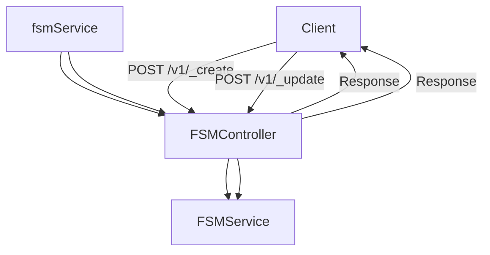

# Overview

The <SwmToken path="municipal-services/fsm/src/main/java/org/egov/fsm/web/model/Error.java" pos="1:8:8" line-data="package org.egov.fsm.web.model;">`web`</SwmToken> package in the FSM module contains the model classes that define the structure of the FSM application data. These classes are used to map the JSON data received from the client to Java objects.

# Main Entity: FSM Class

The <SwmToken path="municipal-services/fsm/src/main/java/org/egov/fsm/web/controller/FSMController.java" pos="52:1:1" line-data="		FSM fsm = fsmService.create(fsmRequest);">`FSM`</SwmToken> class represents the main entity of the FSM application. It includes various properties such as `citizen`, <SwmToken path="municipal-services/fsm/src/main/java/org/egov/fsm/web/model/collection/BillDetail.java" pos="68:9:9" line-data="@EqualsAndHashCode(of = {&quot;id&quot;})">`id`</SwmToken>, <SwmToken path="municipal-services/fsm/src/main/java/org/egov/fsm/web/model/collection/BillDetail.java" pos="74:5:5" line-data="	@JsonProperty(&quot;tenantId&quot;)">`tenantId`</SwmToken>, `applicationNo`, <SwmToken path="municipal-services/fsm/src/main/java/org/egov/fsm/web/model/Error.java" pos="34:5:5" line-data="  @JsonProperty(&quot;description&quot;)">`description`</SwmToken>, `accountId`, <SwmToken path="municipal-services/fsm/src/main/java/org/egov/fsm/web/model/collection/BillDetail.java" pos="98:5:5" line-data="	@JsonProperty(&quot;additionalDetails&quot;)">`additionalDetails`</SwmToken>, `applicationStatus`, `source`, `sanitationtype`, `propertyUsage`, `vehicleType`, `noOfTrips`, `vehicleCapacity`, <SwmToken path="municipal-services/fsm/src/main/java/org/egov/fsm/web/model/Error.java" pos="19:49:49" line-data=" * Error object will be returned as a part of reponse body in conjunction with ResponseHeader as part of ErrorResponse whenever the request processing status in the ResponseHeader is FAILED. HTTP return in this scenario will usually be HTTP 400.">`status`</SwmToken>, `vehicleId`, `vehicle`, `dsoId`, `dso`, `possibleServiceDate`, and `address`.

# Response Handling: <SwmToken path="municipal-services/fsm/src/main/java/org/egov/fsm/web/controller/FSMController.java" pos="49:5:5" line-data="	public ResponseEntity&lt;FSMResponse&gt; create(@Valid @RequestBody FSMRequest fsmRequest) {">`FSMResponse`</SwmToken> Class

The <SwmToken path="municipal-services/fsm/src/main/java/org/egov/fsm/web/controller/FSMController.java" pos="49:5:5" line-data="	public ResponseEntity&lt;FSMResponse&gt; create(@Valid @RequestBody FSMRequest fsmRequest) {">`FSMResponse`</SwmToken> class is used to encapsulate the response data for FSM-related API calls. It includes properties like `totalCount`, <SwmToken path="municipal-services/fsm/src/main/java/org/egov/fsm/web/controller/FSMController.java" pos="56:2:2" line-data="				.responseInfo(responseInfoFactory.createResponseInfoFromRequestInfo(fsmRequest.getRequestInfo(), true))">`responseInfo`</SwmToken>, <SwmToken path="municipal-services/fsm/src/main/java/org/egov/fsm/web/controller/FSMController.java" pos="52:1:1" line-data="		FSM fsm = fsmService.create(fsmRequest);">`FSM`</SwmToken>, and `workflow`. This class helps in standardizing the response structure sent back to the client.

# Request Handling: <SwmToken path="municipal-services/fsm/src/main/java/org/egov/fsm/web/controller/FSMController.java" pos="49:16:16" line-data="	public ResponseEntity&lt;FSMResponse&gt; create(@Valid @RequestBody FSMRequest fsmRequest) {">`FSMRequest`</SwmToken> Class

The <SwmToken path="municipal-services/fsm/src/main/java/org/egov/fsm/web/controller/FSMController.java" pos="49:16:16" line-data="	public ResponseEntity&lt;FSMResponse&gt; create(@Valid @RequestBody FSMRequest fsmRequest) {">`FSMRequest`</SwmToken> class is used to encapsulate the request data for creating or updating FSM applications. It includes properties like <SwmToken path="municipal-services/fsm/src/main/java/org/egov/fsm/web/model/notification/EventRequest.java" pos="48:12:12" line-data="import org.egov.common.contract.request.RequestInfo;">`RequestInfo`</SwmToken>, <SwmToken path="municipal-services/fsm/src/main/java/org/egov/fsm/web/controller/FSMController.java" pos="52:1:1" line-data="		FSM fsm = fsmService.create(fsmRequest);">`FSM`</SwmToken>, and `workflow`. This class helps in standardizing the request structure received from the client.

# Controller: <SwmToken path="municipal-services/fsm/src/main/java/org/egov/fsm/web/controller/FSMController.java" pos="37:4:4" line-data="public class FSMController {">`FSMController`</SwmToken> Class

The <SwmToken path="municipal-services/fsm/src/main/java/org/egov/fsm/web/controller/FSMController.java" pos="37:4:4" line-data="public class FSMController {">`FSMController`</SwmToken> class handles the API endpoints for creating and updating FSM applications. It uses the <SwmToken path="municipal-services/fsm/src/main/java/org/egov/fsm/web/controller/FSMController.java" pos="52:7:7" line-data="		FSM fsm = fsmService.create(fsmRequest);">`fsmService`</SwmToken> to perform the actual business logic and returns the <SwmToken path="municipal-services/fsm/src/main/java/org/egov/fsm/web/controller/FSMController.java" pos="49:5:5" line-data="	public ResponseEntity&lt;FSMResponse&gt; create(@Valid @RequestBody FSMRequest fsmRequest) {">`FSMResponse`</SwmToken> to the client.

# Model Classes

Model classes like <SwmToken path="municipal-services/fsm/src/main/java/org/egov/fsm/web/model/Error.java" pos="111:5:5" line-data="   * Some error messages may carry replaceable fields (say $1, $2) to provide more context to the message. E.g. Format related errors may want to indicate the actual field for which the format is invalid. Client&#39;s should use the values in the param array to replace those fields.">`error`</SwmToken> are used to define the structure of the FSM application data and map JSON data to Java objects.

<SwmSnippet path="/municipal-services/fsm/src/main/java/org/egov/fsm/web/model/Error.java" line="111">

---

The <SwmToken path="municipal-services/fsm/src/main/java/org/egov/fsm/web/model/Error.java" pos="111:5:5" line-data="   * Some error messages may carry replaceable fields (say $1, $2) to provide more context to the message. E.g. Format related errors may want to indicate the actual field for which the format is invalid. Client&#39;s should use the values in the param array to replace those fields.">`error`</SwmToken> class includes error messages that may carry replaceable fields (e.g., $1, $2) to provide more context to the message.

```java
   * Some error messages may carry replaceable fields (say $1, $2) to provide more context to the message. E.g. Format related errors may want to indicate the actual field for which the format is invalid. Client's should use the values in the param array to replace those fields.
```

---

</SwmSnippet>

# Event Request Handling: <SwmToken path="municipal-services/fsm/src/main/java/org/egov/fsm/web/model/notification/EventRequest.java" pos="65:4:4" line-data="public class EventRequest {">`EventRequest`</SwmToken> Class

The <SwmToken path="municipal-services/fsm/src/main/java/org/egov/fsm/web/model/notification/EventRequest.java" pos="65:4:4" line-data="public class EventRequest {">`EventRequest`</SwmToken> class is used to handle event-related data within the FSM application.

<SwmSnippet path="/municipal-services/fsm/src/main/java/org/egov/fsm/web/model/notification/EventRequest.java" line="35">

---

The <SwmToken path="municipal-services/fsm/src/main/java/org/egov/fsm/web/model/notification/EventRequest.java" pos="65:4:4" line-data="public class EventRequest {">`EventRequest`</SwmToken> class manages event-related data and ensures proper handling within the FSM application.

```java
 *         with regards to rights under trademark law for use of the trade names
```

---

</SwmSnippet>

# Billing Details: <SwmToken path="municipal-services/fsm/src/main/java/org/egov/fsm/web/model/collection/BillDetail.java" pos="69:4:4" line-data="public class BillDetail {">`BillDetail`</SwmToken> Class

The <SwmToken path="municipal-services/fsm/src/main/java/org/egov/fsm/web/model/collection/BillDetail.java" pos="69:4:4" line-data="public class BillDetail {">`BillDetail`</SwmToken> class is used to manage billing-related data within the FSM application.

<SwmSnippet path="/municipal-services/fsm/src/main/java/org/egov/fsm/web/model/collection/BillDetail.java" line="35">

---

The <SwmToken path="municipal-services/fsm/src/main/java/org/egov/fsm/web/model/collection/BillDetail.java" pos="69:4:4" line-data="public class BillDetail {">`BillDetail`</SwmToken> class handles billing-related data and ensures accurate billing within the FSM application.

```java
 *         with regards to rights under trademark law for use of the trade names
```

---

</SwmSnippet>

# FSM APIs

The FSM APIs provide endpoints for creating and updating FSM applications.

## Create Endpoint

The <SwmToken path="municipal-services/fsm/src/main/java/org/egov/fsm/web/controller/FSMController.java" pos="49:8:8" line-data="	public ResponseEntity&lt;FSMResponse&gt; create(@Valid @RequestBody FSMRequest fsmRequest) {">`create`</SwmToken> endpoint allows clients to create a new FSM application. It accepts a POST request with an <SwmToken path="municipal-services/fsm/src/main/java/org/egov/fsm/web/controller/FSMController.java" pos="49:16:16" line-data="	public ResponseEntity&lt;FSMResponse&gt; create(@Valid @RequestBody FSMRequest fsmRequest) {">`FSMRequest`</SwmToken> payload, processes the request using the <SwmToken path="municipal-services/fsm/src/main/java/org/egov/fsm/web/controller/FSMController.java" pos="52:7:7" line-data="		FSM fsm = fsmService.create(fsmRequest);">`fsmService`</SwmToken>, and returns an <SwmToken path="municipal-services/fsm/src/main/java/org/egov/fsm/web/controller/FSMController.java" pos="49:5:5" line-data="	public ResponseEntity&lt;FSMResponse&gt; create(@Valid @RequestBody FSMRequest fsmRequest) {">`FSMResponse`</SwmToken> with the created FSM application details.

<SwmSnippet path="/municipal-services/fsm/src/main/java/org/egov/fsm/web/controller/FSMController.java" line="48">

---

The <SwmToken path="municipal-services/fsm/src/main/java/org/egov/fsm/web/controller/FSMController.java" pos="49:8:8" line-data="	public ResponseEntity&lt;FSMResponse&gt; create(@Valid @RequestBody FSMRequest fsmRequest) {">`create`</SwmToken> method in <SwmToken path="municipal-services/fsm/src/main/java/org/egov/fsm/web/controller/FSMController.java" pos="37:4:4" line-data="public class FSMController {">`FSMController`</SwmToken> handles the creation of a new FSM application by processing the <SwmToken path="municipal-services/fsm/src/main/java/org/egov/fsm/web/controller/FSMController.java" pos="49:16:16" line-data="	public ResponseEntity&lt;FSMResponse&gt; create(@Valid @RequestBody FSMRequest fsmRequest) {">`FSMRequest`</SwmToken> and returning an <SwmToken path="municipal-services/fsm/src/main/java/org/egov/fsm/web/controller/FSMController.java" pos="49:5:5" line-data="	public ResponseEntity&lt;FSMResponse&gt; create(@Valid @RequestBody FSMRequest fsmRequest) {">`FSMResponse`</SwmToken>.

```java
	@PostMapping(value = "/_create")
	public ResponseEntity<FSMResponse> create(@Valid @RequestBody FSMRequest fsmRequest) {

		fsmUtil.defaultJsonPathConfig();
		FSM fsm = fsmService.create(fsmRequest);
		List<FSM> fsmList = new ArrayList<>();
		fsmList.add(fsm);
		FSMResponse response = FSMResponse.builder().fsm(fsmList)
				.responseInfo(responseInfoFactory.createResponseInfoFromRequestInfo(fsmRequest.getRequestInfo(), true))
				.build();
		return new ResponseEntity<>(response, HttpStatus.OK);
	}
```

---

</SwmSnippet>

## Update Endpoint

The <SwmToken path="municipal-services/fsm/src/main/java/org/egov/fsm/web/controller/FSMController.java" pos="62:8:8" line-data="	public ResponseEntity&lt;FSMResponse&gt; update(@Valid @RequestBody FSMRequest fsmRequest) {">`update`</SwmToken> endpoint allows clients to update an existing FSM application. It accepts a POST request with an <SwmToken path="municipal-services/fsm/src/main/java/org/egov/fsm/web/controller/FSMController.java" pos="49:16:16" line-data="	public ResponseEntity&lt;FSMResponse&gt; create(@Valid @RequestBody FSMRequest fsmRequest) {">`FSMRequest`</SwmToken> payload, processes the request using the <SwmToken path="municipal-services/fsm/src/main/java/org/egov/fsm/web/controller/FSMController.java" pos="52:7:7" line-data="		FSM fsm = fsmService.create(fsmRequest);">`fsmService`</SwmToken>, and returns an <SwmToken path="municipal-services/fsm/src/main/java/org/egov/fsm/web/controller/FSMController.java" pos="49:5:5" line-data="	public ResponseEntity&lt;FSMResponse&gt; create(@Valid @RequestBody FSMRequest fsmRequest) {">`FSMResponse`</SwmToken> with the updated FSM application details.

<SwmSnippet path="/municipal-services/fsm/src/main/java/org/egov/fsm/web/controller/FSMController.java" line="61">

---

The <SwmToken path="municipal-services/fsm/src/main/java/org/egov/fsm/web/controller/FSMController.java" pos="62:8:8" line-data="	public ResponseEntity&lt;FSMResponse&gt; update(@Valid @RequestBody FSMRequest fsmRequest) {">`update`</SwmToken> method in <SwmToken path="municipal-services/fsm/src/main/java/org/egov/fsm/web/controller/FSMController.java" pos="37:4:4" line-data="public class FSMController {">`FSMController`</SwmToken> handles the updating of an existing FSM application by processing the <SwmToken path="municipal-services/fsm/src/main/java/org/egov/fsm/web/controller/FSMController.java" pos="62:16:16" line-data="	public ResponseEntity&lt;FSMResponse&gt; update(@Valid @RequestBody FSMRequest fsmRequest) {">`FSMRequest`</SwmToken> and returning an <SwmToken path="municipal-services/fsm/src/main/java/org/egov/fsm/web/controller/FSMController.java" pos="62:5:5" line-data="	public ResponseEntity&lt;FSMResponse&gt; update(@Valid @RequestBody FSMRequest fsmRequest) {">`FSMResponse`</SwmToken>.

```java
	@PostMapping(value = "/_update")
	public ResponseEntity<FSMResponse> update(@Valid @RequestBody FSMRequest fsmRequest) {

		fsmUtil.defaultJsonPathConfig();
		FSM fsm = fsmService.update(fsmRequest);
		List<FSM> fsmList = new ArrayList<>();
		fsmList.add(fsm);
		FSMResponse response = FSMResponse.builder().fsm(fsmList)
				.responseInfo(responseInfoFactory.createResponseInfoFromRequestInfo(fsmRequest.getRequestInfo(), true))
				.build();
		return new ResponseEntity<>(response, HttpStatus.OK);
	}
```

---

</SwmSnippet>

&nbsp;

*This is an auto-generated document by Swimm AI 🌊 and has not yet been verified by a human*

<SwmMeta version="3.0.0" repo-id="Z2l0aHViJTNBJTNBRElHSVQtT1NTJTNBJTNBU3dpbW0tRGVtbw==" repo-name="DIGIT-OSS" doc-type="overview"><sup>Powered by [Swimm](/)</sup></SwmMeta>
