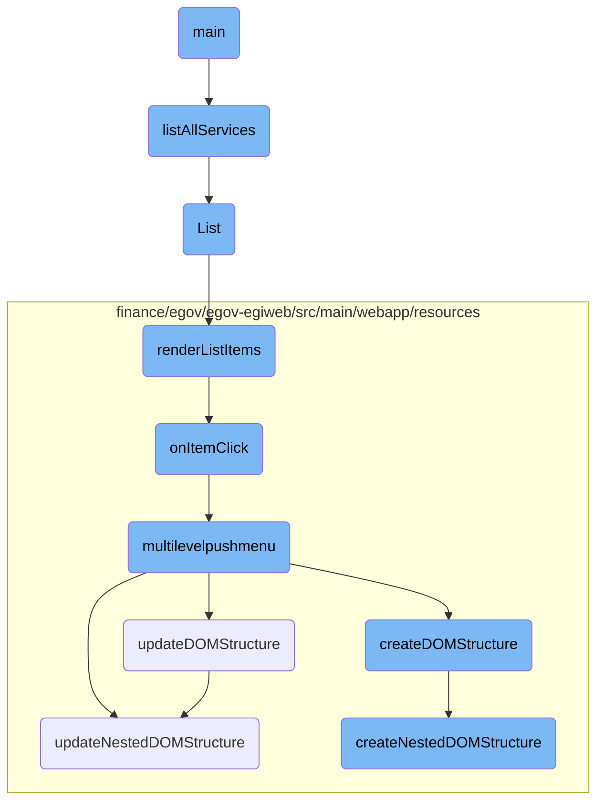

This document explains the initialization and execution flow of the main function. It covers the steps from environment variable checks to Kubernetes client connection and service listing.

The flow starts with the main function checking if the <SwmToken path="utilities/zuul-kubernetes-discovery/main.go" pos="114:15:15" line-data="	if _, ok := os.LookupEnv(&quot;OUTPUT_FILE_PATH&quot;); !ok {">`OUTPUT_FILE_PATH`</SwmToken> environment variable is set. If not, it logs an error and exits. Next, it checks for the NAMESPACE environment variable, defaulting to cluster-wide if not set. The function then establishes a Kubernetes client connection and calls <SwmToken path="utilities/zuul-kubernetes-discovery/main.go" pos="60:2:2" line-data="func listAllServices(clientset *kubernetes.Clientset, namespace string) (s *v1.ServiceList) {">`listAllServices`</SwmToken> to retrieve all services in the specified namespace. The retrieved services are then processed to get Zuul routes, which are finally written to a template.

# Flow drill down



<SwmSnippet path="/utilities/zuul-kubernetes-discovery/main.go" line="113">

---

## Main Function Initialization

The <SwmToken path="utilities/zuul-kubernetes-discovery/main.go" pos="113:2:2" line-data="func main() {">`main`</SwmToken> function initializes the process by checking for the <SwmToken path="utilities/zuul-kubernetes-discovery/main.go" pos="114:15:15" line-data="	if _, ok := os.LookupEnv(&quot;OUTPUT_FILE_PATH&quot;); !ok {">`OUTPUT_FILE_PATH`</SwmToken> environment variable. If not set, it logs an error and exits. It then attempts to get the <SwmToken path="utilities/zuul-kubernetes-discovery/main.go" pos="117:13:13" line-data="	n, ok := os.LookupEnv(&quot;NAMESPACE&quot;)">`NAMESPACE`</SwmToken> environment variable, defaulting to cluster-wide if not set. The function establishes a Kubernetes client connection and calls <SwmToken path="utilities/zuul-kubernetes-discovery/main.go" pos="123:5:5" line-data="	s := listAllServices(clientset, n)">`listAllServices`</SwmToken> to retrieve all services in the specified namespace.

```go
func main() {
	if _, ok := os.LookupEnv("OUTPUT_FILE_PATH"); !ok {
		log.Panicln("OUTPUT_FILE_PATH environment variable not set! Exiting!")
	}
	n, ok := os.LookupEnv("NAMESPACE")
	if !ok {
		log.Println("NAMESPACE environment vairable not set, defaulting to cluster wide")
	}

	clientset := getKubeConnection()
	s := listAllServices(clientset, n)
	r := getZuulRoutes(s)
	writeTemplate(r)
}
```

---

</SwmSnippet>

<SwmSnippet path="/utilities/zuul-kubernetes-discovery/main.go" line="60">

---

## Listing All Services

The <SwmToken path="utilities/zuul-kubernetes-discovery/main.go" pos="60:2:2" line-data="func listAllServices(clientset *kubernetes.Clientset, namespace string) (s *v1.ServiceList) {">`listAllServices`</SwmToken> function retrieves all Kubernetes services within a specified namespace. It uses the Kubernetes client to list services and returns the service list. If an error occurs during the listing, the function panics.

```go
func listAllServices(clientset *kubernetes.Clientset, namespace string) (s *v1.ServiceList) {
	sc := clientset.CoreV1().Services(namespace)

	s, err := sc.List(metav1.ListOptions{})
	if err != nil {
		panic(err)
	}

	return s
}
```

---

</SwmSnippet>

&nbsp;

*This is an auto-generated document by Swimm AI 🌊 and has not yet been verified by a human*

<SwmMeta version="3.0.0" repo-id="Z2l0aHViJTNBJTNBRElHSVQtT1NTJTNBJTNBU3dpbW0tRGVtbw==" repo-name="DIGIT-OSS" doc-type="flows"><sup>Powered by [Swimm](/)</sup></SwmMeta>
