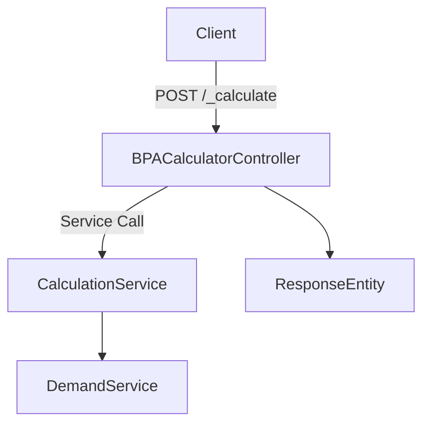

# What is Bpa Fee Calculation Service

The Bpa Fee Calculation Service is used to generate various fees and charges related to building permits and occupancy certificate applications. It calculates fees such as Application Fee, Sanction Fee, Low Application Permit Fee, and Deviation Charges based on the Application Type, <SwmToken path="municipal-services/bpa-calculator/src/main/java/org/egov/bpa/calculator/services/MDMSService.java" pos="127:11:11" line-data="            filterExp = &quot;$.[?(@.riskType == &#39;&quot;+bpa.getRiskType()+&quot;&#39; || @.riskType === &#39;ALL&#39; )]&quot;;">`riskType`</SwmToken>, and <SwmToken path="municipal-services/bpa-calculator/src/main/java/org/egov/bpa/calculator/services/MDMSService.java" pos="107:3:3" line-data="    		JSONArray serviceType = context.read(&quot;edcrDetail.*.applicationSubType&quot;);">`serviceType`</SwmToken>.

The service generates a demand for the calculated amount, which is then used for payment processing. It provides multiple functionalities including demand generation for a particular BPA, BPA occupancy certificate applications, and demand updates.

## API Details

The `bpa-calculator/v1/_calculate` endpoint is used to calculate the fee and create a demand with the applicable businessService and TaxHeads.

## BPA Calculator Endpoints

The <SwmToken path="municipal-services/bpa-calculator/src/main/java/org/egov/bpa/calculator/web/controllers/BPACalculatorController.java" pos="52:9:10" line-data="	@RequestMapping(value = &quot;/_calculate&quot;, method = RequestMethod.POST)">`/_calculate`</SwmToken> endpoint is used to calculate the trade license fee and create a demand. It accepts a POST request with a <SwmToken path="municipal-services/bpa-calculator/src/main/java/org/egov/bpa/calculator/web/controllers/BPACalculatorController.java" pos="53:16:16" line-data="	public ResponseEntity&lt;CalculationRes&gt; calculate(@Valid @RequestBody CalculationReq calculationReq) {">`CalculationReq`</SwmToken> payload and returns a <SwmToken path="municipal-services/bpa-calculator/src/main/java/org/egov/bpa/calculator/web/controllers/BPACalculatorController.java" pos="53:5:5" line-data="	public ResponseEntity&lt;CalculationRes&gt; calculate(@Valid @RequestBody CalculationReq calculationReq) {">`CalculationRes`</SwmToken> response containing the calculated fees.

<SwmSnippet path="/municipal-services/bpa-calculator/src/main/java/org/egov/bpa/calculator/web/controllers/BPACalculatorController.java" line="52">

---

The <SwmToken path="municipal-services/bpa-calculator/src/main/java/org/egov/bpa/calculator/web/controllers/BPACalculatorController.java" pos="53:8:8" line-data="	public ResponseEntity&lt;CalculationRes&gt; calculate(@Valid @RequestBody CalculationReq calculationReq) {">`calculate`</SwmToken> method in <SwmToken path="municipal-services/bpa-calculator/src/main/java/org/egov/bpa/calculator/web/controllers/BPACalculatorController.java" pos="28:4:4" line-data="public class BPACalculatorController {">`BPACalculatorController`</SwmToken> handles the POST request to the <SwmToken path="municipal-services/bpa-calculator/src/main/java/org/egov/bpa/calculator/web/controllers/BPACalculatorController.java" pos="52:9:10" line-data="	@RequestMapping(value = &quot;/_calculate&quot;, method = RequestMethod.POST)">`/_calculate`</SwmToken> endpoint. It logs the incoming request, calls the <SwmToken path="municipal-services/bpa-calculator/src/main/java/org/egov/bpa/calculator/web/controllers/BPACalculatorController.java" pos="55:10:10" line-data="		 List&lt;Calculation&gt; calculations = calculationService.calculate(calculationReq);">`calculationService`</SwmToken> to perform the fee calculation, and returns the calculated fees in a <SwmToken path="municipal-services/bpa-calculator/src/main/java/org/egov/bpa/calculator/web/controllers/BPACalculatorController.java" pos="53:5:5" line-data="	public ResponseEntity&lt;CalculationRes&gt; calculate(@Valid @RequestBody CalculationReq calculationReq) {">`CalculationRes`</SwmToken> response.

```java
	@RequestMapping(value = "/_calculate", method = RequestMethod.POST)
	public ResponseEntity<CalculationRes> calculate(@Valid @RequestBody CalculationReq calculationReq) {
		log.debug("CalculationReaquest:: " + calculationReq);
		 List<Calculation> calculations = calculationService.calculate(calculationReq);
		 CalculationRes calculationRes = CalculationRes.builder().calculations(calculations).build();
		 return new ResponseEntity<CalculationRes>(calculationRes,HttpStatus.OK);
	}
```

---

</SwmSnippet>

## MDMS Search Endpoint

The MDMS search endpoint is constructed using the <SwmToken path="municipal-services/bpa-calculator/src/main/java/org/egov/bpa/calculator/services/MDMSService.java" pos="59:5:5" line-data="    private StringBuilder getMdmsSearchUrl() {">`getMdmsSearchUrl`</SwmToken> method, which combines the MDMS host and search endpoint from the configuration. This URL is used to fetch MDMS data required for calculations.

<SwmSnippet path="/municipal-services/bpa-calculator/src/main/java/org/egov/bpa/calculator/services/MDMSService.java" line="59">

---

The <SwmToken path="municipal-services/bpa-calculator/src/main/java/org/egov/bpa/calculator/services/MDMSService.java" pos="59:5:5" line-data="    private StringBuilder getMdmsSearchUrl() {">`getMdmsSearchUrl`</SwmToken> method in <SwmToken path="municipal-services/bpa-calculator/src/main/java/org/egov/bpa/calculator/services/MDMSService.java" pos="36:4:4" line-data="public class MDMSService {">`MDMSService`</SwmToken> constructs the URL for fetching MDMS data by appending the MDMS host and search endpoint from the configuration.

```java
    private StringBuilder getMdmsSearchUrl() {
        return new StringBuilder().append(config.getMdmsHost()).append(config.getMdmsSearchEndpoint());
    }
```

---

</SwmSnippet>

&nbsp;

*This is an auto-generated document by Swimm AI 🌊 and has not yet been verified by a human*

<SwmMeta version="3.0.0" repo-id="Z2l0aHViJTNBJTNBRElHSVQtT1NTJTNBJTNBU3dpbW0tRGVtbw==" repo-name="DIGIT-OSS" doc-type="overview"><sup>Powered by [Swimm](/)</sup></SwmMeta>
