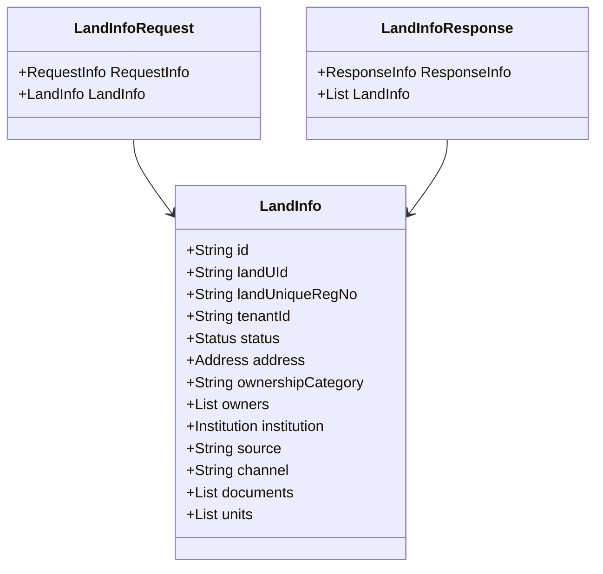

# What is Land Information

Land information refers to the data related to land, including details such as land identification, ownership information, address, and associated documents. It is a major service supporting bpa-services, which handles comprehensive information about the land.

<SwmSnippet path="/municipal-services/bpa-services/src/main/java/org/egov/bpa/web/model/landInfo/LandInfo.java" line="38">

---

## <SwmToken path="municipal-services/bpa-services/src/main/java/org/egov/bpa/web/model/landInfo/LandInfo.java" pos="38:4:4" line-data="public class LandInfo   {">`LandInfo`</SwmToken> Class

The <SwmToken path="municipal-services/bpa-services/src/main/java/org/egov/bpa/web/model/landInfo/LandInfo.java" pos="38:4:4" line-data="public class LandInfo   {">`LandInfo`</SwmToken> class is used to model land data, encapsulating fields like land ID, unique registration number, tenant ID, status, address, ownership category, owners, institution, source, channel, documents, and units.

```java
public class LandInfo   {
  @SafeHtml
  @JsonProperty("id")
  private String id = null;

  @SafeHtml
  @JsonProperty("landUId")
  private String landUId = null;

  @SafeHtml
  @JsonProperty("landUniqueRegNo")
  private String landUniqueRegNo = null;

  @SafeHtml
  @JsonProperty("tenantId")
  private String tenantId = null;

  @JsonProperty("status")
  private Status status = null;

  @JsonProperty("address")
```

---

</SwmSnippet>

<SwmSnippet path="/municipal-services/bpa-services/src/main/java/org/egov/bpa/web/model/landInfo/LandInfoRequest.java" line="27">

---

## <SwmToken path="municipal-services/bpa-services/src/main/java/org/egov/bpa/web/model/landInfo/LandInfoRequest.java" pos="27:4:4" line-data="public class LandInfoRequest   {">`LandInfoRequest`</SwmToken> Class

The <SwmToken path="municipal-services/bpa-services/src/main/java/org/egov/bpa/web/model/landInfo/LandInfoRequest.java" pos="27:4:4" line-data="public class LandInfoRequest   {">`LandInfoRequest`</SwmToken> class is used to handle requests involving land information. It includes fields for request information and land information.

```java
public class LandInfoRequest   {
  @JsonProperty("RequestInfo")
  private RequestInfo requestInfo = null;

  @JsonProperty("LandInfo")
  private LandInfo landInfo = null;

  public LandInfoRequest requestInfo(RequestInfo requestInfo) {
    this.requestInfo = requestInfo;
    return this;
  }

  /**
   * Get requestInfo
   * @return requestInfo
  **/
  @ApiModelProperty(value = "")
  
    @Valid
    public RequestInfo getRequestInfo() {
    return requestInfo;
```

---

</SwmSnippet>

<SwmSnippet path="/municipal-services/bpa-services/src/main/java/org/egov/bpa/web/model/landInfo/LandInfoResponse.java" line="28">

---

## <SwmToken path="municipal-services/bpa-services/src/main/java/org/egov/bpa/web/model/landInfo/LandInfoResponse.java" pos="28:4:4" line-data="public class LandInfoResponse   {">`LandInfoResponse`</SwmToken> Class

The <SwmToken path="municipal-services/bpa-services/src/main/java/org/egov/bpa/web/model/landInfo/LandInfoResponse.java" pos="28:4:4" line-data="public class LandInfoResponse   {">`LandInfoResponse`</SwmToken> class is used to handle responses involving land information. It includes fields for response information and a list of land information.

```java
public class LandInfoResponse   {
  @JsonProperty("ResponseInfo")
  private ResponseInfo responseInfo = null;

  @JsonProperty("landInfo")
  private List<LandInfo> landInfo = null;

  public LandInfoResponse responseInfo(ResponseInfo responseInfo) {
    this.responseInfo = responseInfo;
    return this;
  }

  /**
   * Get responseInfo
   * @return responseInfo
  **/
  @ApiModelProperty(value = "")
  
    @Valid
    public ResponseInfo getResponseInfo() {
    return responseInfo;
```

---

</SwmSnippet>

## Service Details

The land service is a major service supporting bpa-services, handling comprehensive information about the land.

## API Details

The land-services API provides details on how to create and update land details. It utilizes the <SwmToken path="municipal-services/bpa-services/src/main/java/org/egov/bpa/web/model/landInfo/LandInfo.java" pos="38:4:4" line-data="public class LandInfo   {">`LandInfo`</SwmToken> class to model the land data, encapsulating various fields related to land information.

&nbsp;

*This is an auto-generated document by Swimm AI 🌊 and has not yet been verified by a human*

<SwmMeta version="3.0.0" repo-id="Z2l0aHViJTNBJTNBRElHSVQtT1NTJTNBJTNBU3dpbW0tRGVtbw==" repo-name="DIGIT-OSS" doc-type="overview"><sup>Powered by [Swimm](/)</sup></SwmMeta>
