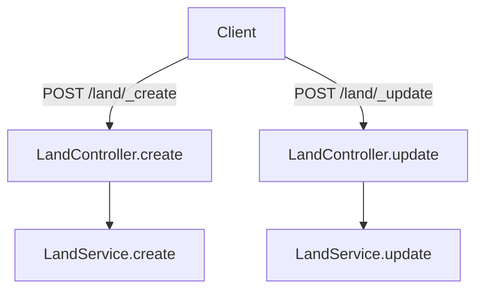

# Overview of Land Services in Municipal Services

Land services handle the data related to land, including land details, owner information, unit, address, and documents. This service supports bpa-services by managing comprehensive land information and ensuring that all relevant land data is accurately captured and maintained.

## Service Details

The land service supports bpa-services by handling comprehensive land data, including details, owner information, unit, address, and documents.

## Local Setup

This section provides instructions on setting up the land services locally, including cloning the repository and understanding dependencies.

## <SwmToken path="municipal-services/land-services/src/main/java/org/egov/land/service/LandService.java" pos="29:4:4" line-data="public class LandService {">`LandService`</SwmToken> Class

The <SwmToken path="municipal-services/land-services/src/main/java/org/egov/land/service/LandService.java" pos="29:4:4" line-data="public class LandService {">`LandService`</SwmToken> class contains methods for creating, updating, and searching land information. It validates land data, manages user information, enriches land requests, and interacts with the repository to save or update data.

<SwmSnippet path="/municipal-services/land-services/src/main/java/org/egov/land/service/LandService.java" line="27">

---

The <SwmToken path="municipal-services/land-services/src/main/java/org/egov/land/service/LandService.java" pos="29:4:4" line-data="public class LandService {">`LandService`</SwmToken> class is annotated with <SwmToken path="municipal-services/land-services/src/main/java/org/egov/land/service/LandService.java" pos="27:0:1" line-data="@Service">`@Service`</SwmToken> and <SwmToken path="municipal-services/land-services/src/main/java/org/egov/land/service/LandService.java" pos="28:0:1" line-data="@Slf4j">`@Slf4j`</SwmToken>. It autowires several components such as <SwmToken path="municipal-services/land-services/src/main/java/org/egov/land/service/LandService.java" pos="32:1:1" line-data="	LandValidator landValidator;">`LandValidator`</SwmToken>, <SwmToken path="municipal-services/land-services/src/main/java/org/egov/land/service/LandService.java" pos="35:3:3" line-data="	private LandEnrichmentService enrichmentService;">`LandEnrichmentService`</SwmToken>, <SwmToken path="municipal-services/land-services/src/main/java/org/egov/land/service/LandService.java" pos="38:3:3" line-data="	private LandUserService userService;">`LandUserService`</SwmToken>, <SwmToken path="municipal-services/land-services/src/main/java/org/egov/land/service/LandService.java" pos="41:3:3" line-data="	private LandRepository repository;">`LandRepository`</SwmToken>, and <SwmToken path="municipal-services/land-services/src/main/java/org/egov/land/service/LandService.java" pos="44:3:3" line-data="	private LandUtil util;">`LandUtil`</SwmToken> to perform its operations.

```java
@Service
@Slf4j
public class LandService {

	@Autowired
	LandValidator landValidator;

	@Autowired
	private LandEnrichmentService enrichmentService;

	@Autowired
	private LandUserService userService;

	@Autowired
	private LandRepository repository;

	@Autowired
	private LandUtil util;

	public LandInfo create(@Valid LandInfoRequest landRequest) {
```

---

</SwmSnippet>

## Main Functions

There are several main functions in this folder. Some of them are create, update, and getAreaType. We will dive a little into create and update.

### Create

The <SwmToken path="municipal-services/land-services/src/main/java/org/egov/land/service/LandService.java" pos="46:5:5" line-data="	public LandInfo create(@Valid LandInfoRequest landRequest) {">`create`</SwmToken> function is responsible for creating new land information records. It validates the land information, manages user details, enriches the land information request, and saves the data to the repository.

<SwmSnippet path="/municipal-services/land-services/src/main/java/org/egov/land/service/LandService.java" line="46">

---

The <SwmToken path="municipal-services/land-services/src/main/java/org/egov/land/service/LandService.java" pos="46:5:5" line-data="	public LandInfo create(@Valid LandInfoRequest landRequest) {">`create`</SwmToken> function in the <SwmToken path="municipal-services/land-services/src/main/java/org/egov/land/service/LandService.java" pos="29:4:4" line-data="public class LandService {">`LandService`</SwmToken> class performs several steps: it calls <SwmToken path="municipal-services/land-services/src/main/java/org/egov/land/service/LandService.java" pos="48:7:9" line-data="		Object mdmsData = util.mDMSCall(landRequest.getRequestInfo(), landRequest.getLandInfo().getTenantId());">`util.mDMSCall`</SwmToken> to get MDMS data, validates the tenant ID, validates the land information using <SwmToken path="municipal-services/land-services/src/main/java/org/egov/land/service/LandService.java" pos="53:1:1" line-data="		landValidator.validateLandInfo(landRequest,mdmsData);">`landValidator`</SwmToken>, manages user details with <SwmToken path="municipal-services/land-services/src/main/java/org/egov/land/service/LandService.java" pos="54:1:1" line-data="		userService.manageUser(landRequest);">`userService`</SwmToken>, enriches the land information request with <SwmToken path="municipal-services/land-services/src/main/java/org/egov/land/service/LandService.java" pos="56:1:1" line-data="		enrichmentService.enrichLandInfoRequest(landRequest, false);">`enrichmentService`</SwmToken>, and finally saves the data to the repository.

```java
	public LandInfo create(@Valid LandInfoRequest landRequest) {

		Object mdmsData = util.mDMSCall(landRequest.getRequestInfo(), landRequest.getLandInfo().getTenantId());
		if (landRequest.getLandInfo().getTenantId().split("\\.").length == 1) {
			throw new CustomException(LandConstants.INVALID_TENANT, " Application cannot be create at StateLevel");
		}
		
		landValidator.validateLandInfo(landRequest,mdmsData);
		userService.manageUser(landRequest);
		
		enrichmentService.enrichLandInfoRequest(landRequest, false);

		landRequest.getLandInfo().getOwners().forEach(owner -> {
			if (owner.getActive()) {
				owner.setStatus(true);
			}else
			{
				owner.setStatus(false);
			}
		});
		repository.save(landRequest);
```

---

</SwmSnippet>

### Update

The <SwmToken path="municipal-services/land-services/src/main/java/org/egov/land/service/LandService.java" pos="70:5:5" line-data="	public LandInfo update(@Valid LandInfoRequest landRequest) {">`update`</SwmToken> function handles updating existing land information records. It ensures the land ID is present, validates the land information, manages user details, enriches the land information request, and updates the data in the repository.

<SwmSnippet path="/municipal-services/land-services/src/main/java/org/egov/land/service/LandService.java" line="70">

---

The <SwmToken path="municipal-services/land-services/src/main/java/org/egov/land/service/LandService.java" pos="70:5:5" line-data="	public LandInfo update(@Valid LandInfoRequest landRequest) {">`update`</SwmToken> function in the <SwmToken path="municipal-services/land-services/src/main/java/org/egov/land/service/LandService.java" pos="29:4:4" line-data="public class LandService {">`LandService`</SwmToken> class performs several steps: it calls <SwmToken path="municipal-services/land-services/src/main/java/org/egov/land/service/LandService.java" pos="73:7:9" line-data="		Object mdmsData = util.mDMSCall(landRequest.getRequestInfo(), landRequest.getLandInfo().getTenantId());">`util.mDMSCall`</SwmToken> to get MDMS data, checks if the land ID is present, validates the land information using <SwmToken path="municipal-services/land-services/src/main/java/org/egov/land/service/LandService.java" pos="83:1:1" line-data="		landValidator.validateLandInfo(landRequest, mdmsData);">`landValidator`</SwmToken>, manages user details with <SwmToken path="municipal-services/land-services/src/main/java/org/egov/land/service/LandService.java" pos="84:1:1" line-data="		userService.manageUser(landRequest);">`userService`</SwmToken>, and enriches the land information request with <SwmToken path="municipal-services/land-services/src/main/java/org/egov/land/service/LandService.java" pos="85:1:1" line-data="		enrichmentService.enrichLandInfoRequest(landRequest, true);">`enrichmentService`</SwmToken>.

```java
	public LandInfo update(@Valid LandInfoRequest landRequest) {
		LandInfo landInfo = landRequest.getLandInfo();

		Object mdmsData = util.mDMSCall(landRequest.getRequestInfo(), landRequest.getLandInfo().getTenantId());
		if (landInfo.getId() == null) {
			throw new CustomException(LandConstants.UPDATE_ERROR, "Id is mandatory to update ");
		}

		landInfo.getOwners().forEach(owner -> {
			if (owner.getOwnerType() == null) {
				owner.setOwnerType("NONE");
			}
		});
		landValidator.validateLandInfo(landRequest, mdmsData);
		userService.manageUser(landRequest);
		enrichmentService.enrichLandInfoRequest(landRequest, true);
```

---

</SwmSnippet>

## Land Services Endpoints

Land Services Endpoints

<SwmSnippet path="/municipal-services/land-services/src/main/java/org/egov/land/web/controller/LandController.java" line="38">

---

The <SwmToken path="municipal-services/land-services/src/main/java/org/egov/land/web/controller/LandController.java" pos="39:8:8" line-data="	public ResponseEntity&lt;LandInfoResponse&gt; create(@Valid @RequestBody LandInfoRequest landRequest) {">`create`</SwmToken> endpoint in the <SwmToken path="municipal-services/land-services/src/main/java/org/egov/land/web/controller/LandController.java" pos="27:4:4" line-data="public class LandController {">`LandController`</SwmToken> class handles HTTP POST requests to <SwmToken path="municipal-services/land-services/src/main/java/org/egov/land/web/controller/LandController.java" pos="38:9:12" line-data="	@PostMapping(value = &quot;/land/_create&quot;)">`/land/_create`</SwmToken>. It calls the <SwmToken path="municipal-services/land-services/src/main/java/org/egov/land/web/controller/LandController.java" pos="39:8:8" line-data="	public ResponseEntity&lt;LandInfoResponse&gt; create(@Valid @RequestBody LandInfoRequest landRequest) {">`create`</SwmToken> method of <SwmToken path="municipal-services/land-services/src/main/java/org/egov/land/web/controller/LandController.java" pos="41:7:7" line-data="		LandInfo landInfo = landService.create(landRequest);">`landService`</SwmToken> to create new land information and returns the created land details in a <SwmToken path="municipal-services/land-services/src/main/java/org/egov/land/web/controller/LandController.java" pos="39:5:5" line-data="	public ResponseEntity&lt;LandInfoResponse&gt; create(@Valid @RequestBody LandInfoRequest landRequest) {">`LandInfoResponse`</SwmToken> object.

```java
	@PostMapping(value = "/land/_create")
	public ResponseEntity<LandInfoResponse> create(@Valid @RequestBody LandInfoRequest landRequest) {
		landUtil.defaultJsonPathConfig();
		LandInfo landInfo = landService.create(landRequest);
		List<LandInfo> landInfos = new ArrayList<LandInfo>();
		landInfos.add(landInfo);
		LandInfoResponse response = LandInfoResponse.builder().landInfo(landInfos)
				.responseInfo(responseInfoFactory.createResponseInfoFromRequestInfo(landRequest.getRequestInfo(), true))
				.build();
		return new ResponseEntity<>(response, HttpStatus.OK);
	}
```

---

</SwmSnippet>

### Update

The <SwmToken path="municipal-services/land-services/src/main/java/org/egov/land/service/LandService.java" pos="70:5:5" line-data="	public LandInfo update(@Valid LandInfoRequest landRequest) {">`update`</SwmToken> endpoint is used to update an existing land detail in the land registry. It accepts a <SwmToken path="municipal-services/land-services/src/main/java/org/egov/land/service/LandService.java" pos="46:10:10" line-data="	public LandInfo create(@Valid LandInfoRequest landRequest) {">`LandInfoRequest`</SwmToken> object and returns a <SwmToken path="municipal-services/land-services/src/main/java/org/egov/land/web/controller/LandController.java" pos="39:5:5" line-data="	public ResponseEntity&lt;LandInfoResponse&gt; create(@Valid @RequestBody LandInfoRequest landRequest) {">`LandInfoResponse`</SwmToken> object containing the updated land details.

&nbsp;

*This is an auto-generated document by Swimm AI 🌊 and has not yet been verified by a human*

<SwmMeta version="3.0.0" repo-id="Z2l0aHViJTNBJTNBRElHSVQtT1NTJTNBJTNBU3dpbW0tRGVtbw==" repo-name="DIGIT-OSS" doc-type="overview"><sup>Powered by [Swimm](/)</sup></SwmMeta>
