```mermaid
classDiagram
    PropertyService --> UserService
    PropertyService --> NotificationService
    PropertyService --> WorkflowService
    PropertyService --> AssessmentService
    PropertyService --> MigrationService
    PropertyService --> CalculationService
    PropertyService --> BoundaryService
    PropertyService --> TranslationService
    PropertyService --> WorkflowService

%% Swimm:
%% classDiagram
%%     <SwmToken path="municipal-services/property-services/src/main/java/org/egov/pt/service/PropertyService.java" pos="45:4:4" line-data="public class PropertyService {">`PropertyService`</SwmToken> --> <SwmToken path="municipal-services/property-services/src/main/java/org/egov/pt/service/UserService.java" pos="38:4:4" line-data="public class UserService {">`UserService`</SwmToken>
%%     <SwmToken path="municipal-services/property-services/src/main/java/org/egov/pt/service/PropertyService.java" pos="45:4:4" line-data="public class PropertyService {">`PropertyService`</SwmToken> --> <SwmToken path="municipal-services/property-services/src/main/java/org/egov/pt/service/PropertyService.java" pos="54:3:3" line-data="	private NotificationService notifService;">`NotificationService`</SwmToken>
%%     <SwmToken path="municipal-services/property-services/src/main/java/org/egov/pt/service/PropertyService.java" pos="45:4:4" line-data="public class PropertyService {">`PropertyService`</SwmToken> --> <SwmToken path="municipal-services/property-services/src/main/java/org/egov/pt/service/AssessmentService.java" pos="48:3:3" line-data="	private WorkflowService workflowService;">`WorkflowService`</SwmToken>
%%     <SwmToken path="municipal-services/property-services/src/main/java/org/egov/pt/service/PropertyService.java" pos="45:4:4" line-data="public class PropertyService {">`PropertyService`</SwmToken> --> <SwmToken path="municipal-services/property-services/src/main/java/org/egov/pt/service/AssessmentService.java" pos="30:4:4" line-data="public class AssessmentService {">`AssessmentService`</SwmToken>
%%     <SwmToken path="municipal-services/property-services/src/main/java/org/egov/pt/service/PropertyService.java" pos="45:4:4" line-data="public class PropertyService {">`PropertyService`</SwmToken> --> <SwmToken path="municipal-services/property-services/src/main/java/org/egov/pt/service/MigrationService.java" pos="63:4:4" line-data="public class MigrationService {">`MigrationService`</SwmToken>
%%     <SwmToken path="municipal-services/property-services/src/main/java/org/egov/pt/service/PropertyService.java" pos="45:4:4" line-data="public class PropertyService {">`PropertyService`</SwmToken> --> <SwmToken path="municipal-services/property-services/src/main/java/org/egov/pt/service/CalculationService.java" pos="16:4:4" line-data="public class CalculationService {">`CalculationService`</SwmToken>
%%     <SwmToken path="municipal-services/property-services/src/main/java/org/egov/pt/service/PropertyService.java" pos="45:4:4" line-data="public class PropertyService {">`PropertyService`</SwmToken> --> <SwmToken path="municipal-services/property-services/src/main/java/org/egov/pt/service/BoundaryService.java" pos="26:4:4" line-data="public class BoundaryService {">`BoundaryService`</SwmToken>
%%     <SwmToken path="municipal-services/property-services/src/main/java/org/egov/pt/service/PropertyService.java" pos="45:4:4" line-data="public class PropertyService {">`PropertyService`</SwmToken> --> <SwmToken path="municipal-services/property-services/src/main/java/org/egov/pt/service/CalculationService.java" pos="25:3:3" line-data="    private TranslationService translationService;">`TranslationService`</SwmToken>
%%     <SwmToken path="municipal-services/property-services/src/main/java/org/egov/pt/service/PropertyService.java" pos="45:4:4" line-data="public class PropertyService {">`PropertyService`</SwmToken> --> <SwmToken path="municipal-services/property-services/src/main/java/org/egov/pt/service/AssessmentService.java" pos="48:3:3" line-data="	private WorkflowService workflowService;">`WorkflowService`</SwmToken>
```

# Overview of Property Service

The Property Service in DIGIT is designed to manage various property-related operations. It includes functionalities such as creating, updating, and managing property records, handling user information, and integrating with other services. The <SwmToken path="municipal-services/property-services/src/main/java/org/egov/pt/service/PropertyService.java" pos="45:4:4" line-data="public class PropertyService {">`PropertyService`</SwmToken> class orchestrates these operations, ensuring data validation, enrichment, and workflow management.

## Service Details

The service allows users to apply for water connections, search for water connections, take different actions based on the state (workflow), and send notifications based on the application state.

## API Details

The base path for the API is `/ws-services/wc/[API endpoint]`. The service provides methods like `_create` for creating water service applications, `_update` for approving and activating applications, and `_search` for searching water connections.

## Local Setup

To set up the property service locally, clone the municipal-services repository and follow the dependencies and setup instructions provided in the document.

## <SwmToken path="municipal-services/property-services/src/main/java/org/egov/pt/service/UserService.java" pos="38:4:4" line-data="public class UserService {">`UserService`</SwmToken>

The <SwmToken path="municipal-services/property-services/src/main/java/org/egov/pt/service/UserService.java" pos="38:4:4" line-data="public class UserService {">`UserService`</SwmToken> class handles creating, updating, and managing user information related to property owners. It ensures that user details are correctly set and updated in the system.

<SwmSnippet path="/municipal-services/property-services/src/main/java/org/egov/pt/service/UserService.java" line="37">

---

The <SwmToken path="municipal-services/property-services/src/main/java/org/egov/pt/service/UserService.java" pos="38:4:4" line-data="public class UserService {">`UserService`</SwmToken> class is annotated with <SwmToken path="municipal-services/property-services/src/main/java/org/egov/pt/service/UserService.java" pos="37:0:1" line-data="@Service">`@Service`</SwmToken> and uses various dependencies to manage user information. It interacts with endpoints defined in the configuration to create and search for users.

```java
@Service
public class UserService {

    @Autowired
    private ObjectMapper mapper;

    @Autowired
    private ServiceRequestRepository serviceRequestRepository;

    @Value("${egov.user.host}")
    private String userHost;

    @Value("${egov.user.context.path}")
    private String userContextPath;

    @Value("${egov.user.create.path}")
    private String userCreateEndpoint;

    @Value("${egov.user.search.path}")
    private String userSearchEndpoint;
```

---

</SwmSnippet>

## <SwmToken path="municipal-services/property-services/src/main/java/org/egov/pt/service/AssessmentService.java" pos="30:4:4" line-data="public class AssessmentService {">`AssessmentService`</SwmToken>

The <SwmToken path="municipal-services/property-services/src/main/java/org/egov/pt/service/AssessmentService.java" pos="30:4:4" line-data="public class AssessmentService {">`AssessmentService`</SwmToken> class manages property assessments, including creating and updating assessments. It validates assessment data, enriches it, and integrates with workflow services to manage the assessment lifecycle.

<SwmSnippet path="/municipal-services/property-services/src/main/java/org/egov/pt/service/AssessmentService.java" line="29">

---

The <SwmToken path="municipal-services/property-services/src/main/java/org/egov/pt/service/AssessmentService.java" pos="30:4:4" line-data="public class AssessmentService {">`AssessmentService`</SwmToken> class is annotated with <SwmToken path="municipal-services/property-services/src/main/java/org/egov/pt/service/AssessmentService.java" pos="29:0:1" line-data="@Service">`@Service`</SwmToken> and uses various dependencies to manage property assessments. It ensures that assessments are validated, enriched, and processed through the workflow.

```java
@Service
public class AssessmentService {

	private AssessmentValidator validator;

	private PropertyProducer producer;

	private PropertyConfiguration props;

	private AssessmentRepository repository;

	private AssessmentEnrichmentService assessmentEnrichmentService;

	private PropertyConfiguration config;

	private DiffService diffService;

	private AssessmentUtils utils;

	private WorkflowService workflowService;
```

---

</SwmSnippet>

## <SwmToken path="municipal-services/property-services/src/main/java/org/egov/pt/service/MigrationService.java" pos="63:4:4" line-data="public class MigrationService {">`MigrationService`</SwmToken>

The <SwmToken path="municipal-services/property-services/src/main/java/org/egov/pt/service/MigrationService.java" pos="63:4:4" line-data="public class MigrationService {">`MigrationService`</SwmToken> class handles the migration of property data from old systems to the new system. It validates and processes property data, ensuring a smooth transition.

<SwmSnippet path="/municipal-services/property-services/src/main/java/org/egov/pt/service/MigrationService.java" line="61">

---

The <SwmToken path="municipal-services/property-services/src/main/java/org/egov/pt/service/MigrationService.java" pos="63:4:4" line-data="public class MigrationService {">`MigrationService`</SwmToken> class is annotated with <SwmToken path="municipal-services/property-services/src/main/java/org/egov/pt/service/MigrationService.java" pos="61:0:1" line-data="@Service">`@Service`</SwmToken> and uses various dependencies to manage the migration of property data. It ensures that data is validated and processed correctly during the migration.

```java
@Service
@Slf4j
public class MigrationService {

    @Autowired
    private PropertyProducer producer;

    @Autowired
    private AssessmentValidator validator;

    @Autowired
    private PropertyConfiguration config;

    @Autowired
    private PropertyMigrationValidator propertyMigrationValidator;

    @Autowired
    private ObjectMapper mapper;

    @Autowired
    private AssessmentUtils AssmtUtils;
```

---

</SwmSnippet>

## <SwmToken path="municipal-services/property-services/src/main/java/org/egov/pt/service/CalculationService.java" pos="16:4:4" line-data="public class CalculationService {">`CalculationService`</SwmToken>

The <SwmToken path="municipal-services/property-services/src/main/java/org/egov/pt/service/CalculationService.java" pos="16:4:4" line-data="public class CalculationService {">`CalculationService`</SwmToken> class is responsible for calculating property taxes and mutation fees. It interacts with external calculation services to fetch and process tax data.

<SwmSnippet path="/municipal-services/property-services/src/main/java/org/egov/pt/service/CalculationService.java" line="15">

---

The <SwmToken path="municipal-services/property-services/src/main/java/org/egov/pt/service/CalculationService.java" pos="16:4:4" line-data="public class CalculationService {">`CalculationService`</SwmToken> class is annotated with <SwmToken path="municipal-services/property-services/src/main/java/org/egov/pt/service/CalculationService.java" pos="15:0:1" line-data="@Service">`@Service`</SwmToken> and uses various dependencies to calculate property taxes. It interacts with external services to fetch and process tax data.

```java
@Service
public class CalculationService {

    @Autowired
    private ServiceRequestRepository serviceRequestRepository;

    @Autowired
    private PropertyConfiguration config;

    @Autowired
    private TranslationService translationService;


     public void calculateTax(AssessmentRequest assessmentRequest, Property property){
    	 
         StringBuilder uri = new StringBuilder(config.getCalculationHost())
			        		 .append(config.getCalculationContextPath())
			                 .append(config.getCalculationEndpoint());

         Map<String, Object> oldPropertyObject = translationService.translate(assessmentRequest, property);
         Object response = serviceRequestRepository.fetchResult(uri, oldPropertyObject);
```

---

</SwmSnippet>

## <SwmToken path="municipal-services/property-services/src/main/java/org/egov/pt/service/BoundaryService.java" pos="26:4:4" line-data="public class BoundaryService {">`BoundaryService`</SwmToken>

The <SwmToken path="municipal-services/property-services/src/main/java/org/egov/pt/service/BoundaryService.java" pos="26:4:4" line-data="public class BoundaryService {">`BoundaryService`</SwmToken> class enriches property data with locality information by calling the location service. It ensures that property addresses are correctly mapped to their respective localities.

<SwmSnippet path="/municipal-services/property-services/src/main/java/org/egov/pt/service/BoundaryService.java" line="25">

---

The <SwmToken path="municipal-services/property-services/src/main/java/org/egov/pt/service/BoundaryService.java" pos="26:4:4" line-data="public class BoundaryService {">`BoundaryService`</SwmToken> class is annotated with <SwmToken path="municipal-services/property-services/src/main/java/org/egov/pt/service/BoundaryService.java" pos="25:0:1" line-data="@Service">`@Service`</SwmToken> and uses various dependencies to enrich property data with locality information. It interacts with the location service to ensure accurate mapping of property addresses.

```java
@Service
public class BoundaryService {

	@Value("${egov.location.host}")
	private String locationHost;

	@Value("${egov.location.context.path}")
	private String locationContextPath;

	@Value("${egov.location.endpoint}")
	private String locationEndpoint;

	@Autowired
	private ServiceRequestRepository serviceRequestRepository;

	@Autowired
	private ObjectMapper mapper;

	/**
	 * Enriches the locality object by calling the location service
	 * 
```

---

</SwmSnippet>

## <SwmToken path="municipal-services/property-services/src/main/java/org/egov/pt/service/CalculationService.java" pos="25:3:3" line-data="    private TranslationService translationService;">`TranslationService`</SwmToken>

The <SwmToken path="municipal-services/property-services/src/main/java/org/egov/pt/service/CalculationService.java" pos="25:3:3" line-data="    private TranslationService translationService;">`TranslationService`</SwmToken> class translates property and assessment data into a format suitable for calculation services. It ensures that all necessary details are included for accurate tax calculations.

<SwmSnippet path="/municipal-services/property-services/src/main/java/org/egov/pt/service/TranslationService.java" line="24">

---

The <SwmToken path="municipal-services/property-services/src/main/java/org/egov/pt/service/TranslationService.java" pos="25:4:4" line-data="public class TranslationService {">`TranslationService`</SwmToken> class is annotated with <SwmToken path="municipal-services/property-services/src/main/java/org/egov/pt/service/TranslationService.java" pos="24:0:1" line-data="@Service">`@Service`</SwmToken> and uses various dependencies to translate property and assessment data. It ensures that data is formatted correctly for tax calculations.

```java
@Service
public class TranslationService {


    private ObjectMapper mapper;


    @Autowired
    public TranslationService(ObjectMapper mapper) {
        this.mapper = mapper;
    }


    public Map<String, Object> translate(AssessmentRequest assessmentRequest, Property property){

        RequestInfo requestInfo = assessmentRequest.getRequestInfo();
        Assessment assessment = assessmentRequest.getAssessment();

        Map<String, Object> propertyMap = new HashMap<>();
        Map<String, Object> propertyDetail = new HashMap<>();
```

---

</SwmSnippet>

## <SwmToken path="municipal-services/property-services/src/main/java/org/egov/pt/service/AssessmentService.java" pos="48:3:3" line-data="	private WorkflowService workflowService;">`WorkflowService`</SwmToken>

The <SwmToken path="municipal-services/property-services/src/main/java/org/egov/pt/service/AssessmentService.java" pos="48:3:3" line-data="	private WorkflowService workflowService;">`WorkflowService`</SwmToken> class integrates with the workflow engine to manage the state transitions of property applications. It ensures that property records follow the correct approval processes.

<SwmSnippet path="/municipal-services/property-services/src/main/java/org/egov/pt/service/WorkflowService.java" line="27">

---

The <SwmToken path="municipal-services/property-services/src/main/java/org/egov/pt/service/WorkflowService.java" pos="28:4:4" line-data="public class WorkflowService {">`WorkflowService`</SwmToken> class is annotated with <SwmToken path="municipal-services/property-services/src/main/java/org/egov/pt/service/WorkflowService.java" pos="27:0:1" line-data="@Service">`@Service`</SwmToken> and uses various dependencies to manage the state transitions of property applications. It integrates with the workflow engine to ensure correct approval processes.

```java
@Service
public class WorkflowService {

	@Autowired
	private PropertyConfiguration configs;

	@Autowired
	private ServiceRequestRepository restRepo;

	@Autowired
	private ObjectMapper mapper;
	
	@Autowired
	private PropertyUtil utils;
	
	@Autowired
	ServiceRequestRepository serviceRequestRepository;
	

	/**
```

---

</SwmSnippet>

## Main Functions

There are several main functions in this folder. Some of them are <SwmToken path="municipal-services/property-services/src/main/java/org/egov/pt/service/AssessmentService.java" pos="75:5:5" line-data="	public Assessment createAssessment(AssessmentRequest request) {">`createAssessment`</SwmToken>, <SwmToken path="municipal-services/property-services/src/main/java/org/egov/pt/service/PropertyService.java" pos="95:5:5" line-data="	public Property createProperty(PropertyRequest request) {">`createProperty`</SwmToken>, <SwmToken path="municipal-services/property-services/src/main/java/org/egov/pt/service/CalculationService.java" pos="28:5:5" line-data="     public void calculateTax(AssessmentRequest assessmentRequest, Property property){">`calculateTax`</SwmToken>, <SwmToken path="municipal-services/property-services/src/main/java/org/egov/pt/service/BoundaryService.java" pos="51:5:5" line-data="	public void getAreaType(Property property, RequestInfo requestInfo, String hierarchyTypeCode) {">`getAreaType`</SwmToken>, <SwmToken path="municipal-services/property-services/src/main/java/org/egov/pt/service/AssessmentService.java" pos="79:3:3" line-data="		assessmentEnrichmentService.enrichAssessmentCreate(request);">`enrichAssessmentCreate`</SwmToken>, <SwmToken path="municipal-services/property-services/src/main/java/org/egov/pt/service/AssessmentService.java" pos="85:9:9" line-data="			State state = workflowService.callWorkFlow(workflowRequest);">`callWorkFlow`</SwmToken>, <SwmToken path="municipal-services/property-services/src/main/java/org/egov/pt/service/PropertyService.java" pos="99:3:3" line-data="		userService.createUser(request);">`createUser`</SwmToken>, <SwmToken path="municipal-services/property-services/src/main/java/org/egov/pt/service/CalculationService.java" pos="34:15:15" line-data="         Map&lt;String, Object&gt; oldPropertyObject = translationService.translate(assessmentRequest, property);">`translate`</SwmToken>, <SwmToken path="municipal-services/property-services/src/main/java/org/egov/pt/service/PropertyService.java" pos="98:3:3" line-data="		enrichmentService.enrichCreateRequest(request);">`enrichCreateRequest`</SwmToken>, <SwmToken path="municipal-services/property-services/src/main/java/org/egov/pt/service/AssessmentService.java" pos="203:12:12" line-data="		List&lt;String&gt; fieldsUpdated = diffService.getUpdatedFields(assessment, assessmentFromSearch, &quot;&quot;);">`getUpdatedFields`</SwmToken>, `fetchBill`, and `sendNotificationForMutation`. We will dive a little into <SwmToken path="municipal-services/property-services/src/main/java/org/egov/pt/service/AssessmentService.java" pos="75:5:5" line-data="	public Assessment createAssessment(AssessmentRequest request) {">`createAssessment`</SwmToken> and <SwmToken path="municipal-services/property-services/src/main/java/org/egov/pt/service/PropertyService.java" pos="95:5:5" line-data="	public Property createProperty(PropertyRequest request) {">`createProperty`</SwmToken>.

### <SwmToken path="municipal-services/property-services/src/main/java/org/egov/pt/service/AssessmentService.java" pos="75:5:5" line-data="	public Assessment createAssessment(AssessmentRequest request) {">`createAssessment`</SwmToken>

The <SwmToken path="municipal-services/property-services/src/main/java/org/egov/pt/service/AssessmentService.java" pos="75:5:5" line-data="	public Assessment createAssessment(AssessmentRequest request) {">`createAssessment`</SwmToken> function is used to create an assessment asynchronously. It validates the assessment request, enriches the assessment data, and initiates the workflow if enabled.

<SwmSnippet path="/municipal-services/property-services/src/main/java/org/egov/pt/service/AssessmentService.java" line="75">

---

The <SwmToken path="municipal-services/property-services/src/main/java/org/egov/pt/service/AssessmentService.java" pos="75:5:5" line-data="	public Assessment createAssessment(AssessmentRequest request) {">`createAssessment`</SwmToken> function in the <SwmToken path="municipal-services/property-services/src/main/java/org/egov/pt/service/AssessmentService.java" pos="30:4:4" line-data="public class AssessmentService {">`AssessmentService`</SwmToken> class validates the assessment request, enriches the assessment data, and initiates the workflow if enabled.

```java
	public Assessment createAssessment(AssessmentRequest request) {
		
		Property property = utils.getPropertyForAssessment(request);
		validator.validateAssessmentCreate(request, property);
		assessmentEnrichmentService.enrichAssessmentCreate(request);

		if(config.getIsAssessmentWorkflowEnabled()){
			assessmentEnrichmentService.enrichWorkflowForInitiation(request);
			ProcessInstanceRequest workflowRequest = new ProcessInstanceRequest(request.getRequestInfo(),
					Collections.singletonList(request.getAssessment().getWorkflow()));
			State state = workflowService.callWorkFlow(workflowRequest);
			request.getAssessment().getWorkflow().setState(state);
		}
```

---

</SwmSnippet>

### <SwmToken path="municipal-services/property-services/src/main/java/org/egov/pt/service/PropertyService.java" pos="95:5:5" line-data="	public Property createProperty(PropertyRequest request) {">`createProperty`</SwmToken>

The <SwmToken path="municipal-services/property-services/src/main/java/org/egov/pt/service/PropertyService.java" pos="95:5:5" line-data="	public Property createProperty(PropertyRequest request) {">`createProperty`</SwmToken> function enriches the property request and pushes it to the queue. It validates the create request, enriches the request data, and creates a user if necessary.

<SwmSnippet path="/municipal-services/property-services/src/main/java/org/egov/pt/service/PropertyService.java" line="95">

---

The <SwmToken path="municipal-services/property-services/src/main/java/org/egov/pt/service/PropertyService.java" pos="95:5:5" line-data="	public Property createProperty(PropertyRequest request) {">`createProperty`</SwmToken> function in the <SwmToken path="municipal-services/property-services/src/main/java/org/egov/pt/service/PropertyService.java" pos="45:4:4" line-data="public class PropertyService {">`PropertyService`</SwmToken> class validates the create request, enriches the request data, and creates a user if necessary.

```java
	public Property createProperty(PropertyRequest request) {

		propertyValidator.validateCreateRequest(request);
		enrichmentService.enrichCreateRequest(request);
		userService.createUser(request);
		if (config.getIsWorkflowEnabled()
```

---

</SwmSnippet>

## User APIs

User APIs are used to manage user information related to property owners. The <SwmToken path="municipal-services/property-services/src/main/java/org/egov/pt/service/UserService.java" pos="53:5:5" line-data="    private String userCreateEndpoint;">`userCreateEndpoint`</SwmToken> and <SwmToken path="municipal-services/property-services/src/main/java/org/egov/pt/service/UserService.java" pos="56:5:5" line-data="    private String userSearchEndpoint;">`userSearchEndpoint`</SwmToken> are two main endpoints provided by the <SwmToken path="municipal-services/property-services/src/main/java/org/egov/pt/service/UserService.java" pos="38:4:4" line-data="public class UserService {">`UserService`</SwmToken> class.

### <SwmToken path="municipal-services/property-services/src/main/java/org/egov/pt/service/UserService.java" pos="53:5:5" line-data="    private String userCreateEndpoint;">`userCreateEndpoint`</SwmToken>

The <SwmToken path="municipal-services/property-services/src/main/java/org/egov/pt/service/UserService.java" pos="53:5:5" line-data="    private String userCreateEndpoint;">`userCreateEndpoint`</SwmToken> is used to create a new user in the system. This endpoint is defined in the <SwmToken path="municipal-services/property-services/src/main/java/org/egov/pt/service/UserService.java" pos="38:4:4" line-data="public class UserService {">`UserService`</SwmToken> class and is used to handle the creation of user records when a new property is registered or updated.

<SwmSnippet path="/municipal-services/property-services/src/main/java/org/egov/pt/service/UserService.java" line="52">

---

The <SwmToken path="municipal-services/property-services/src/main/java/org/egov/pt/service/UserService.java" pos="53:5:5" line-data="    private String userCreateEndpoint;">`userCreateEndpoint`</SwmToken> in the <SwmToken path="municipal-services/property-services/src/main/java/org/egov/pt/service/UserService.java" pos="38:4:4" line-data="public class UserService {">`UserService`</SwmToken> class is used to create new user records.

```java
    @Value("${egov.user.create.path}")
    private String userCreateEndpoint;
```

---

</SwmSnippet>

&nbsp;

*This is an auto-generated document by Swimm AI 🌊 and has not yet been verified by a human*

<SwmMeta version="3.0.0" repo-id="Z2l0aHViJTNBJTNBRElHSVQtT1NTJTNBJTNBU3dpbW0tRGVtbw==" repo-name="DIGIT-OSS" doc-type="overview"><sup>Powered by [Swimm](/)</sup></SwmMeta>
