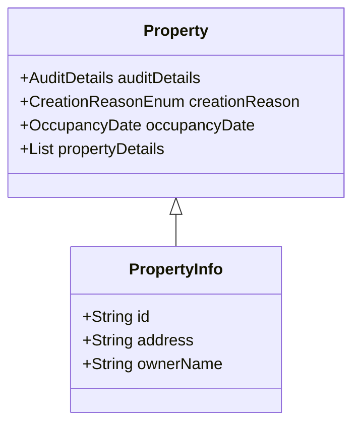

# What is Property Services

Property services are responsible for creating and managing property records within a municipality. These records are stored in a registry and are used for various municipal activities such as assessment, mutation, and amalgamation. Property services ensure that all property-related data is up-to-date and accurate, including tracking properties and the taxes paid for them.

# Property Class

The <SwmToken path="municipal-services/pt-calculator-v2/src/main/java/org/egov/pt/calculator/web/models/property/Property.java" pos="23:3:3" line-data=" * Property">`Property`</SwmToken> class extends <SwmToken path="municipal-services/pt-calculator-v2/src/main/java/org/egov/pt/calculator/web/models/property/Property.java" pos="32:8:8" line-data="public class Property extends PropertyInfo{">`PropertyInfo`</SwmToken> and includes additional attributes such as audit details, creation reason, occupancy date, and a list of property details. This class is used in various services and utilities to manage property data, perform calculations, and generate demands.

<SwmSnippet path="/municipal-services/pt-calculator-v2/src/main/java/org/egov/pt/calculator/web/models/property/Property.java" line="22">

---

The <SwmToken path="municipal-services/pt-calculator-v2/src/main/java/org/egov/pt/calculator/web/models/property/Property.java" pos="23:3:3" line-data=" * Property">`Property`</SwmToken> class is defined with several annotations and attributes. It includes audit details, creation reason, and other property-specific information. This class is crucial for creating property records and storing them in the registry.

```java
/**
 * Property
 */
@Validated
@javax.annotation.Generated(value = "org.egov.codegen.SpringBootCodegen", date = "2018-05-11T14:12:44.497+05:30")
@ToString
@Getter
@Setter
@AllArgsConstructor
@NoArgsConstructor
public class Property extends PropertyInfo{


	@JsonProperty("auditDetails")
	private AuditDetails auditDetails;


	public enum CreationReasonEnum {
		NEWPROPERTY("NEWPROPERTY"),

		SUBDIVISION("SUBDIVISION");
```

---

</SwmSnippet>

# Property Creation

The <SwmToken path="municipal-services/pt-calculator-v2/src/main/java/org/egov/pt/calculator/web/models/property/Property.java" pos="23:3:3" line-data=" * Property">`Property`</SwmToken> class is responsible for creating property records and storing them in a registry. This includes attributes such as audit details, creation reason, occupancy date, and a list of property details. The creation process ensures that all necessary information is captured and stored accurately.

# Property Mutation

Property mutation involves updating existing property records in the registry. This can include changes in ownership, subdivision of properties, or other modifications. The <SwmToken path="municipal-services/pt-calculator-v2/src/main/java/org/egov/pt/calculator/web/models/property/Property.java" pos="23:3:3" line-data=" * Property">`Property`</SwmToken> class plays a key role in handling these mutations by providing the necessary attributes and methods to update the records.

# Property Assessment

Property assessment is the process of evaluating the value of a property for taxation purposes. The <SwmToken path="municipal-services/pt-calculator-v2/src/main/java/org/egov/pt/calculator/web/models/property/Property.java" pos="23:3:3" line-data=" * Property">`Property`</SwmToken> class, along with other utilities, helps in performing these assessments by providing accurate and up-to-date property data.

&nbsp;

*This is an auto-generated document by Swimm AI 🌊 and has not yet been verified by a human*

<SwmMeta version="3.0.0" repo-id="Z2l0aHViJTNBJTNBRElHSVQtT1NTJTNBJTNBU3dpbW0tRGVtbw==" repo-name="DIGIT-OSS" doc-type="overview"><sup>Powered by [Swimm](/)</sup></SwmMeta>
