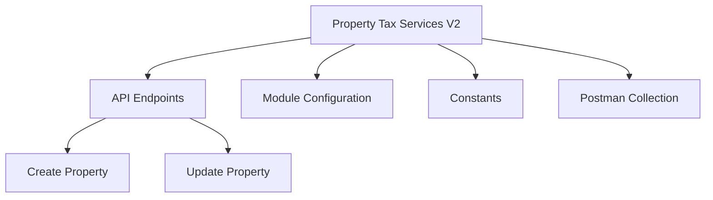

# Overview of Property Tax Services <SwmToken path="municipal-services/pt-services-v2/src/main/java/org/egov/pt/util/PTConstants.java" pos="44:18:18" line-data="    public static final String MODULE = &quot;pt-services-v2&quot;;">`v2`</SwmToken>

Property Tax Services <SwmToken path="municipal-services/pt-services-v2/src/main/java/org/egov/pt/util/PTConstants.java" pos="44:18:18" line-data="    public static final String MODULE = &quot;pt-services-v2&quot;;">`v2`</SwmToken> is a module within the Municipal Services that handles property tax-related functionalities. It provides APIs for creating, updating, and searching property details. The module is built using Spring Boot and includes dependencies for web, JDBC, Flyway, and Swagger. It integrates with PostgreSQL for database operations and uses Lombok for boilerplate code reduction.

## API Endpoints

Property Tax Services <SwmToken path="municipal-services/pt-services-v2/src/main/java/org/egov/pt/util/PTConstants.java" pos="44:18:18" line-data="    public static final String MODULE = &quot;pt-services-v2&quot;;">`v2`</SwmToken> provides several API endpoints for managing property details. These include endpoints for creating, updating, and searching properties. For example, the endpoint <SwmToken path="municipal-services/pt-services-v2/pt-services-v2-dev.postman_collection.json" pos="9:7:15" line-data="			&quot;name&quot;: &quot;pt-services-v2/property/_create&quot;,">`pt-services-v2/property/_create`</SwmToken> is used to create a new property, while <SwmToken path="municipal-services/pt-services-v2/pt-services-v2-dev.postman_collection.json" pos="115:19:27" line-data="					&quot;raw&quot;: &quot;https://egov-micro-dev.egovernments.org/pt-services-v2/property/_update&quot;,">`pt-services-v2/property/_update`</SwmToken> is used to update an existing property.

## Module Configuration

The module configuration is specified in the <SwmPath>[business-services/billing-service/src/main/resources/application.properties](business-services/billing-service/src/main/resources/application.properties)</SwmPath> file. This file sets the context path and server port for the module. For instance, the `server.contextPath` is set to <SwmPath>[municipal-services/pt-services-v2/](municipal-services/pt-services-v2/)</SwmPath> and the `server.port` is set to `8280`.

<SwmSnippet path="/municipal-services/pt-services-v2/src/main/java/org/egov/pt/util/PTConstants.java" line="44">

---

## Constants

The constant <SwmToken path="municipal-services/pt-services-v2/src/main/java/org/egov/pt/util/PTConstants.java" pos="44:9:9" line-data="    public static final String MODULE = &quot;pt-services-v2&quot;;">`MODULE`</SwmToken> is defined to represent the module name <SwmToken path="municipal-services/pt-services-v2/src/main/java/org/egov/pt/util/PTConstants.java" pos="44:14:18" line-data="    public static final String MODULE = &quot;pt-services-v2&quot;;">`pt-services-v2`</SwmToken>. This constant is used throughout the module to maintain consistency and avoid hardcoding values.

```java
    public static final String MODULE = "pt-services-v2";
```

---

</SwmSnippet>

<SwmSnippet path="/municipal-services/pt-services-v2/src/main/java/org/egov/pt/util/PTConstants.java" line="66">

---

The constant <SwmToken path="municipal-services/pt-services-v2/src/main/java/org/egov/pt/util/PTConstants.java" pos="66:9:9" line-data="	public static final String BUSINESSSERVICE_CODE = &quot;PT&quot;;">`BUSINESSSERVICE_CODE`</SwmToken> is defined to represent the business service code <SwmToken path="municipal-services/pt-services-v2/src/main/java/org/egov/pt/util/PTConstants.java" pos="66:14:14" line-data="	public static final String BUSINESSSERVICE_CODE = &quot;PT&quot;;">`PT`</SwmToken>. This constant is used in various parts of the module, such as in the `PaymentNotificationService` class, to ensure consistency.

```java
	public static final String BUSINESSSERVICE_CODE = "PT";
```

---

</SwmSnippet>

## Postman Collection

The module includes a Postman collection for testing the APIs. This collection defines endpoints for property creation, search, and update, allowing developers to easily test the functionality of the module.

<SwmSnippet path="/municipal-services/pt-services-v2/pt-services-v2-dev.postman_collection.json" line="9">

---

### <SwmToken path="municipal-services/pt-services-v2/pt-services-v2-dev.postman_collection.json" pos="9:7:15" line-data="			&quot;name&quot;: &quot;pt-services-v2/property/_create&quot;,">`pt-services-v2/property/_create`</SwmToken>

The <SwmToken path="municipal-services/pt-services-v2/pt-services-v2-dev.postman_collection.json" pos="9:7:15" line-data="			&quot;name&quot;: &quot;pt-services-v2/property/_create&quot;,">`pt-services-v2/property/_create`</SwmToken> endpoint is used to create a new property. It accepts a POST request with a JSON body containing property details. The response includes the created property object with its assigned <SwmToken path="municipal-services/pt-services-v2/pt-services-v2-dev.postman_collection.json" pos="112:3527:3527" line-data="					&quot;raw&quot;: &quot;{\n   \&quot;RequestInfo\&quot;: {\n    \&quot;apiId\&quot;: \&quot;Rainmaker\&quot;,\n    \&quot;action\&quot;: \&quot;\&quot;,\n    \&quot;did\&quot;: 1,\n    \&quot;key\&quot;: \&quot;\&quot;,\n    \&quot;msgId\&quot;: \&quot;20170310130900|en_IN\&quot;,\n    \&quot;requesterId\&quot;: \&quot;\&quot;,\n    \&quot;ts\&quot;: \&quot;\&quot;,\n    \&quot;ver\&quot;: \&quot;.01\&quot;,\n    \&quot;authToken\&quot;: \&quot;0337820a-420a-4daa-8cf1-1f6db293d238\&quot;\n  },\n    \&quot;Properties\&quot;: [\n        {\n            \&quot;auditDetails\&quot;: {\n                \&quot;createdBy\&quot;: \&quot;530968f3-76b3-4fd1-b09d-9e22eb1f85df\&quot;,\n                \&quot;lastModifiedBy\&quot;: \&quot;530968f3-76b3-4fd1-b09d-9e22eb1f85df\&quot;,\n                \&quot;createdTime\&quot;: 1535464498929,\n                \&quot;lastModifiedTime\&quot;: 1535464498929\n            },\n            \&quot;creationReason\&quot;: null,\n            \&quot;occupancyDate\&quot;: 0,\n            \&quot;propertyDetails\&quot;: [\n                {\n                    \&quot;institution\&quot;: null,\n                    \&quot;tenantId\&quot;: \&quot;pb.amritsar\&quot;,\n                    \&quot;citizenInfo\&quot;: {\n                        \&quot;isPrimaryOwner\&quot;: null,\n                        \&quot;ownerShipPercentage\&quot;: null,\n                        \&quot;ownerType\&quot;: null,\n                        \&quot;institutionId\&quot;: null,\n                        \&quot;documents\&quot;: null,\n                        \&quot;relationship\&quot;: null,\n                        \&quot;id\&quot;: 23349,\n                        \&quot;uuid\&quot;: \&quot;530968f3-76b3-4fd1-b09d-9e22eb1f85df\&quot;,\n                        \&quot;userName\&quot;: \&quot;9404052047\&quot;,\n                        \&quot;password\&quot;: null,\n                        \&quot;salutation\&quot;: null,\n                        \&quot;name\&quot;: \&quot;Aniket Talele\&quot;,\n                        \&quot;gender\&quot;: null,\n                        \&quot;mobileNumber\&quot;: \&quot;9404052047\&quot;,\n                        \&quot;emailId\&quot;: \&quot;\&quot;,\n                        \&quot;altContactNumber\&quot;: null,\n                        \&quot;pan\&quot;: null,\n                        \&quot;aadhaarNumber\&quot;: null,\n                        \&quot;permanentAddress\&quot;: null,\n                        \&quot;permanentCity\&quot;: null,\n                        \&quot;permanentPinCode\&quot;: null,\n                        \&quot;correspondenceCity\&quot;: null,\n                        \&quot;correspondencePinCode\&quot;: null,\n                        \&quot;correspondenceAddress\&quot;: null,\n                        \&quot;active\&quot;: null,\n                        \&quot;dob\&quot;: null,\n                        \&quot;pwdExpiryDate\&quot;: null,\n                        \&quot;locale\&quot;: null,\n                        \&quot;type\&quot;: \&quot;CITIZEN\&quot;,\n                        \&quot;signature\&quot;: null,\n                        \&quot;accountLocked\&quot;: null,\n                        \&quot;roles\&quot;: [\n                            {\n                                \&quot;id\&quot;: 281,\n                                \&quot;name\&quot;: \&quot;Citizen\&quot;,\n                                \&quot;code\&quot;: \&quot;CITIZEN\&quot;,\n                                \&quot;description\&quot;: null,\n                                \&quot;createdBy\&quot;: null,\n                                \&quot;createdDate\&quot;: null,\n                                \&quot;lastModifiedBy\&quot;: null,\n                                \&quot;lastModifiedDate\&quot;: null,\n                                \&quot;tenantId\&quot;: null\n                            }\n                        ],\n                        \&quot;fatherOrHusbandName\&quot;: null,\n                        \&quot;bloodGroup\&quot;: null,\n                        \&quot;identificationMark\&quot;: null,\n                        \&quot;photo\&quot;: null,\n                        \&quot;createdBy\&quot;: null,\n                        \&quot;createdDate\&quot;: null,\n                        \&quot;lastModifiedBy\&quot;: null,\n                        \&quot;lastModifiedDate\&quot;: null,\n                        \&quot;otpReference\&quot;: null,\n                        \&quot;tenantId\&quot;: \&quot;pb\&quot;\n                    },\n                    \&quot;source\&quot;: null,\n                    \&quot;usage\&quot;: null,\n                    \&quot;noOfFloors\&quot;: 1,\n                    \&quot;landArea\&quot;: 2000,\n                    \&quot;buildUpArea\&quot;: 0,\n                    \&quot;units\&quot;: [\n                        {\n                            \&quot;id\&quot;: \&quot;19d8acaf-867c-41ef-9adf-f8aaf1add5a5\&quot;,\n                            \&quot;tenantId\&quot;: \&quot;pb.amritsar\&quot;,\n                            \&quot;floorNo\&quot;: \&quot;0\&quot;,\n                            \&quot;unitType\&quot;: null,\n                            \&quot;unitArea\&quot;: 100,\n                            \&quot;usageCategoryMajor\&quot;: \&quot;RESIDENTIAL\&quot;,\n                            \&quot;usageCategoryMinor\&quot;: null,\n                            \&quot;usageCategorySubMinor\&quot;: null,\n                            \&quot;usageCategoryDetail\&quot;: null,\n                            \&quot;occupancyType\&quot;: \&quot;SELFOCCUPIED\&quot;,\n                            \&quot;occupancyDate\&quot;: 0,\n                            \&quot;constructionType\&quot;: null,\n                            \&quot;constructionSubType\&quot;: null,\n                            \&quot;arv\&quot;: null\n                        }\n                    ],\n                    \&quot;documents\&quot;: null,\n                    \&quot;additionalDetails\&quot;: {\n                        \&quot;type\&quot;: \&quot;jsonb\&quot;,\n                        \&quot;value\&quot;: \&quot;null\&quot;\n                    },\n                    \&quot;financialYear\&quot;: \&quot;2017-18\&quot;,\n                    \&quot;propertyType\&quot;: \&quot;BUILTUP\&quot;,\n                    \&quot;propertySubType\&quot;: \&quot;INDEPENDENTPROPERTY\&quot;,\n                    \&quot;assessmentNumber\&quot;: \&quot;AS-2018-08-28-001416\&quot;,\n                    \&quot;assessmentDate\&quot;: 1535464498949,\n                    \&quot;usageCategoryMajor\&quot;: \&quot;RESIDENTIAL\&quot;,\n                    \&quot;ownershipCategory\&quot;: \&quot;INDIVIDUAL\&quot;,\n                    \&quot;subOwnershipCategory\&quot;: \&quot;MULTIPLEOWNERS\&quot;,\n                    \&quot;adhocExemption\&quot;: null,\n                    \&quot;adhocPenalty\&quot;: null,\n                    \&quot;adhocExemptionReason\&quot;: null,\n                    \&quot;adhocPenaltyReason\&quot;: null,\n                    \&quot;owners\&quot;: [\n                        {\n                            \&quot;isPrimaryOwner\&quot;: false,\n                            \&quot;ownerShipPercentage\&quot;: 0,\n                            \&quot;ownerType\&quot;: \&quot;NONE\&quot;,\n                            \&quot;institutionId\&quot;: null,\n                            \&quot;documents\&quot;: null,\n                            \&quot;relationship\&quot;: null,\n                            \&quot;id\&quot;: null,\n                            \&quot;uuid\&quot;: \&quot;be216c54-5db5-4c93-ab18-53dd1a1bc1f0\&quot;,\n                            \&quot;userName\&quot;: \&quot;745c72cb-99e6-460e-9707-3ed4784d554a\&quot;,\n                            \&quot;password\&quot;: null,\n                            \&quot;salutation\&quot;: null,\n                            \&quot;name\&quot;: \&quot;Three\&quot;,\n                            \&quot;gender\&quot;: \&quot;MALE\&quot;,\n                            \&quot;mobileNumber\&quot;: \&quot;9686987977\&quot;,\n                            \&quot;emailId\&quot;: null,\n                            \&quot;altContactNumber\&quot;: null,\n                            \&quot;pan\&quot;: null,\n                            \&quot;aadhaarNumber\&quot;: null,\n                            \&quot;permanentAddress\&quot;: null,\n                            \&quot;permanentCity\&quot;: null,\n                            \&quot;permanentPinCode\&quot;: null,\n                            \&quot;correspondenceCity\&quot;: null,\n                            \&quot;correspondencePinCode\&quot;: null,\n                            \&quot;correspondenceAddress\&quot;: null,\n                            \&quot;active\&quot;: true,\n                            \&quot;dob\&quot;: null,\n                            \&quot;pwdExpiryDate\&quot;: 1543240499000,\n                            \&quot;locale\&quot;: null,\n                            \&quot;type\&quot;: \&quot;CITIZEN\&quot;,\n                            \&quot;signature\&quot;: null,\n                            \&quot;accountLocked\&quot;: false,\n                            \&quot;roles\&quot;: [\n                                {\n                                    \&quot;id\&quot;: 281,\n                                    \&quot;name\&quot;: \&quot;Citizen\&quot;,\n                                    \&quot;code\&quot;: \&quot;CITIZEN\&quot;,\n                                    \&quot;description\&quot;: null,\n                                    \&quot;createdBy\&quot;: null,\n                                    \&quot;createdDate\&quot;: null,\n                                    \&quot;lastModifiedBy\&quot;: null,\n                                    \&quot;lastModifiedDate\&quot;: null,\n                                    \&quot;tenantId\&quot;: null\n                                }\n                            ],\n                            \&quot;fatherOrHusbandName\&quot;: \&quot;Father 3\&quot;,\n                            \&quot;bloodGroup\&quot;: null,\n                            \&quot;identificationMark\&quot;: null,\n                            \&quot;photo\&quot;: null,\n                            \&quot;createdBy\&quot;: \&quot;23349\&quot;,\n                            \&quot;createdDate\&quot;: 1535464499000,\n                            \&quot;lastModifiedBy\&quot;: \&quot;23349\&quot;,\n                            \&quot;lastModifiedDate\&quot;: 1535464499000,\n                            \&quot;otpReference\&quot;: null,\n                            \&quot;tenantId\&quot;: \&quot;pb\&quot;\n                        },\n                        {\n                            \&quot;isPrimaryOwner\&quot;: false,\n                            \&quot;ownerShipPercentage\&quot;: 0,\n                            \&quot;ownerType\&quot;: \&quot;NONE\&quot;,\n                            \&quot;institutionId\&quot;: null,\n                            \&quot;documents\&quot;: null,\n                            \&quot;relationship\&quot;: null,\n                            \&quot;id\&quot;: null,\n                            \&quot;uuid\&quot;: \&quot;26bfbd38-80f9-4b37-8cf2-2d28d80a776a\&quot;,\n                            \&quot;userName\&quot;: \&quot;95d5d7a4-6118-426f-9b2f-6946d2cadb9a\&quot;,\n                            \&quot;password\&quot;: null,\n                            \&quot;salutation\&quot;: null,\n                            \&quot;name\&quot;: \&quot;One\&quot;,\n                            \&quot;gender\&quot;: null,\n                            \&quot;mobileNumber\&quot;: \&quot;9686987977\&quot;,\n                            \&quot;emailId\&quot;: null,\n                            \&quot;altContactNumber\&quot;: null,\n                            \&quot;pan\&quot;: null,\n                            \&quot;aadhaarNumber\&quot;: null,\n                            \&quot;permanentAddress\&quot;: null,\n                            \&quot;permanentCity\&quot;: null,\n                            \&quot;permanentPinCode\&quot;: null,\n                            \&quot;correspondenceCity\&quot;: null,\n                            \&quot;correspondencePinCode\&quot;: null,\n                            \&quot;correspondenceAddress\&quot;: null,\n                            \&quot;active\&quot;: true,\n                            \&quot;dob\&quot;: null,\n                            \&quot;pwdExpiryDate\&quot;: 1543240499000,\n                            \&quot;locale\&quot;: null,\n                            \&quot;type\&quot;: \&quot;CITIZEN\&quot;,\n                            \&quot;signature\&quot;: null,\n                            \&quot;accountLocked\&quot;: false,\n                            \&quot;roles\&quot;: [\n                                {\n                                    \&quot;id\&quot;: 281,\n                                    \&quot;name\&quot;: \&quot;Citizen\&quot;,\n                                    \&quot;code\&quot;: \&quot;CITIZEN\&quot;,\n                                    \&quot;description\&quot;: null,\n                                    \&quot;createdBy\&quot;: null,\n                                    \&quot;createdDate\&quot;: null,\n                                    \&quot;lastModifiedBy\&quot;: null,\n                                    \&quot;lastModifiedDate\&quot;: null,\n                                    \&quot;tenantId\&quot;: null\n                                }\n                            ],\n                            \&quot;fatherOrHusbandName\&quot;: \&quot;Father 1\&quot;,\n                            \&quot;bloodGroup\&quot;: null,\n                            \&quot;identificationMark\&quot;: null,\n                            \&quot;photo\&quot;: null,\n                            \&quot;createdBy\&quot;: \&quot;23349\&quot;,\n                            \&quot;createdDate\&quot;: 1535464499000,\n                            \&quot;lastModifiedBy\&quot;: \&quot;23349\&quot;,\n                            \&quot;lastModifiedDate\&quot;: 1535464499000,\n                            \&quot;otpReference\&quot;: null,\n                            \&quot;tenantId\&quot;: \&quot;pb\&quot;\n                        },\n                        {\n                            \&quot;isPrimaryOwner\&quot;: false,\n                            \&quot;ownerShipPercentage\&quot;: 0,\n                            \&quot;ownerType\&quot;: \&quot;NONE\&quot;,\n                            \&quot;institutionId\&quot;: null,\n                            \&quot;documents\&quot;: null,\n                            \&quot;relationship\&quot;: null,\n                            \&quot;id\&quot;: null,\n                            \&quot;uuid\&quot;: \&quot;85606046-bd9a-4225-b208-1f051d752b92\&quot;,\n                            \&quot;userName\&quot;: \&quot;5a555c0a-7957-4662-b632-11d7251c9657\&quot;,\n                            \&quot;password\&quot;: null,\n                            \&quot;salutation\&quot;: null,\n                            \&quot;name\&quot;: \&quot;Two\&quot;,\n                            \&quot;gender\&quot;: \&quot;FEMALE\&quot;,\n                            \&quot;mobileNumber\&quot;: \&quot;9686987977\&quot;,\n                            \&quot;emailId\&quot;: null,\n                            \&quot;altContactNumber\&quot;: null,\n                            \&quot;pan\&quot;: null,\n                            \&quot;aadhaarNumber\&quot;: null,\n                            \&quot;permanentAddress\&quot;: null,\n                            \&quot;permanentCity\&quot;: null,\n                            \&quot;permanentPinCode\&quot;: null,\n                            \&quot;correspondenceCity\&quot;: null,\n                            \&quot;correspondencePinCode\&quot;: null,\n                            \&quot;correspondenceAddress\&quot;: null,\n                            \&quot;active\&quot;: true,\n                            \&quot;dob\&quot;: null,\n                            \&quot;pwdExpiryDate\&quot;: 1543240499000,\n                            \&quot;locale\&quot;: null,\n                            \&quot;type\&quot;: \&quot;CITIZEN\&quot;,\n                            \&quot;signature\&quot;: null,\n                            \&quot;accountLocked\&quot;: false,\n                            \&quot;roles\&quot;: [\n                                {\n                                    \&quot;id\&quot;: 281,\n                                    \&quot;name\&quot;: \&quot;Citizen\&quot;,\n                                    \&quot;code\&quot;: \&quot;CITIZEN\&quot;,\n                                    \&quot;description\&quot;: null,\n                                    \&quot;createdBy\&quot;: null,\n                                    \&quot;createdDate\&quot;: null,\n                                    \&quot;lastModifiedBy\&quot;: null,\n                                    \&quot;lastModifiedDate\&quot;: null,\n                                    \&quot;tenantId\&quot;: null\n                                }\n                            ],\n                            \&quot;fatherOrHusbandName\&quot;: \&quot;Father 2\&quot;,\n                            \&quot;bloodGroup\&quot;: null,\n                            \&quot;identificationMark\&quot;: null,\n                            \&quot;photo\&quot;: null,\n                            \&quot;createdBy\&quot;: \&quot;23349\&quot;,\n                            \&quot;createdDate\&quot;: 1535464499000,\n                            \&quot;lastModifiedBy\&quot;: \&quot;23349\&quot;,\n                            \&quot;lastModifiedDate\&quot;: 1535464499000,\n                            \&quot;otpReference\&quot;: null,\n                            \&quot;tenantId\&quot;: \&quot;pb\&quot;\n                        }\n                    ],\n                    \&quot;auditDetails\&quot;: {\n                        \&quot;createdBy\&quot;: \&quot;530968f3-76b3-4fd1-b09d-9e22eb1f85df\&quot;,\n                        \&quot;lastModifiedBy\&quot;: \&quot;530968f3-76b3-4fd1-b09d-9e22eb1f85df\&quot;,\n                        \&quot;createdTime\&quot;: 1535464498929,\n                        \&quot;lastModifiedTime\&quot;: 1535464498929\n                    },\n                    \&quot;calculation\&quot;: null,\n                    \&quot;channel\&quot;: null\n                }\n            ],\n            \&quot;propertyId\&quot;: \&quot;PT-107-001323\&quot;,\n            \&quot;tenantId\&quot;: \&quot;pb.amritsar\&quot;,\n            \&quot;acknowldgementNumber\&quot;: \&quot;PB-AC-2018-08-28-001333\&quot;,\n            \&quot;oldPropertyId\&quot;: null,\n            \&quot;status\&quot;: \&quot;ACTIVE\&quot;,\n            \&quot;address\&quot;: {\n                \&quot;id\&quot;: \&quot;f8772061-313c-4243-8fe4-d652237a8d4b\&quot;,\n                \&quot;tenantId\&quot;: \&quot;pb.amritsar\&quot;,\n                \&quot;latitude\&quot;: 0,\n                \&quot;longitude\&quot;: 0,\n                \&quot;addressId\&quot;: null,\n                \&quot;addressNumber\&quot;: null,\n                \&quot;type\&quot;: null,\n                \&quot;addressLine1\&quot;: null,\n                \&quot;addressLine2\&quot;: null,\n                \&quot;landmark\&quot;: null,\n                \&quot;doorNo\&quot;: \&quot;456\&quot;,\n                \&quot;city\&quot;: \&quot;Amritsar\&quot;,\n                \&quot;pincode\&quot;: null,\n                \&quot;detail\&quot;: null,\n                \&quot;buildingName\&quot;: null,\n                \&quot;street\&quot;: null,\n                \&quot;locality\&quot;: {\n                    \&quot;code\&quot;: \&quot;SUN04\&quot;,\n                    \&quot;name\&quot;: \&quot;Ajit Nagar - Area1\&quot;,\n                    \&quot;label\&quot;: \&quot;Locality\&quot;,\n                    \&quot;latitude\&quot;: null,\n                    \&quot;longitude\&quot;: null,\n                    \&quot;area\&quot;: \&quot;Area1\&quot;,\n                    \&quot;children\&quot;: [],\n                    \&quot;materializedPath\&quot;: null\n                }\n            }\n        }\n    ]\n\t\n}&quot;">`propertyId`</SwmToken> and <SwmToken path="municipal-services/pt-services-v2/pt-services-v2-dev.postman_collection.json" pos="112:1327:1327" line-data="					&quot;raw&quot;: &quot;{\n   \&quot;RequestInfo\&quot;: {\n    \&quot;apiId\&quot;: \&quot;Rainmaker\&quot;,\n    \&quot;action\&quot;: \&quot;\&quot;,\n    \&quot;did\&quot;: 1,\n    \&quot;key\&quot;: \&quot;\&quot;,\n    \&quot;msgId\&quot;: \&quot;20170310130900|en_IN\&quot;,\n    \&quot;requesterId\&quot;: \&quot;\&quot;,\n    \&quot;ts\&quot;: \&quot;\&quot;,\n    \&quot;ver\&quot;: \&quot;.01\&quot;,\n    \&quot;authToken\&quot;: \&quot;0337820a-420a-4daa-8cf1-1f6db293d238\&quot;\n  },\n    \&quot;Properties\&quot;: [\n        {\n            \&quot;auditDetails\&quot;: {\n                \&quot;createdBy\&quot;: \&quot;530968f3-76b3-4fd1-b09d-9e22eb1f85df\&quot;,\n                \&quot;lastModifiedBy\&quot;: \&quot;530968f3-76b3-4fd1-b09d-9e22eb1f85df\&quot;,\n                \&quot;createdTime\&quot;: 1535464498929,\n                \&quot;lastModifiedTime\&quot;: 1535464498929\n            },\n            \&quot;creationReason\&quot;: null,\n            \&quot;occupancyDate\&quot;: 0,\n            \&quot;propertyDetails\&quot;: [\n                {\n                    \&quot;institution\&quot;: null,\n                    \&quot;tenantId\&quot;: \&quot;pb.amritsar\&quot;,\n                    \&quot;citizenInfo\&quot;: {\n                        \&quot;isPrimaryOwner\&quot;: null,\n                        \&quot;ownerShipPercentage\&quot;: null,\n                        \&quot;ownerType\&quot;: null,\n                        \&quot;institutionId\&quot;: null,\n                        \&quot;documents\&quot;: null,\n                        \&quot;relationship\&quot;: null,\n                        \&quot;id\&quot;: 23349,\n                        \&quot;uuid\&quot;: \&quot;530968f3-76b3-4fd1-b09d-9e22eb1f85df\&quot;,\n                        \&quot;userName\&quot;: \&quot;9404052047\&quot;,\n                        \&quot;password\&quot;: null,\n                        \&quot;salutation\&quot;: null,\n                        \&quot;name\&quot;: \&quot;Aniket Talele\&quot;,\n                        \&quot;gender\&quot;: null,\n                        \&quot;mobileNumber\&quot;: \&quot;9404052047\&quot;,\n                        \&quot;emailId\&quot;: \&quot;\&quot;,\n                        \&quot;altContactNumber\&quot;: null,\n                        \&quot;pan\&quot;: null,\n                        \&quot;aadhaarNumber\&quot;: null,\n                        \&quot;permanentAddress\&quot;: null,\n                        \&quot;permanentCity\&quot;: null,\n                        \&quot;permanentPinCode\&quot;: null,\n                        \&quot;correspondenceCity\&quot;: null,\n                        \&quot;correspondencePinCode\&quot;: null,\n                        \&quot;correspondenceAddress\&quot;: null,\n                        \&quot;active\&quot;: null,\n                        \&quot;dob\&quot;: null,\n                        \&quot;pwdExpiryDate\&quot;: null,\n                        \&quot;locale\&quot;: null,\n                        \&quot;type\&quot;: \&quot;CITIZEN\&quot;,\n                        \&quot;signature\&quot;: null,\n                        \&quot;accountLocked\&quot;: null,\n                        \&quot;roles\&quot;: [\n                            {\n                                \&quot;id\&quot;: 281,\n                                \&quot;name\&quot;: \&quot;Citizen\&quot;,\n                                \&quot;code\&quot;: \&quot;CITIZEN\&quot;,\n                                \&quot;description\&quot;: null,\n                                \&quot;createdBy\&quot;: null,\n                                \&quot;createdDate\&quot;: null,\n                                \&quot;lastModifiedBy\&quot;: null,\n                                \&quot;lastModifiedDate\&quot;: null,\n                                \&quot;tenantId\&quot;: null\n                            }\n                        ],\n                        \&quot;fatherOrHusbandName\&quot;: null,\n                        \&quot;bloodGroup\&quot;: null,\n                        \&quot;identificationMark\&quot;: null,\n                        \&quot;photo\&quot;: null,\n                        \&quot;createdBy\&quot;: null,\n                        \&quot;createdDate\&quot;: null,\n                        \&quot;lastModifiedBy\&quot;: null,\n                        \&quot;lastModifiedDate\&quot;: null,\n                        \&quot;otpReference\&quot;: null,\n                        \&quot;tenantId\&quot;: \&quot;pb\&quot;\n                    },\n                    \&quot;source\&quot;: null,\n                    \&quot;usage\&quot;: null,\n                    \&quot;noOfFloors\&quot;: 1,\n                    \&quot;landArea\&quot;: 2000,\n                    \&quot;buildUpArea\&quot;: 0,\n                    \&quot;units\&quot;: [\n                        {\n                            \&quot;id\&quot;: \&quot;19d8acaf-867c-41ef-9adf-f8aaf1add5a5\&quot;,\n                            \&quot;tenantId\&quot;: \&quot;pb.amritsar\&quot;,\n                            \&quot;floorNo\&quot;: \&quot;0\&quot;,\n                            \&quot;unitType\&quot;: null,\n                            \&quot;unitArea\&quot;: 100,\n                            \&quot;usageCategoryMajor\&quot;: \&quot;RESIDENTIAL\&quot;,\n                            \&quot;usageCategoryMinor\&quot;: null,\n                            \&quot;usageCategorySubMinor\&quot;: null,\n                            \&quot;usageCategoryDetail\&quot;: null,\n                            \&quot;occupancyType\&quot;: \&quot;SELFOCCUPIED\&quot;,\n                            \&quot;occupancyDate\&quot;: 0,\n                            \&quot;constructionType\&quot;: null,\n                            \&quot;constructionSubType\&quot;: null,\n                            \&quot;arv\&quot;: null\n                        }\n                    ],\n                    \&quot;documents\&quot;: null,\n                    \&quot;additionalDetails\&quot;: {\n                        \&quot;type\&quot;: \&quot;jsonb\&quot;,\n                        \&quot;value\&quot;: \&quot;null\&quot;\n                    },\n                    \&quot;financialYear\&quot;: \&quot;2017-18\&quot;,\n                    \&quot;propertyType\&quot;: \&quot;BUILTUP\&quot;,\n                    \&quot;propertySubType\&quot;: \&quot;INDEPENDENTPROPERTY\&quot;,\n                    \&quot;assessmentNumber\&quot;: \&quot;AS-2018-08-28-001416\&quot;,\n                    \&quot;assessmentDate\&quot;: 1535464498949,\n                    \&quot;usageCategoryMajor\&quot;: \&quot;RESIDENTIAL\&quot;,\n                    \&quot;ownershipCategory\&quot;: \&quot;INDIVIDUAL\&quot;,\n                    \&quot;subOwnershipCategory\&quot;: \&quot;MULTIPLEOWNERS\&quot;,\n                    \&quot;adhocExemption\&quot;: null,\n                    \&quot;adhocPenalty\&quot;: null,\n                    \&quot;adhocExemptionReason\&quot;: null,\n                    \&quot;adhocPenaltyReason\&quot;: null,\n                    \&quot;owners\&quot;: [\n                        {\n                            \&quot;isPrimaryOwner\&quot;: false,\n                            \&quot;ownerShipPercentage\&quot;: 0,\n                            \&quot;ownerType\&quot;: \&quot;NONE\&quot;,\n                            \&quot;institutionId\&quot;: null,\n                            \&quot;documents\&quot;: null,\n                            \&quot;relationship\&quot;: null,\n                            \&quot;id\&quot;: null,\n                            \&quot;uuid\&quot;: \&quot;be216c54-5db5-4c93-ab18-53dd1a1bc1f0\&quot;,\n                            \&quot;userName\&quot;: \&quot;745c72cb-99e6-460e-9707-3ed4784d554a\&quot;,\n                            \&quot;password\&quot;: null,\n                            \&quot;salutation\&quot;: null,\n                            \&quot;name\&quot;: \&quot;Three\&quot;,\n                            \&quot;gender\&quot;: \&quot;MALE\&quot;,\n                            \&quot;mobileNumber\&quot;: \&quot;9686987977\&quot;,\n                            \&quot;emailId\&quot;: null,\n                            \&quot;altContactNumber\&quot;: null,\n                            \&quot;pan\&quot;: null,\n                            \&quot;aadhaarNumber\&quot;: null,\n                            \&quot;permanentAddress\&quot;: null,\n                            \&quot;permanentCity\&quot;: null,\n                            \&quot;permanentPinCode\&quot;: null,\n                            \&quot;correspondenceCity\&quot;: null,\n                            \&quot;correspondencePinCode\&quot;: null,\n                            \&quot;correspondenceAddress\&quot;: null,\n                            \&quot;active\&quot;: true,\n                            \&quot;dob\&quot;: null,\n                            \&quot;pwdExpiryDate\&quot;: 1543240499000,\n                            \&quot;locale\&quot;: null,\n                            \&quot;type\&quot;: \&quot;CITIZEN\&quot;,\n                            \&quot;signature\&quot;: null,\n                            \&quot;accountLocked\&quot;: false,\n                            \&quot;roles\&quot;: [\n                                {\n                                    \&quot;id\&quot;: 281,\n                                    \&quot;name\&quot;: \&quot;Citizen\&quot;,\n                                    \&quot;code\&quot;: \&quot;CITIZEN\&quot;,\n                                    \&quot;description\&quot;: null,\n                                    \&quot;createdBy\&quot;: null,\n                                    \&quot;createdDate\&quot;: null,\n                                    \&quot;lastModifiedBy\&quot;: null,\n                                    \&quot;lastModifiedDate\&quot;: null,\n                                    \&quot;tenantId\&quot;: null\n                                }\n                            ],\n                            \&quot;fatherOrHusbandName\&quot;: \&quot;Father 3\&quot;,\n                            \&quot;bloodGroup\&quot;: null,\n                            \&quot;identificationMark\&quot;: null,\n                            \&quot;photo\&quot;: null,\n                            \&quot;createdBy\&quot;: \&quot;23349\&quot;,\n                            \&quot;createdDate\&quot;: 1535464499000,\n                            \&quot;lastModifiedBy\&quot;: \&quot;23349\&quot;,\n                            \&quot;lastModifiedDate\&quot;: 1535464499000,\n                            \&quot;otpReference\&quot;: null,\n                            \&quot;tenantId\&quot;: \&quot;pb\&quot;\n                        },\n                        {\n                            \&quot;isPrimaryOwner\&quot;: false,\n                            \&quot;ownerShipPercentage\&quot;: 0,\n                            \&quot;ownerType\&quot;: \&quot;NONE\&quot;,\n                            \&quot;institutionId\&quot;: null,\n                            \&quot;documents\&quot;: null,\n                            \&quot;relationship\&quot;: null,\n                            \&quot;id\&quot;: null,\n                            \&quot;uuid\&quot;: \&quot;26bfbd38-80f9-4b37-8cf2-2d28d80a776a\&quot;,\n                            \&quot;userName\&quot;: \&quot;95d5d7a4-6118-426f-9b2f-6946d2cadb9a\&quot;,\n                            \&quot;password\&quot;: null,\n                            \&quot;salutation\&quot;: null,\n                            \&quot;name\&quot;: \&quot;One\&quot;,\n                            \&quot;gender\&quot;: null,\n                            \&quot;mobileNumber\&quot;: \&quot;9686987977\&quot;,\n                            \&quot;emailId\&quot;: null,\n                            \&quot;altContactNumber\&quot;: null,\n                            \&quot;pan\&quot;: null,\n                            \&quot;aadhaarNumber\&quot;: null,\n                            \&quot;permanentAddress\&quot;: null,\n                            \&quot;permanentCity\&quot;: null,\n                            \&quot;permanentPinCode\&quot;: null,\n                            \&quot;correspondenceCity\&quot;: null,\n                            \&quot;correspondencePinCode\&quot;: null,\n                            \&quot;correspondenceAddress\&quot;: null,\n                            \&quot;active\&quot;: true,\n                            \&quot;dob\&quot;: null,\n                            \&quot;pwdExpiryDate\&quot;: 1543240499000,\n                            \&quot;locale\&quot;: null,\n                            \&quot;type\&quot;: \&quot;CITIZEN\&quot;,\n                            \&quot;signature\&quot;: null,\n                            \&quot;accountLocked\&quot;: false,\n                            \&quot;roles\&quot;: [\n                                {\n                                    \&quot;id\&quot;: 281,\n                                    \&quot;name\&quot;: \&quot;Citizen\&quot;,\n                                    \&quot;code\&quot;: \&quot;CITIZEN\&quot;,\n                                    \&quot;description\&quot;: null,\n                                    \&quot;createdBy\&quot;: null,\n                                    \&quot;createdDate\&quot;: null,\n                                    \&quot;lastModifiedBy\&quot;: null,\n                                    \&quot;lastModifiedDate\&quot;: null,\n                                    \&quot;tenantId\&quot;: null\n                                }\n                            ],\n                            \&quot;fatherOrHusbandName\&quot;: \&quot;Father 1\&quot;,\n                            \&quot;bloodGroup\&quot;: null,\n                            \&quot;identificationMark\&quot;: null,\n                            \&quot;photo\&quot;: null,\n                            \&quot;createdBy\&quot;: \&quot;23349\&quot;,\n                            \&quot;createdDate\&quot;: 1535464499000,\n                            \&quot;lastModifiedBy\&quot;: \&quot;23349\&quot;,\n                            \&quot;lastModifiedDate\&quot;: 1535464499000,\n                            \&quot;otpReference\&quot;: null,\n                            \&quot;tenantId\&quot;: \&quot;pb\&quot;\n                        },\n                        {\n                            \&quot;isPrimaryOwner\&quot;: false,\n                            \&quot;ownerShipPercentage\&quot;: 0,\n                            \&quot;ownerType\&quot;: \&quot;NONE\&quot;,\n                            \&quot;institutionId\&quot;: null,\n                            \&quot;documents\&quot;: null,\n                            \&quot;relationship\&quot;: null,\n                            \&quot;id\&quot;: null,\n                            \&quot;uuid\&quot;: \&quot;85606046-bd9a-4225-b208-1f051d752b92\&quot;,\n                            \&quot;userName\&quot;: \&quot;5a555c0a-7957-4662-b632-11d7251c9657\&quot;,\n                            \&quot;password\&quot;: null,\n                            \&quot;salutation\&quot;: null,\n                            \&quot;name\&quot;: \&quot;Two\&quot;,\n                            \&quot;gender\&quot;: \&quot;FEMALE\&quot;,\n                            \&quot;mobileNumber\&quot;: \&quot;9686987977\&quot;,\n                            \&quot;emailId\&quot;: null,\n                            \&quot;altContactNumber\&quot;: null,\n                            \&quot;pan\&quot;: null,\n                            \&quot;aadhaarNumber\&quot;: null,\n                            \&quot;permanentAddress\&quot;: null,\n                            \&quot;permanentCity\&quot;: null,\n                            \&quot;permanentPinCode\&quot;: null,\n                            \&quot;correspondenceCity\&quot;: null,\n                            \&quot;correspondencePinCode\&quot;: null,\n                            \&quot;correspondenceAddress\&quot;: null,\n                            \&quot;active\&quot;: true,\n                            \&quot;dob\&quot;: null,\n                            \&quot;pwdExpiryDate\&quot;: 1543240499000,\n                            \&quot;locale\&quot;: null,\n                            \&quot;type\&quot;: \&quot;CITIZEN\&quot;,\n                            \&quot;signature\&quot;: null,\n                            \&quot;accountLocked\&quot;: false,\n                            \&quot;roles\&quot;: [\n                                {\n                                    \&quot;id\&quot;: 281,\n                                    \&quot;name\&quot;: \&quot;Citizen\&quot;,\n                                    \&quot;code\&quot;: \&quot;CITIZEN\&quot;,\n                                    \&quot;description\&quot;: null,\n                                    \&quot;createdBy\&quot;: null,\n                                    \&quot;createdDate\&quot;: null,\n                                    \&quot;lastModifiedBy\&quot;: null,\n                                    \&quot;lastModifiedDate\&quot;: null,\n                                    \&quot;tenantId\&quot;: null\n                                }\n                            ],\n                            \&quot;fatherOrHusbandName\&quot;: \&quot;Father 2\&quot;,\n                            \&quot;bloodGroup\&quot;: null,\n                            \&quot;identificationMark\&quot;: null,\n                            \&quot;photo\&quot;: null,\n                            \&quot;createdBy\&quot;: \&quot;23349\&quot;,\n                            \&quot;createdDate\&quot;: 1535464499000,\n                            \&quot;lastModifiedBy\&quot;: \&quot;23349\&quot;,\n                            \&quot;lastModifiedDate\&quot;: 1535464499000,\n                            \&quot;otpReference\&quot;: null,\n                            \&quot;tenantId\&quot;: \&quot;pb\&quot;\n                        }\n                    ],\n                    \&quot;auditDetails\&quot;: {\n                        \&quot;createdBy\&quot;: \&quot;530968f3-76b3-4fd1-b09d-9e22eb1f85df\&quot;,\n                        \&quot;lastModifiedBy\&quot;: \&quot;530968f3-76b3-4fd1-b09d-9e22eb1f85df\&quot;,\n                        \&quot;createdTime\&quot;: 1535464498929,\n                        \&quot;lastModifiedTime\&quot;: 1535464498929\n                    },\n                    \&quot;calculation\&quot;: null,\n                    \&quot;channel\&quot;: null\n                }\n            ],\n            \&quot;propertyId\&quot;: \&quot;PT-107-001323\&quot;,\n            \&quot;tenantId\&quot;: \&quot;pb.amritsar\&quot;,\n            \&quot;acknowldgementNumber\&quot;: \&quot;PB-AC-2018-08-28-001333\&quot;,\n            \&quot;oldPropertyId\&quot;: null,\n            \&quot;status\&quot;: \&quot;ACTIVE\&quot;,\n            \&quot;address\&quot;: {\n                \&quot;id\&quot;: \&quot;f8772061-313c-4243-8fe4-d652237a8d4b\&quot;,\n                \&quot;tenantId\&quot;: \&quot;pb.amritsar\&quot;,\n                \&quot;latitude\&quot;: 0,\n                \&quot;longitude\&quot;: 0,\n                \&quot;addressId\&quot;: null,\n                \&quot;addressNumber\&quot;: null,\n                \&quot;type\&quot;: null,\n                \&quot;addressLine1\&quot;: null,\n                \&quot;addressLine2\&quot;: null,\n                \&quot;landmark\&quot;: null,\n                \&quot;doorNo\&quot;: \&quot;456\&quot;,\n                \&quot;city\&quot;: \&quot;Amritsar\&quot;,\n                \&quot;pincode\&quot;: null,\n                \&quot;detail\&quot;: null,\n                \&quot;buildingName\&quot;: null,\n                \&quot;street\&quot;: null,\n                \&quot;locality\&quot;: {\n                    \&quot;code\&quot;: \&quot;SUN04\&quot;,\n                    \&quot;name\&quot;: \&quot;Ajit Nagar - Area1\&quot;,\n                    \&quot;label\&quot;: \&quot;Locality\&quot;,\n                    \&quot;latitude\&quot;: null,\n                    \&quot;longitude\&quot;: null,\n                    \&quot;area\&quot;: \&quot;Area1\&quot;,\n                    \&quot;children\&quot;: [],\n                    \&quot;materializedPath\&quot;: null\n                }\n            }\n        }\n    ]\n\t\n}&quot;">`assessmentNumber`</SwmToken>.

```json
			"name": "pt-services-v2/property/_create",
			"request": {
				"method": "POST",
				"header": [
					{
						"key": "Content-Type",
						"value": "application/json"
					}
				],
				"body": {
					"mode": "raw",
					"raw": "{\n  \"RequestInfo\": {\n    \"apiId\": \"Rainmaker\",\n    \"ver\": \".01\",\n    \"ts\": \"\",\n    \"action\": \"_create\",\n    \"did\": \"1\",\n    \"key\": \"\",\n    \"msgId\": \"20170310130900|en_IN\",\n    \"authToken\": \"b21b9896-79d8-42a6-9b5e-404d7e1d269e\"\n  },\n   \"Properties\":  [\n   {\n        \"propertyDetails\": [\n          { \n          \t\"additionalDetails\":{\n          \t  \"height\":100,\n          \t  \"type\":\"temporary\"\n          },\n            \"financialYear\": \"2018-19\",\n            \"usageCategoryMinor\": \"COMMERCIAL\",\n            \"units\": [\n              {\n                \"floorNo\": \"0\",\n                \"usageCategoryMinor\": \"COMMERCIAL\",\n                \"usageCategoryMajor\": \"NONRESIDENTIAL\",\n                \"usageCategoryDetail\": \"ACRESTAURANT\",\n                \"usageCategorySubMinor\": \"FOODJOINTS\",\n                \"occupancyType\": \"SELFOCCUPIED\",\n                \"unitArea\": 100\n              },\n              {\n                \"floorNo\": \"1\",\n                \"usageCategoryMinor\": \"COMMERCIAL\",\n                \"usageCategoryMajor\": \"NONRESIDENTIAL\",\n                \"usageCategoryDetail\": \"ACRESTAURANT\",\n                \"usageCategorySubMinor\": \"FOODJOINTS\",\n                \"occupancyType\": \"SELFOCCUPIED\",\n                \"unitArea\": 100\n              }\n            ],\n            \"usageCategoryMajor\": \"NONRESIDENTIAL\",\n            \"propertySubType\": \"INDEPENDENTPROPERTY\",\n            \"propertyType\": \"BUILTUP\",\n            \"noOfFloors\": 2,\n            \"buildUpArea\": null,\n            \"landArea\": \"1000\",\n            \"subOwnershipCategory\": \"SINGLEOWNER\",\n            \"ownershipCategory\": \"INDIVIDUAL\",\n            \"owners\": [\n              {\n                \"name\": \"as\",\n                \"mobileNumber\": \"9999999999\",\n                \"fatherOrHusbandName\": \"asd\",\n                \"emailId\": null,\n                \"permanentAddress\": null,\n                \"relationship\": \"father\",\n                \"ownerType\": \"NONE\",\n                \"gender\": \"Male\"\n              }\n            ]\n          }\n        ],\n        \"tenantId\": \"pb.amritsar\",\n        \"address\": {\n          \"city\": \"Amritsar\",\n          \"locality\": {\n            \"code\": \"SUN04\",\n            \"area\": \"Area1\"\n          }\n        }\n      }\n  ]\n}"
				},
				"url": {
					"raw": "https://egov-micro-dev.egovernments.org/pt-services-v2/property/_create",
					"protocol": "https",
					"host": [
						"egov-micro-dev",
						"egovernments",
						"org"
					],
```

---

</SwmSnippet>

<SwmSnippet path="/municipal-services/pt-services-v2/pt-services-v2-dev.postman_collection.json" line="101">

---

### <SwmToken path="municipal-services/pt-services-v2/pt-services-v2-dev.postman_collection.json" pos="115:19:27" line-data="					&quot;raw&quot;: &quot;https://egov-micro-dev.egovernments.org/pt-services-v2/property/_update&quot;,">`pt-services-v2/property/_update`</SwmToken>

The <SwmToken path="municipal-services/pt-services-v2/pt-services-v2-dev.postman_collection.json" pos="115:19:27" line-data="					&quot;raw&quot;: &quot;https://egov-micro-dev.egovernments.org/pt-services-v2/property/_update&quot;,">`pt-services-v2/property/_update`</SwmToken> endpoint is used to update an existing property. It accepts a POST request with a JSON body containing updated property details. The response includes the updated property object.

```json
			"name": "pt update",
			"request": {
				"method": "POST",
				"header": [
					{
						"key": "Content-Type",
						"value": "application/json"
					}
				],
				"body": {
					"mode": "raw",
					"raw": "{\n   \"RequestInfo\": {\n    \"apiId\": \"Rainmaker\",\n    \"action\": \"\",\n    \"did\": 1,\n    \"key\": \"\",\n    \"msgId\": \"20170310130900|en_IN\",\n    \"requesterId\": \"\",\n    \"ts\": \"\",\n    \"ver\": \".01\",\n    \"authToken\": \"0337820a-420a-4daa-8cf1-1f6db293d238\"\n  },\n    \"Properties\": [\n        {\n            \"auditDetails\": {\n                \"createdBy\": \"530968f3-76b3-4fd1-b09d-9e22eb1f85df\",\n                \"lastModifiedBy\": \"530968f3-76b3-4fd1-b09d-9e22eb1f85df\",\n                \"createdTime\": 1535464498929,\n                \"lastModifiedTime\": 1535464498929\n            },\n            \"creationReason\": null,\n            \"occupancyDate\": 0,\n            \"propertyDetails\": [\n                {\n                    \"institution\": null,\n                    \"tenantId\": \"pb.amritsar\",\n                    \"citizenInfo\": {\n                        \"isPrimaryOwner\": null,\n                        \"ownerShipPercentage\": null,\n                        \"ownerType\": null,\n                        \"institutionId\": null,\n                        \"documents\": null,\n                        \"relationship\": null,\n                        \"id\": 23349,\n                        \"uuid\": \"530968f3-76b3-4fd1-b09d-9e22eb1f85df\",\n                        \"userName\": \"9404052047\",\n                        \"password\": null,\n                        \"salutation\": null,\n                        \"name\": \"Aniket Talele\",\n                        \"gender\": null,\n                        \"mobileNumber\": \"9404052047\",\n                        \"emailId\": \"\",\n                        \"altContactNumber\": null,\n                        \"pan\": null,\n                        \"aadhaarNumber\": null,\n                        \"permanentAddress\": null,\n                        \"permanentCity\": null,\n                        \"permanentPinCode\": null,\n                        \"correspondenceCity\": null,\n                        \"correspondencePinCode\": null,\n                        \"correspondenceAddress\": null,\n                        \"active\": null,\n                        \"dob\": null,\n                        \"pwdExpiryDate\": null,\n                        \"locale\": null,\n                        \"type\": \"CITIZEN\",\n                        \"signature\": null,\n                        \"accountLocked\": null,\n                        \"roles\": [\n                            {\n                                \"id\": 281,\n                                \"name\": \"Citizen\",\n                                \"code\": \"CITIZEN\",\n                                \"description\": null,\n                                \"createdBy\": null,\n                                \"createdDate\": null,\n                                \"lastModifiedBy\": null,\n                                \"lastModifiedDate\": null,\n                                \"tenantId\": null\n                            }\n                        ],\n                        \"fatherOrHusbandName\": null,\n                        \"bloodGroup\": null,\n                        \"identificationMark\": null,\n                        \"photo\": null,\n                        \"createdBy\": null,\n                        \"createdDate\": null,\n                        \"lastModifiedBy\": null,\n                        \"lastModifiedDate\": null,\n                        \"otpReference\": null,\n                        \"tenantId\": \"pb\"\n                    },\n                    \"source\": null,\n                    \"usage\": null,\n                    \"noOfFloors\": 1,\n                    \"landArea\": 2000,\n                    \"buildUpArea\": 0,\n                    \"units\": [\n                        {\n                            \"id\": \"19d8acaf-867c-41ef-9adf-f8aaf1add5a5\",\n                            \"tenantId\": \"pb.amritsar\",\n                            \"floorNo\": \"0\",\n                            \"unitType\": null,\n                            \"unitArea\": 100,\n                            \"usageCategoryMajor\": \"RESIDENTIAL\",\n                            \"usageCategoryMinor\": null,\n                            \"usageCategorySubMinor\": null,\n                            \"usageCategoryDetail\": null,\n                            \"occupancyType\": \"SELFOCCUPIED\",\n                            \"occupancyDate\": 0,\n                            \"constructionType\": null,\n                            \"constructionSubType\": null,\n                            \"arv\": null\n                        }\n                    ],\n                    \"documents\": null,\n                    \"additionalDetails\": {\n                        \"type\": \"jsonb\",\n                        \"value\": \"null\"\n                    },\n                    \"financialYear\": \"2017-18\",\n                    \"propertyType\": \"BUILTUP\",\n                    \"propertySubType\": \"INDEPENDENTPROPERTY\",\n                    \"assessmentNumber\": \"AS-2018-08-28-001416\",\n                    \"assessmentDate\": 1535464498949,\n                    \"usageCategoryMajor\": \"RESIDENTIAL\",\n                    \"ownershipCategory\": \"INDIVIDUAL\",\n                    \"subOwnershipCategory\": \"MULTIPLEOWNERS\",\n                    \"adhocExemption\": null,\n                    \"adhocPenalty\": null,\n                    \"adhocExemptionReason\": null,\n                    \"adhocPenaltyReason\": null,\n                    \"owners\": [\n                        {\n                            \"isPrimaryOwner\": false,\n                            \"ownerShipPercentage\": 0,\n                            \"ownerType\": \"NONE\",\n                            \"institutionId\": null,\n                            \"documents\": null,\n                            \"relationship\": null,\n                            \"id\": null,\n                            \"uuid\": \"be216c54-5db5-4c93-ab18-53dd1a1bc1f0\",\n                            \"userName\": \"745c72cb-99e6-460e-9707-3ed4784d554a\",\n                            \"password\": null,\n                            \"salutation\": null,\n                            \"name\": \"Three\",\n                            \"gender\": \"MALE\",\n                            \"mobileNumber\": \"9686987977\",\n                            \"emailId\": null,\n                            \"altContactNumber\": null,\n                            \"pan\": null,\n                            \"aadhaarNumber\": null,\n                            \"permanentAddress\": null,\n                            \"permanentCity\": null,\n                            \"permanentPinCode\": null,\n                            \"correspondenceCity\": null,\n                            \"correspondencePinCode\": null,\n                            \"correspondenceAddress\": null,\n                            \"active\": true,\n                            \"dob\": null,\n                            \"pwdExpiryDate\": 1543240499000,\n                            \"locale\": null,\n                            \"type\": \"CITIZEN\",\n                            \"signature\": null,\n                            \"accountLocked\": false,\n                            \"roles\": [\n                                {\n                                    \"id\": 281,\n                                    \"name\": \"Citizen\",\n                                    \"code\": \"CITIZEN\",\n                                    \"description\": null,\n                                    \"createdBy\": null,\n                                    \"createdDate\": null,\n                                    \"lastModifiedBy\": null,\n                                    \"lastModifiedDate\": null,\n                                    \"tenantId\": null\n                                }\n                            ],\n                            \"fatherOrHusbandName\": \"Father 3\",\n                            \"bloodGroup\": null,\n                            \"identificationMark\": null,\n                            \"photo\": null,\n                            \"createdBy\": \"23349\",\n                            \"createdDate\": 1535464499000,\n                            \"lastModifiedBy\": \"23349\",\n                            \"lastModifiedDate\": 1535464499000,\n                            \"otpReference\": null,\n                            \"tenantId\": \"pb\"\n                        },\n                        {\n                            \"isPrimaryOwner\": false,\n                            \"ownerShipPercentage\": 0,\n                            \"ownerType\": \"NONE\",\n                            \"institutionId\": null,\n                            \"documents\": null,\n                            \"relationship\": null,\n                            \"id\": null,\n                            \"uuid\": \"26bfbd38-80f9-4b37-8cf2-2d28d80a776a\",\n                            \"userName\": \"95d5d7a4-6118-426f-9b2f-6946d2cadb9a\",\n                            \"password\": null,\n                            \"salutation\": null,\n                            \"name\": \"One\",\n                            \"gender\": null,\n                            \"mobileNumber\": \"9686987977\",\n                            \"emailId\": null,\n                            \"altContactNumber\": null,\n                            \"pan\": null,\n                            \"aadhaarNumber\": null,\n                            \"permanentAddress\": null,\n                            \"permanentCity\": null,\n                            \"permanentPinCode\": null,\n                            \"correspondenceCity\": null,\n                            \"correspondencePinCode\": null,\n                            \"correspondenceAddress\": null,\n                            \"active\": true,\n                            \"dob\": null,\n                            \"pwdExpiryDate\": 1543240499000,\n                            \"locale\": null,\n                            \"type\": \"CITIZEN\",\n                            \"signature\": null,\n                            \"accountLocked\": false,\n                            \"roles\": [\n                                {\n                                    \"id\": 281,\n                                    \"name\": \"Citizen\",\n                                    \"code\": \"CITIZEN\",\n                                    \"description\": null,\n                                    \"createdBy\": null,\n                                    \"createdDate\": null,\n                                    \"lastModifiedBy\": null,\n                                    \"lastModifiedDate\": null,\n                                    \"tenantId\": null\n                                }\n                            ],\n                            \"fatherOrHusbandName\": \"Father 1\",\n                            \"bloodGroup\": null,\n                            \"identificationMark\": null,\n                            \"photo\": null,\n                            \"createdBy\": \"23349\",\n                            \"createdDate\": 1535464499000,\n                            \"lastModifiedBy\": \"23349\",\n                            \"lastModifiedDate\": 1535464499000,\n                            \"otpReference\": null,\n                            \"tenantId\": \"pb\"\n                        },\n                        {\n                            \"isPrimaryOwner\": false,\n                            \"ownerShipPercentage\": 0,\n                            \"ownerType\": \"NONE\",\n                            \"institutionId\": null,\n                            \"documents\": null,\n                            \"relationship\": null,\n                            \"id\": null,\n                            \"uuid\": \"85606046-bd9a-4225-b208-1f051d752b92\",\n                            \"userName\": \"5a555c0a-7957-4662-b632-11d7251c9657\",\n                            \"password\": null,\n                            \"salutation\": null,\n                            \"name\": \"Two\",\n                            \"gender\": \"FEMALE\",\n                            \"mobileNumber\": \"9686987977\",\n                            \"emailId\": null,\n                            \"altContactNumber\": null,\n                            \"pan\": null,\n                            \"aadhaarNumber\": null,\n                            \"permanentAddress\": null,\n                            \"permanentCity\": null,\n                            \"permanentPinCode\": null,\n                            \"correspondenceCity\": null,\n                            \"correspondencePinCode\": null,\n                            \"correspondenceAddress\": null,\n                            \"active\": true,\n                            \"dob\": null,\n                            \"pwdExpiryDate\": 1543240499000,\n                            \"locale\": null,\n                            \"type\": \"CITIZEN\",\n                            \"signature\": null,\n                            \"accountLocked\": false,\n                            \"roles\": [\n                                {\n                                    \"id\": 281,\n                                    \"name\": \"Citizen\",\n                                    \"code\": \"CITIZEN\",\n                                    \"description\": null,\n                                    \"createdBy\": null,\n                                    \"createdDate\": null,\n                                    \"lastModifiedBy\": null,\n                                    \"lastModifiedDate\": null,\n                                    \"tenantId\": null\n                                }\n                            ],\n                            \"fatherOrHusbandName\": \"Father 2\",\n                            \"bloodGroup\": null,\n                            \"identificationMark\": null,\n                            \"photo\": null,\n                            \"createdBy\": \"23349\",\n                            \"createdDate\": 1535464499000,\n                            \"lastModifiedBy\": \"23349\",\n                            \"lastModifiedDate\": 1535464499000,\n                            \"otpReference\": null,\n                            \"tenantId\": \"pb\"\n                        }\n                    ],\n                    \"auditDetails\": {\n                        \"createdBy\": \"530968f3-76b3-4fd1-b09d-9e22eb1f85df\",\n                        \"lastModifiedBy\": \"530968f3-76b3-4fd1-b09d-9e22eb1f85df\",\n                        \"createdTime\": 1535464498929,\n                        \"lastModifiedTime\": 1535464498929\n                    },\n                    \"calculation\": null,\n                    \"channel\": null\n                }\n            ],\n            \"propertyId\": \"PT-107-001323\",\n            \"tenantId\": \"pb.amritsar\",\n            \"acknowldgementNumber\": \"PB-AC-2018-08-28-001333\",\n            \"oldPropertyId\": null,\n            \"status\": \"ACTIVE\",\n            \"address\": {\n                \"id\": \"f8772061-313c-4243-8fe4-d652237a8d4b\",\n                \"tenantId\": \"pb.amritsar\",\n                \"latitude\": 0,\n                \"longitude\": 0,\n                \"addressId\": null,\n                \"addressNumber\": null,\n                \"type\": null,\n                \"addressLine1\": null,\n                \"addressLine2\": null,\n                \"landmark\": null,\n                \"doorNo\": \"456\",\n                \"city\": \"Amritsar\",\n                \"pincode\": null,\n                \"detail\": null,\n                \"buildingName\": null,\n                \"street\": null,\n                \"locality\": {\n                    \"code\": \"SUN04\",\n                    \"name\": \"Ajit Nagar - Area1\",\n                    \"label\": \"Locality\",\n                    \"latitude\": null,\n                    \"longitude\": null,\n                    \"area\": \"Area1\",\n                    \"children\": [],\n                    \"materializedPath\": null\n                }\n            }\n        }\n    ]\n\t\n}"
				},
				"url": {
					"raw": "https://egov-micro-dev.egovernments.org/pt-services-v2/property/_update",
					"protocol": "https",
					"host": [
						"egov-micro-dev",
						"egovernments",
						"org"
					],
```

---

</SwmSnippet>

&nbsp;

*This is an auto-generated document by Swimm AI 🌊 and has not yet been verified by a human*

<SwmMeta version="3.0.0" repo-id="Z2l0aHViJTNBJTNBRElHSVQtT1NTJTNBJTNBU3dpbW0tRGVtbw==" repo-name="DIGIT-OSS" doc-type="overview"><sup>Powered by [Swimm](/)</sup></SwmMeta>
