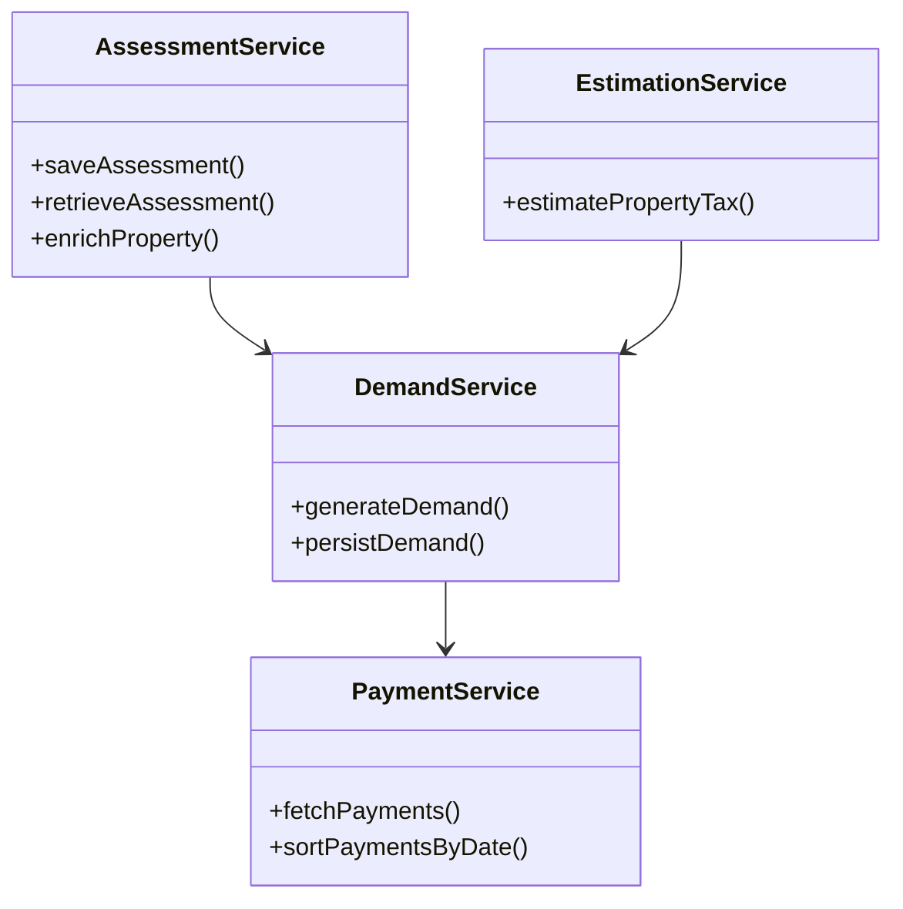

# Overview of Service in Pt calculator v2

Service in Pt calculator v2 refers to various classes that provide specific functionalities related to property tax calculations. These services include operations such as saving and retrieving assessments, calculating tax, generating demands, and enriching property data.

## <SwmToken path="municipal-services/pt-calculator-v2/src/main/java/org/egov/pt/calculator/service/AssessmentService.java" pos="30:4:4" line-data="public class AssessmentService {">`AssessmentService`</SwmToken>

The <SwmToken path="municipal-services/pt-calculator-v2/src/main/java/org/egov/pt/calculator/service/AssessmentService.java" pos="30:4:4" line-data="public class AssessmentService {">`AssessmentService`</SwmToken> class is responsible for saving and retrieving assessments, as well as enriching property objects based on assessment numbers. It uses dependencies like <SwmToken path="municipal-services/pt-calculator-v2/src/main/java/org/egov/pt/calculator/service/AssessmentService.java" pos="33:3:3" line-data="	private CalculatorUtils utils;">`CalculatorUtils`</SwmToken>, <SwmToken path="municipal-services/pt-calculator-v2/src/main/java/org/egov/pt/calculator/service/AssessmentService.java" pos="36:3:3" line-data="	private AssessmentRepository repository;">`AssessmentRepository`</SwmToken>, <SwmToken path="municipal-services/pt-calculator-v2/src/main/java/org/egov/pt/calculator/service/AssessmentService.java" pos="39:3:3" line-data="	private PTCalculatorRepository ptCalculatorRepository;">`PTCalculatorRepository`</SwmToken>, and <SwmToken path="municipal-services/pt-calculator-v2/src/main/java/org/egov/pt/calculator/service/AssessmentService.java" pos="42:3:3" line-data="	private ObjectMapper mapper;">`ObjectMapper`</SwmToken> to perform its operations.

<SwmSnippet path="/municipal-services/pt-calculator-v2/src/main/java/org/egov/pt/calculator/service/AssessmentService.java" line="22">

---

The <SwmToken path="municipal-services/pt-calculator-v2/src/main/java/org/egov/pt/calculator/service/AssessmentService.java" pos="30:4:4" line-data="public class AssessmentService {">`AssessmentService`</SwmToken> class is annotated with <SwmToken path="municipal-services/pt-calculator-v2/src/main/java/org/egov/pt/calculator/service/AssessmentService.java" pos="29:0:1" line-data="@Service">`@Service`</SwmToken> to indicate that it's a Spring service component. It uses various dependencies to perform its operations.

```java
/**
 * AssesmentService
 * 
 * Serves for the purpose of saving and retrieving of assessments
 * 
 * @author kavi elrey
 */
@Service
public class AssessmentService {

	@Autowired
	private CalculatorUtils utils;

	@Autowired
	private AssessmentRepository repository;

	@Autowired
	private PTCalculatorRepository ptCalculatorRepository;

	@Autowired
	private ObjectMapper mapper;
```

---

</SwmSnippet>

## <SwmToken path="municipal-services/pt-calculator-v2/src/main/java/org/egov/pt/calculator/service/DemandService.java" pos="63:4:4" line-data="public class DemandService {">`DemandService`</SwmToken>

The <SwmToken path="municipal-services/pt-calculator-v2/src/main/java/org/egov/pt/calculator/service/DemandService.java" pos="63:4:4" line-data="public class DemandService {">`DemandService`</SwmToken> class generates and persists demands to the billing service for a given property, ensuring that old collection amounts are carried forward as advance. It uses dependencies like <SwmToken path="municipal-services/pt-calculator-v2/src/main/java/org/egov/pt/calculator/service/DemandService.java" pos="66:3:3" line-data="	private EstimationService estimationService;">`EstimationService`</SwmToken>, <SwmToken path="municipal-services/pt-calculator-v2/src/main/java/org/egov/pt/calculator/service/DemandService.java" pos="69:3:3" line-data="	private RestTemplate restTemplate;">`RestTemplate`</SwmToken>, <SwmToken path="municipal-services/pt-calculator-v2/src/main/java/org/egov/pt/calculator/service/DemandService.java" pos="72:3:3" line-data="	private Configurations configs;">`Configurations`</SwmToken>, <SwmToken path="municipal-services/pt-calculator-v2/src/main/java/org/egov/pt/calculator/service/AssessmentService.java" pos="30:4:4" line-data="public class AssessmentService {">`AssessmentService`</SwmToken>, <SwmToken path="municipal-services/pt-calculator-v2/src/main/java/org/egov/pt/calculator/service/AssessmentService.java" pos="33:3:3" line-data="	private CalculatorUtils utils;">`CalculatorUtils`</SwmToken>, and <SwmToken path="municipal-services/pt-calculator-v2/src/main/java/org/egov/pt/calculator/service/AssessmentService.java" pos="36:5:5" line-data="	private AssessmentRepository repository;">`repository`</SwmToken>.

<SwmSnippet path="/municipal-services/pt-calculator-v2/src/main/java/org/egov/pt/calculator/service/DemandService.java" line="61">

---

The <SwmToken path="municipal-services/pt-calculator-v2/src/main/java/org/egov/pt/calculator/service/DemandService.java" pos="63:4:4" line-data="public class DemandService {">`DemandService`</SwmToken> class is annotated with <SwmToken path="municipal-services/pt-calculator-v2/src/main/java/org/egov/pt/calculator/service/DemandService.java" pos="61:0:1" line-data="@Service">`@Service`</SwmToken> and <SwmToken path="municipal-services/pt-calculator-v2/src/main/java/org/egov/pt/calculator/service/DemandService.java" pos="62:0:1" line-data="@Slf4j">`@Slf4j`</SwmToken> to indicate that it's a Spring service component and to enable logging.

```java
@Service
@Slf4j
public class DemandService {

	@Autowired
	private EstimationService estimationService;

	@Autowired
	private RestTemplate restTemplate;

	@Autowired
	private Configurations configs;

	@Autowired
	private AssessmentService assessmentService;

	@Autowired
	private CalculatorUtils utils;

	@Autowired
	private Repository repository;
```

---

</SwmSnippet>

## <SwmToken path="municipal-services/pt-calculator-v2/src/main/java/org/egov/pt/calculator/service/PaymentService.java" pos="32:4:4" line-data="public class PaymentService {">`PaymentService`</SwmToken>

The <SwmToken path="municipal-services/pt-calculator-v2/src/main/java/org/egov/pt/calculator/service/PaymentService.java" pos="32:4:4" line-data="public class PaymentService {">`PaymentService`</SwmToken> class handles fetching payments corresponding to given demands or properties and sorts them by transaction date. It uses dependencies like <SwmToken path="municipal-services/pt-calculator-v2/src/main/java/org/egov/pt/calculator/service/AssessmentService.java" pos="36:5:5" line-data="	private AssessmentRepository repository;">`repository`</SwmToken>, <SwmToken path="municipal-services/pt-calculator-v2/src/main/java/org/egov/pt/calculator/service/AssessmentService.java" pos="42:3:3" line-data="	private ObjectMapper mapper;">`ObjectMapper`</SwmToken>, and <SwmToken path="municipal-services/pt-calculator-v2/src/main/java/org/egov/pt/calculator/service/DemandService.java" pos="72:3:3" line-data="	private Configurations configs;">`Configurations`</SwmToken>.

<SwmSnippet path="/municipal-services/pt-calculator-v2/src/main/java/org/egov/pt/calculator/service/PaymentService.java" line="31">

---

The <SwmToken path="municipal-services/pt-calculator-v2/src/main/java/org/egov/pt/calculator/service/PaymentService.java" pos="32:4:4" line-data="public class PaymentService {">`PaymentService`</SwmToken> class is annotated with <SwmToken path="municipal-services/pt-calculator-v2/src/main/java/org/egov/pt/calculator/service/PaymentService.java" pos="31:0:1" line-data="@Service">`@Service`</SwmToken> to indicate that it's a Spring service component. It includes a method to get all payments corresponding to a given demand.

```java
@Service
public class PaymentService {


	@Autowired
    private Repository repository;

	@Autowired
    private ObjectMapper mapper;

    @Autowired
    private Configurations configurations;


    /**
     * Gets all payments corresponding to the given demand
     * @param demand
     * @param requestInfoWrapper
     * @return
     */
    public List<Payment> getPaymentsFromDemand(Demand demand, RequestInfoWrapper requestInfoWrapper) {
```

---

</SwmSnippet>

## <SwmToken path="municipal-services/pt-calculator-v2/src/main/java/org/egov/pt/calculator/service/DemandService.java" pos="66:3:3" line-data="	private EstimationService estimationService;">`EstimationService`</SwmToken>

The <SwmToken path="municipal-services/pt-calculator-v2/src/main/java/org/egov/pt/calculator/service/DemandService.java" pos="66:3:3" line-data="	private EstimationService estimationService;">`EstimationService`</SwmToken> class is responsible for estimating property tax calculations. It uses various other services like <SwmToken path="municipal-services/pt-calculator-v2/src/main/java/org/egov/pt/calculator/service/EstimationService.java" pos="51:3:3" line-data="	private BillingSlabService billingSlabService;">`BillingSlabService`</SwmToken>, <SwmToken path="municipal-services/pt-calculator-v2/src/main/java/org/egov/pt/calculator/service/EstimationService.java" pos="54:3:3" line-data="	private MutationBillingSlabService mutationService;">`MutationBillingSlabService`</SwmToken>, <SwmToken path="municipal-services/pt-calculator-v2/src/main/java/org/egov/pt/calculator/service/EstimationService.java" pos="57:3:3" line-data="	private PayService payService;">`PayService`</SwmToken>, and <SwmToken path="municipal-services/pt-calculator-v2/src/main/java/org/egov/pt/calculator/service/DemandService.java" pos="63:4:4" line-data="public class DemandService {">`DemandService`</SwmToken> to perform its operations.

<SwmSnippet path="/municipal-services/pt-calculator-v2/src/main/java/org/egov/pt/calculator/service/EstimationService.java" line="46">

---

The <SwmToken path="municipal-services/pt-calculator-v2/src/main/java/org/egov/pt/calculator/service/EstimationService.java" pos="48:4:4" line-data="public class EstimationService {">`EstimationService`</SwmToken> class is annotated with <SwmToken path="municipal-services/pt-calculator-v2/src/main/java/org/egov/pt/calculator/service/EstimationService.java" pos="46:0:1" line-data="@Service">`@Service`</SwmToken> and <SwmToken path="municipal-services/pt-calculator-v2/src/main/java/org/egov/pt/calculator/service/EstimationService.java" pos="47:0:1" line-data="@Slf4j">`@Slf4j`</SwmToken> to indicate that it's a Spring service component and to enable logging.

```java
@Service
@Slf4j
public class EstimationService {

	@Autowired
	private BillingSlabService billingSlabService;

	@Autowired
	private MutationBillingSlabService mutationService;

	@Autowired
	private PayService payService;

	/*@Autowired
	private ReceiptService rcptService;*/

	@Autowired
	private Configurations configs;

	@Autowired
	private MasterDataService mDataService;
```

---

</SwmSnippet>

&nbsp;

*This is an auto-generated document by Swimm AI 🌊 and has not yet been verified by a human*

<SwmMeta version="3.0.0" repo-id="Z2l0aHViJTNBJTNBRElHSVQtT1NTJTNBJTNBU3dpbW0tRGVtbw==" repo-name="DIGIT-OSS" doc-type="overview"><sup>Powered by [Swimm](/)</sup></SwmMeta>
