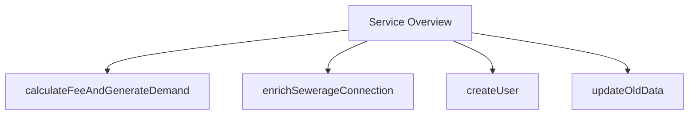

# Overview of Service

Service refers to a set of functionalities provided by various classes to handle specific business logic and operations. In the `sw-services` module, services are implemented to manage different aspects of sewerage connections, calculations, user management, and notifications. Each service class encapsulates the logic required to perform operations such as data enrichment, validation, and communication with other modules or external systems. These services ensure that the business logic is modular, maintainable, and reusable across different parts of the application.

# Main Functions

There are several main functions in this folder. Some of them are <SwmToken path="municipal-services/sw-services/src/main/java/org/egov/swservice/service/CalculationService.java" pos="70:5:5" line-data="	public void calculateFeeAndGenerateDemand(SewerageConnectionRequest request, Property property) {">`calculateFeeAndGenerateDemand`</SwmToken>, <SwmToken path="municipal-services/sw-services/src/main/java/org/egov/swservice/service/EnrichmentService.java" pos="88:5:5" line-data="	public void enrichSewerageConnection(SewerageConnectionRequest sewerageConnectionRequest, int reqType) {">`enrichSewerageConnection`</SwmToken>, and <SwmToken path="municipal-services/sw-services/src/main/java/org/egov/swservice/service/UserService.java" pos="44:5:5" line-data="	public void createUser(SewerageConnectionRequest request) {">`createUser`</SwmToken>. We will dive a little into <SwmToken path="municipal-services/sw-services/src/main/java/org/egov/swservice/service/CalculationService.java" pos="70:5:5" line-data="	public void calculateFeeAndGenerateDemand(SewerageConnectionRequest request, Property property) {">`calculateFeeAndGenerateDemand`</SwmToken> and <SwmToken path="municipal-services/sw-services/src/main/java/org/egov/swservice/service/EnrichmentService.java" pos="88:5:5" line-data="	public void enrichSewerageConnection(SewerageConnectionRequest sewerageConnectionRequest, int reqType) {">`enrichSewerageConnection`</SwmToken>.

<SwmSnippet path="/municipal-services/sw-services/src/main/java/org/egov/swservice/service/CalculationService.java" line="70">

---

## <SwmToken path="municipal-services/sw-services/src/main/java/org/egov/swservice/service/CalculationService.java" pos="70:5:5" line-data="	public void calculateFeeAndGenerateDemand(SewerageConnectionRequest request, Property property) {">`calculateFeeAndGenerateDemand`</SwmToken>

The <SwmToken path="municipal-services/sw-services/src/main/java/org/egov/swservice/service/CalculationService.java" pos="70:5:5" line-data="	public void calculateFeeAndGenerateDemand(SewerageConnectionRequest request, Property property) {">`calculateFeeAndGenerateDemand`</SwmToken> function estimates the fee for a sewerage application and generates the demand based on the action specified in the request. It constructs a URL for the calculator service, creates a calculation request, and fetches the result from the service.

```java
	public void calculateFeeAndGenerateDemand(SewerageConnectionRequest request, Property property) {
		if (request.getSewerageConnection().getProcessInstance().getAction().equalsIgnoreCase("APPROVE_FOR_CONNECTION")){
			StringBuilder uri = sewerageServicesUtil.getCalculatorURL();
			CalculationCriteria criteria = CalculationCriteria.builder()
					.applicationNo(request.getSewerageConnection().getApplicationNo())
					.sewerageConnection(request.getSewerageConnection())
					.tenantId(property.getTenantId()).build();
			List<CalculationCriteria> calculationCriterias = Arrays.asList(criteria);
			CalculationReq calRequest = CalculationReq.builder().calculationCriteria(calculationCriterias)
					.requestInfo(request.getRequestInfo()).isconnectionCalculation(false).disconnectRequest(false).build();
			try {
				Object response = serviceRequestRepository.fetchResult(uri, calRequest);
				CalculationRes calResponse = mapper.convertValue(response, CalculationRes.class);
				log.info(mapper.writeValueAsString(calResponse));
			} catch (Exception ex) {
				log.error("Calculation response error!!", ex);
				throw new CustomException("SEWERAGE_CALCULATION_EXCEPTION", "Calculation response can not parsed!!!");
			}
		}
		if (request.getSewerageConnection().getProcessInstance().getAction().equalsIgnoreCase("APPROVE_FOR_DISCONNECTION")){
				StringBuilder uri = sewerageServicesUtil.getCalculatorURL();
```

---

</SwmSnippet>

<SwmSnippet path="/municipal-services/sw-services/src/main/java/org/egov/swservice/service/EnrichmentService.java" line="88">

---

## <SwmToken path="municipal-services/sw-services/src/main/java/org/egov/swservice/service/EnrichmentService.java" pos="88:5:5" line-data="	public void enrichSewerageConnection(SewerageConnectionRequest sewerageConnectionRequest, int reqType) {">`enrichSewerageConnection`</SwmToken>

The <SwmToken path="municipal-services/sw-services/src/main/java/org/egov/swservice/service/EnrichmentService.java" pos="88:5:5" line-data="	public void enrichSewerageConnection(SewerageConnectionRequest sewerageConnectionRequest, int reqType) {">`enrichSewerageConnection`</SwmToken> function enriches the sewerage connection request with additional details such as audit information, status, and channel based on the user type. It ensures that the request is complete and ready for further processing.

```java
	public void enrichSewerageConnection(SewerageConnectionRequest sewerageConnectionRequest, int reqType) {
		AuditDetails auditDetails = sewerageServicesUtil
				.getAuditDetails(sewerageConnectionRequest.getRequestInfo().getUserInfo().getUuid(), true);
		sewerageConnectionRequest.getSewerageConnection().setAuditDetails(auditDetails);
		sewerageConnectionRequest.getSewerageConnection().setId(UUID.randomUUID().toString());
		sewerageConnectionRequest.getSewerageConnection().setStatus(StatusEnum.ACTIVE);

		if(sewerageConnectionRequest.getSewerageConnection().getChannel() == null){
			if(sewerageConnectionRequest.getRequestInfo().getUserInfo().getType().equalsIgnoreCase("EMPLOYEE") )
				sewerageConnectionRequest.getSewerageConnection().setChannel("CFC_COUNTER");
			if(sewerageConnectionRequest.getRequestInfo().getUserInfo().getType().equalsIgnoreCase("CITIZEN") )
				sewerageConnectionRequest.getSewerageConnection().setChannel("CITIZEN");
			if(sewerageConnectionRequest.getRequestInfo().getUserInfo().getType().equalsIgnoreCase("SYSTEM") )
				sewerageConnectionRequest.getSewerageConnection().setChannel("SYSTEM");
		}
```

---

</SwmSnippet>

<SwmSnippet path="/municipal-services/sw-services/src/main/java/org/egov/swservice/service/UserService.java" line="44">

---

## <SwmToken path="municipal-services/sw-services/src/main/java/org/egov/swservice/service/UserService.java" pos="44:5:5" line-data="	public void createUser(SewerageConnectionRequest request) {">`createUser`</SwmToken>

The <SwmToken path="municipal-services/sw-services/src/main/java/org/egov/swservice/service/UserService.java" pos="44:5:5" line-data="	public void createUser(SewerageConnectionRequest request) {">`createUser`</SwmToken> function handles the creation of users for sewerage connection holders if they do not already exist. It assigns default fields, checks for existing users, and makes a call to the user service to create or update the user information.

```java
	public void createUser(SewerageConnectionRequest request) {
		if (!CollectionUtils.isEmpty(request.getSewerageConnection().getConnectionHolders())) {
			Role role = getCitizenRole();
			Set<String> listOfMobileNumbers = getMobileNumbers(request);
			request.getSewerageConnection().getConnectionHolders().forEach(holderInfo -> {
				addUserDefaultFields(request.getSewerageConnection().getTenantId(), role, holderInfo);
				UserDetailResponse userDetailResponse = userExists(holderInfo, request.getRequestInfo());
				if (CollectionUtils.isEmpty(userDetailResponse.getUser())) {
					/*
					 * Sets userName equal to mobileNumber
					 *
					 * If mobileNumber already assigned as user-name for another user
					 *
					 * then random uuid is assigned as user-name
					 */
					StringBuilder uri = new StringBuilder(configuration.getUserHost())
							.append(configuration.getUserContextPath()).append(configuration.getUserCreateEndPoint());
					setUserName(holderInfo, listOfMobileNumbers);

					ConnectionUserRequest userRequest = ConnectionUserRequest.builder()
							.requestInfo(request.getRequestInfo()).user(holderInfo).build();
```

---

</SwmSnippet>

# Service Endpoints

Service Endpoints

<SwmSnippet path="/municipal-services/sw-services/src/main/java/org/egov/swservice/service/SewerageEncryptionService.java" line="70">

---

## <SwmToken path="municipal-services/sw-services/src/main/java/org/egov/swservice/service/SewerageEncryptionService.java" pos="70:8:8" line-data="    public List&lt;SewerageConnection&gt; updateOldData(SearchCriteria criteria, RequestInfo requestInfo) {">`updateOldData`</SwmToken>

The <SwmToken path="municipal-services/sw-services/src/main/java/org/egov/swservice/service/SewerageEncryptionService.java" pos="70:8:8" line-data="    public List&lt;SewerageConnection&gt; updateOldData(SearchCriteria criteria, RequestInfo requestInfo) {">`updateOldData`</SwmToken> method initiates the encryption of sewerage <SwmToken path="municipal-services/sw-services/src/main/java/org/egov/swservice/service/SewerageEncryptionService.java" pos="64:7:9" line-data="     * Initiates Sewerage applications/connections data encryption">`applications/connections`</SwmToken> data. It takes <SwmToken path="municipal-services/sw-services/src/main/java/org/egov/swservice/service/SewerageEncryptionService.java" pos="70:10:10" line-data="    public List&lt;SewerageConnection&gt; updateOldData(SearchCriteria criteria, RequestInfo requestInfo) {">`SearchCriteria`</SwmToken> and <SwmToken path="municipal-services/sw-services/src/main/java/org/egov/swservice/service/SewerageEncryptionService.java" pos="70:15:15" line-data="    public List&lt;SewerageConnection&gt; updateOldData(SearchCriteria criteria, RequestInfo requestInfo) {">`RequestInfo`</SwmToken> as parameters and returns a list of sewerage applications with encrypted data.

```java
    public List<SewerageConnection> updateOldData(SearchCriteria criteria, RequestInfo requestInfo) {
        SewerageConnectionResponse sewerageConnectionResponse = updateBatchCriteria(requestInfo, criteria);
        return sewerageConnectionResponse.getSewerageConnections();
    }
```

---

</SwmSnippet>

&nbsp;

*This is an auto-generated document by Swimm AI 🌊 and has not yet been verified by a human*

<SwmMeta version="3.0.0" repo-id="Z2l0aHViJTNBJTNBRElHSVQtT1NTJTNBJTNBU3dpbW0tRGVtbw==" repo-name="DIGIT-OSS" doc-type="overview"><sup>Powered by [Swimm](/)</sup></SwmMeta>
