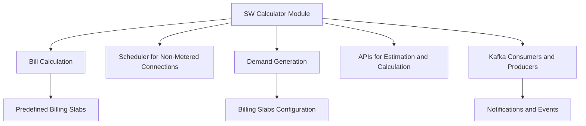

# Introduction to SW Calculator

The SW Calculator is a module designed to manage the bill calculation for registered sewerage service connections. It calculates sewerage charges and taxes based on predefined billing slabs.

# Scheduler for Non-Metered Connections

The module includes a scheduler for generating demands for non-metered connections. This ensures that demands are generated periodically without manual intervention.

# APIs for Estimation and Calculation

The SW Calculator provides APIs for estimating charges, calculating demands, updating demands, scheduling jobs, and applying ad-hoc taxes. These APIs facilitate integration with other systems and enable automated billing processes.

# Kafka Integration

Kafka consumers and producers are used to handle notifications and demand generation events. This ensures real-time processing and communication between different components of the system.

&nbsp;

*This is an auto-generated document by Swimm AI 🌊 and has not yet been verified by a human*

<SwmMeta version="3.0.0" repo-id="Z2l0aHViJTNBJTNBRElHSVQtT1NTJTNBJTNBU3dpbW0tRGVtbw==" repo-name="DIGIT-OSS" doc-type="overview">Powered by [Swimm](/)</SwmMeta>
