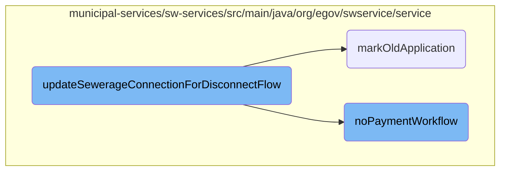

```mermaid
graph TD;
      subgraph municipal-services/sw-services/src/main/java/org/egov/swservice/service/SewerageServiceImpl.java
713301337c25c968ca403198295d21b20ce8b1c1ebc1b7f57f6de2b73deb3f94(updateSewerageConnection):::mainFlowStyle --> 1da219470950547c57b1d788a8f81b46b1c5bda6f974b70afd86052fc68d4163(modifySewerageConnection)
end

subgraph municipal-services/sw-services/src/main/java/org/egov/swservice/service/SewerageServiceImpl.java
713301337c25c968ca403198295d21b20ce8b1c1ebc1b7f57f6de2b73deb3f94(updateSewerageConnection):::mainFlowStyle --> d580d9ebe9477745fa2ec4d5e3da5de5c9194294caf27c7c5cdfa9d2b970772e(updateSewerageConnectionForDisconnectFlow):::mainFlowStyle
end

subgraph municipal-services/sw-services/src/main/java/org/egov/swservice/service/SewerageServiceImpl.java
d580d9ebe9477745fa2ec4d5e3da5de5c9194294caf27c7c5cdfa9d2b970772e(updateSewerageConnectionForDisconnectFlow):::mainFlowStyle --> 06prd(...)
end

subgraph municipal-services/sw-services/src/main/java/org/egov/swservice/service/SewerageServiceImpl.java
1da219470950547c57b1d788a8f81b46b1c5bda6f974b70afd86052fc68d4163(modifySewerageConnection) --> a8f696dd7d3e14331727fc0c276864880a0650ce4e4eb270ac2c56e77d90ce88(markOldApplication)
end


      classDef mainFlowStyle color:#000000,fill:#7CB9F4
classDef rootsStyle color:#000000,fill:#00FFF4
classDef Style1 color:#000000,fill:#00FFAA
classDef Style2 color:#000000,fill:#FFFF00
classDef Style3 color:#000000,fill:#AA7CB9

%% Swimm:
%% graph TD;
%%       subgraph <SwmPath>[municipal-services/sw-services/src/main/java/org/egov/swservice/service/SewerageServiceImpl.java](municipal-services/sw-services/src/main/java/org/egov/swservice/service/SewerageServiceImpl.java)</SwmPath>
%% 713301337c25c968ca403198295d21b20ce8b1c1ebc1b7f57f6de2b73deb3f94(updateSewerageConnection):::mainFlowStyle --> 1da219470950547c57b1d788a8f81b46b1c5bda6f974b70afd86052fc68d4163(modifySewerageConnection)
%% end
%% 
%% subgraph <SwmPath>[municipal-services/sw-services/src/main/java/org/egov/swservice/service/SewerageServiceImpl.java](municipal-services/sw-services/src/main/java/org/egov/swservice/service/SewerageServiceImpl.java)</SwmPath>
%% 713301337c25c968ca403198295d21b20ce8b1c1ebc1b7f57f6de2b73deb3f94(updateSewerageConnection):::mainFlowStyle --> d580d9ebe9477745fa2ec4d5e3da5de5c9194294caf27c7c5cdfa9d2b970772e(updateSewerageConnectionForDisconnectFlow):::mainFlowStyle
%% end
%% 
%% subgraph <SwmPath>[municipal-services/sw-services/src/main/java/org/egov/swservice/service/SewerageServiceImpl.java](municipal-services/sw-services/src/main/java/org/egov/swservice/service/SewerageServiceImpl.java)</SwmPath>
%% d580d9ebe9477745fa2ec4d5e3da5de5c9194294caf27c7c5cdfa9d2b970772e(updateSewerageConnectionForDisconnectFlow):::mainFlowStyle --> 06prd(...)
%% end
%% 
%% subgraph <SwmPath>[municipal-services/sw-services/src/main/java/org/egov/swservice/service/SewerageServiceImpl.java](municipal-services/sw-services/src/main/java/org/egov/swservice/service/SewerageServiceImpl.java)</SwmPath>
%% 1da219470950547c57b1d788a8f81b46b1c5bda6f974b70afd86052fc68d4163(modifySewerageConnection) --> a8f696dd7d3e14331727fc0c276864880a0650ce4e4eb270ac2c56e77d90ce88(markOldApplication)
%% end
%% 
%% 
%%       classDef mainFlowStyle color:#000000,fill:#7CB9F4
%% classDef rootsStyle color:#000000,fill:#00FFF4
%% classDef Style1 color:#000000,fill:#00FFAA
%% classDef Style2 color:#000000,fill:#FFFF00
%% classDef Style3 color:#000000,fill:#AA7CB9
```

This document provides an overview of the 'listen' method and its role in processing Kafka messages. It explains how the method listens to messages, processes them, and triggers subsequent actions such as updating sewerage connections and sending notifications.

The 'listen' method starts by listening to messages from a Kafka topic. When a message is received, it converts the message into a specific request object. This object is then processed to update sewerage connections and send notifications. The process involves several steps, including validating the request, enriching it with additional data, calculating fees, and updating the database. Notifications are sent to users through various channels like SMS and email.

Here is a high level diagram of the flow, showing only the most important functions:

```mermaid
graph TD;
      subgraph municipal-services/sw-services/src/main/java/org/egov/swservice/service
6dbe3f634eec01ecd017bae94641e2efe3f4a8bade730ff13f6f0252390cc0ea(listen):::mainFlowStyle --> 34f5ca8b2a1f58552173a09274daadad1844bc01cfe1d16ff330f637789125f7(process):::mainFlowStyle
end

subgraph municipal-services/sw-services/src/main/java/org/egov/swservice/service
34f5ca8b2a1f58552173a09274daadad1844bc01cfe1d16ff330f637789125f7(process):::mainFlowStyle --> 7cb98bdcddccf0af5741fc43853dd808ee47169b13bde77dd98a86355fc64d99(sendNotificationForPayment)
end

subgraph municipal-services/sw-services/src/main/java/org/egov/swservice/service
34f5ca8b2a1f58552173a09274daadad1844bc01cfe1d16ff330f637789125f7(process):::mainFlowStyle --> 713301337c25c968ca403198295d21b20ce8b1c1ebc1b7f57f6de2b73deb3f94(updateSewerageConnection):::mainFlowStyle
end

subgraph municipal-services/sw-services/src/main/java/org/egov/swservice/service
713301337c25c968ca403198295d21b20ce8b1c1ebc1b7f57f6de2b73deb3f94(updateSewerageConnection):::mainFlowStyle --> 1da219470950547c57b1d788a8f81b46b1c5bda6f974b70afd86052fc68d4163(modifySewerageConnection)
end

subgraph municipal-services/sw-services/src/main/java/org/egov/swservice/service
713301337c25c968ca403198295d21b20ce8b1c1ebc1b7f57f6de2b73deb3f94(updateSewerageConnection):::mainFlowStyle --> d580d9ebe9477745fa2ec4d5e3da5de5c9194294caf27c7c5cdfa9d2b970772e(updateSewerageConnectionForDisconnectFlow):::mainFlowStyle
end

subgraph municipal-services/sw-services/src/main/java/org/egov/swservice/service
d580d9ebe9477745fa2ec4d5e3da5de5c9194294caf27c7c5cdfa9d2b970772e(updateSewerageConnectionForDisconnectFlow):::mainFlowStyle --> a8f696dd7d3e14331727fc0c276864880a0650ce4e4eb270ac2c56e77d90ce88(markOldApplication)
end

subgraph municipal-services/sw-services/src/main/java/org/egov/swservice/service
d580d9ebe9477745fa2ec4d5e3da5de5c9194294caf27c7c5cdfa9d2b970772e(updateSewerageConnectionForDisconnectFlow):::mainFlowStyle --> bbfba581467c7946f15bb54fa48610977976403e30f5116f8551b3d3d8a13b01(noPaymentWorkflow):::mainFlowStyle
end


      classDef mainFlowStyle color:#000000,fill:#7CB9F4
classDef rootsStyle color:#000000,fill:#00FFF4
classDef Style1 color:#000000,fill:#00FFAA
classDef Style2 color:#000000,fill:#FFFF00
classDef Style3 color:#000000,fill:#AA7CB9

%% Swimm:
%% graph TD;
%%       subgraph <SwmPath>[municipal-services/sw-services/src/main/java/org/egov/swservice/service/](municipal-services/sw-services/src/main/java/org/egov/swservice/service/)</SwmPath>
%% 6dbe3f634eec01ecd017bae94641e2efe3f4a8bade730ff13f6f0252390cc0ea(listen):::mainFlowStyle --> 34f5ca8b2a1f58552173a09274daadad1844bc01cfe1d16ff330f637789125f7(process):::mainFlowStyle
%% end
%% 
%% subgraph <SwmPath>[municipal-services/sw-services/src/main/java/org/egov/swservice/service/](municipal-services/sw-services/src/main/java/org/egov/swservice/service/)</SwmPath>
%% 34f5ca8b2a1f58552173a09274daadad1844bc01cfe1d16ff330f637789125f7(process):::mainFlowStyle --> 7cb98bdcddccf0af5741fc43853dd808ee47169b13bde77dd98a86355fc64d99(sendNotificationForPayment)
%% end
%% 
%% subgraph <SwmPath>[municipal-services/sw-services/src/main/java/org/egov/swservice/service/](municipal-services/sw-services/src/main/java/org/egov/swservice/service/)</SwmPath>
%% 34f5ca8b2a1f58552173a09274daadad1844bc01cfe1d16ff330f637789125f7(process):::mainFlowStyle --> 713301337c25c968ca403198295d21b20ce8b1c1ebc1b7f57f6de2b73deb3f94(updateSewerageConnection):::mainFlowStyle
%% end
%% 
%% subgraph <SwmPath>[municipal-services/sw-services/src/main/java/org/egov/swservice/service/](municipal-services/sw-services/src/main/java/org/egov/swservice/service/)</SwmPath>
%% 713301337c25c968ca403198295d21b20ce8b1c1ebc1b7f57f6de2b73deb3f94(updateSewerageConnection):::mainFlowStyle --> 1da219470950547c57b1d788a8f81b46b1c5bda6f974b70afd86052fc68d4163(modifySewerageConnection)
%% end
%% 
%% subgraph <SwmPath>[municipal-services/sw-services/src/main/java/org/egov/swservice/service/](municipal-services/sw-services/src/main/java/org/egov/swservice/service/)</SwmPath>
%% 713301337c25c968ca403198295d21b20ce8b1c1ebc1b7f57f6de2b73deb3f94(updateSewerageConnection):::mainFlowStyle --> d580d9ebe9477745fa2ec4d5e3da5de5c9194294caf27c7c5cdfa9d2b970772e(updateSewerageConnectionForDisconnectFlow):::mainFlowStyle
%% end
%% 
%% subgraph <SwmPath>[municipal-services/sw-services/src/main/java/org/egov/swservice/service/](municipal-services/sw-services/src/main/java/org/egov/swservice/service/)</SwmPath>
%% d580d9ebe9477745fa2ec4d5e3da5de5c9194294caf27c7c5cdfa9d2b970772e(updateSewerageConnectionForDisconnectFlow):::mainFlowStyle --> a8f696dd7d3e14331727fc0c276864880a0650ce4e4eb270ac2c56e77d90ce88(markOldApplication)
%% end
%% 
%% subgraph <SwmPath>[municipal-services/sw-services/src/main/java/org/egov/swservice/service/](municipal-services/sw-services/src/main/java/org/egov/swservice/service/)</SwmPath>
%% d580d9ebe9477745fa2ec4d5e3da5de5c9194294caf27c7c5cdfa9d2b970772e(updateSewerageConnectionForDisconnectFlow):::mainFlowStyle --> bbfba581467c7946f15bb54fa48610977976403e30f5116f8551b3d3d8a13b01(noPaymentWorkflow):::mainFlowStyle
%% end
%% 
%% 
%%       classDef mainFlowStyle color:#000000,fill:#7CB9F4
%% classDef rootsStyle color:#000000,fill:#00FFF4
%% classDef Style1 color:#000000,fill:#00FFAA
%% classDef Style2 color:#000000,fill:#FFFF00
%% classDef Style3 color:#000000,fill:#AA7CB9
```



# Flow drill down

First, we'll zoom into this section of the flow:

```mermaid
graph TD;
      subgraph municipal-services/sw-services/src/main/java/org/egov/swservice/service
6dbe3f634eec01ecd017bae94641e2efe3f4a8bade730ff13f6f0252390cc0ea(listen):::mainFlowStyle --> 34f5ca8b2a1f58552173a09274daadad1844bc01cfe1d16ff330f637789125f7(process):::mainFlowStyle
end

subgraph municipal-services/sw-services/src/main/java/org/egov/swservice/service
34f5ca8b2a1f58552173a09274daadad1844bc01cfe1d16ff330f637789125f7(process):::mainFlowStyle --> 7cb98bdcddccf0af5741fc43853dd808ee47169b13bde77dd98a86355fc64d99(sendNotificationForPayment)
end

subgraph municipal-services/sw-services/src/main/java/org/egov/swservice/service
34f5ca8b2a1f58552173a09274daadad1844bc01cfe1d16ff330f637789125f7(process):::mainFlowStyle --> 713301337c25c968ca403198295d21b20ce8b1c1ebc1b7f57f6de2b73deb3f94(updateSewerageConnection):::mainFlowStyle
end

subgraph municipal-services/sw-services/src/main/java/org/egov/swservice/service
713301337c25c968ca403198295d21b20ce8b1c1ebc1b7f57f6de2b73deb3f94(updateSewerageConnection):::mainFlowStyle --> 112t8(...)
end

subgraph municipal-services/sw-services/src/main/java/org/egov/swservice/service
7cb98bdcddccf0af5741fc43853dd808ee47169b13bde77dd98a86355fc64d99(sendNotificationForPayment) --> 724b52908bfdd38128c6f9b8399d070fdcebc7056ac393da39470ae27ea62b20(sendPaymentNotification)
end


      classDef mainFlowStyle color:#000000,fill:#7CB9F4
classDef rootsStyle color:#000000,fill:#00FFF4
classDef Style1 color:#000000,fill:#00FFAA
classDef Style2 color:#000000,fill:#FFFF00
classDef Style3 color:#000000,fill:#AA7CB9

%% Swimm:
%% graph TD;
%%       subgraph <SwmPath>[municipal-services/sw-services/src/main/java/org/egov/swservice/service/](municipal-services/sw-services/src/main/java/org/egov/swservice/service/)</SwmPath>
%% 6dbe3f634eec01ecd017bae94641e2efe3f4a8bade730ff13f6f0252390cc0ea(listen):::mainFlowStyle --> 34f5ca8b2a1f58552173a09274daadad1844bc01cfe1d16ff330f637789125f7(process):::mainFlowStyle
%% end
%% 
%% subgraph <SwmPath>[municipal-services/sw-services/src/main/java/org/egov/swservice/service/](municipal-services/sw-services/src/main/java/org/egov/swservice/service/)</SwmPath>
%% 34f5ca8b2a1f58552173a09274daadad1844bc01cfe1d16ff330f637789125f7(process):::mainFlowStyle --> 7cb98bdcddccf0af5741fc43853dd808ee47169b13bde77dd98a86355fc64d99(sendNotificationForPayment)
%% end
%% 
%% subgraph <SwmPath>[municipal-services/sw-services/src/main/java/org/egov/swservice/service/](municipal-services/sw-services/src/main/java/org/egov/swservice/service/)</SwmPath>
%% 34f5ca8b2a1f58552173a09274daadad1844bc01cfe1d16ff330f637789125f7(process):::mainFlowStyle --> 713301337c25c968ca403198295d21b20ce8b1c1ebc1b7f57f6de2b73deb3f94(updateSewerageConnection):::mainFlowStyle
%% end
%% 
%% subgraph <SwmPath>[municipal-services/sw-services/src/main/java/org/egov/swservice/service/](municipal-services/sw-services/src/main/java/org/egov/swservice/service/)</SwmPath>
%% 713301337c25c968ca403198295d21b20ce8b1c1ebc1b7f57f6de2b73deb3f94(updateSewerageConnection):::mainFlowStyle --> 112t8(...)
%% end
%% 
%% subgraph <SwmPath>[municipal-services/sw-services/src/main/java/org/egov/swservice/service/](municipal-services/sw-services/src/main/java/org/egov/swservice/service/)</SwmPath>
%% 7cb98bdcddccf0af5741fc43853dd808ee47169b13bde77dd98a86355fc64d99(sendNotificationForPayment) --> 724b52908bfdd38128c6f9b8399d070fdcebc7056ac393da39470ae27ea62b20(sendPaymentNotification)
%% end
%% 
%% 
%%       classDef mainFlowStyle color:#000000,fill:#7CB9F4
%% classDef rootsStyle color:#000000,fill:#00FFF4
%% classDef Style1 color:#000000,fill:#00FFAA
%% classDef Style2 color:#000000,fill:#FFFF00
%% classDef Style3 color:#000000,fill:#AA7CB9
```



<SwmSnippet path="/municipal-services/sw-services/src/main/java/org/egov/swservice/consumer/FileStoreIdsConsumer.java" line="33">

---

## Listening to Kafka messages

The <SwmToken path="municipal-services/sw-services/src/main/java/org/egov/swservice/consumer/FileStoreIdsConsumer.java" pos="34:5:5" line-data="	public void listen(final HashMap&lt;String, Object&gt; record, @Header(KafkaHeaders.RECEIVED_TOPIC) String topic) {">`listen`</SwmToken> method listens to Kafka messages on a specified topic. It converts the received record into a <SwmToken path="municipal-services/sw-services/src/main/java/org/egov/swservice/consumer/FileStoreIdsConsumer.java" pos="36:1:1" line-data="			SewerageConnectionRequest sewerageConnectionRequest = mapper.convertValue(record,">`SewerageConnectionRequest`</SwmToken> object and processes it using the <SwmToken path="municipal-services/sw-services/src/main/java/org/egov/swservice/consumer/FileStoreIdsConsumer.java" pos="38:1:1" line-data="			pdfService.process(sewerageConnectionRequest, topic);">`pdfService`</SwmToken>.

```java
	@KafkaListener(topics = { "${sw.consume.filestoreids.topic}" })
	public void listen(final HashMap<String, Object> record, @Header(KafkaHeaders.RECEIVED_TOPIC) String topic) {
		try {
			SewerageConnectionRequest sewerageConnectionRequest = mapper.convertValue(record,
					SewerageConnectionRequest.class);
			pdfService.process(sewerageConnectionRequest, topic);
		} catch (Exception ex) {
			StringBuilder builder = new StringBuilder("Error while listening to value: ").append(record)
					.append("on topic: ").append(topic);
			log.error(builder.toString(), ex);
		}
	}
```

---

</SwmSnippet>

<SwmSnippet path="/municipal-services/sw-services/src/main/java/org/egov/swservice/service/PaymentUpdateService.java" line="83">

---

## Processing payment updates

The <SwmToken path="municipal-services/sw-services/src/main/java/org/egov/swservice/service/PaymentUpdateService.java" pos="83:5:5" line-data="	public void process(HashMap&lt;String, Object&gt; record) {">`process`</SwmToken> method handles payment updates. It converts the received record into a <SwmToken path="municipal-services/sw-services/src/main/java/org/egov/swservice/service/PaymentUpdateService.java" pos="85:1:1" line-data="			PaymentRequest paymentRequest = mapper.convertValue(record, PaymentRequest.class);">`PaymentRequest`</SwmToken> object, checks if the service matches, and updates the sewerage connection status. It also sends notifications for the payment.

```java
	public void process(HashMap<String, Object> record) {
		try {
			PaymentRequest paymentRequest = mapper.convertValue(record, PaymentRequest.class);
			boolean isServiceMatched = false;
			for (PaymentDetail paymentDetail : paymentRequest.getPayment().getPaymentDetails()) {
				if (paymentDetail.getBusinessService().equalsIgnoreCase(config.getReceiptBusinessservice()) ||
						SEWERAGE_SERVICE_BUSINESS_ID.equals(paymentDetail.getBusinessService())) {
					isServiceMatched = true;
				}
			}
			if (!isServiceMatched)
				return;
			paymentRequest.getRequestInfo().setUserInfo(fetchUser(
					paymentRequest.getRequestInfo().getUserInfo().getUuid(), paymentRequest.getRequestInfo()));
			for (PaymentDetail paymentDetail : paymentRequest.getPayment().getPaymentDetails()) {
				log.info("Consuming Business Service: {}", paymentDetail.getBusinessService());
				SearchCriteria criteria = new SearchCriteria();
				if (paymentDetail.getBusinessService().equalsIgnoreCase(config.getReceiptDisconnectionBusinessservice())) {
					criteria = SearchCriteria.builder()
							.tenantId(paymentRequest.getPayment().getTenantId())
							.connectionNumber(Stream.of(paymentDetail.getBill().getConsumerCode().toString()).collect(Collectors.toSet()))
```

---

</SwmSnippet>

<SwmSnippet path="/municipal-services/sw-services/src/main/java/org/egov/swservice/service/PaymentUpdateService.java" line="176">

---

### Sending payment notifications

The <SwmToken path="municipal-services/sw-services/src/main/java/org/egov/swservice/service/PaymentUpdateService.java" pos="176:5:5" line-data="	public void sendNotificationForPayment(PaymentRequest paymentRequest) {">`sendNotificationForPayment`</SwmToken> method processes the payment request for notification. It searches for the relevant sewerage connection and sends a payment notification.

```java
	public void sendNotificationForPayment(PaymentRequest paymentRequest) {
		try {
			log.info("Payment Notification consumer :");
			boolean isServiceMatched = false;
			for (PaymentDetail paymentDetail : paymentRequest.getPayment().getPaymentDetails()) {
                String businessservice = paymentDetail.getBusinessService();
                if (SEWERAGE_SERVICE_BUSINESS_ID.equals(businessservice) || SEWERAGE_SERVICE_ONE_TIME_FEE_BUSINESS_ID.equals(businessservice)) {
					isServiceMatched = true;
				}
			}
			if (!isServiceMatched)
				return;
			for (PaymentDetail paymentDetail : paymentRequest.getPayment().getPaymentDetails()) {
				log.info("Consuming Business Service : {}", paymentDetail.getBusinessService());
				if (SEWERAGE_SERVICE_BUSINESS_ID.equals(paymentDetail.getBusinessService()) ||
						config.getReceiptBusinessservice().equals(paymentDetail.getBusinessService())) {
					SearchCriteria criteria = new SearchCriteria();
					if (SEWERAGE_SERVICE_BUSINESS_ID.equals(paymentDetail.getBusinessService())) {
						criteria = SearchCriteria.builder()
								.tenantId(paymentRequest.getPayment().getTenantId())
								.connectionNumber(Stream.of(paymentDetail.getBill().getConsumerCode().toString()).collect(Collectors.toSet())).build();
```

---

</SwmSnippet>

<SwmSnippet path="/municipal-services/sw-services/src/main/java/org/egov/swservice/service/PaymentUpdateService.java" line="228">

---

### Sending detailed payment notifications

The <SwmToken path="municipal-services/sw-services/src/main/java/org/egov/swservice/service/PaymentUpdateService.java" pos="228:5:5" line-data="	public void sendPaymentNotification(SewerageConnectionRequest sewerageConnectionRequest, PaymentDetail paymentDetail) {">`sendPaymentNotification`</SwmToken> method sends detailed notifications via different channels such as SMS, email, and events based on the configured channels.

```java
	public void sendPaymentNotification(SewerageConnectionRequest sewerageConnectionRequest, PaymentDetail paymentDetail) {
		User userInfoCopy = sewerageConnectionRequest.getRequestInfo().getUserInfo();
		User userInfo = notificationUtil.getInternalMicroserviceUser(sewerageConnectionRequest.getSewerageConnection().getTenantId());
		sewerageConnectionRequest.getRequestInfo().setUserInfo(userInfo);
		Property property = validateProperty.getOrValidateProperty(sewerageConnectionRequest);
		sewerageConnectionRequest.getRequestInfo().setUserInfo(userInfoCopy);

		List<String> configuredChannelNames =  notificationUtil.fetchChannelList(sewerageConnectionRequest.getRequestInfo(), sewerageConnectionRequest.getSewerageConnection().getTenantId(), SEWERAGE_SERVICE_BUSINESS_ID, sewerageConnectionRequest.getSewerageConnection().getProcessInstance().getAction());

		if(configuredChannelNames.contains(CHANNEL_NAME_EVENT)) {
			if (config.getIsUserEventsNotificationEnabled() != null && config.getIsUserEventsNotificationEnabled()) {
				EventRequest eventRequest = getEventRequest(sewerageConnectionRequest, property, paymentDetail);
				if (eventRequest != null) {
					notificationUtil.sendEventNotification(eventRequest);
				}
			}
		}
		if(configuredChannelNames.contains(CHANNEL_NAME_SMS)) {
			if (config.getIsSMSEnabled() != null && config.getIsSMSEnabled()) {
				List<SMSRequest> smsRequests = getSmsRequest(sewerageConnectionRequest, property, paymentDetail);
				if (!CollectionUtils.isEmpty(smsRequests)) {
```

---

</SwmSnippet>

Now, lets zoom into this section of the flow:



<SwmSnippet path="/municipal-services/sw-services/src/main/java/org/egov/swservice/service/SewerageServiceImpl.java" line="276">

---

## <SwmToken path="municipal-services/sw-services/src/main/java/org/egov/swservice/service/SewerageServiceImpl.java" pos="386:3:3" line-data="		sewerageDao.updateSewerageConnection(sewerageConnectionRequest, isStateUpdatable);">`updateSewerageConnection`</SwmToken>

The <SwmToken path="municipal-services/sw-services/src/main/java/org/egov/swservice/service/SewerageServiceImpl.java" pos="386:3:3" line-data="		sewerageDao.updateSewerageConnection(sewerageConnectionRequest, isStateUpdatable);">`updateSewerageConnection`</SwmToken> method first checks if the request is for disconnection. If so, it delegates the task to <SwmToken path="municipal-services/sw-services/src/main/java/org/egov/swservice/service/SewerageServiceImpl.java" pos="277:3:3" line-data="			return updateSewerageConnectionForDisconnectFlow(sewerageConnectionRequest);">`updateSewerageConnectionForDisconnectFlow`</SwmToken>.

```java
		if(sewerageConnectionRequest.isDisconnectRequest()) {
			return updateSewerageConnectionForDisconnectFlow(sewerageConnectionRequest);
		}
```

---

</SwmSnippet>

<SwmSnippet path="/municipal-services/sw-services/src/main/java/org/egov/swservice/service/SewerageServiceImpl.java" line="281">

---

If the request is to modify the connection, it calls <SwmToken path="municipal-services/sw-services/src/main/java/org/egov/swservice/service/SewerageServiceImpl.java" pos="282:3:3" line-data="			return modifySewerageConnection(sewerageConnectionRequest);">`modifySewerageConnection`</SwmToken>.

```java
		if(sewerageServicesUtil.isModifyConnectionRequest(sewerageConnectionRequest)){
			return modifySewerageConnection(sewerageConnectionRequest);
		}
```

---

</SwmSnippet>

<SwmSnippet path="/municipal-services/sw-services/src/main/java/org/egov/swservice/service/SewerageServiceImpl.java" line="284">

---

For other update requests, it performs various validations, enriches the request, calculates fees, and updates the sewerage connection details in the database.

```java
		sewerageConnectionValidator.validateSewerageConnection(sewerageConnectionRequest, SWConstants.UPDATE_APPLICATION);
		mDMSValidator.validateMasterData(sewerageConnectionRequest, SWConstants.UPDATE_APPLICATION);
		Property property = validateProperty.getOrValidateProperty(sewerageConnectionRequest);
		validateProperty.validatePropertyFields(property,sewerageConnectionRequest.getRequestInfo());
		String previousApplicationStatus = workflowService.getApplicationStatus(
				sewerageConnectionRequest.getRequestInfo(),
				sewerageConnectionRequest.getSewerageConnection().getApplicationNo(),
				sewerageConnectionRequest.getSewerageConnection().getTenantId(), config.getBusinessServiceValue());
		BusinessService businessService = workflowService.getBusinessService(config.getBusinessServiceValue(),
				sewerageConnectionRequest.getSewerageConnection().getTenantId(),
				sewerageConnectionRequest.getRequestInfo());
		SewerageConnection searchResult = getConnectionForUpdateRequest(
				sewerageConnectionRequest.getSewerageConnection().getId(), sewerageConnectionRequest.getRequestInfo());

		Boolean isStateUpdatable = sewerageServicesUtil.getStatusForUpdate(businessService, previousApplicationStatus);

		boolean isPlumberSwapped = unmaskingUtil.getUnmaskedPlumberInfo(sewerageConnectionRequest.getSewerageConnection().getPlumberInfo(), searchResult.getPlumberInfo());
		if (isPlumberSwapped)
			sewerageConnectionRequest.setSewerageConnection(encryptionDecryptionUtil.decryptObject(sewerageConnectionRequest.getSewerageConnection(), "WnSConnectionPlumberDecrypDisabled", SewerageConnection.class, sewerageConnectionRequest.getRequestInfo()));

		enrichmentService.enrichUpdateSewerageConnection(sewerageConnectionRequest);
```

---

</SwmSnippet>

<SwmSnippet path="/municipal-services/sw-services/src/main/java/org/egov/swservice/service/SewerageServiceImpl.java" line="449">

---

## <SwmToken path="municipal-services/sw-services/src/main/java/org/egov/swservice/service/SewerageServiceImpl.java" pos="282:3:3" line-data="			return modifySewerageConnection(sewerageConnectionRequest);">`modifySewerageConnection`</SwmToken>

The <SwmToken path="municipal-services/sw-services/src/main/java/org/egov/swservice/service/SewerageServiceImpl.java" pos="282:3:3" line-data="			return modifySewerageConnection(sewerageConnectionRequest);">`modifySewerageConnection`</SwmToken> method validates the request, retrieves the current connection details, and enriches the request with updated information.

```java
		sewerageConnectionValidator.validateSewerageConnection(sewerageConnectionRequest, SWConstants.MODIFY_CONNECTION);
		mDMSValidator.validateMasterData(sewerageConnectionRequest, SWConstants.MODIFY_CONNECTION);
		Property property = validateProperty.getOrValidateProperty(sewerageConnectionRequest);
		validateProperty.validatePropertyFields(property,sewerageConnectionRequest.getRequestInfo());
		String previousApplicationStatus = workflowService.getApplicationStatus(
				sewerageConnectionRequest.getRequestInfo(),
				sewerageConnectionRequest.getSewerageConnection().getApplicationNo(),
				sewerageConnectionRequest.getSewerageConnection().getTenantId(), config.getModifySWBusinessServiceName());
		BusinessService businessService = workflowService.getBusinessService(config.getModifySWBusinessServiceName(),
				sewerageConnectionRequest.getSewerageConnection().getTenantId(),
				sewerageConnectionRequest.getRequestInfo());
		SewerageConnection searchResult = getConnectionForUpdateRequest(
				sewerageConnectionRequest.getSewerageConnection().getId(), sewerageConnectionRequest.getRequestInfo());

		Boolean isStateUpdatable = sewerageServicesUtil.getStatusForUpdate(businessService, previousApplicationStatus);
		boolean isPlumberSwapped = unmaskingUtil.getUnmaskedPlumberInfo(sewerageConnectionRequest.getSewerageConnection().getPlumberInfo(), searchResult.getPlumberInfo());
		if (isPlumberSwapped)
			sewerageConnectionRequest.setSewerageConnection(encryptionDecryptionUtil.decryptObject(sewerageConnectionRequest.getSewerageConnection(), "WnSConnectionPlumberDecrypDisabled", SewerageConnection.class, sewerageConnectionRequest.getRequestInfo()));

		enrichmentService.enrichUpdateSewerageConnection(sewerageConnectionRequest);
		actionValidator.validateUpdateRequest(sewerageConnectionRequest, businessService, previousApplicationStatus);
```

---

</SwmSnippet>

<SwmSnippet path="/municipal-services/sw-services/src/main/java/org/egov/swservice/service/SewerageServiceImpl.java" line="472">

---

It then updates the sewerage connection details in the database and calls the workflow service to handle the business logic.

```java
		sewerageDaoImpl.pushForEditNotification(sewerageConnectionRequest, isStateUpdatable);
		// Call workflow
		wfIntegrator.callWorkFlow(sewerageConnectionRequest, property);

		/* encrypt here */
		sewerageConnectionRequest.setSewerageConnection(encryptConnectionDetails(sewerageConnectionRequest.getSewerageConnection()));
		/* encrypt here for connection holder details */
		sewerageConnectionRequest.setSewerageConnection(encryptConnectionHolderDetails(sewerageConnectionRequest.getSewerageConnection()));

		sewerageDaoImpl.updateSewerageConnection(sewerageConnectionRequest, isStateUpdatable);
```

---

</SwmSnippet>

<SwmSnippet path="/municipal-services/sw-services/src/main/java/org/egov/swservice/service/SewerageServiceImpl.java" line="492">

---

## <SwmToken path="municipal-services/sw-services/src/main/java/org/egov/swservice/service/SewerageServiceImpl.java" pos="492:5:5" line-data="	public void markOldApplication(SewerageConnectionRequest sewerageConnectionRequest) {">`markOldApplication`</SwmToken>

The <SwmToken path="municipal-services/sw-services/src/main/java/org/egov/swservice/service/SewerageServiceImpl.java" pos="492:5:5" line-data="	public void markOldApplication(SewerageConnectionRequest sewerageConnectionRequest) {">`markOldApplication`</SwmToken> method marks previous applications as old if the current request is approved. It iterates through all previous applications and updates their status.

```java
	public void markOldApplication(SewerageConnectionRequest sewerageConnectionRequest) {
		if (sewerageConnectionRequest.getSewerageConnection().getProcessInstance().getAction().equalsIgnoreCase(APPROVE_CONNECTION)) {
			String currentModifiedApplicationNo = sewerageConnectionRequest.getSewerageConnection().getApplicationNo();
			List<SewerageConnection> sewerageConnectionList = getAllSewerageApplications(sewerageConnectionRequest);

			for(SewerageConnection sewerageConnection:sewerageConnectionList){
				if(!sewerageConnection.getOldApplication() && !(sewerageConnection.getApplicationNo().equalsIgnoreCase(currentModifiedApplicationNo))){
					sewerageConnection.setOldApplication(Boolean.TRUE);
					sewerageConnection = encryptConnectionDetails(sewerageConnection);
					SewerageConnectionRequest previousSewerageConnectionRequest = SewerageConnectionRequest.builder().requestInfo(sewerageConnectionRequest.getRequestInfo())
							.sewerageConnection(sewerageConnection).build();
					sewerageDaoImpl.updateSewerageConnection(previousSewerageConnectionRequest,Boolean.TRUE);
				}
			}
		}
	}
```

---

</SwmSnippet>

Now, lets zoom into this section of the flow:



<SwmSnippet path="/municipal-services/sw-services/src/main/java/org/egov/swservice/service/SewerageServiceImpl.java" line="342">

---

## Validating and Updating the Sewerage Connection

The <SwmToken path="municipal-services/sw-services/src/main/java/org/egov/swservice/service/SewerageServiceImpl.java" pos="277:3:3" line-data="			return updateSewerageConnectionForDisconnectFlow(sewerageConnectionRequest);">`updateSewerageConnectionForDisconnectFlow`</SwmToken> method begins by validating the sewerage connection request using various validators. This ensures that the request meets all necessary criteria before proceeding. The method then retrieves the previous application status and business service details, which are crucial for determining if the state is updatable.

```java
		sewerageConnectionValidator.validateSewerageConnection(sewerageConnectionRequest, SWConstants.DISCONNECT_CONNECTION);
		mDMSValidator.validateMasterData(sewerageConnectionRequest, SWConstants.DISCONNECT_CONNECTION);
		Property property = validateProperty.getOrValidateProperty(sewerageConnectionRequest);
		validateProperty.validatePropertyFields(property,sewerageConnectionRequest.getRequestInfo());
		String previousApplicationStatus = workflowService.getApplicationStatus(
				sewerageConnectionRequest.getRequestInfo(),
				sewerageConnectionRequest.getSewerageConnection().getApplicationNo(),
				sewerageConnectionRequest.getSewerageConnection().getTenantId(),config.getDisconnectBusinessServiceName() );
		BusinessService businessService = workflowService.getBusinessService(config.getDisconnectBusinessServiceName(),
				sewerageConnectionRequest.getSewerageConnection().getTenantId(),
				sewerageConnectionRequest.getRequestInfo());
		SewerageConnection searchResult = getConnectionForUpdateRequest(
				sewerageConnectionRequest.getSewerageConnection().getId(), sewerageConnectionRequest.getRequestInfo());

		Boolean isStateUpdatable = sewerageServicesUtil.getStatusForUpdate(businessService, previousApplicationStatus);

		boolean isPlumberSwapped = unmaskingUtil.getUnmaskedPlumberInfo(sewerageConnectionRequest.getSewerageConnection().getPlumberInfo(), searchResult.getPlumberInfo());
		if (isPlumberSwapped)
			sewerageConnectionRequest.setSewerageConnection(encryptionDecryptionUtil.decryptObject(sewerageConnectionRequest.getSewerageConnection(), "WnSConnectionPlumberDecrypDisabled", SewerageConnection.class, sewerageConnectionRequest.getRequestInfo()));

		enrichmentService.enrichUpdateSewerageConnection(sewerageConnectionRequest);
```

---

</SwmSnippet>

<SwmSnippet path="/municipal-services/sw-services/src/main/java/org/egov/swservice/service/SewerageServiceImpl.java" line="362">

---

## Enriching and Calculating Fees

The method enriches the sewerage connection request with additional data and calculates any applicable fees. This step is essential for ensuring that all necessary information is included and that the correct fees are applied.

```java
		enrichmentService.enrichUpdateSewerageConnection(sewerageConnectionRequest);
		actionValidator.validateUpdateRequest(sewerageConnectionRequest, businessService, previousApplicationStatus);
		sewerageConnectionValidator.validateUpdate(sewerageConnectionRequest, searchResult);
		sewerageDaoImpl.pushForEditNotification(sewerageConnectionRequest, isStateUpdatable);
		userService.updateUser(sewerageConnectionRequest, searchResult);
		calculationService.calculateFeeAndGenerateDemand(sewerageConnectionRequest, property);
```

---

</SwmSnippet>

<SwmSnippet path="/municipal-services/sw-services/src/main/java/org/egov/swservice/service/SewerageServiceImpl.java" line="369">

---

## Handling No Payment Workflow

The method checks if there are any outstanding payments. If no payment is required, it sets a specific comment in the process instance to indicate this. This step is crucial for handling cases where no payment is due.

```java
		boolean isNoPayment = false;
		SewerageConnection sewerageConnection = sewerageConnectionRequest.getSewerageConnection();
		ProcessInstance processInstance = sewerageConnection.getProcessInstance();
		if (SWConstants.APPROVE_DISCONNECTION_CONST.equalsIgnoreCase(processInstance.getAction())) {
			isNoPayment = calculationService.fetchBill(sewerageConnection.getTenantId(), sewerageConnection.getConnectionNo(), sewerageConnectionRequest.getRequestInfo());
			if (isNoPayment) {
				processInstance.setComment(WORKFLOW_NO_PAYMENT_CODE);
			}
		}
```

---

</SwmSnippet>

<SwmSnippet path="/municipal-services/sw-services/src/main/java/org/egov/swservice/service/SewerageServiceImpl.java" line="379">

---

## Calling the Workflow and Encrypting Data

The method then calls the workflow service to update the workflow status and encrypts the sewerage connection details. This ensures that the data is secure and that the workflow is correctly updated.

```java
		wfIntegrator.callWorkFlow(sewerageConnectionRequest, property);

		/* encrypt here */
		sewerageConnectionRequest.setSewerageConnection(encryptConnectionDetails(sewerageConnectionRequest.getSewerageConnection()));
		/* encrypt here for connection holder details */
		sewerageConnectionRequest.setSewerageConnection(encryptConnectionHolderDetails(sewerageConnectionRequest.getSewerageConnection()));
```

---

</SwmSnippet>

<SwmSnippet path="/municipal-services/sw-services/src/main/java/org/egov/swservice/service/SewerageServiceImpl.java" line="386">

---

## Updating the Sewerage Connection and Marking Old Applications

The method updates the sewerage connection in the database and marks the old application. This step finalizes the update process and ensures that the old application is correctly flagged.

```java
		sewerageDao.updateSewerageConnection(sewerageConnectionRequest, isStateUpdatable);

		// setting oldApplication Flag
		markOldApplication(sewerageConnectionRequest);
```

---

</SwmSnippet>

<SwmSnippet path="/municipal-services/sw-services/src/main/java/org/egov/swservice/service/PaymentUpdateService.java" line="567">

---

## No Payment Workflow Execution

The <SwmToken path="municipal-services/sw-services/src/main/java/org/egov/swservice/service/PaymentUpdateService.java" pos="567:5:5" line-data="	public void noPaymentWorkflow(SewerageConnectionRequest request, Property property, RequestInfo requestInfo) {">`noPaymentWorkflow`</SwmToken> method is called when there are no dues. It updates the workflow status from 'approve for disconnection' to 'pending for disconnection execution'. This method enriches the request with necessary roles and calls the workflow service to move the workflow forward.

```java
	public void noPaymentWorkflow(SewerageConnectionRequest request, Property property, RequestInfo requestInfo) {
		//Updating the workflow from approve for disconnection to pending for disconnection execution when there are no dues
		SearchCriteria criteria = new SearchCriteria();
		SewerageConnection sewerageRequest = request.getSewerageConnection();
		criteria = SearchCriteria.builder()
				.tenantId(sewerageRequest.getTenantId())
				.connectionNumber(Stream.of(sewerageRequest.getConnectionNo().toString()).collect(Collectors.toSet()))
				.applicationStatus(Collections.singleton(PENDING_FOR_PAYMENT_STATUS_CODE)).build();
		List<SewerageConnection> sewerageConnections = sewerageService.search(criteria,
				requestInfo);
		sewerageConnections.forEach(sewerageConnection -> sewerageConnection.getProcessInstance().setAction((SWConstants.ACTION_PAY)));
		Optional<SewerageConnection> connections = sewerageConnections.stream().findFirst();
		SewerageConnection connection = connections.get();
		SewerageConnectionRequest sewerageConnectionRequest = SewerageConnectionRequest.builder()
				.sewerageConnection(connection).requestInfo(requestInfo)
				.build();
		ProcessInstance processInstanceReq = sewerageConnectionRequest.getSewerageConnection().getProcessInstance();
		processInstanceReq.setComment(WORKFLOW_NO_PAYMENT_CODE + " : " +WORKFLOW_NODUE_COMMENT);
		// Enrich tenantId in userInfo for workflow call
		Role role = Role.builder().code("SYSTEM_PAYMENT").tenantId(property.getTenantId()).build();
		Role counterEmployeeRole = Role.builder().name(COUNTER_EMPLOYEE_ROLE_NAME).code(COUNTER_EMPLOYEE_ROLE_CODE).tenantId(property.getTenantId()).build();
```

---

</SwmSnippet>

&nbsp;

*This is an auto-generated document by Swimm AI 🌊 and has not yet been verified by a human*

<SwmMeta version="3.0.0" repo-id="Z2l0aHViJTNBJTNBRElHSVQtT1NTJTNBJTNBU3dpbW0tRGVtbw==" repo-name="DIGIT-OSS" doc-type="flows"><sup>Powered by [Swimm](/)</sup></SwmMeta>
