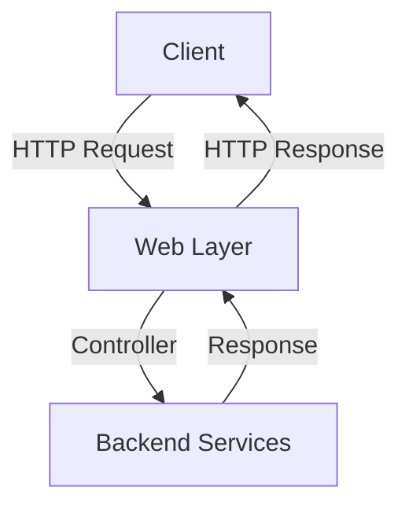

# Overview

The web layer in the Trade License Calculator module handles HTTP requests and responses, acting as the interface between the client and the backend services. It includes controllers, models, and annotations to manage data flow and ensure data integrity.

# Controllers

Controllers in the web layer, such as <SwmToken path="municipal-services/tl-calculator/src/main/java/org/egov/tlcalculator/web/controllers/CalculatorController.java" pos="29:4:4" line-data="public class CalculatorController {">`CalculatorController`</SwmToken>, manage endpoints for calculating trade license fees, generating bills, and estimating fees. They serve as the entry point for client requests and coordinate with backend services to process these requests.

<SwmSnippet path="/municipal-services/tl-calculator/src/main/java/org/egov/tlcalculator/web/controllers/CalculatorController.java" line="45">

---

The <SwmToken path="municipal-services/tl-calculator/src/main/java/org/egov/tlcalculator/web/controllers/CalculatorController.java" pos="29:4:4" line-data="public class CalculatorController {">`CalculatorController`</SwmToken> handles the `calculateTradeLicenseFee` endpoint, which calculates the fees for a trade license. It takes a <SwmToken path="municipal-services/tl-calculator/src/main/java/org/egov/tlcalculator/web/controllers/CalculatorController.java" pos="53:6:6" line-data="	 * @param calculationReq The calculation Request">`calculationReq`</SwmToken> object as input and returns a <SwmToken path="municipal-services/tl-calculator/src/main/java/org/egov/tlcalculator/web/controllers/CalculatorController.java" pos="57:5:5" line-data="	public ResponseEntity&lt;CalculationRes&gt; calculate(@Valid @RequestBody CalculationReq calculationReq,@PathVariable(required = false) String servicename) {">`CalculationRes`</SwmToken> object containing the calculated fees.

```java
		this.request = request;
		this.calculationService = calculationService;
		this.demandService = demandService;
		this.bpaCalculationService = bpaCalculationService;
	}

	/**
	 * Calulates the tradeLicense fee and creates Demand
	 * @param calculationReq The calculation Request
	 * @return Calculation Response
	 */
```

---

</SwmSnippet>

# Models

Models in the web layer, such as <SwmToken path="municipal-services/tl-calculator/src/main/java/org/egov/tlcalculator/web/controllers/CalculatorController.java" pos="53:6:6" line-data="	 * @param calculationReq The calculation Request">`calculationReq`</SwmToken>, <SwmToken path="municipal-services/tl-calculator/src/main/java/org/egov/tlcalculator/web/controllers/CalculatorController.java" pos="57:5:5" line-data="	public ResponseEntity&lt;CalculationRes&gt; calculate(@Valid @RequestBody CalculationReq calculationReq,@PathVariable(required = false) String servicename) {">`CalculationRes`</SwmToken>, and `Document`, represent the data structures used in the requests and responses. These models ensure that the data is structured correctly for processing by the backend services.

<SwmSnippet path="/municipal-services/tl-calculator/src/main/java/org/egov/tlcalculator/web/models/demand/DemandRequest.java" line="35">

---

The <SwmToken path="municipal-services/tl-calculator/src/main/java/org/egov/tlcalculator/web/models/demand/DemandRequest.java" pos="58:4:4" line-data="public class DemandRequest {">`DemandRequest`</SwmToken> model is an example of a data structure used in the web layer to represent the request data for generating demands.

```java
 *            with regards to rights under trademark law for use of the trade names
```

---

</SwmSnippet>

<SwmSnippet path="/municipal-services/tl-calculator/src/main/java/org/egov/tlcalculator/web/models/demand/DemandResponse.java" line="35">

---

The <SwmToken path="municipal-services/tl-calculator/src/main/java/org/egov/tlcalculator/web/models/demand/DemandResponse.java" pos="56:4:4" line-data="public class DemandResponse {">`DemandResponse`</SwmToken> model represents the response data structure for demands in the web layer.

```java
 *            with regards to rights under trademark law for use of the trade names
```

---

</SwmSnippet>

# Annotations

The web layer uses annotations for validation and JSON property mapping to ensure data integrity and proper serialization/deserialization. These annotations help in maintaining the consistency and correctness of the data as it flows between the client and backend services.

&nbsp;

*This is an auto-generated document by Swimm AI 🌊 and has not yet been verified by a human*

<SwmMeta version="3.0.0" repo-id="Z2l0aHViJTNBJTNBRElHSVQtT1NTJTNBJTNBU3dpbW0tRGVtbw==" repo-name="DIGIT-OSS" doc-type="overview"><sup>Powered by [Swimm](/)</sup></SwmMeta>
