```mermaid
classDiagram
    CalculationV2Controller --> TranslationService
    CalculationV2Controller --> EstimationService
    InstitutionV2 --> id
    InstitutionV2 --> tenantId
    InstitutionV2 --> name
    InstitutionV2 --> type
    InstitutionV2 --> designation
    InstitutionV2 --> nameOfAuthorizedPerson
    InstitutionV2 --> additionalDetails
    DocumentV2 --> id
    DocumentV2 --> documentType
    DocumentV2 --> fileStoreId
    DocumentV2 --> documentUid
    DocumentV2 --> auditDetails
    DocumentV2 --> status
    UnitV2 --> id
    UnitV2 --> tenantId
    UnitV2 --> floorNo
    UnitV2 --> unitType
    UnitV2 --> usageCategory
    UnitV2 --> occupancyType
    UnitV2 --> active
    UnitV2 --> occupancyDate
    UnitV2 --> constructionDetail
    UnitV2 --> additionalDetails
    UnitV2 --> auditDetails
    UnitV2 --> arv
    AssessmentV2 --> id
    AssessmentV2 --> tenantId
    AssessmentV2 --> assessmentNumber
    AssessmentV2 --> financialYear
    AssessmentV2 --> propertyId
    AssessmentV2 --> assessmentDate
    AssessmentV2 --> status
    AssessmentV2 --> source
    AssessmentV2 --> unitUsageList
    AssessmentV2 --> documents
    AssessmentV2 --> additionalDetails
    AssessmentV2 --> channel
    AssessmentV2 --> auditDetails
```

# Introduction

This document provides an overview of the web components in the Property Tax Calculator Version 2 (Pt Calculator V2). It covers the main classes and their functionalities, including controllers and models used in the application.

# Controllers

The `CalculationV2Controller` class handles HTTP requests for property tax estimations. It utilizes services like `TranslationService` and `EstimationService` to process these requests efficiently.

# Models

The Pt Calculator V2 includes several models that represent different entities within the property tax system. These models are crucial for structuring and managing the data.

The `InstitutionV2` class represents an institution with properties such as `id`, `tenantId`, `name`, `type`, `designation`, `nameOfAuthorizedPerson`, and `additionalDetails`.

The `DocumentV2` class models a document with attributes like `id`, `documentType`, `fileStoreId`, `documentUid`, `auditDetails`, and `status`.

The `UnitV2` class represents a unit within a property, including details like `id`, `tenantId`, `floorNo`, `unitType`, `usageCategory`, `occupancyType`, `active`, `occupancyDate`, `constructionDetail`, `additionalDetails`, `auditDetails`, and `arv`.

The `AssessmentV2` class models an assessment with properties such as `id`, `tenantId`, `assessmentNumber`, `financialYear`, `propertyId`, `assessmentDate`, `status`, `source`, `unitUsageList`, `documents`, `additionalDetails`, `channel`, and `auditDetails`.

&nbsp;

*This is an auto-generated document by Swimm AI 🌊 and has not yet been verified by a human*

<SwmMeta version="3.0.0" repo-id="Z2l0aHViJTNBJTNBRElHSVQtT1NTJTNBJTNBU3dpbW0tRGVtbw==" repo-name="DIGIT-OSS" doc-type="overview">Powered by [Swimm](/)</SwmMeta>
