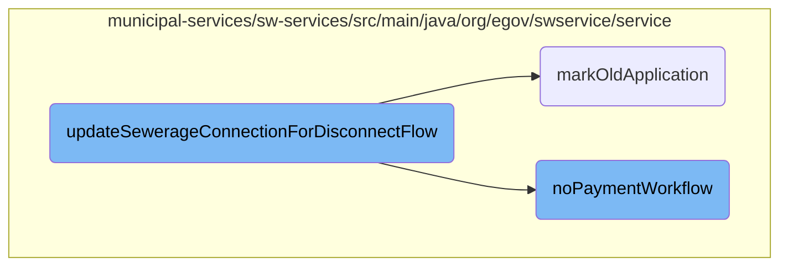

```mermaid
graph TD;
      subgraph municipal-services/sw-services/src/main/java/org/egov/swservice/service/SewerageServiceImpl.java
713301337c25c968ca403198295d21b20ce8b1c1ebc1b7f57f6de2b73deb3f94(updateSewerageConnection):::mainFlowStyle --> 1da219470950547c57b1d788a8f81b46b1c5bda6f974b70afd86052fc68d4163(modifySewerageConnection)
end

subgraph municipal-services/sw-services/src/main/java/org/egov/swservice/service/SewerageServiceImpl.java
713301337c25c968ca403198295d21b20ce8b1c1ebc1b7f57f6de2b73deb3f94(updateSewerageConnection):::mainFlowStyle --> d580d9ebe9477745fa2ec4d5e3da5de5c9194294caf27c7c5cdfa9d2b970772e(updateSewerageConnectionForDisconnectFlow):::mainFlowStyle
end

subgraph municipal-services/sw-services/src/main/java/org/egov/swservice/service/SewerageServiceImpl.java
d580d9ebe9477745fa2ec4d5e3da5de5c9194294caf27c7c5cdfa9d2b970772e(updateSewerageConnectionForDisconnectFlow):::mainFlowStyle --> jw09f(...)
end

subgraph municipal-services/sw-services/src/main/java/org/egov/swservice/service/SewerageServiceImpl.java
1da219470950547c57b1d788a8f81b46b1c5bda6f974b70afd86052fc68d4163(modifySewerageConnection) --> a8f696dd7d3e14331727fc0c276864880a0650ce4e4eb270ac2c56e77d90ce88(markOldApplication)
end


      classDef mainFlowStyle color:#000000,fill:#7CB9F4
classDef rootsStyle color:#000000,fill:#00FFF4
classDef Style1 color:#000000,fill:#00FFAA
classDef Style2 color:#000000,fill:#FFFF00
classDef Style3 color:#000000,fill:#AA7CB9

%% Swimm:
%% graph TD;
%%       subgraph <SwmPath>[municipal-services/sw-services/src/main/java/org/egov/swservice/service/SewerageServiceImpl.java](municipal-services/sw-services/src/main/java/org/egov/swservice/service/SewerageServiceImpl.java)</SwmPath>
%% 713301337c25c968ca403198295d21b20ce8b1c1ebc1b7f57f6de2b73deb3f94(updateSewerageConnection):::mainFlowStyle --> 1da219470950547c57b1d788a8f81b46b1c5bda6f974b70afd86052fc68d4163(modifySewerageConnection)
%% end
%% 
%% subgraph <SwmPath>[municipal-services/sw-services/src/main/java/org/egov/swservice/service/SewerageServiceImpl.java](municipal-services/sw-services/src/main/java/org/egov/swservice/service/SewerageServiceImpl.java)</SwmPath>
%% 713301337c25c968ca403198295d21b20ce8b1c1ebc1b7f57f6de2b73deb3f94(updateSewerageConnection):::mainFlowStyle --> d580d9ebe9477745fa2ec4d5e3da5de5c9194294caf27c7c5cdfa9d2b970772e(updateSewerageConnectionForDisconnectFlow):::mainFlowStyle
%% end
%% 
%% subgraph <SwmPath>[municipal-services/sw-services/src/main/java/org/egov/swservice/service/SewerageServiceImpl.java](municipal-services/sw-services/src/main/java/org/egov/swservice/service/SewerageServiceImpl.java)</SwmPath>
%% d580d9ebe9477745fa2ec4d5e3da5de5c9194294caf27c7c5cdfa9d2b970772e(updateSewerageConnectionForDisconnectFlow):::mainFlowStyle --> jw09f(...)
%% end
%% 
%% subgraph <SwmPath>[municipal-services/sw-services/src/main/java/org/egov/swservice/service/SewerageServiceImpl.java](municipal-services/sw-services/src/main/java/org/egov/swservice/service/SewerageServiceImpl.java)</SwmPath>
%% 1da219470950547c57b1d788a8f81b46b1c5bda6f974b70afd86052fc68d4163(modifySewerageConnection) --> a8f696dd7d3e14331727fc0c276864880a0650ce4e4eb270ac2c56e77d90ce88(markOldApplication)
%% end
%% 
%% 
%%       classDef mainFlowStyle color:#000000,fill:#7CB9F4
%% classDef rootsStyle color:#000000,fill:#00FFF4
%% classDef Style1 color:#000000,fill:#00FFAA
%% classDef Style2 color:#000000,fill:#FFFF00
%% classDef Style3 color:#000000,fill:#AA7CB9
```

This document explains the <SwmToken path="municipal-services/sw-services/src/main/java/org/egov/swservice/consumer/ReceiptConsumer.java" pos="16:5:5" line-data="    public void listenPayments(final HashMap&lt;String, Object&gt; record) {">`listenPayments`</SwmToken> function, which is responsible for listening to payment records and triggering subsequent processes to update sewerage connections and send notifications.

The <SwmToken path="municipal-services/sw-services/src/main/java/org/egov/swservice/consumer/ReceiptConsumer.java" pos="16:5:5" line-data="    public void listenPayments(final HashMap&lt;String, Object&gt; record) {">`listenPayments`</SwmToken> function starts by listening for payment records from a Kafka topic. When a payment record is received, it triggers the <SwmToken path="municipal-services/sw-services/src/main/java/org/egov/swservice/consumer/ReceiptConsumer.java" pos="17:3:3" line-data="        paymentUpdateService.process(record);">`process`</SwmToken> function to handle the payment update. The <SwmToken path="municipal-services/sw-services/src/main/java/org/egov/swservice/consumer/ReceiptConsumer.java" pos="17:3:3" line-data="        paymentUpdateService.process(record);">`process`</SwmToken> function validates the payment details, fetches the corresponding sewerage connection, and updates its status. If the payment is valid, it also triggers the notification process. The notification process involves sending notifications through various channels such as SMS, email, and events. Finally, the sewerage connection details are updated in the database, and any old applications are marked accordingly.

Here is a high level diagram of the flow, showing only the most important functions:

```mermaid
graph TD;
      subgraph municipal-services/sw-services/src/main/java/org/egov/swservice/service
513731fab74022c634bb7bcaf2075c22473b98e67a2d55ae5311a046e42c74cd(listenPayments):::mainFlowStyle --> 34f5ca8b2a1f58552173a09274daadad1844bc01cfe1d16ff330f637789125f7(process):::mainFlowStyle
end

subgraph municipal-services/sw-services/src/main/java/org/egov/swservice/service
34f5ca8b2a1f58552173a09274daadad1844bc01cfe1d16ff330f637789125f7(process):::mainFlowStyle --> 7cb98bdcddccf0af5741fc43853dd808ee47169b13bde77dd98a86355fc64d99(sendNotificationForPayment)
end

subgraph municipal-services/sw-services/src/main/java/org/egov/swservice/service
34f5ca8b2a1f58552173a09274daadad1844bc01cfe1d16ff330f637789125f7(process):::mainFlowStyle --> 713301337c25c968ca403198295d21b20ce8b1c1ebc1b7f57f6de2b73deb3f94(updateSewerageConnection):::mainFlowStyle
end

subgraph municipal-services/sw-services/src/main/java/org/egov/swservice/service
713301337c25c968ca403198295d21b20ce8b1c1ebc1b7f57f6de2b73deb3f94(updateSewerageConnection):::mainFlowStyle --> 1da219470950547c57b1d788a8f81b46b1c5bda6f974b70afd86052fc68d4163(modifySewerageConnection)
end

subgraph municipal-services/sw-services/src/main/java/org/egov/swservice/service
713301337c25c968ca403198295d21b20ce8b1c1ebc1b7f57f6de2b73deb3f94(updateSewerageConnection):::mainFlowStyle --> d580d9ebe9477745fa2ec4d5e3da5de5c9194294caf27c7c5cdfa9d2b970772e(updateSewerageConnectionForDisconnectFlow):::mainFlowStyle
end

subgraph municipal-services/sw-services/src/main/java/org/egov/swservice/service
d580d9ebe9477745fa2ec4d5e3da5de5c9194294caf27c7c5cdfa9d2b970772e(updateSewerageConnectionForDisconnectFlow):::mainFlowStyle --> a8f696dd7d3e14331727fc0c276864880a0650ce4e4eb270ac2c56e77d90ce88(markOldApplication)
end

subgraph municipal-services/sw-services/src/main/java/org/egov/swservice/service
d580d9ebe9477745fa2ec4d5e3da5de5c9194294caf27c7c5cdfa9d2b970772e(updateSewerageConnectionForDisconnectFlow):::mainFlowStyle --> bbfba581467c7946f15bb54fa48610977976403e30f5116f8551b3d3d8a13b01(noPaymentWorkflow):::mainFlowStyle
end


      classDef mainFlowStyle color:#000000,fill:#7CB9F4
classDef rootsStyle color:#000000,fill:#00FFF4
classDef Style1 color:#000000,fill:#00FFAA
classDef Style2 color:#000000,fill:#FFFF00
classDef Style3 color:#000000,fill:#AA7CB9

%% Swimm:
%% graph TD;
%%       subgraph <SwmPath>[municipal-services/sw-services/src/main/java/org/egov/swservice/service/](municipal-services/sw-services/src/main/java/org/egov/swservice/service/)</SwmPath>
%% 513731fab74022c634bb7bcaf2075c22473b98e67a2d55ae5311a046e42c74cd(listenPayments):::mainFlowStyle --> 34f5ca8b2a1f58552173a09274daadad1844bc01cfe1d16ff330f637789125f7(process):::mainFlowStyle
%% end
%% 
%% subgraph <SwmPath>[municipal-services/sw-services/src/main/java/org/egov/swservice/service/](municipal-services/sw-services/src/main/java/org/egov/swservice/service/)</SwmPath>
%% 34f5ca8b2a1f58552173a09274daadad1844bc01cfe1d16ff330f637789125f7(process):::mainFlowStyle --> 7cb98bdcddccf0af5741fc43853dd808ee47169b13bde77dd98a86355fc64d99(sendNotificationForPayment)
%% end
%% 
%% subgraph <SwmPath>[municipal-services/sw-services/src/main/java/org/egov/swservice/service/](municipal-services/sw-services/src/main/java/org/egov/swservice/service/)</SwmPath>
%% 34f5ca8b2a1f58552173a09274daadad1844bc01cfe1d16ff330f637789125f7(process):::mainFlowStyle --> 713301337c25c968ca403198295d21b20ce8b1c1ebc1b7f57f6de2b73deb3f94(updateSewerageConnection):::mainFlowStyle
%% end
%% 
%% subgraph <SwmPath>[municipal-services/sw-services/src/main/java/org/egov/swservice/service/](municipal-services/sw-services/src/main/java/org/egov/swservice/service/)</SwmPath>
%% 713301337c25c968ca403198295d21b20ce8b1c1ebc1b7f57f6de2b73deb3f94(updateSewerageConnection):::mainFlowStyle --> 1da219470950547c57b1d788a8f81b46b1c5bda6f974b70afd86052fc68d4163(modifySewerageConnection)
%% end
%% 
%% subgraph <SwmPath>[municipal-services/sw-services/src/main/java/org/egov/swservice/service/](municipal-services/sw-services/src/main/java/org/egov/swservice/service/)</SwmPath>
%% 713301337c25c968ca403198295d21b20ce8b1c1ebc1b7f57f6de2b73deb3f94(updateSewerageConnection):::mainFlowStyle --> d580d9ebe9477745fa2ec4d5e3da5de5c9194294caf27c7c5cdfa9d2b970772e(updateSewerageConnectionForDisconnectFlow):::mainFlowStyle
%% end
%% 
%% subgraph <SwmPath>[municipal-services/sw-services/src/main/java/org/egov/swservice/service/](municipal-services/sw-services/src/main/java/org/egov/swservice/service/)</SwmPath>
%% d580d9ebe9477745fa2ec4d5e3da5de5c9194294caf27c7c5cdfa9d2b970772e(updateSewerageConnectionForDisconnectFlow):::mainFlowStyle --> a8f696dd7d3e14331727fc0c276864880a0650ce4e4eb270ac2c56e77d90ce88(markOldApplication)
%% end
%% 
%% subgraph <SwmPath>[municipal-services/sw-services/src/main/java/org/egov/swservice/service/](municipal-services/sw-services/src/main/java/org/egov/swservice/service/)</SwmPath>
%% d580d9ebe9477745fa2ec4d5e3da5de5c9194294caf27c7c5cdfa9d2b970772e(updateSewerageConnectionForDisconnectFlow):::mainFlowStyle --> bbfba581467c7946f15bb54fa48610977976403e30f5116f8551b3d3d8a13b01(noPaymentWorkflow):::mainFlowStyle
%% end
%% 
%% 
%%       classDef mainFlowStyle color:#000000,fill:#7CB9F4
%% classDef rootsStyle color:#000000,fill:#00FFF4
%% classDef Style1 color:#000000,fill:#00FFAA
%% classDef Style2 color:#000000,fill:#FFFF00
%% classDef Style3 color:#000000,fill:#AA7CB9
```



# Flow drill down

First, we'll zoom into this section of the flow:

```mermaid
graph TD;
      subgraph municipal-services/sw-services/src/main/java/org/egov/swservice/service
513731fab74022c634bb7bcaf2075c22473b98e67a2d55ae5311a046e42c74cd(listenPayments):::mainFlowStyle --> 34f5ca8b2a1f58552173a09274daadad1844bc01cfe1d16ff330f637789125f7(process):::mainFlowStyle
end

subgraph municipal-services/sw-services/src/main/java/org/egov/swservice/service
34f5ca8b2a1f58552173a09274daadad1844bc01cfe1d16ff330f637789125f7(process):::mainFlowStyle --> 7cb98bdcddccf0af5741fc43853dd808ee47169b13bde77dd98a86355fc64d99(sendNotificationForPayment)
end

subgraph municipal-services/sw-services/src/main/java/org/egov/swservice/service
34f5ca8b2a1f58552173a09274daadad1844bc01cfe1d16ff330f637789125f7(process):::mainFlowStyle --> 713301337c25c968ca403198295d21b20ce8b1c1ebc1b7f57f6de2b73deb3f94(updateSewerageConnection):::mainFlowStyle
end

subgraph municipal-services/sw-services/src/main/java/org/egov/swservice/service
713301337c25c968ca403198295d21b20ce8b1c1ebc1b7f57f6de2b73deb3f94(updateSewerageConnection):::mainFlowStyle --> ukkfj(...)
end

subgraph municipal-services/sw-services/src/main/java/org/egov/swservice/service
7cb98bdcddccf0af5741fc43853dd808ee47169b13bde77dd98a86355fc64d99(sendNotificationForPayment) --> 724b52908bfdd38128c6f9b8399d070fdcebc7056ac393da39470ae27ea62b20(sendPaymentNotification)
end


      classDef mainFlowStyle color:#000000,fill:#7CB9F4
classDef rootsStyle color:#000000,fill:#00FFF4
classDef Style1 color:#000000,fill:#00FFAA
classDef Style2 color:#000000,fill:#FFFF00
classDef Style3 color:#000000,fill:#AA7CB9

%% Swimm:
%% graph TD;
%%       subgraph <SwmPath>[municipal-services/sw-services/src/main/java/org/egov/swservice/service/](municipal-services/sw-services/src/main/java/org/egov/swservice/service/)</SwmPath>
%% 513731fab74022c634bb7bcaf2075c22473b98e67a2d55ae5311a046e42c74cd(listenPayments):::mainFlowStyle --> 34f5ca8b2a1f58552173a09274daadad1844bc01cfe1d16ff330f637789125f7(process):::mainFlowStyle
%% end
%% 
%% subgraph <SwmPath>[municipal-services/sw-services/src/main/java/org/egov/swservice/service/](municipal-services/sw-services/src/main/java/org/egov/swservice/service/)</SwmPath>
%% 34f5ca8b2a1f58552173a09274daadad1844bc01cfe1d16ff330f637789125f7(process):::mainFlowStyle --> 7cb98bdcddccf0af5741fc43853dd808ee47169b13bde77dd98a86355fc64d99(sendNotificationForPayment)
%% end
%% 
%% subgraph <SwmPath>[municipal-services/sw-services/src/main/java/org/egov/swservice/service/](municipal-services/sw-services/src/main/java/org/egov/swservice/service/)</SwmPath>
%% 34f5ca8b2a1f58552173a09274daadad1844bc01cfe1d16ff330f637789125f7(process):::mainFlowStyle --> 713301337c25c968ca403198295d21b20ce8b1c1ebc1b7f57f6de2b73deb3f94(updateSewerageConnection):::mainFlowStyle
%% end
%% 
%% subgraph <SwmPath>[municipal-services/sw-services/src/main/java/org/egov/swservice/service/](municipal-services/sw-services/src/main/java/org/egov/swservice/service/)</SwmPath>
%% 713301337c25c968ca403198295d21b20ce8b1c1ebc1b7f57f6de2b73deb3f94(updateSewerageConnection):::mainFlowStyle --> ukkfj(...)
%% end
%% 
%% subgraph <SwmPath>[municipal-services/sw-services/src/main/java/org/egov/swservice/service/](municipal-services/sw-services/src/main/java/org/egov/swservice/service/)</SwmPath>
%% 7cb98bdcddccf0af5741fc43853dd808ee47169b13bde77dd98a86355fc64d99(sendNotificationForPayment) --> 724b52908bfdd38128c6f9b8399d070fdcebc7056ac393da39470ae27ea62b20(sendPaymentNotification)
%% end
%% 
%% 
%%       classDef mainFlowStyle color:#000000,fill:#7CB9F4
%% classDef rootsStyle color:#000000,fill:#00FFF4
%% classDef Style1 color:#000000,fill:#00FFAA
%% classDef Style2 color:#000000,fill:#FFFF00
%% classDef Style3 color:#000000,fill:#AA7CB9
```



<SwmSnippet path="/municipal-services/sw-services/src/main/java/org/egov/swservice/consumer/ReceiptConsumer.java" line="15">

---

## Listening for Payments

The <SwmToken path="municipal-services/sw-services/src/main/java/org/egov/swservice/consumer/ReceiptConsumer.java" pos="16:5:5" line-data="    public void listenPayments(final HashMap&lt;String, Object&gt; record) {">`listenPayments`</SwmToken> function listens for payment records from a Kafka topic and triggers the <SwmToken path="municipal-services/sw-services/src/main/java/org/egov/swservice/consumer/ReceiptConsumer.java" pos="17:3:3" line-data="        paymentUpdateService.process(record);">`process`</SwmToken> function to handle the payment update.

```java
	@KafkaListener(topics = {"${kafka.topics.receipt.create}"})
    public void listenPayments(final HashMap<String, Object> record) {
        paymentUpdateService.process(record);
    }
```

---

</SwmSnippet>

<SwmSnippet path="/municipal-services/sw-services/src/main/java/org/egov/swservice/service/PaymentUpdateService.java" line="83">

---

## Processing Payment Records

The <SwmToken path="municipal-services/sw-services/src/main/java/org/egov/swservice/service/PaymentUpdateService.java" pos="83:5:5" line-data="	public void process(HashMap&lt;String, Object&gt; record) {">`process`</SwmToken> function handles the core logic of updating the sewerage connection status based on the payment details. It validates the payment details, fetches the corresponding sewerage connection, and updates its status. If the payment is valid, it also triggers the notification process.

```java
	public void process(HashMap<String, Object> record) {
		try {
			PaymentRequest paymentRequest = mapper.convertValue(record, PaymentRequest.class);
			boolean isServiceMatched = false;
			for (PaymentDetail paymentDetail : paymentRequest.getPayment().getPaymentDetails()) {
				if (paymentDetail.getBusinessService().equalsIgnoreCase(config.getReceiptBusinessservice()) ||
						SEWERAGE_SERVICE_BUSINESS_ID.equals(paymentDetail.getBusinessService())) {
					isServiceMatched = true;
				}
			}
			if (!isServiceMatched)
				return;
			paymentRequest.getRequestInfo().setUserInfo(fetchUser(
					paymentRequest.getRequestInfo().getUserInfo().getUuid(), paymentRequest.getRequestInfo()));
			for (PaymentDetail paymentDetail : paymentRequest.getPayment().getPaymentDetails()) {
				log.info("Consuming Business Service: {}", paymentDetail.getBusinessService());
				SearchCriteria criteria = new SearchCriteria();
				if (paymentDetail.getBusinessService().equalsIgnoreCase(config.getReceiptDisconnectionBusinessservice())) {
					criteria = SearchCriteria.builder()
							.tenantId(paymentRequest.getPayment().getTenantId())
							.connectionNumber(Stream.of(paymentDetail.getBill().getConsumerCode().toString()).collect(Collectors.toSet()))
```

---

</SwmSnippet>

<SwmSnippet path="/municipal-services/sw-services/src/main/java/org/egov/swservice/service/PaymentUpdateService.java" line="176">

---

### Sending Notification for Payment

The <SwmToken path="municipal-services/sw-services/src/main/java/org/egov/swservice/service/PaymentUpdateService.java" pos="176:5:5" line-data="	public void sendNotificationForPayment(PaymentRequest paymentRequest) {">`sendNotificationForPayment`</SwmToken> function is responsible for initiating the notification process for a payment. It checks if the payment service matches the configured services and then fetches the relevant sewerage connection to send notifications.

```java
	public void sendNotificationForPayment(PaymentRequest paymentRequest) {
		try {
			log.info("Payment Notification consumer :");
			boolean isServiceMatched = false;
			for (PaymentDetail paymentDetail : paymentRequest.getPayment().getPaymentDetails()) {
                String businessservice = paymentDetail.getBusinessService();
                if (SEWERAGE_SERVICE_BUSINESS_ID.equals(businessservice) || SEWERAGE_SERVICE_ONE_TIME_FEE_BUSINESS_ID.equals(businessservice)) {
					isServiceMatched = true;
				}
			}
			if (!isServiceMatched)
				return;
			for (PaymentDetail paymentDetail : paymentRequest.getPayment().getPaymentDetails()) {
				log.info("Consuming Business Service : {}", paymentDetail.getBusinessService());
				if (SEWERAGE_SERVICE_BUSINESS_ID.equals(paymentDetail.getBusinessService()) ||
						config.getReceiptBusinessservice().equals(paymentDetail.getBusinessService())) {
					SearchCriteria criteria = new SearchCriteria();
					if (SEWERAGE_SERVICE_BUSINESS_ID.equals(paymentDetail.getBusinessService())) {
						criteria = SearchCriteria.builder()
								.tenantId(paymentRequest.getPayment().getTenantId())
								.connectionNumber(Stream.of(paymentDetail.getBill().getConsumerCode().toString()).collect(Collectors.toSet())).build();
```

---

</SwmSnippet>

<SwmSnippet path="/municipal-services/sw-services/src/main/java/org/egov/swservice/service/PaymentUpdateService.java" line="228">

---

### Sending Payment Notification

The <SwmToken path="municipal-services/sw-services/src/main/java/org/egov/swservice/service/PaymentUpdateService.java" pos="228:5:5" line-data="	public void sendPaymentNotification(SewerageConnectionRequest sewerageConnectionRequest, PaymentDetail paymentDetail) {">`sendPaymentNotification`</SwmToken> function sends notifications through various channels such as SMS, email, and events. It constructs the notification requests and uses the <SwmToken path="municipal-services/sw-services/src/main/java/org/egov/swservice/service/PaymentUpdateService.java" pos="230:7:7" line-data="		User userInfo = notificationUtil.getInternalMicroserviceUser(sewerageConnectionRequest.getSewerageConnection().getTenantId());">`notificationUtil`</SwmToken> to send them based on the configured channels.

```java
	public void sendPaymentNotification(SewerageConnectionRequest sewerageConnectionRequest, PaymentDetail paymentDetail) {
		User userInfoCopy = sewerageConnectionRequest.getRequestInfo().getUserInfo();
		User userInfo = notificationUtil.getInternalMicroserviceUser(sewerageConnectionRequest.getSewerageConnection().getTenantId());
		sewerageConnectionRequest.getRequestInfo().setUserInfo(userInfo);
		Property property = validateProperty.getOrValidateProperty(sewerageConnectionRequest);
		sewerageConnectionRequest.getRequestInfo().setUserInfo(userInfoCopy);

		List<String> configuredChannelNames =  notificationUtil.fetchChannelList(sewerageConnectionRequest.getRequestInfo(), sewerageConnectionRequest.getSewerageConnection().getTenantId(), SEWERAGE_SERVICE_BUSINESS_ID, sewerageConnectionRequest.getSewerageConnection().getProcessInstance().getAction());

		if(configuredChannelNames.contains(CHANNEL_NAME_EVENT)) {
			if (config.getIsUserEventsNotificationEnabled() != null && config.getIsUserEventsNotificationEnabled()) {
				EventRequest eventRequest = getEventRequest(sewerageConnectionRequest, property, paymentDetail);
				if (eventRequest != null) {
					notificationUtil.sendEventNotification(eventRequest);
				}
			}
		}
		if(configuredChannelNames.contains(CHANNEL_NAME_SMS)) {
			if (config.getIsSMSEnabled() != null && config.getIsSMSEnabled()) {
				List<SMSRequest> smsRequests = getSmsRequest(sewerageConnectionRequest, property, paymentDetail);
				if (!CollectionUtils.isEmpty(smsRequests)) {
```

---

</SwmSnippet>

Now, lets zoom into this section of the flow:



<SwmSnippet path="/municipal-services/sw-services/src/main/java/org/egov/swservice/service/SewerageServiceImpl.java" line="276">

---

## <SwmToken path="municipal-services/sw-services/src/main/java/org/egov/swservice/service/SewerageServiceImpl.java" pos="386:3:3" line-data="		sewerageDao.updateSewerageConnection(sewerageConnectionRequest, isStateUpdatable);">`updateSewerageConnection`</SwmToken>

The <SwmToken path="municipal-services/sw-services/src/main/java/org/egov/swservice/service/SewerageServiceImpl.java" pos="386:3:3" line-data="		sewerageDao.updateSewerageConnection(sewerageConnectionRequest, isStateUpdatable);">`updateSewerageConnection`</SwmToken> method first checks if the request is for disconnection. If so, it delegates the task to <SwmToken path="municipal-services/sw-services/src/main/java/org/egov/swservice/service/SewerageServiceImpl.java" pos="277:3:3" line-data="			return updateSewerageConnectionForDisconnectFlow(sewerageConnectionRequest);">`updateSewerageConnectionForDisconnectFlow`</SwmToken>.

```java
		if(sewerageConnectionRequest.isDisconnectRequest()) {
			return updateSewerageConnectionForDisconnectFlow(sewerageConnectionRequest);
		}
```

---

</SwmSnippet>

<SwmSnippet path="/municipal-services/sw-services/src/main/java/org/egov/swservice/service/SewerageServiceImpl.java" line="281">

---

If the request is for modifying the connection, it calls <SwmToken path="municipal-services/sw-services/src/main/java/org/egov/swservice/service/SewerageServiceImpl.java" pos="282:3:3" line-data="			return modifySewerageConnection(sewerageConnectionRequest);">`modifySewerageConnection`</SwmToken>.

```java
		if(sewerageServicesUtil.isModifyConnectionRequest(sewerageConnectionRequest)){
			return modifySewerageConnection(sewerageConnectionRequest);
		}
```

---

</SwmSnippet>

<SwmSnippet path="/municipal-services/sw-services/src/main/java/org/egov/swservice/service/SewerageServiceImpl.java" line="284">

---

For other update requests, it performs a series of validations and enrichments, calculates fees, updates the user, and pushes notifications. It also calls the workflow and updates the sewerage connection in the database.

```java
		sewerageConnectionValidator.validateSewerageConnection(sewerageConnectionRequest, SWConstants.UPDATE_APPLICATION);
		mDMSValidator.validateMasterData(sewerageConnectionRequest, SWConstants.UPDATE_APPLICATION);
		Property property = validateProperty.getOrValidateProperty(sewerageConnectionRequest);
		validateProperty.validatePropertyFields(property,sewerageConnectionRequest.getRequestInfo());
		String previousApplicationStatus = workflowService.getApplicationStatus(
				sewerageConnectionRequest.getRequestInfo(),
				sewerageConnectionRequest.getSewerageConnection().getApplicationNo(),
				sewerageConnectionRequest.getSewerageConnection().getTenantId(), config.getBusinessServiceValue());
		BusinessService businessService = workflowService.getBusinessService(config.getBusinessServiceValue(),
				sewerageConnectionRequest.getSewerageConnection().getTenantId(),
				sewerageConnectionRequest.getRequestInfo());
		SewerageConnection searchResult = getConnectionForUpdateRequest(
				sewerageConnectionRequest.getSewerageConnection().getId(), sewerageConnectionRequest.getRequestInfo());

		Boolean isStateUpdatable = sewerageServicesUtil.getStatusForUpdate(businessService, previousApplicationStatus);

		boolean isPlumberSwapped = unmaskingUtil.getUnmaskedPlumberInfo(sewerageConnectionRequest.getSewerageConnection().getPlumberInfo(), searchResult.getPlumberInfo());
		if (isPlumberSwapped)
			sewerageConnectionRequest.setSewerageConnection(encryptionDecryptionUtil.decryptObject(sewerageConnectionRequest.getSewerageConnection(), "WnSConnectionPlumberDecrypDisabled", SewerageConnection.class, sewerageConnectionRequest.getRequestInfo()));

		enrichmentService.enrichUpdateSewerageConnection(sewerageConnectionRequest);
```

---

</SwmSnippet>

<SwmSnippet path="/municipal-services/sw-services/src/main/java/org/egov/swservice/service/SewerageServiceImpl.java" line="449">

---

## <SwmToken path="municipal-services/sw-services/src/main/java/org/egov/swservice/service/SewerageServiceImpl.java" pos="282:3:3" line-data="			return modifySewerageConnection(sewerageConnectionRequest);">`modifySewerageConnection`</SwmToken>

The <SwmToken path="municipal-services/sw-services/src/main/java/org/egov/swservice/service/SewerageServiceImpl.java" pos="282:3:3" line-data="			return modifySewerageConnection(sewerageConnectionRequest);">`modifySewerageConnection`</SwmToken> method validates the request, enriches the connection details, updates the user, and calls the workflow. It then updates the sewerage connection in the database.

```java
		sewerageConnectionValidator.validateSewerageConnection(sewerageConnectionRequest, SWConstants.MODIFY_CONNECTION);
		mDMSValidator.validateMasterData(sewerageConnectionRequest, SWConstants.MODIFY_CONNECTION);
		Property property = validateProperty.getOrValidateProperty(sewerageConnectionRequest);
		validateProperty.validatePropertyFields(property,sewerageConnectionRequest.getRequestInfo());
		String previousApplicationStatus = workflowService.getApplicationStatus(
				sewerageConnectionRequest.getRequestInfo(),
				sewerageConnectionRequest.getSewerageConnection().getApplicationNo(),
				sewerageConnectionRequest.getSewerageConnection().getTenantId(), config.getModifySWBusinessServiceName());
		BusinessService businessService = workflowService.getBusinessService(config.getModifySWBusinessServiceName(),
				sewerageConnectionRequest.getSewerageConnection().getTenantId(),
				sewerageConnectionRequest.getRequestInfo());
		SewerageConnection searchResult = getConnectionForUpdateRequest(
				sewerageConnectionRequest.getSewerageConnection().getId(), sewerageConnectionRequest.getRequestInfo());

		Boolean isStateUpdatable = sewerageServicesUtil.getStatusForUpdate(businessService, previousApplicationStatus);
		boolean isPlumberSwapped = unmaskingUtil.getUnmaskedPlumberInfo(sewerageConnectionRequest.getSewerageConnection().getPlumberInfo(), searchResult.getPlumberInfo());
		if (isPlumberSwapped)
			sewerageConnectionRequest.setSewerageConnection(encryptionDecryptionUtil.decryptObject(sewerageConnectionRequest.getSewerageConnection(), "WnSConnectionPlumberDecrypDisabled", SewerageConnection.class, sewerageConnectionRequest.getRequestInfo()));

		enrichmentService.enrichUpdateSewerageConnection(sewerageConnectionRequest);
		actionValidator.validateUpdateRequest(sewerageConnectionRequest, businessService, previousApplicationStatus);
```

---

</SwmSnippet>

<SwmSnippet path="/municipal-services/sw-services/src/main/java/org/egov/swservice/service/SewerageServiceImpl.java" line="484">

---

After updating the connection, it marks the old application using the <SwmToken path="municipal-services/sw-services/src/main/java/org/egov/swservice/service/SewerageServiceImpl.java" pos="484:1:1" line-data="		markOldApplication(sewerageConnectionRequest);">`markOldApplication`</SwmToken> method.

```java
		markOldApplication(sewerageConnectionRequest);

		/* decrypt here */
		sewerageConnectionRequest.setSewerageConnection(decryptConnectionDetails(sewerageConnectionRequest.getSewerageConnection(), sewerageConnectionRequest.getRequestInfo()));
```

---

</SwmSnippet>

<SwmSnippet path="/municipal-services/sw-services/src/main/java/org/egov/swservice/service/SewerageServiceImpl.java" line="492">

---

## <SwmToken path="municipal-services/sw-services/src/main/java/org/egov/swservice/service/SewerageServiceImpl.java" pos="492:5:5" line-data="	public void markOldApplication(SewerageConnectionRequest sewerageConnectionRequest) {">`markOldApplication`</SwmToken>

The <SwmToken path="municipal-services/sw-services/src/main/java/org/egov/swservice/service/SewerageServiceImpl.java" pos="492:5:5" line-data="	public void markOldApplication(SewerageConnectionRequest sewerageConnectionRequest) {">`markOldApplication`</SwmToken> method sets the <SwmToken path="municipal-services/sw-services/src/main/java/org/egov/swservice/service/SewerageServiceImpl.java" pos="388:5:5" line-data="		// setting oldApplication Flag">`oldApplication`</SwmToken> flag to true for previous applications when a new application is approved. It updates the database with the modified application details.

```java
	public void markOldApplication(SewerageConnectionRequest sewerageConnectionRequest) {
		if (sewerageConnectionRequest.getSewerageConnection().getProcessInstance().getAction().equalsIgnoreCase(APPROVE_CONNECTION)) {
			String currentModifiedApplicationNo = sewerageConnectionRequest.getSewerageConnection().getApplicationNo();
			List<SewerageConnection> sewerageConnectionList = getAllSewerageApplications(sewerageConnectionRequest);

			for(SewerageConnection sewerageConnection:sewerageConnectionList){
				if(!sewerageConnection.getOldApplication() && !(sewerageConnection.getApplicationNo().equalsIgnoreCase(currentModifiedApplicationNo))){
					sewerageConnection.setOldApplication(Boolean.TRUE);
					sewerageConnection = encryptConnectionDetails(sewerageConnection);
					SewerageConnectionRequest previousSewerageConnectionRequest = SewerageConnectionRequest.builder().requestInfo(sewerageConnectionRequest.getRequestInfo())
							.sewerageConnection(sewerageConnection).build();
					sewerageDaoImpl.updateSewerageConnection(previousSewerageConnectionRequest,Boolean.TRUE);
				}
			}
		}
	}
```

---

</SwmSnippet>

Now, lets zoom into this section of the flow:



<SwmSnippet path="/municipal-services/sw-services/src/main/java/org/egov/swservice/service/SewerageServiceImpl.java" line="339">

---

## <SwmToken path="municipal-services/sw-services/src/main/java/org/egov/swservice/service/SewerageServiceImpl.java" pos="339:8:8" line-data="	private List&lt;SewerageConnection&gt; updateSewerageConnectionForDisconnectFlow(SewerageConnectionRequest sewerageConnectionRequest) {">`updateSewerageConnectionForDisconnectFlow`</SwmToken>

The <SwmToken path="municipal-services/sw-services/src/main/java/org/egov/swservice/service/SewerageServiceImpl.java" pos="339:8:8" line-data="	private List&lt;SewerageConnection&gt; updateSewerageConnectionForDisconnectFlow(SewerageConnectionRequest sewerageConnectionRequest) {">`updateSewerageConnectionForDisconnectFlow`</SwmToken> method handles the update process for a sewerage connection when a disconnection is requested. It validates the sewerage connection request, updates the connection details, and processes the workflow. The method also checks for any outstanding payments and updates the workflow accordingly.

```java
	private List<SewerageConnection> updateSewerageConnectionForDisconnectFlow(SewerageConnectionRequest sewerageConnectionRequest) {
		SearchCriteria criteria = new SearchCriteria();

		sewerageConnectionValidator.validateSewerageConnection(sewerageConnectionRequest, SWConstants.DISCONNECT_CONNECTION);
		mDMSValidator.validateMasterData(sewerageConnectionRequest, SWConstants.DISCONNECT_CONNECTION);
		Property property = validateProperty.getOrValidateProperty(sewerageConnectionRequest);
		validateProperty.validatePropertyFields(property,sewerageConnectionRequest.getRequestInfo());
		String previousApplicationStatus = workflowService.getApplicationStatus(
				sewerageConnectionRequest.getRequestInfo(),
				sewerageConnectionRequest.getSewerageConnection().getApplicationNo(),
				sewerageConnectionRequest.getSewerageConnection().getTenantId(),config.getDisconnectBusinessServiceName() );
		BusinessService businessService = workflowService.getBusinessService(config.getDisconnectBusinessServiceName(),
				sewerageConnectionRequest.getSewerageConnection().getTenantId(),
				sewerageConnectionRequest.getRequestInfo());
		SewerageConnection searchResult = getConnectionForUpdateRequest(
				sewerageConnectionRequest.getSewerageConnection().getId(), sewerageConnectionRequest.getRequestInfo());

		Boolean isStateUpdatable = sewerageServicesUtil.getStatusForUpdate(businessService, previousApplicationStatus);

		boolean isPlumberSwapped = unmaskingUtil.getUnmaskedPlumberInfo(sewerageConnectionRequest.getSewerageConnection().getPlumberInfo(), searchResult.getPlumberInfo());
		if (isPlumberSwapped)
```

---

</SwmSnippet>

<SwmSnippet path="/municipal-services/sw-services/src/main/java/org/egov/swservice/service/SewerageServiceImpl.java" line="342">

---

### Validation and Enrichment

The method starts by validating the sewerage connection request and the associated property. It then enriches the request with additional details and validates the update request against the current state of the connection.

```java
		sewerageConnectionValidator.validateSewerageConnection(sewerageConnectionRequest, SWConstants.DISCONNECT_CONNECTION);
		mDMSValidator.validateMasterData(sewerageConnectionRequest, SWConstants.DISCONNECT_CONNECTION);
		Property property = validateProperty.getOrValidateProperty(sewerageConnectionRequest);
		validateProperty.validatePropertyFields(property,sewerageConnectionRequest.getRequestInfo());
		String previousApplicationStatus = workflowService.getApplicationStatus(
				sewerageConnectionRequest.getRequestInfo(),
				sewerageConnectionRequest.getSewerageConnection().getApplicationNo(),
				sewerageConnectionRequest.getSewerageConnection().getTenantId(),config.getDisconnectBusinessServiceName() );
		BusinessService businessService = workflowService.getBusinessService(config.getDisconnectBusinessServiceName(),
				sewerageConnectionRequest.getSewerageConnection().getTenantId(),
				sewerageConnectionRequest.getRequestInfo());
		SewerageConnection searchResult = getConnectionForUpdateRequest(
				sewerageConnectionRequest.getSewerageConnection().getId(), sewerageConnectionRequest.getRequestInfo());

		Boolean isStateUpdatable = sewerageServicesUtil.getStatusForUpdate(businessService, previousApplicationStatus);

		boolean isPlumberSwapped = unmaskingUtil.getUnmaskedPlumberInfo(sewerageConnectionRequest.getSewerageConnection().getPlumberInfo(), searchResult.getPlumberInfo());
		if (isPlumberSwapped)
			sewerageConnectionRequest.setSewerageConnection(encryptionDecryptionUtil.decryptObject(sewerageConnectionRequest.getSewerageConnection(), "WnSConnectionPlumberDecrypDisabled", SewerageConnection.class, sewerageConnectionRequest.getRequestInfo()));

		enrichmentService.enrichUpdateSewerageConnection(sewerageConnectionRequest);
```

---

</SwmSnippet>

<SwmSnippet path="/municipal-services/sw-services/src/main/java/org/egov/swservice/service/SewerageServiceImpl.java" line="367">

---

### Payment Check and Workflow Update

The method checks if there are any outstanding payments for the sewerage connection. If there are no payments due, it updates the workflow to reflect this status.

```java
		calculationService.calculateFeeAndGenerateDemand(sewerageConnectionRequest, property);
		//check whether amount is due
		boolean isNoPayment = false;
		SewerageConnection sewerageConnection = sewerageConnectionRequest.getSewerageConnection();
		ProcessInstance processInstance = sewerageConnection.getProcessInstance();
		if (SWConstants.APPROVE_DISCONNECTION_CONST.equalsIgnoreCase(processInstance.getAction())) {
			isNoPayment = calculationService.fetchBill(sewerageConnection.getTenantId(), sewerageConnection.getConnectionNo(), sewerageConnectionRequest.getRequestInfo());
			if (isNoPayment) {
				processInstance.setComment(WORKFLOW_NO_PAYMENT_CODE);
			}
		}
		// Call workflow
		wfIntegrator.callWorkFlow(sewerageConnectionRequest, property);
```

---

</SwmSnippet>

<SwmSnippet path="/municipal-services/sw-services/src/main/java/org/egov/swservice/service/SewerageServiceImpl.java" line="381">

---

### Final Updates and Encryption

The method finalizes the update by encrypting the connection details and updating the sewerage connection in the database. It also marks the old application and enriches the process instance with the latest details.

```java
		/* encrypt here */
		sewerageConnectionRequest.setSewerageConnection(encryptConnectionDetails(sewerageConnectionRequest.getSewerageConnection()));
		/* encrypt here for connection holder details */
		sewerageConnectionRequest.setSewerageConnection(encryptConnectionHolderDetails(sewerageConnectionRequest.getSewerageConnection()));

		sewerageDao.updateSewerageConnection(sewerageConnectionRequest, isStateUpdatable);

		// setting oldApplication Flag
		markOldApplication(sewerageConnectionRequest);

		if (!StringUtils.isEmpty(sewerageConnectionRequest.getSewerageConnection().getTenantId()))
			criteria.setTenantId(sewerageConnectionRequest.getSewerageConnection().getTenantId());
		enrichmentService.enrichProcessInstance(Arrays.asList(sewerageConnectionRequest.getSewerageConnection()), criteria, sewerageConnectionRequest.getRequestInfo());

		//Updating the workflow from approve for disconnection to pending for disconnection execution when there are no dues
		if(SWConstants.APPROVE_DISCONNECTION_CONST.equalsIgnoreCase(processInstance.getAction()) && isNoPayment){
			paymentUpdateService.noPaymentWorkflow(sewerageConnectionRequest, property, sewerageConnectionRequest.getRequestInfo());
		}

		/* decrypt here */
		sewerageConnectionRequest.setSewerageConnection(decryptConnectionDetails(sewerageConnectionRequest.getSewerageConnection(), sewerageConnectionRequest.getRequestInfo()));
```

---

</SwmSnippet>

<SwmSnippet path="/municipal-services/sw-services/src/main/java/org/egov/swservice/service/PaymentUpdateService.java" line="567">

---

## <SwmToken path="municipal-services/sw-services/src/main/java/org/egov/swservice/service/PaymentUpdateService.java" pos="567:5:5" line-data="	public void noPaymentWorkflow(SewerageConnectionRequest request, Property property, RequestInfo requestInfo) {">`noPaymentWorkflow`</SwmToken>

The <SwmToken path="municipal-services/sw-services/src/main/java/org/egov/swservice/service/PaymentUpdateService.java" pos="567:5:5" line-data="	public void noPaymentWorkflow(SewerageConnectionRequest request, Property property, RequestInfo requestInfo) {">`noPaymentWorkflow`</SwmToken> method is called when there are no outstanding payments for the sewerage connection. It updates the workflow status from 'approve for disconnection' to 'pending for disconnection execution'. The method enriches the request with necessary roles and calls the workflow integrator to move the workflow forward.

```java
	public void noPaymentWorkflow(SewerageConnectionRequest request, Property property, RequestInfo requestInfo) {
		//Updating the workflow from approve for disconnection to pending for disconnection execution when there are no dues
		SearchCriteria criteria = new SearchCriteria();
		SewerageConnection sewerageRequest = request.getSewerageConnection();
		criteria = SearchCriteria.builder()
				.tenantId(sewerageRequest.getTenantId())
				.connectionNumber(Stream.of(sewerageRequest.getConnectionNo().toString()).collect(Collectors.toSet()))
				.applicationStatus(Collections.singleton(PENDING_FOR_PAYMENT_STATUS_CODE)).build();
		List<SewerageConnection> sewerageConnections = sewerageService.search(criteria,
				requestInfo);
		sewerageConnections.forEach(sewerageConnection -> sewerageConnection.getProcessInstance().setAction((SWConstants.ACTION_PAY)));
		Optional<SewerageConnection> connections = sewerageConnections.stream().findFirst();
		SewerageConnection connection = connections.get();
		SewerageConnectionRequest sewerageConnectionRequest = SewerageConnectionRequest.builder()
				.sewerageConnection(connection).requestInfo(requestInfo)
				.build();
		ProcessInstance processInstanceReq = sewerageConnectionRequest.getSewerageConnection().getProcessInstance();
		processInstanceReq.setComment(WORKFLOW_NO_PAYMENT_CODE + " : " +WORKFLOW_NODUE_COMMENT);
		// Enrich tenantId in userInfo for workflow call
		Role role = Role.builder().code("SYSTEM_PAYMENT").tenantId(property.getTenantId()).build();
		Role counterEmployeeRole = Role.builder().name(COUNTER_EMPLOYEE_ROLE_NAME).code(COUNTER_EMPLOYEE_ROLE_CODE).tenantId(property.getTenantId()).build();
```

---

</SwmSnippet>

&nbsp;

*This is an auto-generated document by Swimm AI 🌊 and has not yet been verified by a human*

<SwmMeta version="3.0.0" repo-id="Z2l0aHViJTNBJTNBRElHSVQtT1NTJTNBJTNBU3dpbW0tRGVtbw==" repo-name="DIGIT-OSS" doc-type="flows"><sup>Powered by [Swimm](/)</sup></SwmMeta>
