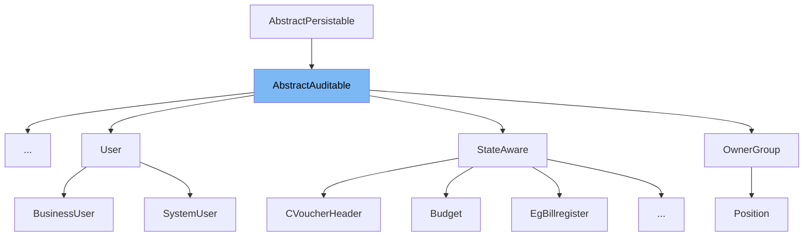

This document will cover the class <SwmToken path="finance/egov/egov-egi/src/main/java/org/egov/infra/persistence/entity/AbstractAuditable.java" pos="65:6:6" line-data="public abstract class AbstractAuditable extends AbstractPersistable&lt;Long&gt; {">`AbstractAuditable`</SwmToken>. We will discuss:

1. What <SwmToken path="finance/egov/egov-egi/src/main/java/org/egov/infra/persistence/entity/AbstractAuditable.java" pos="65:6:6" line-data="public abstract class AbstractAuditable extends AbstractPersistable&lt;Long&gt; {">`AbstractAuditable`</SwmToken> is.
2. The variables and functions defined in <SwmToken path="finance/egov/egov-egi/src/main/java/org/egov/infra/persistence/entity/AbstractAuditable.java" pos="65:6:6" line-data="public abstract class AbstractAuditable extends AbstractPersistable&lt;Long&gt; {">`AbstractAuditable`</SwmToken>.
3. An example of how to use <SwmToken path="finance/egov/egov-egi/src/main/java/org/egov/infra/persistence/entity/AbstractAuditable.java" pos="65:6:6" line-data="public abstract class AbstractAuditable extends AbstractPersistable&lt;Long&gt; {">`AbstractAuditable`</SwmToken> in <SwmToken path="finance/egov/egov-egi/src/main/java/org/egov/infra/admin/master/entity/CityPreferences.java" pos="71:16:16" line-data="import static org.egov.infra.admin.master.entity.CityPreferences.SEQ_CITY_PREF;">`CityPreferences`</SwmToken>.



# What is <SwmToken path="finance/egov/egov-egi/src/main/java/org/egov/infra/persistence/entity/AbstractAuditable.java" pos="65:6:6" line-data="public abstract class AbstractAuditable extends AbstractPersistable&lt;Long&gt; {">`AbstractAuditable`</SwmToken>

The <SwmToken path="finance/egov/egov-egi/src/main/java/org/egov/infra/persistence/entity/AbstractAuditable.java" pos="65:6:6" line-data="public abstract class AbstractAuditable extends AbstractPersistable&lt;Long&gt; {">`AbstractAuditable`</SwmToken> class is an abstract class used for auditing purposes in the application. It extends <SwmToken path="finance/egov/egov-egi/src/main/java/org/egov/infra/persistence/entity/AbstractAuditable.java" pos="65:10:13" line-data="public abstract class AbstractAuditable extends AbstractPersistable&lt;Long&gt; {">`AbstractPersistable<Long>`</SwmToken> and provides fields to track the creation and modification details of an entity. This class is annotated with <SwmToken path="finance/egov/egov-egi/src/main/java/org/egov/infra/persistence/entity/AbstractAuditable.java" pos="63:0:1" line-data="@MappedSuperclass">`@MappedSuperclass`</SwmToken> and <SwmToken path="finance/egov/egov-egi/src/main/java/org/egov/infra/persistence/entity/AbstractAuditable.java" pos="64:0:6" line-data="@EntityListeners(AuditingEntityListener.class)">`@EntityListeners(AuditingEntityListener.class)`</SwmToken>, which means it is not a standalone entity but can be extended by other entities to inherit its auditing properties.

<SwmSnippet path="/finance/egov/egov-egi/src/main/java/org/egov/infra/persistence/entity/AbstractAuditable.java" line="73">

---

# Variables and functions

The variable <SwmToken path="finance/egov/egov-egi/src/main/java/org/egov/infra/persistence/entity/AbstractAuditable.java" pos="73:5:5" line-data="	private Long createdBy;">`createdBy`</SwmToken> is used to store the ID of the user who created the entity. It is of type <SwmToken path="finance/egov/egov-egi/src/main/java/org/egov/infra/persistence/entity/AbstractAuditable.java" pos="73:3:3" line-data="	private Long createdBy;">`Long`</SwmToken>.

```java
	private Long createdBy;
```

---

</SwmSnippet>

<SwmSnippet path="/finance/egov/egov-egi/src/main/java/org/egov/infra/persistence/entity/AbstractAuditable.java" line="77">

---

The variable <SwmToken path="finance/egov/egov-egi/src/main/java/org/egov/infra/persistence/entity/AbstractAuditable.java" pos="77:5:5" line-data="	private Date createdDate;">`createdDate`</SwmToken> is used to store the date and time when the entity was created. It is annotated with <SwmToken path="finance/egov/egov-egi/src/main/java/org/egov/infra/persistence/entity/AbstractAuditable.java" pos="75:1:7" line-data="	@Temporal(TemporalType.TIMESTAMP)">`@Temporal(TemporalType.TIMESTAMP)`</SwmToken> and <SwmToken path="finance/egov/egov-egi/src/main/java/org/egov/infra/persistence/entity/AbstractAuditable.java" pos="76:1:2" line-data="	@CreatedDate">`@CreatedDate`</SwmToken>.

```java
	private Date createdDate;
```

---

</SwmSnippet>

<SwmSnippet path="/finance/egov/egov-egi/src/main/java/org/egov/infra/persistence/entity/AbstractAuditable.java" line="83">

---

The variable <SwmToken path="finance/egov/egov-egi/src/main/java/org/egov/infra/persistence/entity/AbstractAuditable.java" pos="83:5:5" line-data="	private Long lastModifiedBy;">`lastModifiedBy`</SwmToken> is used to store the ID of the user who last modified the entity. It is of type <SwmToken path="finance/egov/egov-egi/src/main/java/org/egov/infra/persistence/entity/AbstractAuditable.java" pos="83:3:3" line-data="	private Long lastModifiedBy;">`Long`</SwmToken>.

```java
	private Long lastModifiedBy;
```

---

</SwmSnippet>

<SwmSnippet path="/finance/egov/egov-egi/src/main/java/org/egov/infra/persistence/entity/AbstractAuditable.java" line="87">

---

The variable <SwmToken path="finance/egov/egov-egi/src/main/java/org/egov/infra/persistence/entity/AbstractAuditable.java" pos="87:5:5" line-data="	private Date lastModifiedDate;">`lastModifiedDate`</SwmToken> is used to store the date and time when the entity was last modified. It is annotated with <SwmToken path="finance/egov/egov-egi/src/main/java/org/egov/infra/persistence/entity/AbstractAuditable.java" pos="75:1:7" line-data="	@Temporal(TemporalType.TIMESTAMP)">`@Temporal(TemporalType.TIMESTAMP)`</SwmToken> and <SwmToken path="finance/egov/egov-egi/src/main/java/org/egov/infra/persistence/entity/AbstractAuditable.java" pos="86:1:2" line-data="	@LastModifiedDate">`@LastModifiedDate`</SwmToken>.

```java
	private Date lastModifiedDate;
```

---

</SwmSnippet>

<SwmSnippet path="/finance/egov/egov-egi/src/main/java/org/egov/infra/persistence/entity/AbstractAuditable.java" line="89">

---

The function <SwmToken path="finance/egov/egov-egi/src/main/java/org/egov/infra/persistence/entity/AbstractAuditable.java" pos="89:5:5" line-data="	public Long getCreatedBy() {">`getCreatedBy`</SwmToken> returns the ID of the user who created the entity.

```java
	public Long getCreatedBy() {
		return createdBy;
	}
```

---

</SwmSnippet>

<SwmSnippet path="/finance/egov/egov-egi/src/main/java/org/egov/infra/persistence/entity/AbstractAuditable.java" line="93">

---

The function <SwmToken path="finance/egov/egov-egi/src/main/java/org/egov/infra/persistence/entity/AbstractAuditable.java" pos="93:5:5" line-data="	public void setCreatedBy(final Long createdBy) {">`setCreatedBy`</SwmToken> sets the ID of the user who created the entity.

```java
	public void setCreatedBy(final Long createdBy) {
		this.createdBy = createdBy;
	}
```

---

</SwmSnippet>

<SwmSnippet path="/finance/egov/egov-egi/src/main/java/org/egov/infra/persistence/entity/AbstractAuditable.java" line="97">

---

The function <SwmToken path="finance/egov/egov-egi/src/main/java/org/egov/infra/persistence/entity/AbstractAuditable.java" pos="97:5:5" line-data="	public Date getCreatedDate() {">`getCreatedDate`</SwmToken> returns the date and time when the entity was created.

```java
	public Date getCreatedDate() {
		return createdDate;
	}
```

---

</SwmSnippet>

<SwmSnippet path="/finance/egov/egov-egi/src/main/java/org/egov/infra/persistence/entity/AbstractAuditable.java" line="101">

---

The function <SwmToken path="finance/egov/egov-egi/src/main/java/org/egov/infra/persistence/entity/AbstractAuditable.java" pos="101:5:5" line-data="	public void setCreatedDate(final Date createdDate) {">`setCreatedDate`</SwmToken> sets the date and time when the entity was created.

```java
	public void setCreatedDate(final Date createdDate) {
		this.createdDate = createdDate;
	}
```

---

</SwmSnippet>

<SwmSnippet path="/finance/egov/egov-egi/src/main/java/org/egov/infra/persistence/entity/AbstractAuditable.java" line="105">

---

The function <SwmToken path="finance/egov/egov-egi/src/main/java/org/egov/infra/persistence/entity/AbstractAuditable.java" pos="106:5:5" line-data="	public Long getLastModifiedBy() {">`getLastModifiedBy`</SwmToken> returns the ID of the user who last modified the entity. It is annotated with <SwmToken path="finance/egov/egov-egi/src/main/java/org/egov/infra/persistence/entity/AbstractAuditable.java" pos="105:1:2" line-data="	@Audited">`@Audited`</SwmToken>.

```java
	@Audited
	public Long getLastModifiedBy() {
		return lastModifiedBy;
	}
```

---

</SwmSnippet>

<SwmSnippet path="/finance/egov/egov-egi/src/main/java/org/egov/infra/persistence/entity/AbstractAuditable.java" line="110">

---

The function <SwmToken path="finance/egov/egov-egi/src/main/java/org/egov/infra/persistence/entity/AbstractAuditable.java" pos="110:5:5" line-data="	public void setLastModifiedBy(final Long lastModifiedBy) {">`setLastModifiedBy`</SwmToken> sets the ID of the user who last modified the entity.

```java
	public void setLastModifiedBy(final Long lastModifiedBy) {
		this.lastModifiedBy = lastModifiedBy;
	}
```

---

</SwmSnippet>

<SwmSnippet path="/finance/egov/egov-egi/src/main/java/org/egov/infra/persistence/entity/AbstractAuditable.java" line="114">

---

The function <SwmToken path="finance/egov/egov-egi/src/main/java/org/egov/infra/persistence/entity/AbstractAuditable.java" pos="115:5:5" line-data="	public Date getLastModifiedDate() {">`getLastModifiedDate`</SwmToken> returns the date and time when the entity was last modified. It is annotated with <SwmToken path="finance/egov/egov-egi/src/main/java/org/egov/infra/persistence/entity/AbstractAuditable.java" pos="114:1:2" line-data="	@Audited">`@Audited`</SwmToken>.

```java
	@Audited
	public Date getLastModifiedDate() {
		return lastModifiedDate;
	}
```

---

</SwmSnippet>

<SwmSnippet path="/finance/egov/egov-egi/src/main/java/org/egov/infra/persistence/entity/AbstractAuditable.java" line="119">

---

The function <SwmToken path="finance/egov/egov-egi/src/main/java/org/egov/infra/persistence/entity/AbstractAuditable.java" pos="119:5:5" line-data="	public void setLastModifiedDate(final Date lastModifiedDate) {">`setLastModifiedDate`</SwmToken> sets the date and time when the entity was last modified.

```java
	public void setLastModifiedDate(final Date lastModifiedDate) {
		this.lastModifiedDate = lastModifiedDate;
	}
```

---

</SwmSnippet>

# Usage example

The <SwmToken path="finance/egov/egov-egi/src/main/java/org/egov/infra/admin/master/entity/CityPreferences.java" pos="71:16:16" line-data="import static org.egov.infra.admin.master.entity.CityPreferences.SEQ_CITY_PREF;">`CityPreferences`</SwmToken> class is an example of how to use <SwmToken path="finance/egov/egov-egi/src/main/java/org/egov/infra/persistence/entity/AbstractAuditable.java" pos="65:6:6" line-data="public abstract class AbstractAuditable extends AbstractPersistable&lt;Long&gt; {">`AbstractAuditable`</SwmToken>. It extends <SwmToken path="finance/egov/egov-egi/src/main/java/org/egov/infra/persistence/entity/AbstractAuditable.java" pos="65:6:6" line-data="public abstract class AbstractAuditable extends AbstractPersistable&lt;Long&gt; {">`AbstractAuditable`</SwmToken> to inherit its auditing properties.

<SwmSnippet path="/finance/egov/egov-egi/src/main/java/org/egov/infra/admin/master/entity/CityPreferences.java" line="1">

---

The <SwmToken path="finance/egov/egov-egi/src/main/java/org/egov/infra/admin/master/entity/CityPreferences.java" pos="71:16:16" line-data="import static org.egov.infra.admin.master.entity.CityPreferences.SEQ_CITY_PREF;">`CityPreferences`</SwmToken> class extends <SwmToken path="finance/egov/egov-egi/src/main/java/org/egov/infra/persistence/entity/AbstractAuditable.java" pos="65:6:6" line-data="public abstract class AbstractAuditable extends AbstractPersistable&lt;Long&gt; {">`AbstractAuditable`</SwmToken>, thereby inheriting its auditing fields and methods.

```java
/*
 *    eGov  SmartCity eGovernance suite aims to improve the internal efficiency,transparency,
 *    accountability and the service delivery of the government  organizations.
 *
 *     Copyright (C) 2017  eGovernments Foundation
 *
 *     The updated version of eGov suite of products as by eGovernments Foundation
 *     is available at http://www.egovernments.org
 *
 *     This program is free software: you can redistribute it and/or modify
```

---

</SwmSnippet>

&nbsp;

*This is an auto-generated document by Swimm AI 🌊 and has not yet been verified by a human*

<SwmMeta version="3.0.0" repo-id="Z2l0aHViJTNBJTNBRElHSVQtT1NTJTNBJTNBU3dpbW0tRGVtbw==" repo-name="DIGIT-OSS" doc-type="general-class"><sup>Powered by [Swimm](/)</sup></SwmMeta>
