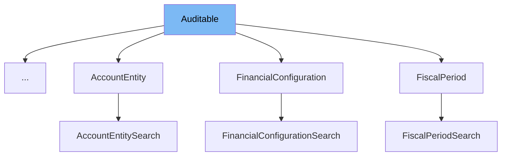

This document will cover the class <SwmToken path="business-services/egf-instrument/src/main/java/org/egov/egf/instrument/domain/model/InstrumentTypeProperty.java" pos="5:12:12" line-data="import org.egov.common.domain.model.Auditable;">`Auditable`</SwmToken> in detail. We will discuss:

1. What <SwmToken path="business-services/egf-instrument/src/main/java/org/egov/egf/instrument/domain/model/InstrumentTypeProperty.java" pos="5:12:12" line-data="import org.egov.common.domain.model.Auditable;">`Auditable`</SwmToken> is.
2. The variables and functions defined in <SwmToken path="business-services/egf-instrument/src/main/java/org/egov/egf/instrument/domain/model/InstrumentTypeProperty.java" pos="5:12:12" line-data="import org.egov.common.domain.model.Auditable;">`Auditable`</SwmToken>.
3. An example of how to use <SwmToken path="business-services/egf-instrument/src/main/java/org/egov/egf/instrument/domain/model/InstrumentTypeProperty.java" pos="5:12:12" line-data="import org.egov.common.domain.model.Auditable;">`Auditable`</SwmToken> in <SwmToken path="business-services/egf-instrument/src/main/java/org/egov/egf/instrument/domain/model/InstrumentTypeProperty.java" pos="19:4:4" line-data="public class InstrumentTypeProperty extends Auditable {">`InstrumentTypeProperty`</SwmToken>.



# What is Auditable

The <SwmToken path="business-services/egf-instrument/src/main/java/org/egov/egf/instrument/domain/model/InstrumentTypeProperty.java" pos="5:12:12" line-data="import org.egov.common.domain.model.Auditable;">`Auditable`</SwmToken> class is a domain model used to add auditing information to other entities. It includes fields for tracking the tenant, the user who created or last modified the entity, and timestamps for creation and last modification. This class is essential for maintaining a history of changes and ensuring data integrity in multi-tenant environments.

<SwmSnippet path="/business-services/egf-master/src/main/java/org/egov/common/domain/model/Auditable.java" line="24">

---

# Variables and functions

The variable <SwmToken path="business-services/egf-master/src/main/java/org/egov/common/domain/model/Auditable.java" pos="26:5:5" line-data="    protected String tenantId;">`tenantId`</SwmToken> is a unique identifier for the tenant, such as 'AP' or <SwmToken path="business-services/egf-master/src/main/java/org/egov/common/domain/model/Auditable.java" pos="20:21:23" line-data="     * tenantId Unique Identifier of the tenant, Like AP, AP.Kurnool etc.">`AP.Kurnool`</SwmToken>. It represents the client for which the transaction is created. This field is annotated with <SwmToken path="business-services/egf-master/src/main/java/org/egov/common/domain/model/Auditable.java" pos="24:1:2" line-data="    @NotNull">`@NotNull`</SwmToken> and <SwmToken path="business-services/egf-master/src/main/java/org/egov/common/domain/model/Auditable.java" pos="25:1:2" line-data="    @Length(max = 50, min = 5)">`@Length`</SwmToken> to ensure it is not null and has a length between 5 and 50 characters.

```java
    @NotNull
    @Length(max = 50, min = 5)
    protected String tenantId;
```

---

</SwmSnippet>

<SwmSnippet path="/business-services/egf-master/src/main/java/org/egov/common/domain/model/Auditable.java" line="30">

---

The variable <SwmToken path="business-services/egf-master/src/main/java/org/egov/common/domain/model/Auditable.java" pos="30:5:5" line-data="    protected User createdBy;">`createdBy`</SwmToken> stores the user who created the transaction. This is an instance of the <SwmToken path="business-services/egf-master/src/main/java/org/egov/common/domain/model/Auditable.java" pos="30:3:3" line-data="    protected User createdBy;">`User`</SwmToken> class.

```java
    protected User createdBy;
```

---

</SwmSnippet>

<SwmSnippet path="/business-services/egf-master/src/main/java/org/egov/common/domain/model/Auditable.java" line="34">

---

The variable <SwmToken path="business-services/egf-master/src/main/java/org/egov/common/domain/model/Auditable.java" pos="34:5:5" line-data="    protected User lastModifiedBy;">`lastModifiedBy`</SwmToken> stores the user who last updated the transaction. This is also an instance of the <SwmToken path="business-services/egf-master/src/main/java/org/egov/common/domain/model/Auditable.java" pos="34:3:3" line-data="    protected User lastModifiedBy;">`User`</SwmToken> class.

```java
    protected User lastModifiedBy;
```

---

</SwmSnippet>

<SwmSnippet path="/business-services/egf-master/src/main/java/org/egov/common/domain/model/Auditable.java" line="38">

---

The variable <SwmToken path="business-services/egf-master/src/main/java/org/egov/common/domain/model/Auditable.java" pos="38:5:5" line-data="    protected Date createdDate;">`createdDate`</SwmToken> stores the date when the transaction was created. This is an instance of the <SwmToken path="business-services/egf-master/src/main/java/org/egov/common/domain/model/Auditable.java" pos="38:3:3" line-data="    protected Date createdDate;">`Date`</SwmToken> class.

```java
    protected Date createdDate;
```

---

</SwmSnippet>

<SwmSnippet path="/business-services/egf-master/src/main/java/org/egov/common/domain/model/Auditable.java" line="42">

---

The variable <SwmToken path="business-services/egf-master/src/main/java/org/egov/common/domain/model/Auditable.java" pos="42:5:5" line-data="    protected Date lastModifiedDate;">`lastModifiedDate`</SwmToken> stores the date when the transaction was last updated. This is an instance of the <SwmToken path="business-services/egf-master/src/main/java/org/egov/common/domain/model/Auditable.java" pos="42:3:3" line-data="    protected Date lastModifiedDate;">`Date`</SwmToken> class.

```java
    protected Date lastModifiedDate;
```

---

</SwmSnippet>

<SwmSnippet path="/business-services/egf-master/src/main/java/org/egov/common/domain/model/Auditable.java" line="44">

---

The variable <SwmToken path="business-services/egf-master/src/main/java/org/egov/common/domain/model/Auditable.java" pos="44:5:5" line-data="    protected String deleteReason;">`deleteReason`</SwmToken> stores the reason for deleting the transaction. This is a string field.

```java
    protected String deleteReason;
```

---

</SwmSnippet>

# Usage example

Here is an example of how to use the <SwmToken path="business-services/egf-instrument/src/main/java/org/egov/egf/instrument/domain/model/InstrumentTypeProperty.java" pos="5:12:12" line-data="import org.egov.common.domain.model.Auditable;">`Auditable`</SwmToken> class in the <SwmToken path="business-services/egf-instrument/src/main/java/org/egov/egf/instrument/domain/model/InstrumentTypeProperty.java" pos="19:4:4" line-data="public class InstrumentTypeProperty extends Auditable {">`InstrumentTypeProperty`</SwmToken> class.

<SwmSnippet path="/business-services/egf-instrument/src/main/java/org/egov/egf/instrument/domain/model/InstrumentTypeProperty.java" line="1">

---

The <SwmToken path="business-services/egf-instrument/src/main/java/org/egov/egf/instrument/domain/model/InstrumentTypeProperty.java" pos="19:4:4" line-data="public class InstrumentTypeProperty extends Auditable {">`InstrumentTypeProperty`</SwmToken> class extends the <SwmToken path="business-services/egf-instrument/src/main/java/org/egov/egf/instrument/domain/model/InstrumentTypeProperty.java" pos="5:12:12" line-data="import org.egov.common.domain.model.Auditable;">`Auditable`</SwmToken> class, inheriting all its fields and methods. This allows <SwmToken path="business-services/egf-instrument/src/main/java/org/egov/egf/instrument/domain/model/InstrumentTypeProperty.java" pos="19:4:4" line-data="public class InstrumentTypeProperty extends Auditable {">`InstrumentTypeProperty`</SwmToken> to have auditing capabilities, such as tracking the tenant, the user who created or last modified it, and the timestamps for creation and last modification.

```java
package org.egov.egf.instrument.domain.model;

import javax.validation.constraints.NotNull;

import org.egov.common.domain.model.Auditable;
import org.egov.egf.master.web.contract.FinancialStatusContract;

import lombok.AllArgsConstructor;
import lombok.Builder;
import lombok.Getter;
import lombok.NoArgsConstructor;
import lombok.Setter;
```

---

</SwmSnippet>

&nbsp;

*This is an auto-generated document by Swimm AI 🌊 and has not yet been verified by a human*

<SwmMeta version="3.0.0" repo-id="Z2l0aHViJTNBJTNBRElHSVQtT1NTJTNBJTNBU3dpbW0tRGVtbw==" repo-name="DIGIT-OSS" doc-type="general-class"><sup>Powered by [Swimm](/)</sup></SwmMeta>
