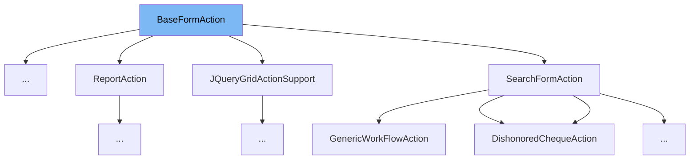

This document will cover the class <SwmToken path="finance/egov/egov-egi/src/main/java/org/egov/infra/web/struts/actions/BaseFormAction.java" pos="85:6:6" line-data="public abstract class BaseFormAction extends ActionSupport">`BaseFormAction`</SwmToken> in detail. We will cover:

1. What is <SwmToken path="finance/egov/egov-egi/src/main/java/org/egov/infra/web/struts/actions/BaseFormAction.java" pos="85:6:6" line-data="public abstract class BaseFormAction extends ActionSupport">`BaseFormAction`</SwmToken>
2. Variables and functions
3. Usage example



# What is <SwmToken path="finance/egov/egov-egi/src/main/java/org/egov/infra/web/struts/actions/BaseFormAction.java" pos="85:6:6" line-data="public abstract class BaseFormAction extends ActionSupport">`BaseFormAction`</SwmToken>

The <SwmToken path="finance/egov/egov-egi/src/main/java/org/egov/infra/web/struts/actions/BaseFormAction.java" pos="85:6:6" line-data="public abstract class BaseFormAction extends ActionSupport">`BaseFormAction`</SwmToken> class is an abstract class in the <SwmPath>[finance/egov/egov-egi/src/main/java/org/egov/infra/web/struts/actions/BaseFormAction.java](finance/egov/egov-egi/src/main/java/org/egov/infra/web/struts/actions/BaseFormAction.java)</SwmPath> file. It serves as a base class for form actions in the application. This class implements several interfaces such as <SwmToken path="finance/egov/egov-egi/src/main/java/org/egov/infra/web/struts/actions/BaseFormAction.java" pos="80:8:8" line-data="import com.opensymphony.xwork2.ModelDriven;">`ModelDriven`</SwmToken>, <SwmToken path="finance/egov/egov-egi/src/main/java/org/egov/infra/web/struts/actions/BaseFormAction.java" pos="66:10:10" line-data="import org.apache.struts2.interceptor.ParameterAware;">`ParameterAware`</SwmToken>, <SwmToken path="finance/egov/egov-egi/src/main/java/org/egov/infra/web/struts/actions/BaseFormAction.java" pos="68:10:10" line-data="import org.apache.struts2.interceptor.SessionAware;">`SessionAware`</SwmToken>, <SwmToken path="finance/egov/egov-egi/src/main/java/org/egov/infra/web/struts/actions/BaseFormAction.java" pos="81:8:8" line-data="import com.opensymphony.xwork2.Preparable;">`Preparable`</SwmToken>, <SwmToken path="finance/egov/egov-egi/src/main/java/org/egov/infra/web/struts/actions/BaseFormAction.java" pos="67:10:10" line-data="import org.apache.struts2.interceptor.RequestAware;">`RequestAware`</SwmToken>, and <SwmToken path="finance/egov/egov-egi/src/main/java/org/egov/infra/web/struts/actions/BaseFormAction.java" pos="82:10:10" line-data="import com.opensymphony.xwork2.interceptor.ParameterNameAware;">`ParameterNameAware`</SwmToken>, which provide various functionalities for handling web requests, sessions, and parameters.

<SwmSnippet path="/finance/egov/egov-egi/src/main/java/org/egov/infra/web/struts/actions/BaseFormAction.java" line="108">

---

# Variables and functions

The function <SwmToken path="finance/egov/egov-egi/src/main/java/org/egov/infra/web/struts/actions/BaseFormAction.java" pos="108:11:11" line-data="    protected Map&lt;String, Object&gt; session() {">`session`</SwmToken> returns the current session map.

```java
    protected Map<String, Object> session() {
        return session;
    }
```

---

</SwmSnippet>

<SwmSnippet path="/finance/egov/egov-egi/src/main/java/org/egov/infra/web/struts/actions/BaseFormAction.java" line="112">

---

The function <SwmToken path="finance/egov/egov-egi/src/main/java/org/egov/infra/web/struts/actions/BaseFormAction.java" pos="112:11:11" line-data="    public Map&lt;String, Object&gt; getSession() {">`getSession`</SwmToken> returns the current session map.

```java
    public Map<String, Object> getSession() {
        return session;
    }
```

---

</SwmSnippet>

<SwmSnippet path="/finance/egov/egov-egi/src/main/java/org/egov/infra/web/struts/actions/BaseFormAction.java" line="116">

---

The function <SwmToken path="finance/egov/egov-egi/src/main/java/org/egov/infra/web/struts/actions/BaseFormAction.java" pos="117:5:5" line-data="    public void setSession(final Map&lt;String, Object&gt; session) {">`setSession`</SwmToken> sets the session map.

```java
    @Override
    public void setSession(final Map<String, Object> session) {
        this.session = session;
    }
```

---

</SwmSnippet>

<SwmSnippet path="/finance/egov/egov-egi/src/main/java/org/egov/infra/web/struts/actions/BaseFormAction.java" line="121">

---

The function <SwmToken path="finance/egov/egov-egi/src/main/java/org/egov/infra/web/struts/actions/BaseFormAction.java" pos="121:5:5" line-data="    public PersistenceService getPersistenceService() {">`getPersistenceService`</SwmToken> returns the persistence service.

```java
    public PersistenceService getPersistenceService() {
        return persistenceService;
    }
```

---

</SwmSnippet>

<SwmSnippet path="/finance/egov/egov-egi/src/main/java/org/egov/infra/web/struts/actions/BaseFormAction.java" line="125">

---

The function <SwmToken path="finance/egov/egov-egi/src/main/java/org/egov/infra/web/struts/actions/BaseFormAction.java" pos="125:5:5" line-data="    public void setPersistenceService(final PersistenceService service) {">`setPersistenceService`</SwmToken> sets the persistence service.

```java
    public void setPersistenceService(final PersistenceService service) {
        persistenceService = service;
    }
```

---

</SwmSnippet>

<SwmSnippet path="/finance/egov/egov-egi/src/main/java/org/egov/infra/web/struts/actions/BaseFormAction.java" line="129">

---

The function <SwmToken path="finance/egov/egov-egi/src/main/java/org/egov/infra/web/struts/actions/BaseFormAction.java" pos="130:5:5" line-data="    public void prepare() {">`prepare`</SwmToken> prepares the action by setting up relationships.

```java
    @Override
    public void prepare() {
        final Map<String, Class> relationships = getRelationships();
        for (final Entry<String, Class> rel : relationships.entrySet())
            try {
                setRelationship(rel.getKey(), rel.getValue());
            } catch (IntrospectionException e) {
                throw new ApplicationRuntimeException(String.format("Could not set relationship for key %s of class %s",
                        rel.getKey(), rel.getValue().getSimpleName()), e);
            }
    }
```

---

</SwmSnippet>

<SwmSnippet path="/finance/egov/egov-egi/src/main/java/org/egov/infra/web/struts/actions/BaseFormAction.java" line="141">

---

The function <SwmToken path="finance/egov/egov-egi/src/main/java/org/egov/infra/web/struts/actions/BaseFormAction.java" pos="141:5:5" line-data="	private void setRelationship(final String relationshipName, final Class class1) throws IntrospectionException {">`setRelationship`</SwmToken> sets a relationship for a given name and class.

```java
	private void setRelationship(final String relationshipName, final Class class1) throws IntrospectionException {
		final String[] ids = parameters.get(relationshipName);
		final List<String> relationNames = Arrays.asList("department", "executingDepartment", "vouchermis.schemeid",
				"vouchermis.subschemeid");
		if (ids != null && ids.length > 0) {
			final String id = ids[0];
			if (!relationNames.contains(relationshipName) && isNotBlank(id) && Long.valueOf(id) > 0) {
				final PropertyDescriptor propDiscriptor = new PropertyDescriptor("id", class1);
				if (propDiscriptor.getPropertyType().isAssignableFrom(Long.class))
					setValue(relationshipName, getPersistenceService().getSession().get(class1, Long.valueOf(id)));
				else
					setValue(relationshipName, getPersistenceService().load(Integer.valueOf(id), class1));
			} else if (("vouchermis.schemeid".equals(relationshipName)
					|| "vouchermis.subschemeid".equals(relationshipName)) && id != null && !id.equals("-1")) {
				setValue(relationshipName, getPersistenceService().load(Integer.valueOf(id), class1));
			} else if ("department".equals(relationshipName) && id != null && !id.equals("-1")) {
				Department dept = microserviceUtils.getDepartmentByCode(id);
				setValue(relationshipName, dept);
			} else if ("executingDepartment".equals(relationshipName) && id != null) {
				Department dept = microserviceUtils.getDepartmentByCode(id);
				setValue(relationshipName, dept.getCode());
```

---

</SwmSnippet>

<SwmSnippet path="/finance/egov/egov-egi/src/main/java/org/egov/infra/web/struts/actions/BaseFormAction.java" line="167">

---

The function <SwmToken path="finance/egov/egov-egi/src/main/java/org/egov/infra/web/struts/actions/BaseFormAction.java" pos="167:5:5" line-data="    protected void setValue(final String relationshipName, final Object relation) {">`setValue`</SwmToken> sets a value in the value stack for a given relationship name and relation.

```java
    protected void setValue(final String relationshipName, final Object relation) {
        ActionContext.getContext().getValueStack().setValue("model." + relationshipName, relation);
    }
```

---

</SwmSnippet>

<SwmSnippet path="/finance/egov/egov-egi/src/main/java/org/egov/infra/web/struts/actions/BaseFormAction.java" line="171">

---

The function <SwmToken path="finance/egov/egov-egi/src/main/java/org/egov/infra/web/struts/actions/BaseFormAction.java" pos="171:11:11" line-data="    public Map&lt;String, Class&gt; getRelationships() {">`getRelationships`</SwmToken> returns the map of relationships.

```java
    public Map<String, Class> getRelationships() {
        return relations;
    }
```

---

</SwmSnippet>

<SwmSnippet path="/finance/egov/egov-egi/src/main/java/org/egov/infra/web/struts/actions/BaseFormAction.java" line="175">

---

The function <SwmToken path="finance/egov/egov-egi/src/main/java/org/egov/infra/web/struts/actions/BaseFormAction.java" pos="175:11:11" line-data="    public Map&lt;String, List&gt; getDropdownData() {">`getDropdownData`</SwmToken> returns the dropdown data map.

```java
    public Map<String, List> getDropdownData() {
        return dropdownData;
    }
```

---

</SwmSnippet>

<SwmSnippet path="/finance/egov/egov-egi/src/main/java/org/egov/infra/web/struts/actions/BaseFormAction.java" line="179">

---

The function <SwmToken path="finance/egov/egov-egi/src/main/java/org/egov/infra/web/struts/actions/BaseFormAction.java" pos="180:5:5" line-data="    public void setRequest(final Map&lt;String, Object&gt; request) {">`setRequest`</SwmToken> sets the request map.

```java
    @Override
    public void setRequest(final Map<String, Object> request) {
        this.request = request;
    }
```

---

</SwmSnippet>

<SwmSnippet path="/finance/egov/egov-egi/src/main/java/org/egov/infra/web/struts/actions/BaseFormAction.java" line="184">

---

The function <SwmToken path="finance/egov/egov-egi/src/main/java/org/egov/infra/web/struts/actions/BaseFormAction.java" pos="184:5:5" line-data="    protected void setupDropdownDataExcluding(final String... excluded) {">`setupDropdownDataExcluding`</SwmToken> sets up dropdown data excluding specified keys.

```java
    protected void setupDropdownDataExcluding(final String... excluded) {
        final List<String> excludedRelations = new ArrayList<>();
        if (excluded != null)
            for (final String e : excluded)
                excludedRelations.add(e);
        for (final Entry<String, Class> rel : relations.entrySet())
            if (!excludedRelations.contains(rel.getKey()))
                if (!ordering.containsKey(rel.getKey()))
                    dropdownData.put(rel.getKey() + "List",
                            getPersistenceService().findAllBy("from " + relations.get(rel.getKey()).getSimpleName()));
                else
                    dropdownData.put(rel.getKey() + "List", getPersistenceService().findAllBy(
                            "from " + relations.get(rel.getKey()).getSimpleName() + " order by " + ordering.get(rel.getKey())));
    }
```

---

</SwmSnippet>

<SwmSnippet path="/finance/egov/egov-egi/src/main/java/org/egov/infra/web/struts/actions/BaseFormAction.java" line="199">

---

The function <SwmToken path="finance/egov/egov-egi/src/main/java/org/egov/infra/web/struts/actions/BaseFormAction.java" pos="199:5:5" line-data="    protected void addRelatedEntity(final String name, final Class type) {">`addRelatedEntity`</SwmToken> adds a related entity to the relations map.

```java
    protected void addRelatedEntity(final String name, final Class type) {
        relations.put(name, type);
    }
```

---

</SwmSnippet>

<SwmSnippet path="/finance/egov/egov-egi/src/main/java/org/egov/infra/web/struts/actions/BaseFormAction.java" line="203">

---

The function <SwmToken path="finance/egov/egov-egi/src/main/java/org/egov/infra/web/struts/actions/BaseFormAction.java" pos="203:5:5" line-data="    protected void addRelatedEntity(final String name, final Class type, final String order) {">`addRelatedEntity`</SwmToken> adds a related entity with an ordering to the relations and ordering maps.

```java
    protected void addRelatedEntity(final String name, final Class type, final String order) {
        relations.put(name, type);
        ordering.put(name, order);
    }
```

---

</SwmSnippet>

<SwmSnippet path="/finance/egov/egov-egi/src/main/java/org/egov/infra/web/struts/actions/BaseFormAction.java" line="208">

---

The function <SwmToken path="finance/egov/egov-egi/src/main/java/org/egov/infra/web/struts/actions/BaseFormAction.java" pos="208:5:5" line-data="    protected void addDropdownData(final String name, final List values) {">`addDropdownData`</SwmToken> adds dropdown data to the <SwmToken path="finance/egov/egov-egi/src/main/java/org/egov/infra/web/struts/actions/BaseFormAction.java" pos="209:1:1" line-data="        dropdownData.put(name, values);">`dropdownData`</SwmToken> map.

```java
    protected void addDropdownData(final String name, final List values) {
        dropdownData.put(name, values);
    }
```

---

</SwmSnippet>

<SwmSnippet path="/finance/egov/egov-egi/src/main/java/org/egov/infra/web/struts/actions/BaseFormAction.java" line="212">

---

The function <SwmToken path="finance/egov/egov-egi/src/main/java/org/egov/infra/web/struts/actions/BaseFormAction.java" pos="213:5:5" line-data="    public boolean acceptableParameterName(final String paramName) {">`acceptableParameterName`</SwmToken> checks if a parameter name is acceptable.

```java
    @Override
    public boolean acceptableParameterName(final String paramName) {
        return !relations.containsKey(paramName);
    }
```

---

</SwmSnippet>

<SwmSnippet path="/finance/egov/egov-egi/src/main/java/org/egov/infra/web/struts/actions/BaseFormAction.java" line="217">

---

The function <SwmToken path="finance/egov/egov-egi/src/main/java/org/egov/infra/web/struts/actions/BaseFormAction.java" pos="218:5:5" line-data="    public void setParameters(Map&lt;String, String[]&gt; parameters) {">`setParameters`</SwmToken> sets the parameters map.

```java
    @Override
    public void setParameters(Map<String, String[]> parameters) {
        this.parameters = parameters;
    }
```

---

</SwmSnippet>

<SwmSnippet path="/finance/egov/egov-egi/src/main/java/org/egov/infra/web/struts/actions/BaseFormAction.java" line="222">

---

The function <SwmToken path="finance/egov/egov-egi/src/main/java/org/egov/infra/web/struts/actions/BaseFormAction.java" pos="222:11:11" line-data="    public Map&lt;String, String&gt; getOrdering() {">`getOrdering`</SwmToken> returns the ordering map.

```java
    public Map<String, String> getOrdering() {
        return ordering;
    }
```

---

</SwmSnippet>

<SwmSnippet path="/finance/egov/egov-egi/src/main/java/org/egov/infra/web/struts/actions/BaseFormAction.java" line="226">

---

The function <SwmToken path="finance/egov/egov-egi/src/main/java/org/egov/infra/web/struts/actions/BaseFormAction.java" pos="226:5:5" line-data="    public String tokenName() {">`tokenName`</SwmToken> generates a unique token name.

```java
    public String tokenName() {
        return this.getClass().getSimpleName() + UUID.randomUUID();
    }
```

---

</SwmSnippet>

<SwmSnippet path="/finance/egov/egov-egi/src/main/java/org/egov/infra/web/struts/actions/BaseFormAction.java" line="230">

---

The function <SwmToken path="finance/egov/egov-egi/src/main/java/org/egov/infra/web/struts/actions/BaseFormAction.java" pos="230:8:8" line-data="    public List&lt;Department&gt; getDepartmentsFromMs() {">`getDepartmentsFromMs`</SwmToken> retrieves a list of departments from the microservice.

```java
    public List<Department> getDepartmentsFromMs() {

        List<Department> departments = microserviceUtils.getDepartments();
        return departments;
    }
```

---

</SwmSnippet>

# Usage example

Here is an example of how to use <SwmToken path="finance/egov/egov-egi/src/main/java/org/egov/infra/web/struts/actions/BaseFormAction.java" pos="85:6:6" line-data="public abstract class BaseFormAction extends ActionSupport">`BaseFormAction`</SwmToken> in <SwmToken path="finance/egov/egov-egfweb/src/main/java/org/egov/egf/web/actions/bill/BillViewAction.java" pos="82:4:4" line-data="public class BillViewAction extends BaseFormAction">`BillViewAction`</SwmToken>.

<SwmSnippet path="/finance/egov/egov-egfweb/src/main/java/org/egov/egf/web/actions/bill/BillViewAction.java" line="30">

---

The <SwmToken path="finance/egov/egov-egfweb/src/main/java/org/egov/egf/web/actions/bill/BillViewAction.java" pos="82:4:4" line-data="public class BillViewAction extends BaseFormAction">`BillViewAction`</SwmToken> class extends <SwmToken path="finance/egov/egov-egi/src/main/java/org/egov/infra/web/struts/actions/BaseFormAction.java" pos="85:6:6" line-data="public abstract class BaseFormAction extends ActionSupport">`BaseFormAction`</SwmToken> and demonstrates its usage.

```java
 *            Urban Local Bodies interfaces, dashboards, mobile applications, of the program and any
 *            derived works should carry eGovernments Foundation logo on the top right corner.
 *
 *            For the logo, please refer http://egovernments.org/html/logo/egov_logo.png.
 *            For any further queries on attribution, including queries on brand guidelines,
 *            please contact contact@egovernments.org
```

---

</SwmSnippet>

&nbsp;

*This is an auto-generated document by Swimm AI 🌊 and has not yet been verified by a human*

<SwmMeta version="3.0.0" repo-id="Z2l0aHViJTNBJTNBRElHSVQtT1NTJTNBJTNBU3dpbW0tRGVtbw==" repo-name="DIGIT-OSS" doc-type="general-class"><sup>Powered by [Swimm](/)</sup></SwmMeta>
