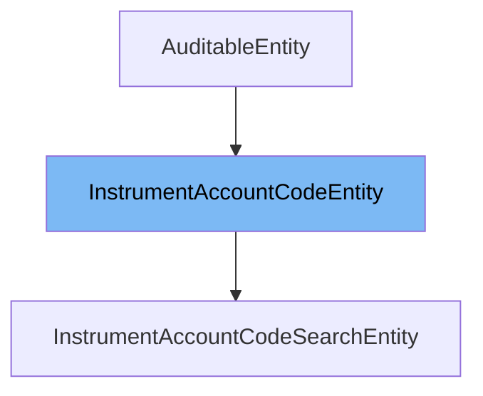

This document will cover the class <SwmToken path="business-services/egf-instrument/src/main/java/org/egov/egf/instrument/persistence/entity/InstrumentAccountCodeEntity.java" pos="35:3:3" line-data="    public InstrumentAccountCodeEntity toEntity(InstrumentAccountCode instrumentAccountCode) {">`InstrumentAccountCodeEntity`</SwmToken>. We will discuss:

1. What <SwmToken path="business-services/egf-instrument/src/main/java/org/egov/egf/instrument/persistence/entity/InstrumentAccountCodeEntity.java" pos="35:3:3" line-data="    public InstrumentAccountCodeEntity toEntity(InstrumentAccountCode instrumentAccountCode) {">`InstrumentAccountCodeEntity`</SwmToken> is.
2. The variables and functions defined in <SwmToken path="business-services/egf-instrument/src/main/java/org/egov/egf/instrument/persistence/entity/InstrumentAccountCodeEntity.java" pos="35:3:3" line-data="    public InstrumentAccountCodeEntity toEntity(InstrumentAccountCode instrumentAccountCode) {">`InstrumentAccountCodeEntity`</SwmToken>.
3. An example of how to use <SwmToken path="business-services/egf-instrument/src/main/java/org/egov/egf/instrument/persistence/entity/InstrumentAccountCodeEntity.java" pos="35:3:3" line-data="    public InstrumentAccountCodeEntity toEntity(InstrumentAccountCode instrumentAccountCode) {">`InstrumentAccountCodeEntity`</SwmToken> in <SwmToken path="business-services/egf-instrument/src/main/java/org/egov/egf/instrument/persistence/entity/InstrumentAccountCodeSearchEntity.java" pos="16:4:4" line-data="public class InstrumentAccountCodeSearchEntity extends InstrumentAccountCodeEntity {">`InstrumentAccountCodeSearchEntity`</SwmToken>.



# What is <SwmToken path="business-services/egf-instrument/src/main/java/org/egov/egf/instrument/persistence/entity/InstrumentAccountCodeEntity.java" pos="35:3:3" line-data="    public InstrumentAccountCodeEntity toEntity(InstrumentAccountCode instrumentAccountCode) {">`InstrumentAccountCodeEntity`</SwmToken>

The <SwmToken path="business-services/egf-instrument/src/main/java/org/egov/egf/instrument/persistence/entity/InstrumentAccountCodeEntity.java" pos="35:3:3" line-data="    public InstrumentAccountCodeEntity toEntity(InstrumentAccountCode instrumentAccountCode) {">`InstrumentAccountCodeEntity`</SwmToken> class is a persistence entity used in the eGovernments Foundation's DIGIT platform. It represents the mapping between an instrument type and an account code. This entity is used to store and retrieve data related to instrument account codes from the database.

<SwmSnippet path="/business-services/egf-instrument/src/main/java/org/egov/egf/instrument/persistence/entity/InstrumentAccountCodeEntity.java" line="21">

---

# Variables and functions

The constant <SwmToken path="business-services/egf-instrument/src/main/java/org/egov/egf/instrument/persistence/entity/InstrumentAccountCodeEntity.java" pos="21:9:9" line-data="    public static final String TABLE_NAME = &quot;egf_instrumentaccountcode&quot;;">`TABLE_NAME`</SwmToken> defines the name of the database table associated with this entity.

```java
    public static final String TABLE_NAME = "egf_instrumentaccountcode";
```

---

</SwmSnippet>

<SwmSnippet path="/business-services/egf-instrument/src/main/java/org/egov/egf/instrument/persistence/entity/InstrumentAccountCodeEntity.java" line="22">

---

The variable <SwmToken path="business-services/egf-instrument/src/main/java/org/egov/egf/instrument/persistence/entity/InstrumentAccountCodeEntity.java" pos="22:5:5" line-data="    private String id;">`id`</SwmToken> is used to store the unique identifier of the instrument account code entity.

```java
    private String id;
```

---

</SwmSnippet>

<SwmSnippet path="/business-services/egf-instrument/src/main/java/org/egov/egf/instrument/persistence/entity/InstrumentAccountCodeEntity.java" line="23">

---

The variable <SwmToken path="business-services/egf-instrument/src/main/java/org/egov/egf/instrument/persistence/entity/InstrumentAccountCodeEntity.java" pos="23:5:5" line-data="    private String instrumentTypeId;">`instrumentTypeId`</SwmToken> is used to store the identifier of the instrument type associated with this entity.

```java
    private String instrumentTypeId;
```

---

</SwmSnippet>

<SwmSnippet path="/business-services/egf-instrument/src/main/java/org/egov/egf/instrument/persistence/entity/InstrumentAccountCodeEntity.java" line="24">

---

The variable <SwmToken path="business-services/egf-instrument/src/main/java/org/egov/egf/instrument/persistence/entity/InstrumentAccountCodeEntity.java" pos="24:5:5" line-data="    private String accountCodeId;">`accountCodeId`</SwmToken> is used to store the identifier of the account code associated with this entity.

```java
    private String accountCodeId;
```

---

</SwmSnippet>

<SwmSnippet path="/business-services/egf-instrument/src/main/java/org/egov/egf/instrument/persistence/entity/InstrumentAccountCodeEntity.java" line="26">

---

The function <SwmToken path="business-services/egf-instrument/src/main/java/org/egov/egf/instrument/persistence/entity/InstrumentAccountCodeEntity.java" pos="26:5:5" line-data="    public InstrumentAccountCode toDomain() {">`toDomain`</SwmToken> converts the <SwmToken path="business-services/egf-instrument/src/main/java/org/egov/egf/instrument/persistence/entity/InstrumentAccountCodeEntity.java" pos="35:3:3" line-data="    public InstrumentAccountCodeEntity toEntity(InstrumentAccountCode instrumentAccountCode) {">`InstrumentAccountCodeEntity`</SwmToken> instance to a domain model object of type <SwmToken path="business-services/egf-instrument/src/main/java/org/egov/egf/instrument/persistence/entity/InstrumentAccountCodeEntity.java" pos="26:3:3" line-data="    public InstrumentAccountCode toDomain() {">`InstrumentAccountCode`</SwmToken>. It sets the properties of the domain object based on the entity's properties.

```java
    public InstrumentAccountCode toDomain() {
        InstrumentAccountCode instrumentAccountCode = new InstrumentAccountCode();
        super.toDomain(instrumentAccountCode);
        instrumentAccountCode.setId(id);
        instrumentAccountCode.setInstrumentType(InstrumentType.builder().name(instrumentTypeId).build());
        instrumentAccountCode.setAccountCode(ChartOfAccountContract.builder().glcode(accountCodeId).build());
        return instrumentAccountCode;
    }
```

---

</SwmSnippet>

<SwmSnippet path="/business-services/egf-instrument/src/main/java/org/egov/egf/instrument/persistence/entity/InstrumentAccountCodeEntity.java" line="35">

---

The function <SwmToken path="business-services/egf-instrument/src/main/java/org/egov/egf/instrument/persistence/entity/InstrumentAccountCodeEntity.java" pos="35:5:5" line-data="    public InstrumentAccountCodeEntity toEntity(InstrumentAccountCode instrumentAccountCode) {">`toEntity`</SwmToken> converts a domain model object of type <SwmToken path="business-services/egf-instrument/src/main/java/org/egov/egf/instrument/persistence/entity/InstrumentAccountCodeEntity.java" pos="35:7:7" line-data="    public InstrumentAccountCodeEntity toEntity(InstrumentAccountCode instrumentAccountCode) {">`InstrumentAccountCode`</SwmToken> to an <SwmToken path="business-services/egf-instrument/src/main/java/org/egov/egf/instrument/persistence/entity/InstrumentAccountCodeEntity.java" pos="35:3:3" line-data="    public InstrumentAccountCodeEntity toEntity(InstrumentAccountCode instrumentAccountCode) {">`InstrumentAccountCodeEntity`</SwmToken> instance. It sets the properties of the entity based on the domain object's properties.

```java
    public InstrumentAccountCodeEntity toEntity(InstrumentAccountCode instrumentAccountCode) {
        super.toEntity(instrumentAccountCode);
        id = instrumentAccountCode.getId();
        instrumentTypeId = instrumentAccountCode.getInstrumentType() != null
                ? instrumentAccountCode.getInstrumentType().getName() : null;
        accountCodeId = instrumentAccountCode.getAccountCode() != null
                ? instrumentAccountCode.getAccountCode().getGlcode() : null;
        return this;
    }
```

---

</SwmSnippet>

# Usage example

Here is an example of how to use <SwmToken path="business-services/egf-instrument/src/main/java/org/egov/egf/instrument/persistence/entity/InstrumentAccountCodeEntity.java" pos="35:3:3" line-data="    public InstrumentAccountCodeEntity toEntity(InstrumentAccountCode instrumentAccountCode) {">`InstrumentAccountCodeEntity`</SwmToken> in <SwmToken path="business-services/egf-instrument/src/main/java/org/egov/egf/instrument/persistence/entity/InstrumentAccountCodeSearchEntity.java" pos="16:4:4" line-data="public class InstrumentAccountCodeSearchEntity extends InstrumentAccountCodeEntity {">`InstrumentAccountCodeSearchEntity`</SwmToken>.

<SwmSnippet path="/business-services/egf-instrument/src/main/java/org/egov/egf/instrument/persistence/entity/InstrumentAccountCodeSearchEntity.java" line="1">

---

The <SwmToken path="business-services/egf-instrument/src/main/java/org/egov/egf/instrument/persistence/entity/InstrumentAccountCodeSearchEntity.java" pos="16:4:4" line-data="public class InstrumentAccountCodeSearchEntity extends InstrumentAccountCodeEntity {">`InstrumentAccountCodeSearchEntity`</SwmToken> class extends <SwmToken path="business-services/egf-instrument/src/main/java/org/egov/egf/instrument/persistence/entity/InstrumentAccountCodeSearchEntity.java" pos="16:8:8" line-data="public class InstrumentAccountCodeSearchEntity extends InstrumentAccountCodeEntity {">`InstrumentAccountCodeEntity`</SwmToken> and adds search-specific properties and methods. This class can be used to perform search operations on instrument account codes.

```java
package org.egov.egf.instrument.persistence.entity;

import org.egov.egf.instrument.domain.model.InstrumentAccountCode;
import org.egov.egf.instrument.domain.model.InstrumentAccountCodeSearch;

import lombok.AllArgsConstructor;
import lombok.Getter;
import lombok.NoArgsConstructor;
import lombok.Setter;

@Getter
@Setter
@AllArgsConstructor
@NoArgsConstructor

public class InstrumentAccountCodeSearchEntity extends InstrumentAccountCodeEntity {
    private String ids;
    private String sortBy;
    private Integer pageSize;
    private Integer offset;

```

---

</SwmSnippet>

&nbsp;

*This is an auto-generated document by Swimm AI 🌊 and has not yet been verified by a human*

<SwmMeta version="3.0.0" repo-id="Z2l0aHViJTNBJTNBRElHSVQtT1NTJTNBJTNBU3dpbW0tRGVtbw==" repo-name="DIGIT-OSS" doc-type="general-class"><sup>Powered by [Swimm](/)</sup></SwmMeta>
