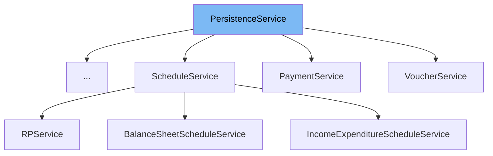

This document will cover the <SwmToken path="finance/egov/egov-egi/src/main/java/org/egov/infstr/services/PersistenceService.java" pos="93:4:4" line-data="public class PersistenceService&lt;T, ID extends Serializable&gt; {">`PersistenceService`</SwmToken> class. We will cover:

1. What <SwmToken path="finance/egov/egov-egi/src/main/java/org/egov/infstr/services/PersistenceService.java" pos="93:4:4" line-data="public class PersistenceService&lt;T, ID extends Serializable&gt; {">`PersistenceService`</SwmToken> is.
2. Variables and functions in <SwmToken path="finance/egov/egov-egi/src/main/java/org/egov/infstr/services/PersistenceService.java" pos="93:4:4" line-data="public class PersistenceService&lt;T, ID extends Serializable&gt; {">`PersistenceService`</SwmToken>.
3. Usage example of <SwmToken path="finance/egov/egov-egi/src/main/java/org/egov/infstr/services/PersistenceService.java" pos="93:4:4" line-data="public class PersistenceService&lt;T, ID extends Serializable&gt; {">`PersistenceService`</SwmToken> in `ChartOfAccountDetailService`.



# What is <SwmToken path="finance/egov/egov-egi/src/main/java/org/egov/infstr/services/PersistenceService.java" pos="93:4:4" line-data="public class PersistenceService&lt;T, ID extends Serializable&gt; {">`PersistenceService`</SwmToken>

The <SwmToken path="finance/egov/egov-egi/src/main/java/org/egov/infstr/services/PersistenceService.java" pos="93:4:4" line-data="public class PersistenceService&lt;T, ID extends Serializable&gt; {">`PersistenceService`</SwmToken> class in <SwmPath>[finance/egov/egov-egi/src/main/java/org/egov/infstr/services/PersistenceService.java](finance/egov/egov-egi/src/main/java/org/egov/infstr/services/PersistenceService.java)</SwmPath> is a deprecated service class used for handling persistence operations. It provides various methods for validating, finding, and managing entities in the database. Although it is still present in the codebase, it is recommended to use repositories instead.

<SwmSnippet path="/finance/egov/egov-egi/src/main/java/org/egov/infstr/services/PersistenceService.java" line="93">

---

# Variables and functions

The <SwmToken path="finance/egov/egov-egi/src/main/java/org/egov/infstr/services/PersistenceService.java" pos="93:4:4" line-data="public class PersistenceService&lt;T, ID extends Serializable&gt; {">`PersistenceService`</SwmToken> constructor initializes the service with the type of entity it will manage.

```java
public class PersistenceService<T, ID extends Serializable> {
	private static final Logger LOG = LoggerFactory.getLogger(PersistenceService.class);

	@PersistenceContext
	protected EntityManager entityManager;

	private Class<T> type;

	@Autowired
	@Qualifier("entityValidator")
	private LocalValidatorFactoryBean entityValidator;

	public PersistenceService(final Class<T> type) {
		this.type = type;
	}
```

---

</SwmSnippet>

<SwmSnippet path="/finance/egov/egov-egi/src/main/java/org/egov/infstr/services/PersistenceService.java" line="109">

---

The <SwmToken path="finance/egov/egov-egi/src/main/java/org/egov/infstr/services/PersistenceService.java" pos="109:8:8" line-data="	public Class&lt;T&gt; getType() {">`getType`</SwmToken> function returns the type of entity managed by the service.

```java
	public Class<T> getType() {
		return this.type;
	}
```

---

</SwmSnippet>

<SwmSnippet path="/finance/egov/egov-egi/src/main/java/org/egov/infstr/services/PersistenceService.java" line="113">

---

The <SwmToken path="finance/egov/egov-egi/src/main/java/org/egov/infstr/services/PersistenceService.java" pos="113:5:5" line-data="	public Session getSession() {">`getSession`</SwmToken> function unwraps and returns the current Hibernate session from the <SwmToken path="finance/egov/egov-egi/src/main/java/org/egov/infstr/services/PersistenceService.java" pos="114:3:3" line-data="		return entityManager.unwrap(Session.class);">`entityManager`</SwmToken>.

```java
	public Session getSession() {
		return entityManager.unwrap(Session.class);
	}
```

---

</SwmSnippet>

<SwmSnippet path="/finance/egov/egov-egi/src/main/java/org/egov/infstr/services/PersistenceService.java" line="117">

---

The <SwmToken path="finance/egov/egov-egi/src/main/java/org/egov/infstr/services/PersistenceService.java" pos="117:5:5" line-data="	public void validate(final T model) {">`validate`</SwmToken> function validates the given model and throws a <SwmToken path="finance/egov/egov-egi/src/main/java/org/egov/infstr/services/PersistenceService.java" pos="120:5:5" line-data="			throw new ValidationException(errors);">`ValidationException`</SwmToken> if there are any validation errors.

```java
	public void validate(final T model) {
		final List<ValidationError> errors = this.validateModel(model);
		if (!errors.isEmpty())
			throw new ValidationException(errors);
	}
```

---

</SwmSnippet>

<SwmSnippet path="/finance/egov/egov-egi/src/main/java/org/egov/infstr/services/PersistenceService.java" line="123">

---

The <SwmToken path="finance/egov/egov-egi/src/main/java/org/egov/infstr/services/PersistenceService.java" pos="123:8:8" line-data="	public List&lt;ValidationError&gt; validateModel(final T model) {">`validateModel`</SwmToken> function performs the actual validation of the model and returns a list of validation errors.

```java
	public List<ValidationError> validateModel(final T model) {
		LOG.debug("Validating Model");
		final List<ValidationError> errors = new ArrayList<>();
		if (model == null) {
			errors.add(new ValidationError("", "model.null"));
			return errors;
		}
		final Set<ConstraintViolation<T>> constraintViolations = entityValidator.validate(model);
		for (final ConstraintViolation<T> constraintViolation : constraintViolations) {
			final Iterator<Node> nodes = constraintViolation.getPropertyPath().iterator();
			while (nodes.hasNext())
				errors.add(new ValidationError(nodes.next().getName(), constraintViolation.getMessage()));
		}
		if (model instanceof BaseModel) {
			final BaseModel basemodel = (BaseModel) model;
			final List<ValidationError> dependentValMessages = basemodel.validate();
			if (dependentValMessages != null)
				errors.addAll(dependentValMessages);
		}
		return errors;
	}
```

---

</SwmSnippet>

<SwmSnippet path="/finance/egov/egov-egi/src/main/java/org/egov/infstr/services/PersistenceService.java" line="145">

---

The <SwmToken path="finance/egov/egov-egi/src/main/java/org/egov/infstr/services/PersistenceService.java" pos="145:5:5" line-data="	public T find(final String query, final Object... params) {">`find`</SwmToken> function executes a query with parameters and returns the first result.

```java
	public T find(final String query, final Object... params) {
		final List<T> results = findAllBy(query, params);
		return results.isEmpty() ? null : results.get(0);
	}
```

---

</SwmSnippet>

<SwmSnippet path="/finance/egov/egov-egi/src/main/java/org/egov/infstr/services/PersistenceService.java" line="150">

---

The <SwmToken path="finance/egov/egov-egi/src/main/java/org/egov/infstr/services/PersistenceService.java" pos="150:5:5" line-data="	public T find(final String query) {">`find`</SwmToken> function executes a query and returns a unique result.

```java
	public T find(final String query) {
		final Query q = getSession().createQuery(query);
		return (T) q.uniqueResult();
	}
```

---

</SwmSnippet>

<SwmSnippet path="/finance/egov/egov-egi/src/main/java/org/egov/infstr/services/PersistenceService.java" line="155">

---

The <SwmToken path="finance/egov/egov-egi/src/main/java/org/egov/infstr/services/PersistenceService.java" pos="155:5:5" line-data="	protected T findById(final ID id) {">`findById`</SwmToken> function retrieves an entity by its ID.

```java
	protected T findById(final ID id) {
		return id == null ? null : getSession().get(this.type, id);
	}
```

---

</SwmSnippet>

<SwmSnippet path="/finance/egov/egov-egi/src/main/java/org/egov/infstr/services/PersistenceService.java" line="159">

---

The <SwmToken path="finance/egov/egov-egi/src/main/java/org/egov/infstr/services/PersistenceService.java" pos="159:8:8" line-data="	public List&lt;T&gt; findAllBy(final String query, final Object... params) {">`findAllBy`</SwmToken> function executes a query with parameters and returns a list of results.

```java
	public List<T> findAllBy(final String query, final Object... params) {
		final Query q = getQueryWithParams(query, params);
		return q.list();
	}
```

---

</SwmSnippet>

<SwmSnippet path="/finance/egov/egov-egi/src/main/java/org/egov/infstr/services/PersistenceService.java" line="164">

---

The <SwmToken path="finance/egov/egov-egi/src/main/java/org/egov/infstr/services/PersistenceService.java" pos="174:5:5" line-data="	public Page findPageBy(final String query, final Integer pageNumber, final Integer pageSize,">`findPageBy`</SwmToken> function executes a query with pagination parameters and returns a <SwmToken path="finance/egov/egov-egi/src/main/java/org/egov/infstr/services/PersistenceService.java" pos="169:19:19" line-data="	 *            Number of records to be returned in the page. If null then all">`page`</SwmToken> object containing the results.

```java
	/**
	 * @param query
	 * @param pageNumber
	 *            used to determine the offset from which to return the results
	 * @param pageSize
	 *            Number of records to be returned in the page. If null then all
	 *            records that match query are returned
	 * @param params
	 * @return
	 */
	public Page findPageBy(final String query, final Integer pageNumber, final Integer pageSize,
			final Object... params) {
		final Query q = getQueryWithParams(query, params);
		return new Page(q, pageNumber, pageSize);
	}
```

---

</SwmSnippet>

<SwmSnippet path="/finance/egov/egov-egi/src/main/java/org/egov/infstr/services/PersistenceService.java" line="180">

---

The <SwmToken path="finance/egov/egov-egi/src/main/java/org/egov/infstr/services/PersistenceService.java" pos="180:5:5" line-data="	private Query getQueryWithParams(final String query, final Object... params) {">`getQueryWithParams`</SwmToken> function creates a query with the given parameters.

```java
	private Query getQueryWithParams(final String query, final Object... params) {
		final Query q = getSession().createQuery(query);
		int index = 0;
		for (final Object param : params) {
			q.setParameter(index, param);
			index++;
		}
		return q;
	}
```

---

</SwmSnippet>

<SwmSnippet path="/finance/egov/egov-egi/src/main/java/org/egov/infstr/services/PersistenceService.java" line="190">

---

The <SwmToken path="finance/egov/egov-egi/src/main/java/org/egov/infstr/services/PersistenceService.java" pos="190:8:8" line-data="	public List&lt;T&gt; findAllByNamedQuery(final String namedQuery, final Object... params) {">`findAllByNamedQuery`</SwmToken> function executes a named query with parameters and returns a list of results.

```java
	public List<T> findAllByNamedQuery(final String namedQuery, final Object... params) {
		final Query q = getNamedQueryWithParams(namedQuery, params);
		return q.list();
	}
```

---

</SwmSnippet>

<SwmSnippet path="/finance/egov/egov-egi/src/main/java/org/egov/infstr/services/PersistenceService.java" line="195">

---

The <SwmToken path="finance/egov/egov-egi/src/main/java/org/egov/infstr/services/PersistenceService.java" pos="205:5:5" line-data="	public Page findPageByNamedQuery(final String namedQuery, final Integer pageNumber, final Integer pageSize,">`findPageByNamedQuery`</SwmToken> function executes a named query with pagination parameters and returns a <SwmToken path="finance/egov/egov-egi/src/main/java/org/egov/infstr/services/PersistenceService.java" pos="200:19:19" line-data="	 *            Number of records to be returned in the page. If null then all">`page`</SwmToken> object containing the results.

```java
	/**
	 * @param namedQuery
	 * @param pageNumber
	 *            used to determine the offset from which to return the results
	 * @param pageSize
	 *            Number of records to be returned in the page. If null then all
	 *            records that match query are returned
	 * @param params
	 * @return Page instance that can be used to implement pagination
	 */
	public Page findPageByNamedQuery(final String namedQuery, final Integer pageNumber, final Integer pageSize,
			final Object... params) {
		final Query q = getNamedQueryWithParams(namedQuery, params);
		return new Page(q, pageNumber, pageSize);
	}
```

---

</SwmSnippet>

<SwmSnippet path="/finance/egov/egov-egi/src/main/java/org/egov/infstr/services/PersistenceService.java" line="211">

---

The <SwmToken path="finance/egov/egov-egi/src/main/java/org/egov/infstr/services/PersistenceService.java" pos="211:5:5" line-data="	private Query getNamedQueryWithParams(final String namedQuery, final Object... params) {">`getNamedQueryWithParams`</SwmToken> function creates a named query with the given parameters.

```java
	private Query getNamedQueryWithParams(final String namedQuery, final Object... params) {
		final Query q = getSession().getNamedQuery(namedQuery);
		int index = 0;
		for (final Object param : params) {
			if (param instanceof Collection)
				q.setParameterList(String.valueOf("param_" + index), (Collection) param);
			else
				q.setParameter(index, param);
			index++;
		}
		return q;
	}
```

---

</SwmSnippet>

<SwmSnippet path="/finance/egov/egov-egi/src/main/java/org/egov/infstr/services/PersistenceService.java" line="224">

---

The <SwmToken path="finance/egov/egov-egi/src/main/java/org/egov/infstr/services/PersistenceService.java" pos="224:5:5" line-data="	public T findByNamedQuery(final String namedQuery, final Object... params) {">`findByNamedQuery`</SwmToken> function executes a named query with parameters and returns the first result.

```java
	public T findByNamedQuery(final String namedQuery, final Object... params) {
		final List<T> results = findAllByNamedQuery(namedQuery, params);
		return results.isEmpty() ? null : results.get(0);
	}
```

---

</SwmSnippet>

<SwmSnippet path="/finance/egov/egov-egi/src/main/java/org/egov/infstr/services/PersistenceService.java" line="229">

---

The <SwmToken path="finance/egov/egov-egi/src/main/java/org/egov/infstr/services/PersistenceService.java" pos="230:5:5" line-data="	public T persist(final T model) {">`persist`</SwmToken> function validates and saves or updates the given model.

```java
	@Transactional
	public T persist(final T model) {
		validate(model);
		getSession().saveOrUpdate(model);
		return model;
```

---

</SwmSnippet>

<SwmSnippet path="/finance/egov/egov-egi/src/main/java/org/egov/infstr/services/PersistenceService.java" line="236">

---

The <SwmToken path="finance/egov/egov-egi/src/main/java/org/egov/infstr/services/PersistenceService.java" pos="237:5:5" line-data="	public T merge(final T model) {">`merge`</SwmToken> function validates and merges the given model.

```java
	@Transactional
	public T merge(final T model) {
		validate(model);
		return (T) getSession().merge(model);
	}
```

---

</SwmSnippet>

<SwmSnippet path="/finance/egov/egov-egi/src/main/java/org/egov/infstr/services/PersistenceService.java" line="242">

---

The <SwmToken path="finance/egov/egov-egi/src/main/java/org/egov/infstr/services/PersistenceService.java" pos="243:5:5" line-data="	public T create(final T entity) {">`create`</SwmToken> function validates and saves the given entity, then loads and returns it.

```java
	@Transactional
	public T create(final T entity) {
		validate(entity);
		final Long id = (Long) getSession().save(entity);
		return getSession().load(this.type, id);
	}
```

---

</SwmSnippet>

<SwmSnippet path="/finance/egov/egov-egi/src/main/java/org/egov/infstr/services/PersistenceService.java" line="249">

---

The <SwmToken path="finance/egov/egov-egi/src/main/java/org/egov/infstr/services/PersistenceService.java" pos="249:5:5" line-data="	public T load(final Serializable id, Class cls) {">`load`</SwmToken> function loads an entity by its ID and class.

```java
	public T load(final Serializable id, Class cls) {
		return (T) getSession().load(cls, id);
	}
```

---

</SwmSnippet>

<SwmSnippet path="/finance/egov/egov-egi/src/main/java/org/egov/infstr/services/PersistenceService.java" line="253">

---

The <SwmToken path="finance/egov/egov-egi/src/main/java/org/egov/infstr/services/PersistenceService.java" pos="254:5:5" line-data="	public void delete(final T entity) {">`delete`</SwmToken> function deletes the given entity.

```java
	@Transactional
	public void delete(final T entity) {
		getSession().delete(entity);
	}
```

---

</SwmSnippet>

<SwmSnippet path="/finance/egov/egov-egi/src/main/java/org/egov/infstr/services/PersistenceService.java" line="258">

---

The <SwmToken path="finance/egov/egov-egi/src/main/java/org/egov/infstr/services/PersistenceService.java" pos="258:8:8" line-data="	public List&lt;T&gt; findAll() {">`findAll`</SwmToken> function retrieves all entities of the managed type.

```java
	public List<T> findAll() {
		return getSession().createCriteria(this.type).list();
	}
```

---

</SwmSnippet>

<SwmSnippet path="/finance/egov/egov-egi/src/main/java/org/egov/infstr/services/PersistenceService.java" line="262">

---

The <SwmToken path="finance/egov/egov-egi/src/main/java/org/egov/infstr/services/PersistenceService.java" pos="262:8:8" line-data="	public List&lt;T&gt; findByExample(final T exampleT) {">`findByExample`</SwmToken> function retrieves entities matching the example entity.

```java
	public List<T> findByExample(final T exampleT) {
		final Criteria criteria = getSession().createCriteria(this.type);
		return criteria.add(Example.create(exampleT)).list();
	}
```

---

</SwmSnippet>

<SwmSnippet path="/finance/egov/egov-egi/src/main/java/org/egov/infstr/services/PersistenceService.java" line="267">

---

The <SwmToken path="finance/egov/egov-egi/src/main/java/org/egov/infstr/services/PersistenceService.java" pos="267:5:5" line-data="	public T findById(final ID id, final boolean lock) {">`findById`</SwmToken> function retrieves an entity by its ID, with an optional lock.

```java
	public T findById(final ID id, final boolean lock) {
		return findById(id);
	}
```

---

</SwmSnippet>

<SwmSnippet path="/finance/egov/egov-egi/src/main/java/org/egov/infstr/services/PersistenceService.java" line="271">

---

The <SwmToken path="finance/egov/egov-egi/src/main/java/org/egov/infstr/services/PersistenceService.java" pos="271:5:5" line-data="	public T findByIdWithJoinFetch(final ID id, final String joinFetchPropertyName) {">`findByIdWithJoinFetch`</SwmToken> function retrieves an entity by its ID and fetches the specified property.

```java
	public T findByIdWithJoinFetch(final ID id, final String joinFetchPropertyName) {
		return (T) getSession().createCriteria(type).setFetchMode(joinFetchPropertyName, FetchMode.JOIN)
				.add(Restrictions.idEq(id)).uniqueResult();
	}
```

---

</SwmSnippet>

<SwmSnippet path="/finance/egov/egov-egi/src/main/java/org/egov/infstr/services/PersistenceService.java" line="276">

---

The <SwmToken path="finance/egov/egov-egi/src/main/java/org/egov/infstr/services/PersistenceService.java" pos="277:5:5" line-data="	public T update(final T entity) {">`update`</SwmToken> function validates and updates the given entity.

```java
	@Transactional
	public T update(final T entity) {
		validate(entity);
		getSession().update(entity);
		return entity;
	}
```

---

</SwmSnippet>

&nbsp;

*This is an auto-generated document by Swimm AI 🌊 and has not yet been verified by a human*

<SwmMeta version="3.0.0" repo-id="Z2l0aHViJTNBJTNBRElHSVQtT1NTJTNBJTNBU3dpbW0tRGVtbw==" repo-name="DIGIT-OSS" doc-type="general-class"><sup>Powered by [Swimm](/)</sup></SwmMeta>
