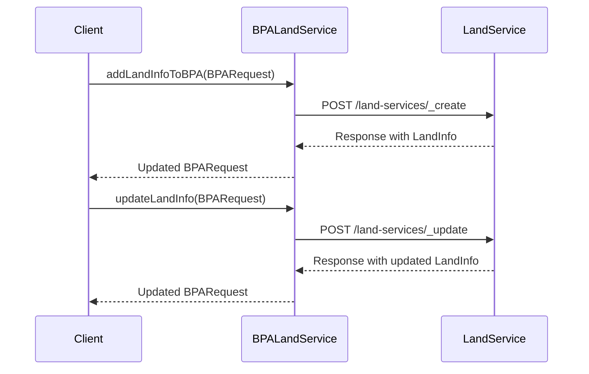

# Overview of BPA Services

BPA Services refer to the various functionalities and operations provided by the <SwmToken path="municipal-services/bpa-services/src/main/java/org/egov/bpa/service/notification/PaymentNotificationService.java" pos="11:10:10" line-data="import org.egov.bpa.service.BPAService;">`BPAService`</SwmToken> class and other related classes. These services include creating and processing Building Plan Approval (BPA) applications, validating data, integrating workflows, enriching requests, and handling notifications.

# Key Components of BPA Services

The <SwmToken path="municipal-services/bpa-services/src/main/java/org/egov/bpa/service/notification/PaymentNotificationService.java" pos="11:10:10" line-data="import org.egov.bpa.service.BPAService;">`BPAService`</SwmToken> class collaborates with multiple other services such as <SwmToken path="municipal-services/bpa-services/src/main/java/org/egov/bpa/service/EnrichmentService.java" pos="32:10:10" line-data="import org.egov.bpa.workflow.WorkflowIntegrator;">`WorkflowIntegrator`</SwmToken>, <SwmToken path="municipal-services/bpa-services/src/main/java/org/egov/bpa/service/EnrichmentService.java" pos="54:4:4" line-data="public class EnrichmentService {">`EnrichmentService`</SwmToken>, <SwmToken path="municipal-services/bpa-services/src/main/java/org/egov/bpa/service/NocService.java" pos="52:13:13" line-data="		Map&lt;String, String&gt; edcrResponse = edcrService.getEDCRDetails(bpaRequest.getRequestInfo(), bpaRequest.getBPA());">`edcrService`</SwmToken>, and others to ensure the smooth processing of BPA applications. It also interacts with external services like land services to fetch and update land information related to BPA applications.

# Main Functions in BPA Services

Several main functions are integral to BPA Services. These include <SwmToken path="municipal-services/bpa-services/src/main/java/org/egov/bpa/service/EnrichmentService.java" pos="95:5:5" line-data="	public void enrichBPACreateRequest(BPARequest bpaRequest, Object mdmsData, Map&lt;String, String&gt; values) {">`enrichBPACreateRequest`</SwmToken>, <SwmToken path="municipal-services/bpa-services/src/main/java/org/egov/bpa/service/EnrichmentService.java" pos="175:5:5" line-data="	public void enrichBPAUpdateRequest(BPARequest bpaRequest, BusinessService businessService) {">`enrichBPAUpdateRequest`</SwmToken>, <SwmToken path="municipal-services/bpa-services/src/main/java/org/egov/bpa/service/CalculationService.java" pos="32:5:5" line-data="	public void addCalculation(BPARequest bpaRequest, String feeType) {">`addCalculation`</SwmToken>, <SwmToken path="municipal-services/bpa-services/src/main/java/org/egov/bpa/service/OCService.java" pos="42:5:5" line-data="	public void validateAdditionalData(BPARequest bpaRequest, BPASearchCriteria criteria) {">`validateAdditionalData`</SwmToken>, `getUsersForBpas`, <SwmToken path="municipal-services/bpa-services/src/main/java/org/egov/bpa/service/NocService.java" pos="50:5:5" line-data="	public void createNocRequest(BPARequest bpaRequest, Object mdmsData) {">`createNocRequest`</SwmToken>, <SwmToken path="municipal-services/bpa-services/src/main/java/org/egov/bpa/service/EDCRService.java" pos="61:11:11" line-data="	public Map&lt;String, String&gt; validateEdcrPlan(BPARequest request, Object mdmsData) {">`validateEdcrPlan`</SwmToken>, and <SwmToken path="municipal-services/bpa-services/src/main/java/org/egov/bpa/service/notification/PaymentNotificationService.java" pos="84:5:5" line-data="	public void process(HashMap&lt;String, Object&gt; record) {">`process`</SwmToken>. Each function plays a specific role in the lifecycle of a BPA application.

<SwmSnippet path="/municipal-services/bpa-services/src/main/java/org/egov/bpa/service/EnrichmentService.java" line="95">

---

## <SwmToken path="municipal-services/bpa-services/src/main/java/org/egov/bpa/service/EnrichmentService.java" pos="95:5:5" line-data="	public void enrichBPACreateRequest(BPARequest bpaRequest, Object mdmsData, Map&lt;String, String&gt; values) {">`enrichBPACreateRequest`</SwmToken>

The <SwmToken path="municipal-services/bpa-services/src/main/java/org/egov/bpa/service/EnrichmentService.java" pos="95:5:5" line-data="	public void enrichBPACreateRequest(BPARequest bpaRequest, Object mdmsData, Map&lt;String, String&gt; values) {">`enrichBPACreateRequest`</SwmToken> function enriches the BPA create request by adding audit details and <SwmToken path="municipal-services/bpa-services/src/main/java/org/egov/bpa/service/EnrichmentService.java" pos="89:19:19" line-data="	 * encrich create BPA Reqeust by adding audidetails and uuids">`uuids`</SwmToken>. It sets the audit details, generates a new UUID for the BPA, and sets the business service based on the application type and risk type.

```java
	public void enrichBPACreateRequest(BPARequest bpaRequest, Object mdmsData, Map<String, String> values) {
		RequestInfo requestInfo = bpaRequest.getRequestInfo();
		AuditDetails auditDetails = bpaUtil.getAuditDetails(requestInfo.getUserInfo().getUuid(), true);
		bpaRequest.getBPA().setAuditDetails(auditDetails);
		bpaRequest.getBPA().setId(UUID.randomUUID().toString());

		bpaRequest.getBPA().setAccountId(bpaRequest.getBPA().getAuditDetails().getCreatedBy());
		String applicationType = values.get(BPAConstants.APPLICATIONTYPE);
		if (applicationType.equalsIgnoreCase(BPAConstants.BUILDING_PLAN)) {
			if (!bpaRequest.getBPA().getRiskType().equalsIgnoreCase(BPAConstants.LOW_RISKTYPE)) {
				bpaRequest.getBPA().setBusinessService(BPAConstants.BPA_MODULE_CODE);
			} else {
				bpaRequest.getBPA().setBusinessService(BPAConstants.BPA_LOW_MODULE_CODE);
			}
		} else {
			bpaRequest.getBPA().setBusinessService(BPAConstants.BPA_OC_MODULE_CODE);
```

---

</SwmSnippet>

<SwmSnippet path="/municipal-services/bpa-services/src/main/java/org/egov/bpa/service/CalculationService.java" line="32">

---

## <SwmToken path="municipal-services/bpa-services/src/main/java/org/egov/bpa/service/CalculationService.java" pos="32:5:5" line-data="	public void addCalculation(BPARequest bpaRequest, String feeType) {">`addCalculation`</SwmToken>

The <SwmToken path="municipal-services/bpa-services/src/main/java/org/egov/bpa/service/CalculationService.java" pos="32:5:5" line-data="	public void addCalculation(BPARequest bpaRequest, String feeType) {">`addCalculation`</SwmToken> function adds a calculation for the BPA object based on the fee type. It creates a calculation request, sets the necessary criteria, and fetches the result from the service request repository.

```java
	public void addCalculation(BPARequest bpaRequest, String feeType) {

		CalculationReq calulcationRequest = new CalculationReq();
		calulcationRequest.setRequestInfo(bpaRequest.getRequestInfo());
		CalulationCriteria calculationCriteria = new CalulationCriteria();
		calculationCriteria.setApplicationNo(bpaRequest.getBPA().getApplicationNo());
		calculationCriteria.setBpa(bpaRequest.getBPA());
		calculationCriteria.setFeeType(feeType);
		calculationCriteria.setTenantId(bpaRequest.getBPA().getTenantId());
		List<CalulationCriteria> criterias = Arrays.asList(calculationCriteria);
		calulcationRequest.setCalulationCriteria(criterias);
		StringBuilder url = new StringBuilder();
		url.append(this.config.getCalculatorHost());
		url.append(this.config.getCalulatorEndPoint());

		this.serviceRequestRepository.fetchResult(url, calulcationRequest);
	}
```

---

</SwmSnippet>

<SwmSnippet path="/municipal-services/bpa-services/src/main/java/org/egov/bpa/service/OCService.java" line="42">

---

## <SwmToken path="municipal-services/bpa-services/src/main/java/org/egov/bpa/service/OCService.java" pos="42:5:5" line-data="	public void validateAdditionalData(BPARequest bpaRequest, BPASearchCriteria criteria) {">`validateAdditionalData`</SwmToken>

The <SwmToken path="municipal-services/bpa-services/src/main/java/org/egov/bpa/service/OCService.java" pos="42:5:5" line-data="	public void validateAdditionalData(BPARequest bpaRequest, BPASearchCriteria criteria) {">`validateAdditionalData`</SwmToken> function validates the OC EDCR and BPA EDCR data. It fetches the EDCR details, extracts necessary data, and validates the risk, khatha, plot, and occupancy types.

```java
	public void validateAdditionalData(BPARequest bpaRequest, BPASearchCriteria criteria) {
		
		org.egov.common.contract.request.RequestInfo requestInfo = bpaRequest.getRequestInfo();
		String OcEdcr = bpaRequest.getBPA().getEdcrNumber(); 
		String num = criteria.getEdcrNumber();
		ArrayList<String> edcrNos = new ArrayList<String>();
		edcrNos.add(OcEdcr);
		edcrNos.add(num);
		RequestInfo edcrRequestInfo = new RequestInfo();
		ArrayList<LinkedHashMap<String, Object>> data = new ArrayList<LinkedHashMap<String, Object>>();
		edcrNos.forEach(edcrNo -> {
			StringBuilder uri = new StringBuilder(config.getEdcrHost());
			uri.append(config.getGetPlanEndPoint());
			uri.append("?").append("tenantId=").append(criteria.getTenantId());
			uri.append("&").append("edcrNumber=").append(edcrNo);
			try {
				LinkedHashMap response = (LinkedHashMap) serviceRequestRepository.fetchResult(uri,
						new org.egov.bpa.web.model.edcr.RequestInfoWrapper(edcrRequestInfo));
				data.add(response);

			} catch (Exception e) {
```

---

</SwmSnippet>

<SwmSnippet path="/municipal-services/bpa-services/src/main/java/org/egov/bpa/service/NocService.java" line="50">

---

## <SwmToken path="municipal-services/bpa-services/src/main/java/org/egov/bpa/service/NocService.java" pos="50:5:5" line-data="	public void createNocRequest(BPARequest bpaRequest, Object mdmsData) {">`createNocRequest`</SwmToken>

The <SwmToken path="municipal-services/bpa-services/src/main/java/org/egov/bpa/service/NocService.java" pos="50:5:5" line-data="	public void createNocRequest(BPARequest bpaRequest, Object mdmsData) {">`createNocRequest`</SwmToken> function creates a NOC request for the BPA. It fetches the EDCR details, determines the risk type, and creates NOC requests based on the NOC type mapping.

```java
	public void createNocRequest(BPARequest bpaRequest, Object mdmsData) {
		BPA bpa = bpaRequest.getBPA();
		Map<String, String> edcrResponse = edcrService.getEDCRDetails(bpaRequest.getRequestInfo(), bpaRequest.getBPA());
		log.debug("applicationType in NOC is " + edcrResponse.get(BPAConstants.APPLICATIONTYPE));
		log.debug("serviceType in NOC is " + edcrResponse.get(BPAConstants.SERVICETYPE));
		
		String riskType = "ALL";
		if (StringUtils.isEmpty(bpa.getRiskType()) || bpa.getRiskType().equalsIgnoreCase("LOW")) {
			riskType = bpa.getRiskType();
		}
		log.debug("Fetching NocTypeMapping record of riskType : " + riskType);

		String nocPath = BPAConstants.NOCTYPE_REQUIRED_MAP
				.replace("{1}", edcrResponse.get(BPAConstants.APPLICATIONTYPE))
				.replace("{2}", edcrResponse.get(BPAConstants.SERVICETYPE)).replace("{3}", riskType);
		
		Map<String,String> nocSourceCnofig = config.getNocSourceConfig();

		List<Object> nocMappingResponse = (List<Object>) JsonPath.read(mdmsData, nocPath);
		List<String> nocTypes = JsonPath.read(nocMappingResponse, "$..type");
		if (!CollectionUtils.isEmpty(nocTypes)) {
```

---

</SwmSnippet>

<SwmSnippet path="/municipal-services/bpa-services/src/main/java/org/egov/bpa/service/EDCRService.java" line="61">

---

## <SwmToken path="municipal-services/bpa-services/src/main/java/org/egov/bpa/service/EDCRService.java" pos="61:11:11" line-data="	public Map&lt;String, String&gt; validateEdcrPlan(BPARequest request, Object mdmsData) {">`validateEdcrPlan`</SwmToken>

The <SwmToken path="municipal-services/bpa-services/src/main/java/org/egov/bpa/service/EDCRService.java" pos="61:11:11" line-data="	public Map&lt;String, String&gt; validateEdcrPlan(BPARequest request, Object mdmsData) {">`validateEdcrPlan`</SwmToken> function validates the EDCR plan based on the EDCR number and risk type. It constructs the URI for the EDCR service, fetches the EDCR details, and validates the response.

```java
	public Map<String, String> validateEdcrPlan(BPARequest request, Object mdmsData) {

		String edcrNo = request.getBPA().getEdcrNumber();
		String riskType = request.getBPA().getRiskType();
		StringBuilder uri = new StringBuilder(config.getEdcrHost());
		BPA bpa = request.getBPA();

		BPASearchCriteria criteria = new BPASearchCriteria();
		criteria.setEdcrNumber(bpa.getEdcrNumber());
		List<BPA> bpas = bpaRepository.getBPAData(criteria, null);
		if(bpas.size()>0){
			for(int i=0; i<bpas.size(); i++){
				if(!bpas.get(i).getStatus().equalsIgnoreCase(BPAConstants.STATUS_REJECTED) && !bpas.get(i).getStatus().equalsIgnoreCase(BPAConstants.STATUS_REVOCATED)){
					throw new CustomException(BPAErrorConstants.DUPLICATE_EDCR,
							" Application already exists with EDCR Number " + bpa.getEdcrNumber());
				}
			}
		}
		
		uri.append(config.getGetPlanEndPoint());
		uri.append("?").append("tenantId=").append(bpa.getTenantId());
```

---

</SwmSnippet>

<SwmSnippet path="/municipal-services/bpa-services/src/main/java/org/egov/bpa/service/notification/PaymentNotificationService.java" line="84">

---

## process

The <SwmToken path="municipal-services/bpa-services/src/main/java/org/egov/bpa/service/notification/PaymentNotificationService.java" pos="84:5:5" line-data="	public void process(HashMap&lt;String, Object&gt; record) {">`process`</SwmToken> function processes the payment notification. It generates an SMS from the input record and sends an SMS request to the SMS service.

```java
	public void process(HashMap<String, Object> record) {
		try {
			String jsonString = new JSONObject(record).toString();
			DocumentContext documentContext = JsonPath.parse(jsonString);
			Map<String, String> valMap = enrichValMap(documentContext);
			if (!StringUtils.equals(BPAConstants.APPL_FEE, valMap.get(businessServiceKey)))
				return;
```

---

</SwmSnippet>

# Service Endpoints

BPA Services interact with various endpoints to perform their operations. Two key methods are <SwmToken path="municipal-services/bpa-services/src/main/java/org/egov/bpa/service/BPALandService.java" pos="43:5:5" line-data="	public void addLandInfoToBPA(BPARequest bpaRequest) {">`addLandInfoToBPA`</SwmToken> and <SwmToken path="municipal-services/bpa-services/src/main/java/org/egov/bpa/service/BPALandService.java" pos="70:5:5" line-data="	public void updateLandInfo(BPARequest bpaRequest) {">`updateLandInfo`</SwmToken>.

<SwmSnippet path="/municipal-services/bpa-services/src/main/java/org/egov/bpa/service/BPALandService.java" line="43">

---

## <SwmToken path="municipal-services/bpa-services/src/main/java/org/egov/bpa/service/BPALandService.java" pos="43:5:5" line-data="	public void addLandInfoToBPA(BPARequest bpaRequest) {">`addLandInfoToBPA`</SwmToken>

The <SwmToken path="municipal-services/bpa-services/src/main/java/org/egov/bpa/service/BPALandService.java" pos="43:5:5" line-data="	public void addLandInfoToBPA(BPARequest bpaRequest) {">`addLandInfoToBPA`</SwmToken> method is used to create land information by calling the <SwmToken path="municipal-services/bpa-services/src/main/java/org/egov/bpa/service/BPALandService.java" pos="37:9:13" line-data="	 * create landInfo calling land-services/_create api and update the landid to">`land-services/_create`</SwmToken> API and updating the land ID in the BPA request. It constructs the URI using the host and endpoint from the configuration, sends the request, and processes the response to update the BPA request with the new land information.

```java
	public void addLandInfoToBPA(BPARequest bpaRequest) {
		StringBuilder uri = new StringBuilder(config.getLandInfoHost());
		uri.append(config.getLandInfoCreate());

		LandInfoRequest landRequest = new LandInfoRequest();
		landRequest.setRequestInfo(bpaRequest.getRequestInfo());
		landRequest.setLandInfo(bpaRequest.getBPA().getLandInfo());
		LinkedHashMap responseMap = null;
		try {
			responseMap = (LinkedHashMap) serviceRequestRepository.fetchResult(uri, landRequest);
		} catch (Exception se) {
			throw new CustomException(BPAErrorConstants.LANDINFO_EXCEPTION, " LandInfo service call failed.");
		}
		ArrayList<LandInfo> landInfo = new ArrayList<LandInfo>();

		landInfo = (ArrayList<LandInfo>) responseMap.get("LandInfo");
		LandInfo landData = mapper.convertValue(landInfo.get(0), LandInfo.class);
		bpaRequest.getBPA().setLandInfo(landData);
		bpaRequest.getBPA().setLandId(landData.getId());
	}
```

---

</SwmSnippet>

<SwmSnippet path="/municipal-services/bpa-services/src/main/java/org/egov/bpa/service/BPALandService.java" line="70">

---

## <SwmToken path="municipal-services/bpa-services/src/main/java/org/egov/bpa/service/BPALandService.java" pos="70:5:5" line-data="	public void updateLandInfo(BPARequest bpaRequest) {">`updateLandInfo`</SwmToken>

The <SwmToken path="municipal-services/bpa-services/src/main/java/org/egov/bpa/service/BPALandService.java" pos="70:5:5" line-data="	public void updateLandInfo(BPARequest bpaRequest) {">`updateLandInfo`</SwmToken> method updates the existing land information for a BPA record by calling the `land-services/_update` API. It constructs the URI, sends the update request, and processes the response to update the BPA request with the updated land information.

```java
	public void updateLandInfo(BPARequest bpaRequest) {
		StringBuilder uri = new StringBuilder(config.getLandInfoHost());
		uri.append(config.getLandInfoUpdate());

		LandInfoRequest landRequest = new LandInfoRequest();
		landRequest.setRequestInfo(bpaRequest.getRequestInfo());
		landRequest.setLandInfo(bpaRequest.getBPA().getLandInfo());
		LinkedHashMap responseMap = null;
		try {
			responseMap = (LinkedHashMap) serviceRequestRepository.fetchResult(uri, landRequest);
		} catch (Exception se) {
			throw new CustomException(BPAErrorConstants.LANDINFO_EXCEPTION, " LandInfo service call failed.");
		}
		ArrayList<LandInfo> landInfo = new ArrayList<LandInfo>();

		landInfo = (ArrayList<LandInfo>) responseMap.get("LandInfo");
		LandInfo landData = mapper.convertValue(landInfo.get(0), LandInfo.class);
		bpaRequest.getBPA().setLandInfo(landData);
		bpaRequest.getBPA().setLandId(landData.getId());
	}
```

---

</SwmSnippet>

&nbsp;

*This is an auto-generated document by Swimm AI 🌊 and has not yet been verified by a human*

<SwmMeta version="3.0.0" repo-id="Z2l0aHViJTNBJTNBRElHSVQtT1NTJTNBJTNBU3dpbW0tRGVtbw==" repo-name="DIGIT-OSS" doc-type="overview"><sup>Powered by [Swimm](/)</sup></SwmMeta>
