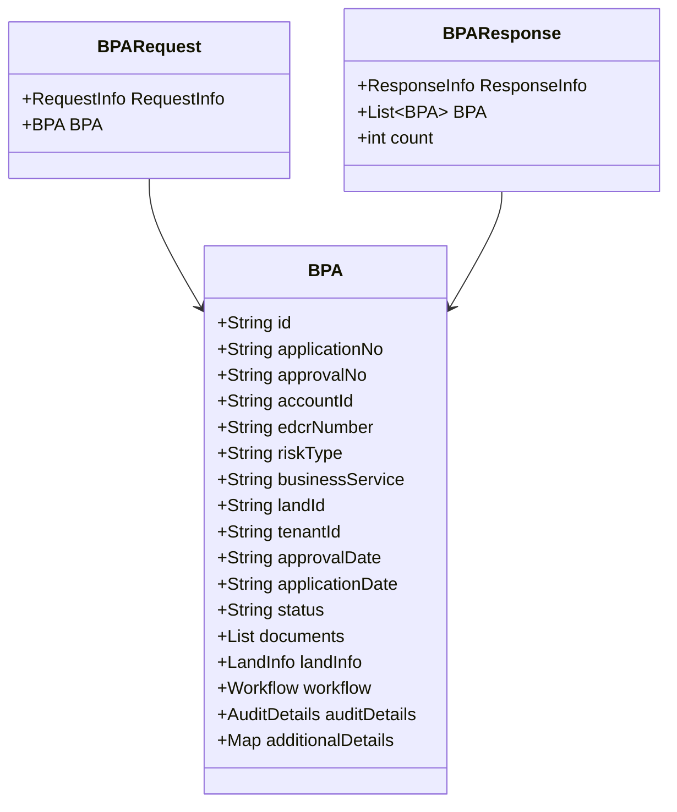

# Overview

Building Plan Approval (BPA) is a service used to apply for building plan approvals and occupancy certificates. This document provides an in-depth understanding of the BPA process, including the classes involved and their attributes, as well as the main functions such as applying for BPA and generating fees.

# BPA Class

The <SwmToken path="municipal-services/noc-services/src/main/java/org/egov/noc/web/model/bpa/BPARequest.java" pos="31:5:5" line-data="  @JsonProperty(&quot;BPA&quot;)">`BPA`</SwmToken> class is central to the BPA process. It includes various attributes such as `id`, `applicationNo`, `approvalNo`, `accountId`, `edcrNumber`, `riskType`, `businessService`, `landId`, `tenantId`, `approvalDate`, `applicationDate`, `status`, `documents`, `landInfo`, `workflow`, `auditDetails`, and `additionalDetails`. These attributes capture all necessary information for a BPA application.

# <SwmToken path="municipal-services/noc-services/src/main/java/org/egov/noc/web/model/bpa/BPARequest.java" pos="27:4:4" line-data="public class BPARequest   {">`BPARequest`</SwmToken> Class

The <SwmToken path="municipal-services/noc-services/src/main/java/org/egov/noc/web/model/bpa/BPARequest.java" pos="27:4:4" line-data="public class BPARequest   {">`BPARequest`</SwmToken> class is used to receive requests for creating or updating BPA applications. It contains a <SwmToken path="municipal-services/noc-services/src/main/java/org/egov/noc/web/model/bpa/BPARequest.java" pos="28:5:5" line-data="  @JsonProperty(&quot;RequestInfo&quot;)">`RequestInfo`</SwmToken> object and a <SwmToken path="municipal-services/noc-services/src/main/java/org/egov/noc/web/model/bpa/BPARequest.java" pos="31:5:5" line-data="  @JsonProperty(&quot;BPA&quot;)">`BPA`</SwmToken> object, which encapsulates the details of the BPA application.

<SwmSnippet path="/municipal-services/noc-services/src/main/java/org/egov/noc/web/model/bpa/BPARequest.java" line="18">

---

The <SwmToken path="municipal-services/noc-services/src/main/java/org/egov/noc/web/model/bpa/BPARequest.java" pos="27:4:4" line-data="public class BPARequest   {">`BPARequest`</SwmToken> class is defined to handle requests for creating or updating BPA applications. It includes a <SwmToken path="municipal-services/noc-services/src/main/java/org/egov/noc/web/model/bpa/BPARequest.java" pos="28:5:5" line-data="  @JsonProperty(&quot;RequestInfo&quot;)">`RequestInfo`</SwmToken> object and a <SwmToken path="municipal-services/noc-services/src/main/java/org/egov/noc/web/model/bpa/BPARequest.java" pos="31:5:5" line-data="  @JsonProperty(&quot;BPA&quot;)">`BPA`</SwmToken> object.

```java
/**
 * Contract class to receive request. Array of Property items  are used in case of create . Where as single Property item is used for update
 */
@ApiModel(description = "Contract class to receive request. Array of Property items  are used in case of create . Where as single Property item is used for update")
@Validated
@javax.annotation.Generated(value = "io.swagger.codegen.v3.generators.java.SpringCodegen", date = "2020-06-23T05:52:32.717Z[GMT]")
@NoArgsConstructor
@AllArgsConstructor
@Builder
public class BPARequest   {
  @JsonProperty("RequestInfo")
  private RequestInfo requestInfo = null;

  @JsonProperty("BPA")
  private BPA BPA = null;

  public BPARequest requestInfo(RequestInfo requestInfo) {
    this.requestInfo = requestInfo;
    return this;
  }
```

---

</SwmSnippet>

# <SwmToken path="municipal-services/noc-services/src/main/java/org/egov/noc/web/model/bpa/BPAResponse.java" pos="32:4:4" line-data="public class BPAResponse   {">`BPAResponse`</SwmToken> Class

The <SwmToken path="municipal-services/noc-services/src/main/java/org/egov/noc/web/model/bpa/BPAResponse.java" pos="32:4:4" line-data="public class BPAResponse   {">`BPAResponse`</SwmToken> class contains the response header and the created or updated BPA applications. It includes a list of <SwmToken path="municipal-services/noc-services/src/main/java/org/egov/noc/web/model/bpa/BPARequest.java" pos="31:5:5" line-data="  @JsonProperty(&quot;BPA&quot;)">`BPA`</SwmToken> objects and a count of the applications, providing a structured response for BPA-related operations.

<SwmSnippet path="/municipal-services/noc-services/src/main/java/org/egov/noc/web/model/bpa/BPAResponse.java" line="21">

---

The <SwmToken path="municipal-services/noc-services/src/main/java/org/egov/noc/web/model/bpa/BPAResponse.java" pos="32:4:4" line-data="public class BPAResponse   {">`BPAResponse`</SwmToken> class is defined to provide a structured response for BPA-related operations. It includes a response header, a list of <SwmToken path="municipal-services/noc-services/src/main/java/org/egov/noc/web/model/bpa/BPAResponse.java" pos="36:5:5" line-data="  @JsonProperty(&quot;BPA&quot;)">`BPA`</SwmToken> objects, and a count of the applications.

```java
/**
 * Contains the ResponseHeader and the created/updated property
 */
@ApiModel(description = "Contains the ResponseHeader and the created/updated property")
@Validated
@javax.annotation.Generated(value = "io.swagger.codegen.v3.generators.java.SpringCodegen", date = "2020-06-23T05:52:32.717Z[GMT]")
@NoArgsConstructor
@AllArgsConstructor
@Builder
@Getter
@Setter
public class BPAResponse   {
  @JsonProperty("ResponseInfo")
  private ResponseInfo responseInfo;

  @JsonProperty("BPA")
  private List<BPA> BPA;
  
  @JsonProperty("Count")
  private int count;
```

---

</SwmSnippet>

# Main Functions

The BPA module includes several main functions such as applying for Building Plan Approval, generating Application Fee, Sanction Fee, Low Application Permit Fee, and Deviation Charges. Below, we will dive into the details of applying for Building Plan Approval and generating fees.

# Applying for Building Plan Approval

The BPA module is used to apply for Building Plan Approval and Building Plan Occupancy Certificate. This involves capturing details of land, landowners, and the address of the land. The application process includes submitting necessary documents and following the workflow for approval.

# Generating Fees

The BPA Calculator service is used to generate various fees such as Application Fee, Sanction Fee, Low Application Permit Fee, and Deviation Charges for building permits and Occupancy Certificate Applications. Based on the Application Type, Risk Type, and Service Type, the fee is calculated and a demand is generated for the calculated amount for payment.

&nbsp;

*This is an auto-generated document by Swimm AI 🌊 and has not yet been verified by a human*

<SwmMeta version="3.0.0" repo-id="Z2l0aHViJTNBJTNBRElHSVQtT1NTJTNBJTNBU3dpbW0tRGVtbw==" repo-name="DIGIT-OSS" doc-type="overview"><sup>Powered by [Swimm](/)</sup></SwmMeta>
