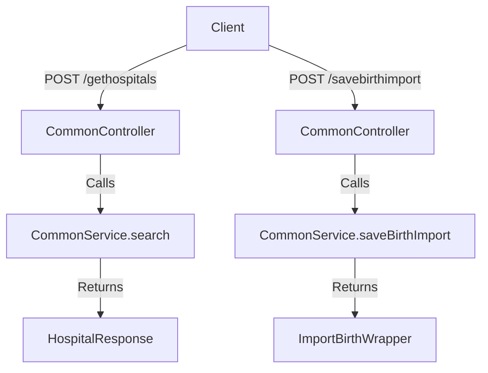

# Overview

Common services refer to shared functionalities and services used across the birth and death services. These services include searching hospital details, saving, and updating birth and death records. The <SwmToken path="municipal-services/birth-death-services/src/main/java/org/bel/birthdeath/common/controller/CommonController.java" pos="28:1:1" line-data="	CommonService commonService;">`CommonService`</SwmToken> class is central to this, providing methods to interact with the repository for these operations. The <SwmToken path="municipal-services/birth-death-services/src/main/java/org/bel/birthdeath/common/controller/CommonController.java" pos="25:4:4" line-data="public class CommonController {">`CommonController`</SwmToken> class exposes endpoints to handle HTTP requests related to these common services. These services ensure that common operations are handled consistently across the application.

# <SwmToken path="municipal-services/birth-death-services/src/main/java/org/bel/birthdeath/common/controller/CommonController.java" pos="25:4:4" line-data="public class CommonController {">`CommonController`</SwmToken>

The <SwmToken path="municipal-services/birth-death-services/src/main/java/org/bel/birthdeath/common/controller/CommonController.java" pos="25:4:4" line-data="public class CommonController {">`CommonController`</SwmToken> class is annotated with <SwmToken path="municipal-services/birth-death-services/src/main/java/org/bel/birthdeath/common/controller/CommonController.java" pos="23:0:1" line-data="@RestController">`@RestController`</SwmToken> and <SwmToken path="municipal-services/birth-death-services/src/main/java/org/bel/birthdeath/common/controller/CommonController.java" pos="24:0:7" line-data="@RequestMapping(&quot;/common&quot;)">`@RequestMapping("/common")`</SwmToken>, exposing endpoints for common services. It uses <SwmToken path="municipal-services/birth-death-services/src/main/java/org/bel/birthdeath/common/controller/CommonController.java" pos="28:1:1" line-data="	CommonService commonService;">`CommonService`</SwmToken> to handle the business logic and <SwmToken path="municipal-services/birth-death-services/src/main/java/org/bel/birthdeath/common/controller/CommonController.java" pos="31:3:3" line-data="	private ResponseInfoFactory responseInfoFactory;">`ResponseInfoFactory`</SwmToken> to create response information.

<SwmSnippet path="/municipal-services/birth-death-services/src/main/java/org/bel/birthdeath/common/controller/CommonController.java" line="23">

---

The <SwmToken path="municipal-services/birth-death-services/src/main/java/org/bel/birthdeath/common/controller/CommonController.java" pos="25:4:4" line-data="public class CommonController {">`CommonController`</SwmToken> class defines the endpoint <SwmToken path="municipal-services/birth-death-services/src/main/java/org/bel/birthdeath/common/controller/CommonController.java" pos="34:11:12" line-data="	@PostMapping(value = { &quot;/gethospitals&quot;})">`/gethospitals`</SwmToken> to search for hospital details. It accepts a <SwmToken path="municipal-services/birth-death-services/src/main/java/org/bel/birthdeath/common/controller/CommonController.java" pos="35:13:13" line-data="    public ResponseEntity&lt;HospitalResponse&gt; search(@RequestBody RequestInfoWrapper requestInfoWrapper,">`RequestInfoWrapper`</SwmToken> and <SwmToken path="municipal-services/birth-death-services/src/main/java/org/bel/birthdeath/common/controller/CommonController.java" pos="36:7:7" line-data="                                                       @Valid @ModelAttribute SearchCriteria criteria) {">`SearchCriteria`</SwmToken> as input and returns a <SwmToken path="municipal-services/birth-death-services/src/main/java/org/bel/birthdeath/common/controller/CommonController.java" pos="35:5:5" line-data="    public ResponseEntity&lt;HospitalResponse&gt; search(@RequestBody RequestInfoWrapper requestInfoWrapper,">`HospitalResponse`</SwmToken> containing the list of hospital details.

```java
@RestController
@RequestMapping("/common")
public class CommonController {
	
	@Autowired
	CommonService commonService;
	
	@Autowired
	private ResponseInfoFactory responseInfoFactory;
	
	
	@PostMapping(value = { "/gethospitals"})
    public ResponseEntity<HospitalResponse> search(@RequestBody RequestInfoWrapper requestInfoWrapper,
                                                       @Valid @ModelAttribute SearchCriteria criteria) {
        List<EgHospitalDtl> hospitalDtls = commonService.search(criteria.getTenantId());
        HospitalResponse response = HospitalResponse.builder().hospitalDtls(hospitalDtls).responseInfo(
                responseInfoFactory.createResponseInfoFromRequestInfo(requestInfoWrapper.getRequestInfo(), true))
                .build();
        return new ResponseEntity<>(response, HttpStatus.OK);
    }
```

---

</SwmSnippet>

# <SwmToken path="municipal-services/birth-death-services/src/main/java/org/bel/birthdeath/common/controller/CommonController.java" pos="28:1:1" line-data="	CommonService commonService;">`CommonService`</SwmToken>

The <SwmToken path="municipal-services/birth-death-services/src/main/java/org/bel/birthdeath/common/controller/CommonController.java" pos="28:1:1" line-data="	CommonService commonService;">`CommonService`</SwmToken> class is autowired into the <SwmToken path="municipal-services/birth-death-services/src/main/java/org/bel/birthdeath/common/controller/CommonController.java" pos="25:4:4" line-data="public class CommonController {">`CommonController`</SwmToken> to provide methods for searching hospital details and saving/updating birth and death records.

<SwmSnippet path="/municipal-services/birth-death-services/src/main/java/org/bel/birthdeath/common/controller/CommonController.java" line="27">

---

The <SwmToken path="municipal-services/birth-death-services/src/main/java/org/bel/birthdeath/common/controller/CommonController.java" pos="28:1:1" line-data="	CommonService commonService;">`CommonService`</SwmToken> class is autowired into the <SwmToken path="municipal-services/birth-death-services/src/main/java/org/bel/birthdeath/common/controller/CommonController.java" pos="25:4:4" line-data="public class CommonController {">`CommonController`</SwmToken> to handle the business logic for common services.

```java
	@Autowired
	CommonService commonService;
```

---

</SwmSnippet>

# Example Endpoints

The <SwmToken path="municipal-services/birth-death-services/src/main/java/org/bel/birthdeath/common/controller/CommonController.java" pos="25:4:4" line-data="public class CommonController {">`CommonController`</SwmToken> class defines several endpoints such as <SwmToken path="municipal-services/birth-death-services/src/main/java/org/bel/birthdeath/common/controller/CommonController.java" pos="34:11:12" line-data="	@PostMapping(value = { &quot;/gethospitals&quot;})">`/gethospitals`</SwmToken>, <SwmToken path="municipal-services/birth-death-services/src/main/java/org/bel/birthdeath/common/controller/CommonController.java" pos="45:11:12" line-data="	@PostMapping(value = { &quot;/savebirthimport&quot;})">`/savebirthimport`</SwmToken>, <SwmToken path="municipal-services/birth-death-services/src/main/java/org/bel/birthdeath/common/controller/CommonController.java" pos="53:11:12" line-data="	@PostMapping(value = { &quot;/savedeathimport&quot;})">`/savedeathimport`</SwmToken>, <SwmToken path="municipal-services/birth-death-services/src/main/java/org/bel/birthdeath/common/controller/CommonController.java" pos="60:11:12" line-data="	@PostMapping(value = { &quot;/updatebirthimport&quot;})">`/updatebirthimport`</SwmToken>, and <SwmToken path="municipal-services/birth-death-services/src/main/java/org/bel/birthdeath/common/controller/CommonController.java" pos="68:11:12" line-data="	@PostMapping(value = { &quot;/updatedeathimport&quot;})">`/updatedeathimport`</SwmToken>. These endpoints handle HTTP POST requests and call corresponding methods in <SwmToken path="municipal-services/birth-death-services/src/main/java/org/bel/birthdeath/common/controller/CommonController.java" pos="28:1:1" line-data="	CommonService commonService;">`CommonService`</SwmToken> to perform the required operations.

<SwmSnippet path="/municipal-services/birth-death-services/src/main/java/org/bel/birthdeath/common/controller/CommonController.java" line="34">

---

The <SwmToken path="municipal-services/birth-death-services/src/main/java/org/bel/birthdeath/common/controller/CommonController.java" pos="25:4:4" line-data="public class CommonController {">`CommonController`</SwmToken> class defines the endpoints <SwmToken path="municipal-services/birth-death-services/src/main/java/org/bel/birthdeath/common/controller/CommonController.java" pos="34:11:12" line-data="	@PostMapping(value = { &quot;/gethospitals&quot;})">`/gethospitals`</SwmToken> and <SwmToken path="municipal-services/birth-death-services/src/main/java/org/bel/birthdeath/common/controller/CommonController.java" pos="45:11:12" line-data="	@PostMapping(value = { &quot;/savebirthimport&quot;})">`/savebirthimport`</SwmToken> to handle HTTP POST requests for searching hospital details and saving birth import data, respectively.

```java
	@PostMapping(value = { "/gethospitals"})
    public ResponseEntity<HospitalResponse> search(@RequestBody RequestInfoWrapper requestInfoWrapper,
                                                       @Valid @ModelAttribute SearchCriteria criteria) {
        List<EgHospitalDtl> hospitalDtls = commonService.search(criteria.getTenantId());
        HospitalResponse response = HospitalResponse.builder().hospitalDtls(hospitalDtls).responseInfo(
                responseInfoFactory.createResponseInfoFromRequestInfo(requestInfoWrapper.getRequestInfo(), true))
                .build();
        return new ResponseEntity<>(response, HttpStatus.OK);
    }
	
	
	@PostMapping(value = { "/savebirthimport"})
    public ResponseEntity<ImportBirthWrapper> saveBirthImport(
    		@RequestBody BirthResponse importJSon) {
        ImportBirthWrapper importBirthWrapper = commonService.saveBirthImport(importJSon,importJSon.getRequestInfo());
        importBirthWrapper.setResponseInfo(responseInfoFactory.createResponseInfoFromRequestInfo(importJSon.getRequestInfo(), true));
        return new ResponseEntity<>(importBirthWrapper, HttpStatus.OK);
    }
```

---

</SwmSnippet>

# Common Endpoints

Common endpoints are used to perform various operations related to birth and death services. Below are some of the key endpoints:

## /gethospitals

The <SwmToken path="municipal-services/birth-death-services/src/main/java/org/bel/birthdeath/common/controller/CommonController.java" pos="34:11:12" line-data="	@PostMapping(value = { &quot;/gethospitals&quot;})">`/gethospitals`</SwmToken> endpoint is used to search for hospital details based on the provided search criteria. It accepts a <SwmToken path="municipal-services/birth-death-services/src/main/java/org/bel/birthdeath/common/controller/CommonController.java" pos="35:13:13" line-data="    public ResponseEntity&lt;HospitalResponse&gt; search(@RequestBody RequestInfoWrapper requestInfoWrapper,">`RequestInfoWrapper`</SwmToken> and <SwmToken path="municipal-services/birth-death-services/src/main/java/org/bel/birthdeath/common/controller/CommonController.java" pos="36:7:7" line-data="                                                       @Valid @ModelAttribute SearchCriteria criteria) {">`SearchCriteria`</SwmToken> as input and returns a <SwmToken path="municipal-services/birth-death-services/src/main/java/org/bel/birthdeath/common/controller/CommonController.java" pos="35:5:5" line-data="    public ResponseEntity&lt;HospitalResponse&gt; search(@RequestBody RequestInfoWrapper requestInfoWrapper,">`HospitalResponse`</SwmToken> containing the list of hospital details.

## /savebirthimport

The <SwmToken path="municipal-services/birth-death-services/src/main/java/org/bel/birthdeath/common/controller/CommonController.java" pos="45:11:12" line-data="	@PostMapping(value = { &quot;/savebirthimport&quot;})">`/savebirthimport`</SwmToken> endpoint is used to save birth import data. It accepts a <SwmToken path="municipal-services/birth-death-services/src/main/java/org/bel/birthdeath/common/controller/CommonController.java" pos="47:4:4" line-data="    		@RequestBody BirthResponse importJSon) {">`BirthResponse`</SwmToken> as input and returns an <SwmToken path="municipal-services/birth-death-services/src/main/java/org/bel/birthdeath/common/controller/CommonController.java" pos="46:5:5" line-data="    public ResponseEntity&lt;ImportBirthWrapper&gt; saveBirthImport(">`ImportBirthWrapper`</SwmToken> containing the saved birth import details.

<SwmSnippet path="/municipal-services/birth-death-services/src/main/java/org/bel/birthdeath/common/controller/CommonController.java" line="45">

---

The <SwmToken path="municipal-services/birth-death-services/src/main/java/org/bel/birthdeath/common/controller/CommonController.java" pos="45:11:12" line-data="	@PostMapping(value = { &quot;/savebirthimport&quot;})">`/savebirthimport`</SwmToken> endpoint in the <SwmToken path="municipal-services/birth-death-services/src/main/java/org/bel/birthdeath/common/controller/CommonController.java" pos="25:4:4" line-data="public class CommonController {">`CommonController`</SwmToken> class handles the saving of birth import data and returns an <SwmToken path="municipal-services/birth-death-services/src/main/java/org/bel/birthdeath/common/controller/CommonController.java" pos="46:5:5" line-data="    public ResponseEntity&lt;ImportBirthWrapper&gt; saveBirthImport(">`ImportBirthWrapper`</SwmToken>.

```java
	@PostMapping(value = { "/savebirthimport"})
    public ResponseEntity<ImportBirthWrapper> saveBirthImport(
    		@RequestBody BirthResponse importJSon) {
        ImportBirthWrapper importBirthWrapper = commonService.saveBirthImport(importJSon,importJSon.getRequestInfo());
        importBirthWrapper.setResponseInfo(responseInfoFactory.createResponseInfoFromRequestInfo(importJSon.getRequestInfo(), true));
        return new ResponseEntity<>(importBirthWrapper, HttpStatus.OK);
    }
```

---

</SwmSnippet>

&nbsp;

*This is an auto-generated document by Swimm AI 🌊 and has not yet been verified by a human*

<SwmMeta version="3.0.0" repo-id="Z2l0aHViJTNBJTNBRElHSVQtT1NTJTNBJTNBU3dpbW0tRGVtbw==" repo-name="DIGIT-OSS" doc-type="overview"><sup>Powered by [Swimm](/)</sup></SwmMeta>
