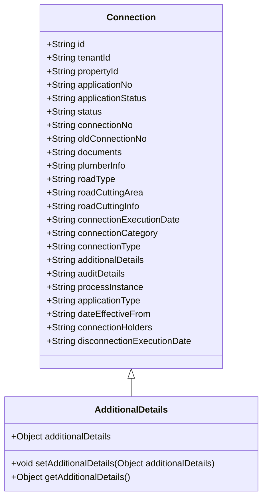

# Connection Metadata Overview

Connection metadata refers to the various attributes and metadata associated with a connection object. These details include identifiers, statuses, and additional information necessary for managing connections.

# Connection Class

The `Connection` class defines various fields to store and manage data related to a connection. These fields include identifiers, tenant information, property details, application numbers, statuses, and various other attributes.

<SwmSnippet path="/municipal-services/ws-calculator/src/main/java/org/egov/wscalculation/web/models/Connection.java" line="33">

---

The `Connection` class includes fields such as `id`, `tenantId`, `propertyId`, `applicationNo`, `applicationStatus`, `status`, `connectionNo`, `oldConnectionNo`, `documents`, `plumberInfo`, `roadType`, `roadCuttingArea`, `roadCuttingInfo`, `connectionExecutionDate`, `connectionCategory`, `connectionType`, `additionalDetails`, `auditDetails`, `processInstance`, `applicationType`, `dateEffectiveFrom`, `connectionHolders`, and `disconnectionExecutionDate`.

```java
public class Connection {
	@JsonProperty("id")
	private String id = null;

	@JsonProperty("tenantId")
	private String tenantId = null;

	@JsonProperty("propertyId")
	private String propertyId = null;

	@JsonProperty("applicationNo")
	private String applicationNo = null;


	@JsonProperty("applicationStatus")
	private String applicationStatus = null;

	/**
	 * Gets or Sets status
	 */
	public enum StatusEnum {
```

---

</SwmSnippet>

# Additional Details

The `additionalDetails` field is used to capture any extra information that is not accommodated by the standard model. This allows for flexibility in storing additional data as needed.

<SwmSnippet path="/municipal-services/ws-calculator/src/main/java/org/egov/wscalculation/web/models/Connection.java" line="116">

---

The `additionalDetails` field is defined in the `Connection` class to store extra information.

```java
	@JsonProperty("additionalDetails")
	private Object additionalDetails = null;
```

---

</SwmSnippet>

# Methods for Additional Details

Methods such as `setAdditionalDetails` and `getAdditionalDetails` are used to set and retrieve the additional details for a connection.

<SwmSnippet path="/municipal-services/ws-calculator/src/main/java/org/egov/wscalculation/web/models/Connection.java" line="493">

---

The `setAdditionalDetails` method is used to set the additional details for a connection.

```java
	public Connection additionalDetails(Object additionalDetails) {
		this.additionalDetails = additionalDetails;
		return this;
	}
```

---

</SwmSnippet>

<SwmSnippet path="/municipal-services/ws-calculator/src/main/java/org/egov/wscalculation/web/models/Connection.java" line="506">

---

The `getAdditionalDetails` method is used to retrieve the additional details for a connection.

```java
	public Object getAdditionalDetails() {
		return additionalDetails;
	}
```

---

</SwmSnippet>

# Main Functions

There are several main functions in this folder. Some of them are `setAdditionalDetails`, `getAdditionalDetails`, `setDocuments`, `getDocuments`, `setPlumberInfo`, `getPlumberInfo`, `setConnectionCategory`, `getConnectionCategory`, `setConnectionType`, `getConnectionType`, `setAuditDetails`, `getAuditDetails`, `setProcessInstance`, `getProcessInstance`, `addConnectionHolderInfo`, `getConnectionHolders`, and `setConnectionHolders`.

## getAdditionalDetails

The `getAdditionalDetails` method is used to retrieve the additional details for a connection. This method allows for accessing any extra information that has been set for the connection.

<SwmSnippet path="/municipal-services/ws-calculator/src/main/java/org/egov/wscalculation/web/models/Connection.java" line="506">

---

The `getAdditionalDetails` method implementation in the `Connection` class.

```java
	public Object getAdditionalDetails() {
		return additionalDetails;
	}
```

---

</SwmSnippet>

&nbsp;

*This is an auto-generated document by Swimm AI 🌊 and has not yet been verified by a human*

<SwmMeta version="3.0.0" repo-id="Z2l0aHViJTNBJTNBRElHSVQtT1NTJTNBJTNBU3dpbW0tRGVtbw==" repo-name="DIGIT-OSS" doc-type="overview"><sup>Powered by [Swimm](https://app.swimm.io/)</sup></SwmMeta>
